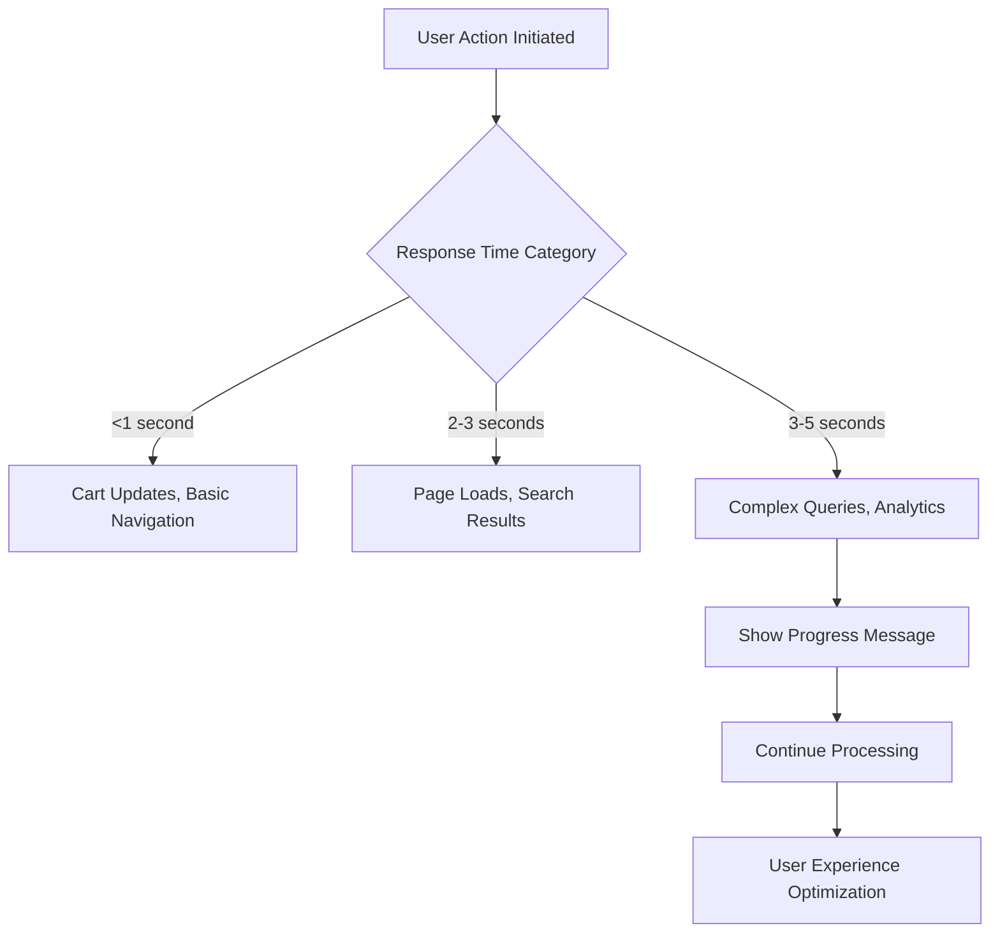
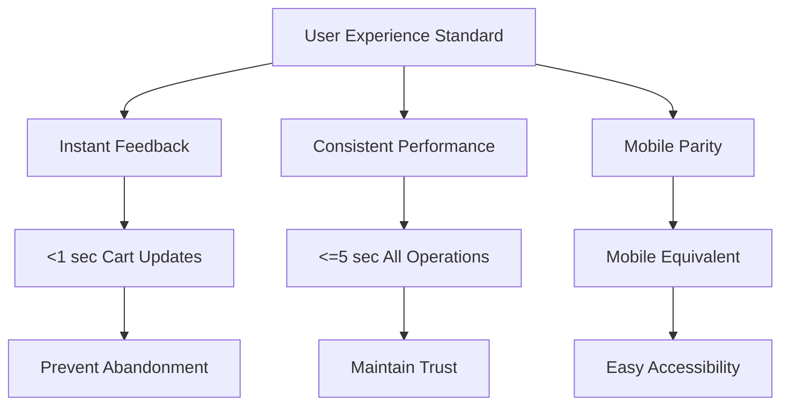
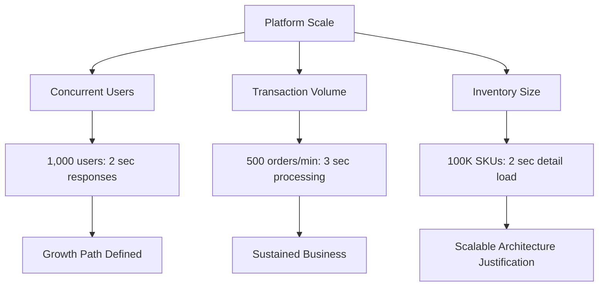
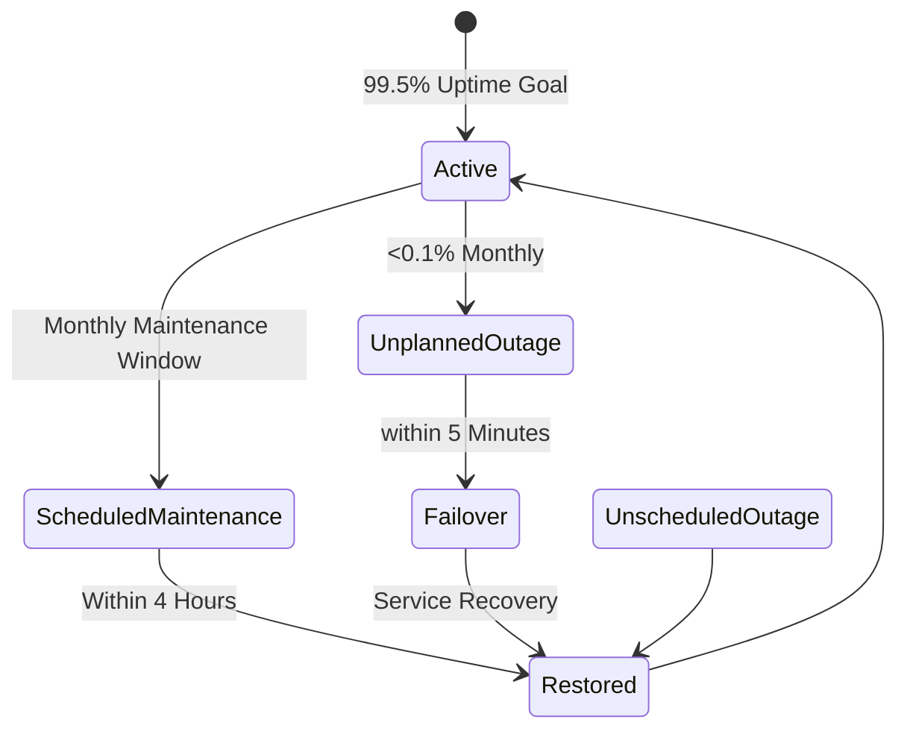
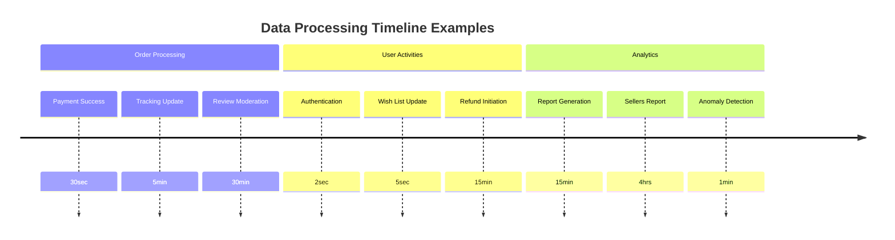

# Performance and Environment Requirements for Shopping Mall Platform

This document establishes the quantitative benchmarks that define a premium user experience in the shopping mall platform. It specifies response time targets, capacity limits, availability standards, and data processing timelines measured from the user's perspective. The platform must deliver consistent, fast performance across all operations while scaling to handle thousands of concurrent users and millions of transactions weekly.

The benchmarks outlined here ensure users never experience frustration caused by slow loading, inconsistent performance, or unavailable features. These requirements support the platform's business goal of becoming the preferred e-commerce destination where shopping feels instantaneous and reliable.

## Response Time Expectations

The platform must respond instantly to user actions, creating the perception of seamless interaction.

WHEN a user navigates to the product catalog home page, THE platform SHALL display all initial content and product recommendations within 2 seconds for the first page load.

WHEN a customer initiates a product search with keyword filters, THE platform SHALL return matching results within 1 second for queries involving up to 1,000 products, displaying images, prices, and availability for each result.

WHEN a customer adds an eligible product to their shopping cart, THE platform SHALL confirm the addition and recalculate the subtotal within 0.5 seconds, providing immediate visual feedback to prevent checkout abandonment.

WHEN a guest views detailed product information including specifications and reviews, THE platform SHALL load all content within 2 seconds, enabling smooth browsing sessions up to 100 products viewed continuously.

WHEN a customer begins the checkout process from a prepared cart, THE platform SHALL validate availability, calculate shipping, and display payment options within 3 seconds total processing time.

WHEN a seller updates inventory levels for a single SKU, THE platform SHALL propagate the change across all customer views and search results within 2 seconds to prevent purchasing of out-of-stock items.

WHEN an administrator accesses the platform dashboard for analytics viewing, THE platform SHALL load current metrics and charts within 3 seconds, enabling real-time monitoring of platform health.

WHEN a customer submits a product review with optional photos, THE platform SHALL validate content appropriateness and confirm successful publication within 1 second.

WHEN a user requests membership in seller account type, THE platform SHALL process the registration verification within 5 minutes, sending confirmation email in parallel.

WHEN a customer refrains from adding items to cart during wishlisting, THE platform SHALL maintain session persistence for 30 calendar days without performance degradation.

WHEN an empty guest user opportunistically browses without cart creation, THE platform SHALL enable instant access without redirect delays or loading screens.

IF any core operation exceeds 5 seconds response time, THEN the platform SHALL display a loading indicator with estimated completion time and continue background processing, preventing user frustration.

## User Experience Standards

The platform must create a fluid, consistent experience that feels professional and trustworthy, regardless of device type or internet connection quality.

WHEN users browse product categories across multiple pages, THE platform SHALL maintain consistent 2-second page load times for navigation between up to 10 category levels.

WHEN customers modify their shopping cart contents during active sessions, THE platform SHALL update all dependent calculations (taxes, shipping, subtotals) instantly, with no perceptible lag between 50 items added or removed.

WHEN platform operates during peak shopping periods, THE platform SHALL deliver performance equivalent to off-peak hours, with no degradation of response times or feature availability.

WHEN customers access the platform through mobile devices, THE platform SHALL achieve identical performance standards as desktop experiences, loading product images within 1.5 seconds.

WHEN sellers manage their product catalog during busy market periods, THE platform SHALL support uninterrupted inventory updates and product modifications with stable 2-second response times.

WHEN administrators perform bulk operations on user accounts, THE platform SHALL process up to 100 account changes within 10 seconds, displaying progress indicators throughout the operation.

WHEN international users access the platform during different timezone loads, THE platform SHALL maintain consistent response times without geographic-based performance variations.

WHEN users experience degraded internet connections (3G speeds), THE platform SHALL gracefully adapt display complexity while achieving 5-second page loads for essential functionality.

WHEN customers contribute to the marketplace through reviews and Q&A, THE platform SHALL facilitate instant submission with 1-second confirmation, encouraging ongoing community engagement.

WHEN sellers optimize their listings with multiple variants and images, THE platform SHALL support fluent editing workflows with immediate visual preview updates within 0.5 seconds.

WHEN administrators conduct system audits after platform updates, THE platform SHALL provide unfiltered log access and report generation within 30 seconds per audit session.

## Scalability Requirements

The platform must support business growth while delivering consistent performance as user base and transaction volume increase.

WHEN the platform reaches 1,000 concurrent active users, THE platform SHALL maintain 2-second response times for product searches and shopping cart operations.

WHEN the platform processes 500 order placements per minute during promotional events, THE platform SHALL achieve 99% successful transaction completion with 3-second average processing time.

WHEN the platform manages an inventory of 100,000 SKUs across multiple sellers, THE platform SHALL handle product detail requests within 2 seconds, supporting detailed variant selections up to 10 options per item.

WHEN the seller community expands to 5,000 active merchants, THE platform SHALL scale order management systems to process daily fulfillment notifications within 5 minutes of order placement.

WHEN the platform serves 10 million monthly page views distributed across global regions, THE platform SHALL achieve 99th percentile response times under 3 seconds for all user-facing operations.

WHEN bulk inventory updates accommodate 10,000 SKU changes simultaneously, THE platform SHALL synchronize updates across all product displays within 10 minutes with progressive progress reporting.

WHEN international expansion adds markets with 100,000 local customers, THE platform SHALL maintain consistent performance without translation-imposed delays on product browsing.

WHEN mobile usage surges to 60% of total platform traffic, THE platform SHALL optimize rendering and cache delivery to achieve 1-second faster image loading.

WHEN seasonal spikes increase concurrent session count by 300%, THE platform SHALL automatically scale compute resources to maintain established response time benchmarks.

WHEN the product catalog grows to 1 million items under active management, THE platform SHALL support advanced search and filtering operations within 2 seconds maximum.

## Availability Specifications

The platform must operate continuously to provide reliable service and meet user expectations for an always-accessible marketplace.

WHEN critical platform components experience issues, THE platform SHALL achieve 99.9% monthly uptime for payment processing and order placement functionality.

WHEN scheduled maintenance occurs outside peak hours, THE platform SHALL achieve 99.5% overall uptime for all user-facing operations annually.

WHEN unplanned service interruptions occur, THE platform SHALL automatically failover to redundant systems within 5 minutes, minimizing disruption to active user sessions.

WHEN external payment processing providers experience outages, THE platform SHALL maintain order cart functionality and queue transactions for processing once service restores.

WHEN shipping provider integrations become unavailable, THE platform SHALL continue accepting orders while temporarily disabling real-time rate calculation and storing shipping requests for later processing.

WHEN email notification services encounter delays, THE platform SHALL maintain order processing capabilities and queue notification batches for delivery within 4-hour recovery windows.

WHEN network connectivity issues affect regional users, THE platform SHALL serve cached content for 15 minutes to maintain basic shopping functionality.

WHEN database maintenance or upgrades occur monthly, THE platform SHALL complete these operations within 4-hour windows during low-traffic periods.

WHEN system monitoring detects potential performance degradation, THE platform SHALL automatically scale resources before reaching critical capacity thresholds.

WHEN cyber security incidents threaten service availability, THE platform SHALL implement isolation protocols that protect unaffected system components.

## Data Processing Timelines

The platform must process data efficiently in the background while maintaining real-time user experience for interactive operations.

WHEN a customer completes successful payment for an order, THE platform SHALL generate order confirmation within 30 seconds and update seller order queues simultaneously.

WHEN inventory tracking determines stock levels below 10% of normal capacity, THE platform SHALL notify affected sellers within 5 minutes of the detection.

WHEN shipping providers update package tracking milestones, THE platform SHALL propagate status changes to customer tracking pages within 5 minutes.

WHEN product reviews undergo automated content moderation, THE platform SHALL complete validation and approval/rejection within 30 minutes for submitted content.

WHEN sellers request detailed sales performance reports, THE platform SHALL generate comprehensive analytics within 15 minutes, including charts and exportable data.

WHEN bulk product catalog imports contain 1,000 items from sellers, THE platform SHALL validate and publish the entire batch within 10 minutes with error reporting.

WHEN customer accounts require security verification during login, THE platform SHALL complete authentication validation within 2 seconds maximum.

WHEN refund processing begins after customer request, THE platform SHALL initiate payment reversal procedures within 15 minutes with seller notification parallel.

WHEN expired promotional offers require cleanup, THE platform SHALL automatically remove unavailable discounts from product displays within 1 hour.

WHEN weekly sales aggregations compile for administrative reporting, THE platform SHALL process transaction data and generate summaries within 4 hours of midnight cutoff.

WHEN new product variant combinations get validated against business rules, THE platform SHALL confirm SKU uniqueness and pricing consistency within 5 seconds.

WHEN marketplace messages between sellers and customers get encrypted for privacy, THE platform SHALL deliver secure communications within 2 minutes transmission time.

WHEN order history aggregates for loyalty program qualification, THE platform SHALL calculate eligibility and award points within 30 seconds per qualifying transaction.

WHEN fraud detection algorithms analyze suspicious transaction patterns, THE platform SHALL flag investigations within 1 minute of detection with real-time alerting.

WHEN inventory synchronization processes run across different seller systems, THE platform SHALL reconcile stock levels within 1 hour of scheduled intervals.

WHEN performance metrics calculate for seller dashboards, THE platform SHALL refresh individual seller reports within 5 minutes of midnight updates.

WHEN administrative bulk user account modifications occur, THE platform SHALL apply changes for 500 accounts within 10 minutes with rollback capabilities.

WHEN product recommendation engines analyze user behavior patterns, THE platform SHALL generate personalized suggestions within 2 minutes for logged-in customers.

WHEN legal export requests require customer data compilation, THE platform SHALL produce GDPR-compliant packages within 72 hours of request receipt.

WHEN system health monitoring detects anomaly patterns, THE platform SHALL trigger automated diagnostics within 1 minute with administrative notification.

WHEN currency conversion calculations execute for international orders, THE platform SHALL provide accurate rates with 30-second processing times maximum.

WHEN network traffic analytics help optimize content delivery, THE platform SHALL update CDN configurations within 15 minutes of significant pattern changes.

WHEN subscription service renewals process automatically, THE platform SHALL handle 10,000 renewals within 1 hour with appropriate notifications.

WHEN abandoned cart recovery campaigns launch based on triggers, THE platform SHALL send personalized emails within 5 minutes of 24-hour cart inactivity.

WHEN cross-seller bundle promotions calculate complex pricing, THE platform SHALL validate bundled discounts within 3 seconds of cart submission.

WHEN tax calculation updates reflect regional changes, THE platform SHALL apply new rates within 30 minutes of regulatory effective dates.

WHEN compliance audits require log export generation, THE platform SHALL compile 30-day transaction records within 4 hours of request.

WHEN machine learning models retrain for recommendation accuracy, THE platform SHALL complete training cycles within 8 hours with minimal impact on live services.

IF any data processing operation fails to meet its timeline target, THEN the platform SHALL log the incident for engineering review, alert monitoring systems, and continue processing with immediate recovery attempts.

The performance and environment requirements documented here establish clear benchmarks for delivering an exceptional user experience. These quantitative standards ensure the platform operates at enterprise grade, supporting business growth while maintaining user satisfaction. Implementation of these requirements will result in a marketplace that users trust and return to consistently.

When performance cannot meet these targets due to infrastructure limitations, the platform SHALL scale resources automatically or implement efficient caching strategies to maintain user experience quality.

The platform SHALL conduct quarterly performance testing to validate compliance with these benchmarks and identify optimization opportunities before they impact users.

Developers SHALL implement monitoring systems that alert when performance metrics approach 80% of specified thresholds, enabling proactive infrastructure adjustments.

The platform SHALL maintain detailed performance logs for troubleshooting and optimization efforts, with retention periods of 90 days for metrics data.

All performance requirements SHALL be measured from the user's perspective, including network transmission time, to ensure realistic user experience standards.

The platform SHALL implement progressive enhancement techniques that maintain functionality during performance variations, prioritizing order completion over advanced features when necessary.

When establishing performance baselines during initial deployment, the platform SHALL provide gradual performance improvement pathways that reach full compliance within 6 months of production launch.

The platform SHALL document performance degradation scenarios with automatic fallback mechanisms, ensuring continuous operation even during peak load periods.

Developers SHALL design the platform architecture considering these requirements from the initial design phase, with performance testing integrated into the development lifecycle.

The platform SHALL achieve these performance standards across different geographies and network conditions, using content delivery networks and edge computing where appropriate.

When new features get added to the platform, developers SHALL verify performance impact and update these requirements accordingly to maintain service quality.

The platform SHALL implement automated performance regression testing to prevent future releases from degrading established user experience standards.

All scalability discussions during architectural design SHALL reference these specific numeric targets to ensure infrastructure planning supports the documented user experience expectations.

The platform SHALL conduct annual performance audits to validate that the actual user experience matches these documented requirements and identify areas for enhancement.

Performance requirements SHALL include specific error rate thresholds, with requirement failures limited to no more than 1% of total operations under normal conditions.

The platform SHALL provide performance transparency to users through status pages and support channel communications when performance issues occur.

When performance issues impact specific user groups, the platform SHALL prioritize resolution for highest-ticket activities like payment processing and order placement.

The platform SHALL implement resource utilization monitoring to predict and prevent performance degradation before it affects users.

All performance metrics SHALL internally track component-level latency and optimize bottleneck areas identified through monitoring data.

The platform SHALL achieve these standards while maintaining cost-effective operations, balancing performance optimization with business economics.

When compliance with these requirements requires hardware or software upgrades, the platform SHALL plan these improvements without disrupting existing user experience.

The platform SHALL establish performance guarantees in service level agreements with users, committing to these benchmark standards.

Performance optimization efforts SHALL focus on the most impactful user interactions first, prioritizing shopping cart and checkout processes over secondary features.

The platform SHALL implement intelligent caching strategies that reduce response times for frequently accessed data without compromising content freshness.

When users report performance issues, the platform SHALL triage these reports immediately and correlate them with internal performance monitoring data.

The platform SHALL achieve these performance standards on mobile networks starting with 4G minimum connection speeds, optimizing for bandwidth constraints.

Performance requirements SHALL evolve with technology advancements, ensuring the platform leverages new capabilities for enhanced user experience.

The platform SHALL conduct user experience testing with real device panels to validate that these performance standards meet actual user satisfaction expectations.

All loading states and progress indicators SHALL design to mitigate perceived wait time, making performance feel faster than raw metrics indicate.

The platform SHALL implement preemptive content loading techniques for anticipated user actions, reducing response times for common navigation patterns.

Performance monitoring SHALL include end-to-end transaction tracking from user action through database persistence and response delivery.

The platform SHALL achieve these standards while maintaining system security, ensuring performance optimizations do not introduce vulnerabilities.

When scaling events occur, the platform SHALL maintain 95th percentile response times within established limits, avoiding long-tail latency issues.

Performance requirements documentation SHALL update annually to reflect changing user expectations and technological capabilities.

The platform SHALL implement geographic distribution strategies to reduce latency for international users, achieving near-local performance standards globally.

All monitoring dashboards SHALL display real-time compliance with these performance requirements, enabling instant detection of standards violations.

The platform SHALL develop performance budgets for individual pages and operations, preventing future feature additions from degrading established standards.

When third-party integrations affect platform performance, the platform SHALL establish performance contracts with those providers to ensure compliance.

Performance standards SHALL include specific constraints for peak usage periods, with maintained 95th percentile response times during holiday seasons.

The platform SHALL conduct capacity planning exercises quarterly to ensure infrastructure can support projected growth while maintaining performance standards.

All performance failures SHALL log with root cause analysis to inform continuous improvement initiatives and prevent recurrence.

The platform SHALL achieve certifications demonstrating compliance with these performance standards, providing independent validation of user experience quality.

Performance requirements SHALL include uptime guarantees beyond availability specifications, ensuring continuous service health monitoring.

The platform SHALL implement gradual performance degradation policies where advanced features get disabled during high load periods rather than complete service failure.

All user-facing operations SHALL include performance monitoring with automatic alerting when response times exceed established thresholds by 50%.

The platform SHALL conduct regular performance competitions between development teams to incentivize ongoing optimization efforts.

Performance standards SHALL communicate to all stakeholders, ensuring business teams understand the impact of feature requests on established user experience.

The data processing timelines specified above represent reasonable upper bounds for essential platform operations, ensuring users perceive immediate responsiveness even during complex background processing.