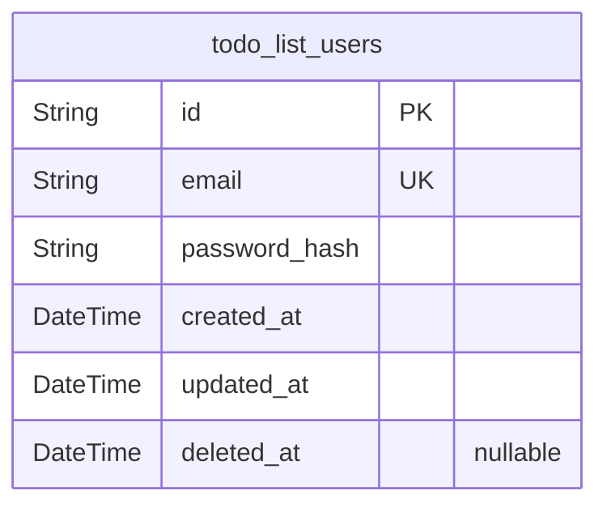
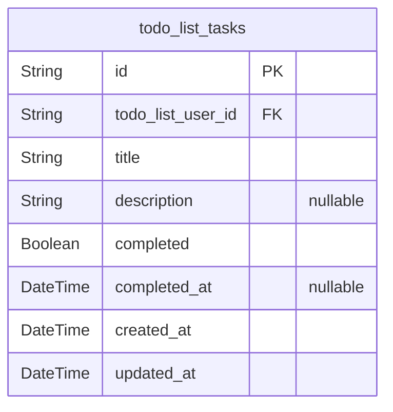

# Prisma Markdown

> Generated by [`prisma-markdown`](https://github.com/samchon/prisma-markdown)

- [Actors](#actors)
- [Tasks](#tasks)

## Actors

### `todo_list_users`

User accounts managing authentication and task ownership in the todo
application. Each user maintains exclusive control over their personal
todo tasks with secure login capabilities.

Properties as follows:

- `id`: Primary Key.
- `email`: User's email address for authentication. Must be unique across all users.
- `password_hash`: Securely hashed password for user authentication and login functionality.
- `created_at`: Timestamp when the user account was initially created.
- `updated_at`: Timestamp of the most recent user account update.
- `deleted_at`
  > Soft delete timestamp for user account deactivation. Null indicates
  > active account.

## Tasks

### `todo_list_tasks`

Todo task entities owned by authenticated users with full CRUD operations
including creation, completion tracking, and permanent deletion.

Properties as follows:

- `id`: Primary Key.
- `todo_list_user_id`: Owned user of this task [todo_list_users.id](#todo_list_users).
- `title`: Task title with maximum 100 characters.
- `description`: Optional task description limited to 500 characters.
- `completed`: Task completion status.
- `completed_at`: Timestamp when task was marked as completed.
- `created_at`: Task creation timestamp.
- `updated_at`: Task last update timestamp.
