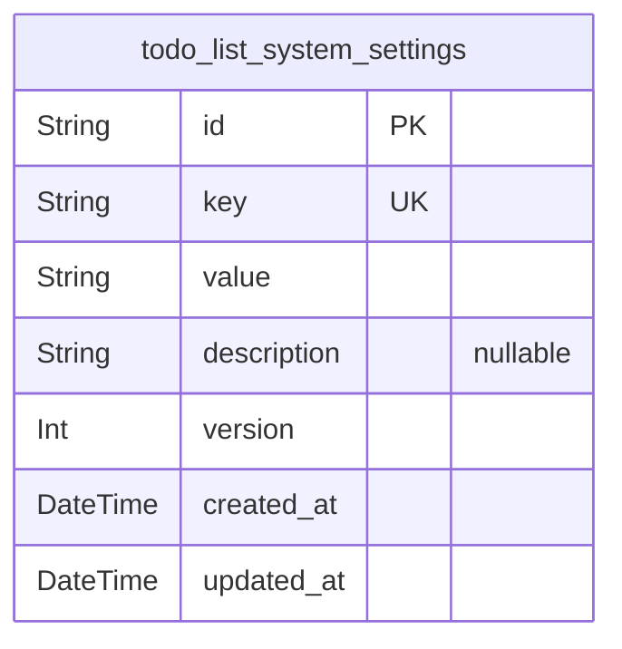
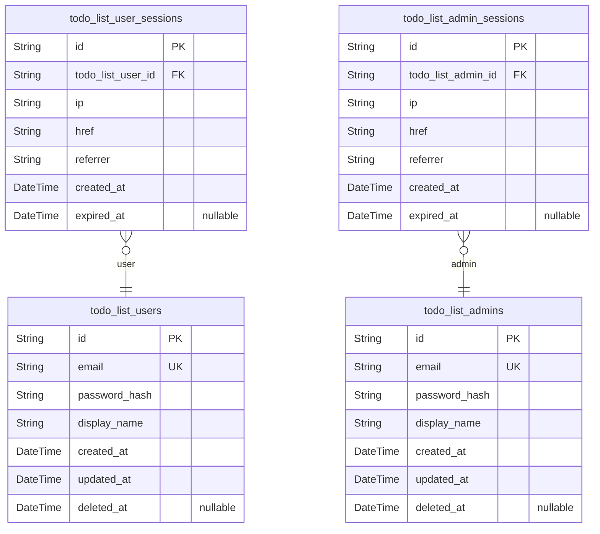
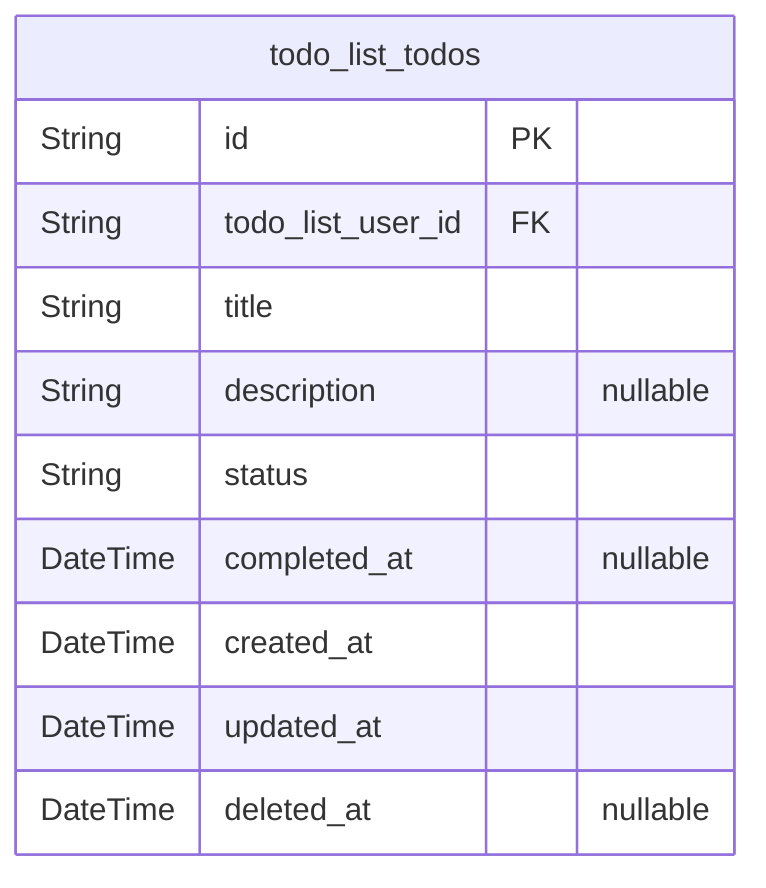
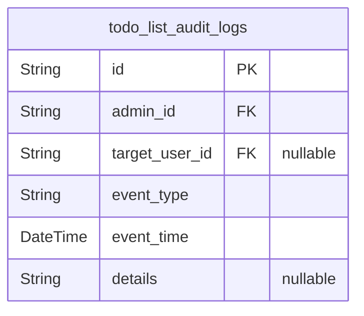

# Prisma Markdown

> Generated by [`prisma-markdown`](https://github.com/samchon/prisma-markdown)

- [Systematic](#systematic)
- [Actors](#actors)
- [Todos](#todos)
- [Audit](#audit)

## Systematic

```mermaid
erDiagram
"todo_list_system_settings" {
  String id PK
  String key UK
  String value
  String description "nullable"
  Int version
  DateTime created_at
  DateTime updated_at
}
```

### `todo_list_system_settings`

System-wide application configuration and global settings table.

Provides a centralized location for storing key/value pairs, flags, and
operational parameters used by the todo list application at runtime. Each
row represents a distinct configuration setting. This allows for
reliable, auditable modification and retrieval of system-level options,
feature toggles, and environment variables.

Typical usage includes storing site-wide feature switches, maintenance
flags, version numbers, and other application settings that need to be
referenced by business logic or admin operations. Settings can be updated
as the product evolves or undergoes upgrades, with timestamps preserving
the history of changes.

Properties as follows:

- `id`: Primary key. Uniquely identifies each configuration record.
- `key`
  > Unique setting identifier. Used by the application code to look up
  > configuration or environment variables. Must be unique system-wide and
  > limited to ASCII alphanumeric with underscores.
- `value`
  > Value assigned to the key. Can be interpreted by business logic as a
  > boolean, integer, string, URI, or other serializable data type as needed
  > by configuration context.
- `description`
  > Optional human-readable explanation describing the business purpose,
  > intended usage, and possible values of this setting.
- `version`
  > Monotonic version number incremented with any setting update. Allows
  > implementation of configuration reload, rollback, or audit scenarios.
- `created_at`
  > Timestamp indicating when the setting was created. Used for lifecycle
  > tracking and change audits.
- `updated_at`
  > Timestamp of last update to this configuration record. Reflects
  > operational changes to settings or value modifications.

## Actors

```mermaid
erDiagram
"todo_list_users" {
  String id PK
  String email UK
  String password_hash
  String display_name
  DateTime created_at
  DateTime updated_at
  DateTime deleted_at "nullable"
}
"todo_list_user_sessions" {
  String id PK
  String todo_list_user_id FK
  String ip
  String href
  String referrer
  DateTime created_at
  DateTime expired_at "nullable"
}
"todo_list_admins" {
  String id PK
  String email UK
  String password_hash
  String display_name
  DateTime created_at
  DateTime updated_at
  DateTime deleted_at "nullable"
}
"todo_list_admin_sessions" {
  String id PK
  String todo_list_admin_id FK
  String ip
  String href
  String referrer
  DateTime created_at
  DateTime expired_at "nullable"
}
"todo_list_user_sessions" }o--|| "todo_list_users" : user
"todo_list_admin_sessions" }o--|| "todo_list_admins" : admin
```

### `todo_list_users`

Registered user accounts for the Todo List application.

Each user is an independent actor who can manage their own personal
todos. The model stores core identity and authentication details,
including a unique email address and a securely stored password hash.
Profile management features such as display name are provided for
personalization, subject to length constraints. Account lifecycle and
security are handled via soft deletion and timestamp fields. Only this
entity serves as the origin of ownership for user-created data in the
system. Soft deletion supports user-driven deactivation or admin
suspension. User accounts are never accessible by other users, and all
business logic enforces strict isolation of user data across the
application.

Properties as follows:

- `id`: Primary Key.
- `email`
  > Unique email address used for authentication. Must conform to RFC
  > standards and be unique across all users.
- `password_hash`
  > Secure, one-way hash of the user password. Plain-text passwords are never
  > stored.
- `display_name`: User's visible profile name. Must be 2–50 characters.
- `created_at`: Timestamp when the user account was created.
- `updated_at`: Timestamp for the most recent profile change.
- `deleted_at`
  > Timestamp for when the account was soft deleted (voluntary or
  > admin-initiated).

### `todo_list_user_sessions`

Authentication session records for users.

Each session represents a single login or authentication event for a
user. Sessions track login context including IP address, connection URL,
and referrer as required for audit and compliance. Unique to each user,
allowing multiple concurrent sessions. Expiration field is provided for
immediate or scheduled logout. All session objects are managed through
this table to maintain strict traceability, session duration control, and
regulatory audit logging. Sessions never store tokens or device
fingerprints, only raw connection context and timestamps.

Properties as follows:

- `id`: Primary Key.
- `todo_list_user_id`: Reference to the owning user account. [todo_list_users.id](#todo_list_users).
- `ip`: IP address at login.
- `href`: Connection URL at login.
- `referrer`: Referrer URL at session start.
- `created_at`: Timestamp when the session was created.
- `expired_at`: Timestamp when the session expired or was explicitly ended.

### `todo_list_admins`

Administrative accounts for system management and oversight.

Admins maintain overall system health, enforce business rules, audit user
activity, and respond to support incidents. Each admin account includes
unique identification via email and secure password storage. Admins do
not create personal todos, but their actions are logged for traceability
and compliance. The model supports soft deletion for account revocation
or security purposes. All privileged operations, such as user suspension
and audit log access, are performed under an authenticated admin
identity.

Properties as follows:

- `id`: Primary Key.
- `email`
  > Unique email address for admin authentication. Must conform to RFC
  > standards and be unique among admins.
- `password_hash`: Secure one-way hash of the admin's password. Never stored in plain text.
- `display_name`
  > Visible admin profile name used for identification in audit logs. Must be
  > 2–50 characters.
- `created_at`: Timestamp for account creation.
- `updated_at`: Timestamp for most recent profile or credential update.
- `deleted_at`: Timestamp for soft deletion (revocation/suspension/voluntary exit).

### `todo_list_admin_sessions`

Authentication session records for administrators.

Each record represents a single login session for an admin account,
including IP, connection URL, and referrer details for compliance and
security auditing. Sessions enable tracing of every admin action to an
authenticated session and identity. Expiration datetime supports
scheduled or manual logout. Multiple concurrent sessions are allowed for
administrative flexibility. All privileged system operations are executed
in the context of a session in this table. No personal data beyond
session context and actor reference is stored here.

Properties as follows:

- `id`: Primary Key.
- `todo_list_admin_id`: Reference to the owning admin account. [todo_list_admins.id](#todo_list_admins).
- `ip`: IP address at session start.
- `href`: Connection URL used by the admin at login.
- `referrer`: Referrer URL for audit traceability.
- `created_at`: Timestamp for session creation.
- `expired_at`: Timestamp when the session expired or was terminated.

## Todos

```mermaid
erDiagram
"todo_list_todos" {
  String id PK
  String todo_list_user_id FK
  String title
  String description "nullable"
  String status
  DateTime completed_at "nullable"
  DateTime created_at
  DateTime updated_at
  DateTime deleted_at "nullable"
}
```

### `todo_list_todos`

Main todo item entity for personal task management.

Represents an individual user-owned task, supporting the full lifecycle
from creation, update, completion, to (soft) deletion. Each todo belongs
exclusively to one authenticated user and is never visible to others
except admins. The entity supports fast retrieval, multi-field filtering,
case-insensitive searching, and provides all audit and business
timestamps required for compliance and lifecycle tracking.

Field structure enforces domain rules: only non-deleted todos may share
the same title for a user, completion is timestamped, and filtered list
views are optimized by indexes. Temporal fields (created_at, updated_at,
completed_at, deleted_at) allow robust retention, undo, and audit
patterns as needed by the product.

Foreign keys, constraints, and indexes ensure data integrity and high
query performance for typical CRUD and search operations.

Properties as follows:

- `id`: Primary Key. Uniquely identifies the todo item.
- `todo_list_user_id`: User who owns this todo. References [todo_list_users.id](#todo_list_users).
- `title`
  > Short title of the todo item. Required, 1-100 visible UTF-8 characters,
  > trimmed of whitespace. Uniqueness enforced per user among non-deleted
  > todos.
- `description`
  > Optional extended description of the todo item. Up to 1000 characters.
  > May be null or empty.
- `status`
  > Todo status in business workflow. Allowed values: 'pending', 'completed'.
  > Only these two values are valid in minimal version; future states can be
  > added with migration.
- `completed_at`: Timestamp when the todo was marked as completed. Null if not completed.
- `created_at`: Creation timestamp of the todo item. Set when the record is first created.
- `updated_at`
  > Last modification timestamp. Updated on every change of title,
  > description, or status.
- `deleted_at`
  > Soft delete timestamp. Null if not deleted; set when user deletes the
  > todo for retention/undo window.

## Audit

```mermaid
erDiagram
"todo_list_audit_logs" {
  String id PK
  String admin_id FK
  String target_user_id FK "nullable"
  String event_type
  DateTime event_time
  String details "nullable"
}
```

### `todo_list_audit_logs`

System audit log entries for privileged administrative events and
compliance tracking.

Captures every significant admin action or sensitive event affecting user
data or system configuration. Each entry includes the precise actor
(admin or system service), affected target (user or resource), event
type/category, timestamp, and an optional narrative or details for audit
clarity.

Serves as an immutable, append-only history to ensure legal and business
compliance—supporting forensics, investigation, and external audit. No
audit event can be changed or deleted. Foreign keys reference existing
administrator and user tables for actor/target traceability. Optimized
for search and filterability on date, actor, target, and event type.

Properties as follows:

- `id`: Primary key. Unique identifier for each audit event.
- `admin_id`
  > Administrator responsible for the event. References {@link
  > todo_list_admins.id}.
- `target_user_id`
  > (Optional) User account affected by the event. May be null if event does
  > not target a specific user. References [todo_list_users.id](#todo_list_users).
- `event_type`
  > The type or category of event (e.g., 'user_deletion', 'todo_removed',
  > 'permission_changed', 'login_failed', 'system_restart'). Must be a short,
  > machine-readable string.
- `event_time`
  > Precise timestamp of when the event occurred (in UTC ISO8601; required
  > for every entry).
- `details`
  > Optional narrative or context describing the event (who, what, why, and
  > business reason for privileged interventions). Up to 2000 characters.
