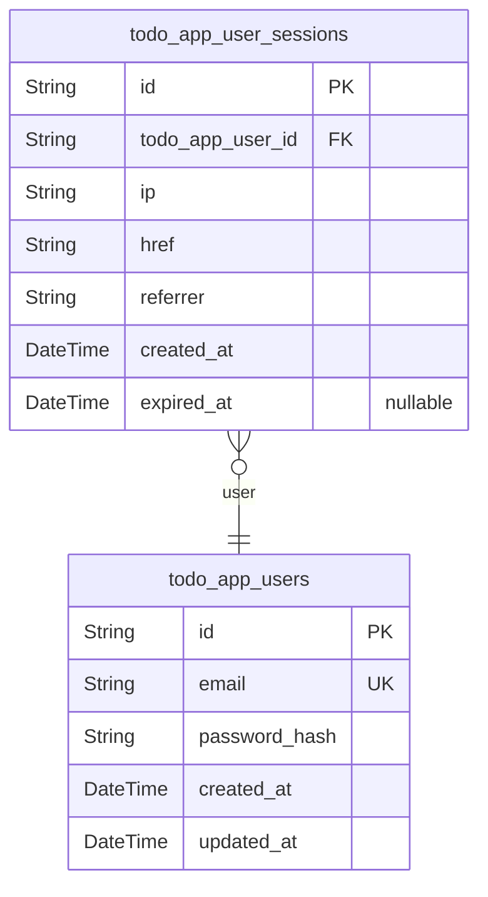
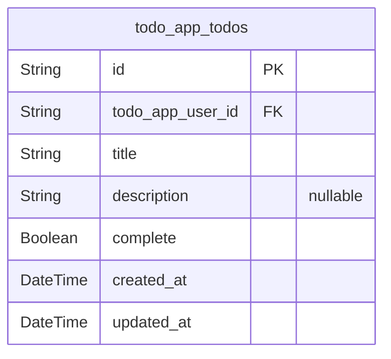

# Prisma Markdown

> Generated by [`prisma-markdown`](https://github.com/samchon/prisma-markdown)

- [Actors](#actors)
- [Todos](#todos)

## Actors

```mermaid
erDiagram
"todo_app_users" {
  String id PK
  String email UK
  String password_hash
  DateTime created_at
  DateTime updated_at
}
"todo_app_user_sessions" {
  String id PK
  String todo_app_user_id FK
  String ip
  String href
  String referrer
  DateTime created_at
  DateTime expired_at "nullable"
}
"todo_app_user_sessions" }o--|| "todo_app_users" : user
```

### `todo_app_users`

User accounts for the Todo application.

Registered users who can authenticate to the system and manage their
personal todo items.
Each user is identified by email and manages their account independently.

Properties as follows:

- `id`: Primary Key.
- `email`: User's email address used for authentication and identification.
- `password_hash`
  > Hashed password for user authentication. Never stores plain text
  > passwords.
- `created_at`: Timestamp when the user account was created.
- `updated_at`: Timestamp when the user account was last modified.

### `todo_app_user_sessions`

Authentication sessions for tracking user login activities.

Sessions are created when users authenticate and track connection details
for security auditing.
Each session is managed through the authentication flow and expires after
configured duration.

Properties as follows:

- `id`: Primary Key.
- `todo_app_user_id`: Belonged user's [todo_app_users.id](#todo_app_users).
- `ip`: IP address from which the user authenticated.
- `href`: URL where authentication occurred.
- `referrer`: Referrer information for the authentication request.
- `created_at`: Timestamp when the session was created.
- `expired_at`: Timestamp when the session expired or was terminated.

## Todos

```mermaid
erDiagram
"todo_app_todos" {
  String id PK
  String todo_app_user_id FK
  String title
  String description "nullable"
  Boolean complete
  DateTime created_at
  DateTime updated_at
}
```

### `todo_app_todos`

User's personal todo items represent the core functionality of the todo
application.

Each todo item contains a task that an authenticated user wants to track
and complete. Todos are strictly owned by individual users with full CRUD
permissions for their own items. The system maintains separate todo
collections for each user, ensuring complete data privacy.

Todo items support basic task tracking with optional descriptions,
completion status tracking, and timestamp audit trails. Users can create
unlimited personal tasks and manage them independently without
interfering with other users' todo lists.

The main business purpose is to help users organize their daily
responsibilities through a simple, reliable task management system.

Properties as follows:

- `id`: Primary Key.
- `todo_app_user_id`: Owner user's [todo_app_users.id](#todo_app_users).
- `title`: Todo item title (required field). Must be 1-200 characters.
- `description`: Optional description of the todo item. Can be up to 1000 characters.
- `complete`
  > Completion status of the todo item. True when completed, false when
  > pending.
- `created_at`: Timestamp when the todo item was first created.
- `updated_at`: Timestamp when the todo item was last modified.
