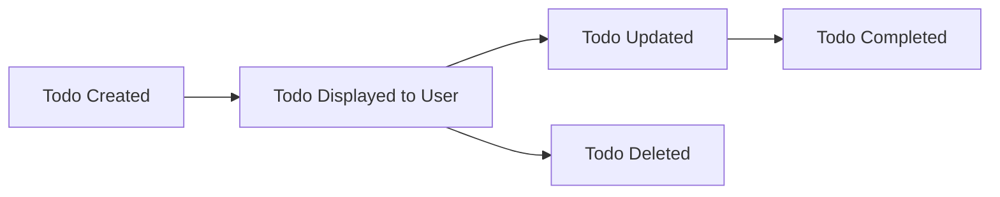

# Todo List Application: Requirements Analysis

## 1. Service Overview and Vision

A Todo list application allows users to organize and track personal tasks. The application exists to help individuals maintain productivity by providing a clear, simple interface to create, update, complete, and manage their daily tasks. The scope is strictly limited to personal usage, focusing on essential features only. No collaborative or team features are included in the minimal version. The goal is to deliver reliability, ease of use, and clarity for individuals aiming to better manage daily responsibilities and commitments.

**WHEN** a user starts using the Todo list application, **THE SYSTEM SHALL** present a user-friendly, uncluttered interface focused on effective personal task management.

## 2. Business Model and Success Criteria

The service provides free access to users. Success is measured by engagement metrics such as the number of users who consistently use the service to track and complete tasks over time. There are no paid features nor ads. The application's value lies in its simplicity and effectiveness in meeting the user's organizational needs.

**WHEN** measuring business success, **THE SYSTEM SHALL** track only anonymized engagement data such as active user count and average daily completed tasks.

## 3. User Actors and Permissions

There is one user actor: the registered user. No administrative or guest roles are present in minimal scope.

- **User**: Can register, authenticate, and manage their own todo items. Cannot access or modify others' data.

**WHEN** a user is authenticated, **THE SYSTEM SHALL** ensure that only that user's data is accessible and mutable.

## 4. Functional Requirements

### 4.1 Task Creation
**WHEN** a user enters a new todo item with a non-empty description, **THE SYSTEM SHALL** persist the task associated with that user and mark it as 'incomplete' by default.

### 4.2 Task Viewing
**WHEN** a user requests to see their todo list, **THE SYSTEM SHALL** present all tasks belonging to that user, optionally filtered by completion status (complete/incomplete).

### 4.3 Task Updates
**WHEN** a user edits the content or status of their todo item, **THE SYSTEM SHALL** save the changes if the new description is not empty.

### 4.4 Task Completion
**WHEN** a user marks a todo item as complete, **THE SYSTEM SHALL** update the status and optionally timestamp the completion.

### 4.5 Task Deletion
**WHEN** a user requests to delete their own todo item, **THE SYSTEM SHALL** remove it from that user's list after confirmation.

### 4.6 Minimal Account Management
**WHEN** a user registers or logs in, **THE SYSTEM SHALL** enforce unique identification (e.g., by email or username), and store a securely hashed password.

## 5. User Workflow and Scenarios

### 5.1 Registration Workflow
- User opens registration page
- User provides email/username and password
- **WHEN** user submits valid credentials, **THE SYSTEM SHALL** create an account and redirect to login

### 5.2 Login Workflow
- User opens login page
- User submits credentials
- **WHEN** credentials are correct, **THE SYSTEM SHALL** establish a session and allow access to todos

### 5.3 Todo Management Workflow
- User adds a new todo item
- User views, edits, marks complete, or deletes items as required
- **WHEN** changes are saved, **THE SYSTEM SHALL** immediately reflect the updated state on the user's list

## 6. Business Rules and Validation

- Task descriptions must not be blank and should be trimmed of leading/trailing whitespace.
- Only the owner can create, view, update, complete, or delete their own todo items.
- Passwords must meet basic security requirements (minimum length: 8 characters).

**WHEN** invalid input is received during any create or update action, **THE SYSTEM SHALL** return a clear error message with guidance.

## 7. Error Handling and Recovery

- **WHEN** authentication fails, **THE SYSTEM SHALL** notify the user and prompt for correct credentials.
- **WHEN** an operation is attempted on a non-existent or unauthorized todo item, **THE SYSTEM SHALL** deny the action and explain why.
- For system errors, **THE SYSTEM SHALL** present a generic error message and encourage retry or contact support.

## 8. Non-Functional Requirements

- Interface shall respond to user actions within 2 seconds.
- User data shall be reliably stored and available at least 99.9% of the time.
- The design shall be accessible and usable on both desktop and mobile devices with standard browsers.

## 9. Security and Compliance Requirements

- User authentication must be required for all interactions with todo data.
- Passwords are never stored or logged in clear text.
- Each user can only access their own todos; there is no public data exposure.
- Basic compliance with privacy standards (email/username and password only; no sensitive personal data is allowed).

**WHEN** a security breach is detected, **THE SYSTEM SHALL** immediately restrict access and notify affected users as appropriate.

## 10. Data Flow and Lifecycle

1. **Creation**: Todo is created and linked to the user's account.
2. **Retrieval**: User requests and views their todo list at any time.
3. **Modification**: Only the user can edit or update their items.
4. **Completion**: User marks item as complete; system timestamps it.
5. **Deletion**: User removes item; data is deleted from active records.

## 11. Glossary of Terms

- **Todo**: A single task or item managed by the user within the application.
- **Complete/Incomplete**: The status of a todo item, indicating whether the task has been finished.
- **User**: An authenticated individual who can create and manage their own todo items.
- **Session**: Period during which a user is authenticated and can perform actions in the app.
- **Task**: Synonym for "todo".
