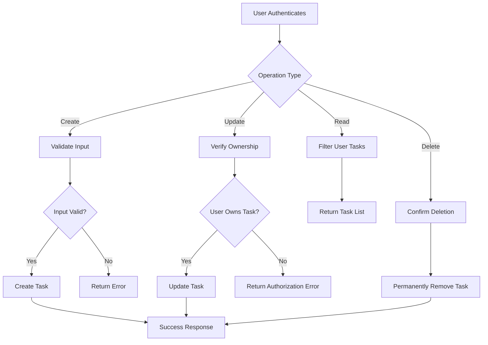

# Todo List Application Business Rules

## Introduction

This document specifies the core business rules and operational constraints for the Todo list application. The application provides minimum functionality focused on essential task management operations: creating tasks, viewing task lists, updating task completion status, and deleting tasks. All business rules are defined in natural language to guide backend developers in implementing the system while maintaining focus on user needs and system reliability.

The document establishes the foundational business logic that governs how the Todo list application operates, ensuring consistency and predictability for users while supporting authenticated access and data integrity.

## Task Validation Rules

WHEN a user creates a new task, THE system SHALL validate that the task title is not empty and contains between 1 and 100 characters.

WHEN a user updates a task, THE system SHALL verify that the user owns the task and that any changes meet the same validation criteria as task creation.

IF a task title is invalid, THEN THE system SHALL reject the operation and provide a clear error message indicating the validation failure.

WHILE processing task operations, THE system SHALL only allow modifications to tasks that belong to the authenticated user.

THE system SHALL prevent task creation or updates that would violate the maximum title length of 100 characters.

WHEN a task deletion is requested, THE system SHALL confirm the task exists and belongs to the requesting user before proceeding.

## Business Logic

THE system SHALL enforce task ownership where each task is exclusively associated with the user who created it.

WHEN a user accesses their task list, THE system SHALL display only tasks owned by that authenticated user.

IF a user attempts to access tasks belonging to another user, THEN THE system SHALL deny access and return an appropriate authorization error.

WHILE maintaining task status, THE system SHALL only allow toggling between "incomplete" and "completed" states.

WHEN a task is created, THE system SHALL automatically set its status to "incomplete" and record the creation timestamp.

IF a user marks a task as completed, THEN THE system SHALL update the completion timestamp to track when the task was finished.

THE system SHALL maintain task order by creation date, with newest tasks appearing first in the user's list view.

## Data Constraints

THE system SHALL limit task titles to a maximum of 100 characters to ensure consistent display across different interfaces.

TASK descriptions SHALL be optional and limited to 500 characters if provided.

EACH user SHALL be restricted to a maximum of 1,000 active tasks to prevent system abuse and ensure performance.

TASK statuses SHALL be limited to exactly two values: "incomplete" and "completed", with no intermediate states allowed.

THE system SHALL automatically archive tasks that have been completed for more than 30 days to maintain system performance.

WHILE storing tasks, THE system SHALL associate each task with exactly one user account, preventing any shared or orphaned tasks.

## Operational Boundaries

WHEN the system experiences high load, THE system SHALL prioritize task creation, viewing, and status updates over less critical operations.

THE system SHALL only allow authenticated users to perform any task-related operations, with no anonymous access permitted.

IF a user's account is deactivated, THEN THE system SHALL retain their tasks for 90 days before permanent deletion, giving them opportunity for data recovery.

THE system SHALL enforce a rate limit of 100 task operations per minute per user to prevent system abuse.

WHEN performing bulk operations, THE system SHALL limit bulk updates to a maximum of 50 tasks per operation.

THE system SHALL not allow tasks to be shared between users or transferred between accounts.

## Task CRUD Operations Flow

This flow diagram illustrates the business logic flow for all task operations, emphasizing validation, ownership verification, and proper authorization checks throughout all CRUD operations.

> *Developer Note: This document defines **business requirements only**. All technical implementations (architecture, APIs, database design, etc.) are at the discretion of the development team.*