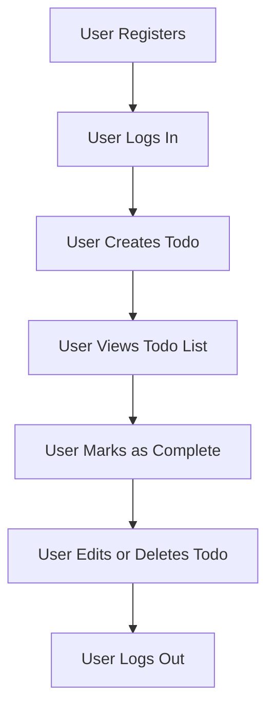

# Todo List Backend Requirements Specification

## Introduction
The todoList backend application enables users to manage, track, and complete their personal tasks via the simplest viable set of features. The service is designed to maximize productivity and clarity by providing core task management for individual registered users and system administrators. This document details the minimum set of requirements for the backend, emphasizing simplicity, security, and privacy.

## Scope of System (MVP and Constraints)
### In Scope
- Creation, viewing, updating, and deletion of individual todo items by each registered user
- Marking todos as complete or incomplete
- Secure user registration, login, and logout using email
- Basic profile management (user can view and update their own account details)
- Administrator access to view, manage, and remove user accounts and reported tasks
- Strict data isolation: users can never access other users’ todos

### Out of Scope
- Group or shared task lists
- Task reminders and notifications
- Calendar integration or event scheduling
- Third-party integrations
- Media/file attachments within todos
- Analytics or progress reports
- Multilingual or internationalization features
- Any frontend/mobile app requirements

## User Actors
- **User**: A registered individual managing their personal todo list. Can only view and manage their own tasks and profile information.
- **Admin**: Responsible for system health, monitoring all user activities, and intervening in cases of abuse or technical issues. Can view and remove inappropriate or malfunctioning user accounts and reported tasks but cannot alter user data except as described.

## Business Requirements (EARS Format)

### Task Management
- WHEN a registered user wants to add a todo item,
  THE system SHALL allow creation of a new todo entry that is only accessible to that user.
- WHEN a user wants to see their task list,
  THE system SHALL present the complete list of uncompleted and completed todos for that user, in an order chosen by the user (default: most recent first).
- WHEN a user edits a task,
  THE system SHALL allow them to update the title and description of the todo item.
- WHEN a user marks a task as completed or uncompleted,
  THE system SHALL immediately update and display the task status in their list.
- WHEN a user deletes a task,
  THE system SHALL remove the specific task from their personal list and prevent access to its data.

### Registration & Authentication
- WHEN a new user registers via email,
  THE system SHALL securely store the user profile and enforce uniqueness of the email.
- WHEN a user logs in with correct credentials,
  THE system SHALL authenticate and establish a session linking requests to that user only.
- WHEN a user logs out,
  THE system SHALL immediately invalidate their session and prohibit further access to protected endpoints.
- WHEN an unauthenticated request is made to protected endpoints,
  THE system SHALL deny access and return a clear authentication error message.

### Profile Management
- WHEN a user views or edits their account,
  THE system SHALL present and allow changes only to the fields owned by that user (such as name or email).
- WHEN a user requests deletion of their account,
  THE system SHALL permanently remove their user record and all related todos, following a confirmation process.

### Administrative Oversight
- WHEN an admin accesses the system dashboard,
  THE system SHALL allow viewing of a paginated list of user accounts for monitoring activity and system health.
- WHEN an admin needs to act on a user or todo (such as for abuse, spam, or malfunction),
  THE system SHALL present controls for account suspension, deletion, or manual review.
- WHEN an admin deletes a user or todo for cause,
  THE system SHALL document the reason and store an audit log entry for traceability.

## Business Rules and Validations
- Each user may only see and manage their personal tasks;
  THE system SHALL strictly prevent all cross-user data visibility.
- All actions require authentication;
  THE system SHALL reject requests from unauthenticated entities with a standardized error message.
- Task content SHALL be limited to plain text without rich formatting or attachments.
- The title for each todo SHALL be required, with a length limit to 100 characters.
- Descriptions SHALL be optional but limited to 500 characters if present.
- No duplicate active tasks (i.e., same title) SHALL exist for a single user.
- Email for registration SHALL follow valid RFC email formats and be unique systemwide.

## Authentication and Authorization
- All endpoints except registration and login require authentication by default.
- Registered users shall have access exclusively to their own data.
- Admin endpoints are accessible only via elevated credentials; admin actions are logged with traceability.
- JWT or session tokens SHOULD be securely generated and validated per request, but visible only as business requirements here.
- There is no guest/anonymous usage except account creation and login.

## Error Handling and Boundary Cases
- WHEN input validation fails (e.g., invalid email, missing field),
  THE system SHALL respond with a descriptive error and not process the request.
- WHEN a forbidden access is attempted (e.g., user tries to access another's task),
  THE system SHALL deny with a permission error and record the event for admins.
- WHEN any operation causes a system error,
  THE system SHALL return a generic error message and log the failure for administrative review.
- WHEN a user or admin attempts an operation on a nonexistent resource,
  THE system SHALL respond with a standardized not-found error.

## Out-of-Scope Features (Explicit Exclusions)
- Team collaboration or sharing
- Reminders, deadlines, recurring tasks
- Calendar or scheduling, analytics, reporting
- Third-party integrations; mobile app or frontend requirements
- File or image attachments in todos
- Complex tagging or categorization
- Internationalization (i18n) and accessibility concerns beyond core features

## Appendix
### Glossary
- **Todo**: A single task item, consisting of title, optional description, completion status, owner user, and timestamps
- **User**: An individual account holder managing personal tasks
- **Admin**: Privileged user for maintaining system health and responding to abuse

### Reference Links
- [Service Overview and Vision](./01-service-overview-and-vision.md)

### Example User Workflow Mermaid Diagram

