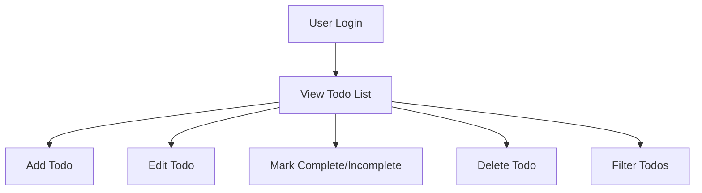

# Todo List Application - Requirements Analysis

## 1. Purpose and Scope

The Todo List application enables users to quickly record, organize, update, and mark completion of simple, private task lists. The service does not implement advanced features such as file attachments, calendar integration, team sharing, or complex tagging in the initial release. The business goal is to provide a frictionless, reliable tool for personal productivity, designed around privacy, clarity, and minimalism.

## 2. User Actors

- **User**: An individual who creates an account, signs in, and manages their personal list of todo items. All data is strictly private to the user.

## 3. Functional Requirements

All requirements use the EARS (Easy Approach to Requirements Syntax) format for precision and verifiability.

- WHEN a user is authenticated, THE system SHALL allow the user to create a new todo item that includes at minimum a title and completion status.
- WHEN viewing their todo list, THE user SHALL see a list of their items, with title, completion status, and creation date.
- WHEN the user selects a todo item, THE system SHALL display its full details (title, completion status, and optionally a note field).
- WHEN the user edits an existing todo, THE system SHALL allow changing the title and completion status.
- WHEN the user deletes a todo item, THE system SHALL prompt for confirmation and, upon approval, permanently remove the item.
- WHEN the user marks an item as complete or incomplete, THE system SHALL update its status immediately and persistently.
- WHEN a user requests to view only completed or incomplete items, THE system SHALL filter the displayed items accordingly.

## 4. Business Rules

- WHEN a todo item is created, THE title SHALL be a non-empty string up to 100 characters. Empty titles SHALL NOT be allowed.
- WHEN a todo item is displayed, THE status SHALL be either 'complete' or 'incomplete'.
- WHEN a user deletes a todo item, THE data SHALL be removed permanently with no recovery mechanism in MVP.
- WHEN displaying the todo list, THE items SHALL be sorted chronologically with the most recently created item first by default.
- WHEN multiple users have accounts, THE system SHALL enforce strict data isolation between user accounts.
- WHEN a request contains invalid data (e.g., missing title), THE system SHALL respond with a clear error message describing the problem.

## 5. User Scenarios

### Scenario 1: Adding a Todo
- WHEN the user logs in and clicks "Add Todo", THE system SHALL display a form prompting for a title (and optional note field).
- WHEN the user submits the form with a valid, non-empty title, THE system SHALL create the todo and update the list view instantly.

### Scenario 2: Editing a Todo
- WHEN the user clicks on an existing todo, THE system SHALL show an edit interface for title and status.
- WHEN changes are submitted, THE system SHALL update and re-display the todo immediately.

### Scenario 3: Completing a Todo
- WHEN the user marks a todo as complete, THE system SHALL visually distinguish completed items (e.g., strikethrough) in the list view.
- WHEN the user marks a completed todo as incomplete, THE system SHALL revert the display so the item appears as not done.

### Scenario 4: Deleting a Todo
- WHEN the user chooses to delete a todo, THE system SHALL prompt to confirm deletion and, if confirmed, remove the item from both display and storage.

### Scenario 5: Filtering Todos
- WHEN the user toggles filters ("Show only incomplete", "Show completed"), THE system SHALL adjust the displayed list accordingly.

## 6. Authentication and Authorization

- WHEN a new user signs up, THE system SHALL require a unique email and password or secure 3rd-party login (e.g., OAuth via Google or Apple).
- WHEN a user logs in, THE system SHALL initiate a secure session and associate all data requests to the authenticated user only.
- WHEN an unauthenticated request is made to any todo-related feature, THE system SHALL reject the request and prompt for sign-in.
- WHEN accessing any user's data, THE system SHALL ensure only the authenticated user can access, modify, or delete their own todos.
- WHEN passwords are stored, THE system SHALL hash them securely using industry-standard algorithms.

## 7. Error Handling

- WHEN a user performs an unsupported action (such as editing someone else's todo), THE system SHALL return a "Forbidden" error.
- WHEN data is invalid or missing, THE system SHALL provide a clear, actionable error response that explains the issue (e.g., "Title cannot be empty").
- WHEN an internal system error occurs, THE system SHALL return a generic error message, log details for internal review, and never expose implementation details to users.

## 8. Non-functional Requirements

- WHEN the system serves user requests, THE service SHALL respond within 500ms in 95% or more of cases.
- WHEN a server or network error is encountered, THE service SHALL remain available for 99.9% of the time over any rolling 30-day period.
- WHEN handling user data, THE service SHALL use encrypted-at-rest and encrypted-in-transit protocols for storage and transfer.
- WHEN accessible via web and mobile, THE interface SHALL be responsive and usable on common device types (smartphones, tablets, desktops).

## 9. Minimalist Flow - Mermaid Diagram

## 10. Success Criteria (Derived from Business Model)

- WHEN users manage todos with minimal steps, THE system SHALL show measurable increases in user retention and satisfaction.
- WHEN key features operate smoothly (creating, editing, deleting, and filtering todos), THE application SHALL achieve at least 95% successful action completion measured by logs.
- WHEN reviewing support inquiries, THE service SHALL demonstrate <5% of issues relate to lost or incorrectly stored todo data.
- WHEN tracking downtime, THE service SHALL show 99.9% system uptime per month and an average response time under 500ms for all tasks.

## 11. Out of Scope

The MVP does not support team/shared lists, notifications, recurring todos, voice input, or data export. Only the minimal individual todo workflow is included.