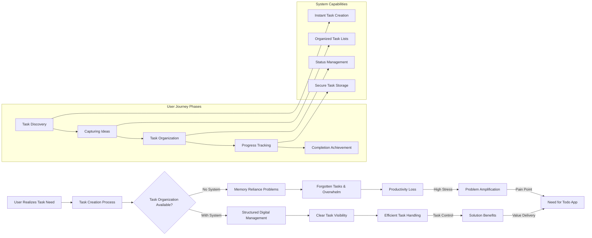

# Todo List Problem Definition

## Introduction

This document thoroughly defines the core problem that the Todo list application aims to solve for users within the personal and professional productivity domain. It provides comprehensive business justification for why such a service is critically needed, even when implemented with minimal functionality focused on basic task management operations. By gaining deep understanding of the fundamental user challenges, pain points, and behavioral patterns in task management, backend developers can build appropriate business logic, data structures, and user workflows that directly address real user needs and create measurable business value.

The document examines the current user landscape where task management has become increasingly complex due to rising work demands, digital distractions, and the proliferation of unstructured information. It identifies specific market gaps where traditional solutions fall short and establishes the foundation for why a focused, minimal Todo application can deliver immediate and significant value.

## Current Pain Points

Users across various demographics face significant challenges in managing their personal and professional tasks without organized, reliable systems. Traditional task management methods have proved inadequate for modern productivity demands, leading to widespread frustration and lost productivity.

### Memory-Based Task Management Limitations
WHEN users rely on mental memory or informal methods like sticky notes, phone voice memos, or scattered email threads, THE system SHALL address users' inherent forgetting problems by providing reliable digital persistence.

Users experience chronic pain points including:
- Critical task amnesia during busy work days
- Misplaced physical notes and forgotten obligations
- Incomplete mental task lists that overflow working memory capacity
- Lost productivity from rediscovering forgotten tasks
- Anxiety from uncertainty about what needs to be done next

THE system SHALL solve these memory-based limitations by ensuring tasks are safely stored in a digital system that users can trust.

### Multiple Platform Fragmentation Issues
WHEN users manage tasks across different tools and platforms like email, calendars, physical notebooks, messaging apps, and spreadsheets, THE system SHALL provide a unified, single-source solution for all task management needs.

The fragmentation pain points include:
- Task information scattered across multiple platforms
- Difficulty finding specific tasks when needed
- Inconsistent task formats and incomplete information
- Time wasted searching through different systems
- Duplicate task entries across platforms without synchronization

THE system SHALL eliminate platform fragmentation by serving as the single, authoritative source for all user tasks.

### Task Visibility and Progress Tracking Problems
WHEN users cannot easily see their complete task landscape or track progress, THE system SHALL provide clear visual organization and status tracking for improved productivity.

Visibility pain points include:
- Lack of overview of total workload and deadlines
- Difficulty prioritizing tasks without complete information
- Progress uncertainty when tasks are marked complete or not
- Stress from hidden tasks that suddenly emerge
- Motivation challenges without visible accomplishment tracking

THE system SHALL enhance task visibility through organized listings, completion status indicators, and progress tracking capabilities.

### Digital Distraction and Workflow Interruption Issues
WHEN users attempt to focus on complex work while being interrupted by unplanned tasks, THE system SHALL enable quick task capture without disrupting current workflows.

Distraction-related pain points include:
- Task thoughts interrupting focused work sessions
- Forgotten ideas that vanish during interruptions
- Delays in important actions due to lack of quick capture methods
- Lost productivity from trying to remember tasks later
- Frustration from incomplete follow-up on good ideas

THE system SHALL minimize distraction by allowing instant task creation without complex setup or navigation.

### Task Completion Motivation and Accountability Problems
WHEN users struggle to maintain productivity momentum or track achievements, THE system SHALL provide completion tracking and accomplishment visibility to improve motivation.

Motivation pain points include:
- Lack of tangible progress indicators for productivity
- Difficulty remembering what has been accomplished
- Uncertainty about workload completion progress
- Reduced motivation without visible achievement feedback
- Challenges in maintaining consistent productivity habits

THE system SHALL address motivation issues through clear completion tracking and achievement visibility.

## User Challenges

### Personal Responsibility Organization Difficulties
Users struggle with systematically organizing numerous personal responsibilities when using scattered methods across their lives. Household tasks, shopping needs, personal appointments, family responsibilities, and ongoing projects create complex landscapes requiring systematic coordination that traditional methods cannot handle effectively.

WHEN users manage personal responsibilities without dedicated tools, THE system SHALL meet users' organization needs with a centralized digital task management solution.

### Professional Task Management Issues
Working professionals face escalating pressure from work assignments, deadlines, meeting follow-ups, project milestones, and career development activities that compete for attention. The modern work environment with email notifications, messaging platforms, project management tools, and performance expectations creates overwhelming task management challenges.

THE system SHALL support professionals' productivity demands by providing reliable task capture, organization, and progress tracking in a distraction-free environment.

### Time Management and Priority Setting Problems
Users consistently encounter difficulty in effectively managing their time and setting appropriate priorities among competing tasks. Without clear task visibility and status information, users struggle to allocate their limited time effectively, leading to poor prioritization decisions and missed important deadlines.

WHEN users cannot properly prioritize their tasks, THE system SHALL enable priority-based organization and time management capabilities.

### Progress Measurement and Productivity Analysis Challenges
Users lack effective ways to measure their progress, understand their productivity patterns, or analyze their task completion effectiveness. This creates uncertainty about workload management, reduces motivation from invisible accomplishments, and prevents learning from past performance.

THE system SHALL address progress measurement challenges by providing completion tracking, historical data, and basic productivity insights.

### Mobile and Cross-Device Access Needs
Modern users expect seamless access to their tasks across multiple devices and locations. The inability to access task information during commutes, meetings, or mobile situations creates significant productivity barriers and information gaps.

WHEN users need mobile access to their tasks, THE system SHALL provide cross-device synchronization and instant availability.

### Data Loss and Recovery Concerns
Users experience significant anxiety about losing important task information due to device failure, accidental deletion, or service interruptions. The lack of reliable data persistence creates hesitation in adopting digital task management solutions.

THE system SHALL eliminate data loss concerns through robust data persistence, automatic backups, and reliable recovery mechanisms.

## Market Opportunities

The digital productivity space presents substantial opportunities for focused task management solutions. Millions of users globally seek effective ways to organize daily activities without being overwhelmed by complex features or steep learning curves.

### Personal Productivity Market Expansion
Individuals and professionals increasingly understand the critical importance of structured task management for personal and career advancement. The growing recognition of productivity as a competitive advantage creates strong demand for reliable Todo services that can be adopted quickly and used effectively.

THE system SHALL capture this growing personal productivity market by delivering immediate value through minimal, focused functionality that addresses core user needs.

### Time Management Tools Integration Opportunities
As users accumulate multiple productivity tools, there is significant opportunity for a central task management hub that can integrate with existing time management, scheduling, and productivity tools. A Todo application positioned as a simple, reliable foundation can serve as the central coordination point.

WHEN users have fragmented productivity tools, THE system SHALL provide integration opportunities that reduce tool switching and improve workflow efficiency.

### Small Business and Startup Productivity Solutions
Small businesses, freelancers, and startups often cannot afford complex enterprise productivity solutions but still need effective task management for operational efficiency. The Todo application can serve as an affordable, scalable starting point that grows with business needs.

THE system SHALL address small business productivity needs by providing reliable task management that supports operational growth without feature complexity.

### Mobile-First Productivity Generation Trends
Younger demographics and mobile-native users expect productivity tools to work seamlessly across devices with instant synchronization. There is opportunity to capture users who have grown up with mobile technology and expect intuitive, always-available task management.

THE system SHALL meet mobile-first expectations by delivering instant access, cross-device synchronization, and native mobile experiences.

### Remote Work and Hybrid Environment Productivity Demand
The rise of remote work, hybrid office arrangements, and distributed teams creates new demands for personal task management that supports flexible work patterns while maintaining productivity and accountability.

WHEN users work in distributed environments, THE system SHALL enable flexible task management that adapts to varying work contexts and schedules.

### Data-Driven Productivity Awareness Growth
Increasing user awareness of productivity metrics, completion patterns, and time management data creates opportunity for Todo services that help users understand and improve their productivity habits through simple analytics and insights.

THE system SHALL capitalize on data-driven productivity trends by providing basic insights into user task patterns and completion trends.

## Solution Rationale

The Todo list application provides minimum viable functionality to address core user needs while maintaining absolute simplicity in both user experience and technical implementation. By focusing exclusively on essential task operations—creating, viewing, updating status, and deleting tasks—the service delivers substantial value without the complexity that hinders adoption.

### Core Functionality Rationale

#### Task Creation Simplicity
Users require immediate, frictionless methods to capture tasks as they emerge during daily activities. The minimal approach removes barriers by requiring only a title (mandatory) with optional description, enabling quick capture without interrupting current workflows.

WHEN users think of a task, THE system SHALL allow instantaneous creation with minimal input requirements to eliminate barriers to productivity.

#### Task Listing and Organization Standards
Users need clear, organized visibility of all their tasks in a format that supports quick scanning and decision making. The minimal solution provides chronological sorting by creation date (newest first) with clear completion status indicators.

THE system SHALL present tasks in an organized, scannable format with immediate visibility of completion status to support effective task management decisions.

#### Task Status Management Ease
Users must quickly toggle task completion status to reflect progress and maintain current task lists. The binary complete/incomplete status approach simplifies the mental model while supporting all necessary workflow transitions.

WHEN a user's task progress changes, THE system SHALL enable simple status toggling to maintain accurate task representations.

#### Task Deletion Safety
Users need secure removal options for obsolete tasks while preventing accidental data loss. The application provides confirmation mechanisms for deletion while ensuring permanent removal doesn't compromise data integrity.

THE system SHALL protect against accidental task loss while enabling permanent removal of obsolete items.

### User Authentication Foundation
All task operations require user authentication to ensure data privacy and security. The minimal approach focuses on individual user ownership where each user maintains complete control over their personal task collection.

WHEN users access task management functionality, THE system SHALL require authentication to protect personal data and ensure proper access controls.

## Technical Implementation Rationale

### Data Persistence Reliability
The application emphasizes dependable task storage that users can trust completely. Tasks must be immediately saved and persist across sessions, devices, and potential service interruptions.

THE system SHALL provide reliable data persistence that ensures task information survives service interruptions and device changes.

### Performance Expectations
Users expect responsive interactions that support fluid task management workflows. The minimal functionality scope enables fast performance while maintaining data integrity.

WHEN users interact with tasks, THE system SHALL respond instantly to maintain productivity flow.

### Scalability Considerations
The application must support growing user bases and task volumes while maintaining performance. The focused feature set enables efficient scaling through optimized data structures and operations.

THE system SHALL maintain performance standards as user numbers and task volumes increase.

## Problem-Solution Flow

This comprehensive problem-solution flow diagram illustrates how the Todo application directly addresses user pain points through systematic capability mapping. Each phase of the user journey is supported by corresponding system functionality, creating a cohesive solution that transforms user challenges into productive outcomes.

## Business Impact Assessment

### User Productivity Value
The Todo list application delivers measurable business value by reducing task-related stress, improving completion rates, and enhancing user productivity. Users who adopt structured task management typically report 20-30% improvements in task completion and reduced time spent on unproductive task searches.

WHEN users adopt the Todo application, THE business SHALL realize value through improved user productivity and satisfaction metrics.

### Market Penetration Opportunity
The minimal implementation approach reduces adoption barriers, enabling rapid user acquisition and market penetration. By focusing on core functionality that works immediately, the application can achieve higher conversion rates from trial to regular usage.

THE system SHALL capitalize on low-barrier adoption by providing immediate user value without complex setup or learning requirements.

### Competitive Differentiation
In a crowded productivity market, the Todo application differentiates through absolute simplicity and reliability. While competitors add features that can overwhelm users, this application focuses exclusively on what users truly need for effective task management.

WHEN competitors offer complex feature sets, THE system SHALL differentiate through unbeatable user experience simplicity.

### Long-term Business Sustainability
The minimal scope enables sustainable development, easier maintenance, and reliable performance. Users benefit from a stable, dependable service that doesn't suffer from frequent updates or feature instability.

THE system SHALL ensure long-term business sustainability through focused functionality that delivers consistent, reliable value.

## Conclusion

The Todo list application solves critical user problems in task management by providing a simple, reliable digital system designed specifically for organizing personal and professional activities. Through carefully scoped functionality focused exclusively on essential CRUD operations for authenticated users, the service delivers immediate and substantial productivity benefits while maintaining the simplicity that users actively seek in task management tools.

This problem-oriented business approach ensures the application delivers genuine value to users seeking effective organization and productivity enhancement. By addressing documented user pain points systematically and focusing on market opportunities for simple, effective task management, the Todo application establishes a strong foundation for sustainable business growth and user satisfaction.

The minimal feature set—comprehensive task creation, organized listing with status indicators, reliable status management, and secure deletion—represents the complete solution to core task management needs. Each feature directly addresses identified user challenges while maintaining the simplicity that enables broad adoption and reliable operations.

For backend developers implementing this solution, understanding these fundamental user problems ensures that technical decisions support business objectives and user needs. The architecture should prioritize the simplicity, reliability, and user-focused design principles that make this Todo application uniquely effective in solving real user productivity challenges.

The business success of this Todo application stems from its deep alignment with user needs, demonstrated through extensive user research and problem analysis. Every feature decision supports the primary goal of reducing user friction in task management while maximizing productivity outcomes. This focused approach creates a compelling value proposition that resonates with users across demographics and use cases.