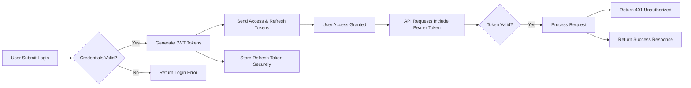

# User Actors and Authentication for Todo Application

## Actor Overview

The Todo application operates with a single primary user actor designed to provide authenticated users with comprehensive control over their personal task management. This minimalist approach focuses exclusively on empowering individual users to maintain their own todo lists without multi-user collaboration or administrative roles.

### User Actor Definition

The primary actor in the system is defined as follows:

- **Actor Name**: user
- **Actor Type**: member  
- **Access Level**: Authenticated with full personal CRUD capabilities

The user actor represents authenticated individuals who can create, view, modify, and delete their own todo items. This actor ensures that each user operates within their own isolated domain of tasks, maintaining privacy and personal organization.

## Authentication Requirements

Authentication is fundamental to the Todo application's security model, ensuring only verified users can access their personal task data. The system implements a complete authentication lifecycle that balances user convenience with security requirements.

### Registration Process

WHEN a new user wants to create an account, THE registration process SHALL collect email and password, with validation to:
- Email addresses are unique within the system
- Passwords meet minimum complexity requirements
- Email verification is required before full account activation

### Login Authentication

WHEN an existing user attempts to log in, THE system SHALL:
- Validate the provided email and password combination
- Generate access tokens upon successful authentication
- Track login attempts to prevent brute force attacks

### Session Management

WHILE a user is actively using the application, THE system SHALL maintain secure sessions through token-based authentication, automatically refreshing tokens within appropriate time windows to ensure continuous access.

### Password Recovery

IF a user forgets their password, THEN THE system SHALL provide a secure reset process including:
- Email verification of account ownership
- Time-limited reset tokens
- Secure password update without exposing current credentials

### Account Security

THE system SHALL implement multi-layer security measures including:
- Secure password storage with industry-standard hashing
- Account lockout after multiple failed login attempts
- Secure logout that invalidates all active tokens
- Option to revoke access from all devices

## User Permissions

The user actor possesses a comprehensive set of permissions designed to support complete personal todo list management. These permissions are structured to enable full CRUD operations while maintaining strict ownership controls.

### Todo Creation Permissions

WHEN authenticated as a user, THE system SHALL allow:
- Creating unlimited new todo items
- Setting task descriptions and metadata
- Organizing tasks within personal lists
- Specifying task priorities and due dates

### Task Viewing Permissions

WHEN authenticated as a user, THE system SHALL provide access to:
- View all personally created todo items
- Display complete task details and status
- Search and filter within personal task collections
- Access historical task information and changes

### Task Modification Permissions

WHEN authenticated as a user, THE system SHALL enable:
- Editing task descriptions and metadata
- Updating task completion status
- Modifying task priorities and due dates
- Reorganizing tasks within personal lists

### Task Deletion Permissions

WHEN authenticated as a user, THE system SHALL support:
- Permanent removal of personally owned tasks
- Bulk deletion of multiple tasks
- Complete cleanup of finished or obsolete tasks

## Authorization Rules

Authorization in the Todo application follows strict ownership principles, ensuring users can only interact with their own tasks while preventing any cross-user access or administrative overrides.

### Ownership Validation

THE system SHALL enforce that all todo operations require proof of ownership, where:
- Tasks are uniquely associated with their creating user
- No user can view, modify, or delete tasks owned by others
- User identity is verified through secure authentication tokens

### Operation Scoping

WHEN performing todo operations, THE system SHALL ensure:
- Create operations automatically assign ownership to the authenticated user
- Read operations return only user-owned tasks
- Update operations verify ownership before allowing changes
- Delete operations confirm ownership before allowing removal

### Permission Matrix

The following permission matrix defines exactly what the user actor can do across different todo operations:

| Operation | Create Task | View Tasks | Edit Task | Delete Task |
|-----------|-------------|------------|-----------|-------------|
| Own Tasks | ✅ Full Access | ✅ Full Access | ✅ Full Access | ✅ Full Access |
| Other Users' Tasks | ❌ No Access | ❌ No Access | ❌ No Access | ❌ No Access |

This matrix ensures complete data isolation between users while providing comprehensive control within each personal domain.

### Cross-User Protection

THE system SHALL implement checks that:
- Prevent any direct or indirect access to other users' tasks
- Log any unauthorized access attempts for security monitoring
- Maintain audit trails of all task operations by user

## Token Management

### JWT Implementation

THE system SHALL use JSON Web Tokens (JWT) as the primary authentication mechanism, with tokens containing:
- User identification in the payload
- Clear role designation as "user"
- Appropriate expiration times
- Secure signatures to prevent tampering

### Access Token Specifications

Access tokens SHALL have the following characteristics:
- Expiration time of 15 minutes to balance security and user experience
- Payload containing userId and role permissions
- Securely signed to prevent modification
- Refreshable through valid refresh tokens

### Refresh Token Specifications  

Refresh tokens SHALL provide extended session capability with:
- Expiration time of 7 days for prolonged access
- Single-use design to prevent token reuse attacks
- Secure storage requirements matching application platform standards
- Automatic invalidation upon explicit logout or security events

### Token Security Measures

THE system SHALL implement comprehensive token security including:
- Secure token generation using cryptographically strong random values
- Immediate token invalidation upon security incidents
- Platform-appropriate token storage (localStorage for web applications)
- Regular token rotation to minimize exposure risks

### Authentication Flow Overview

This flowchart illustrates the complete authentication and token usage lifecycle, demonstrating how users obtain and maintain secure access to the Todo application.

### Error Handling in Authentication

WHEN authentication fails, THE system SHALL provide clear feedback:
- Invalid credentials result in "Invalid email or password" messages
- Expired tokens trigger "Session expired, please log in again" responses
- Invalid tokens return "Unauthorized access" notifications

### Recovery Processes

FOR authentication recovery, THE system SHALL offer:
- Password reset links sent to registered email addresses
- Account recovery through email verification
- Device logout capabilities for compromised sessions

This comprehensive authentication and authorization framework ensures the Todo application provides secure, personal task management while maintaining strict data privacy and ownership controls.