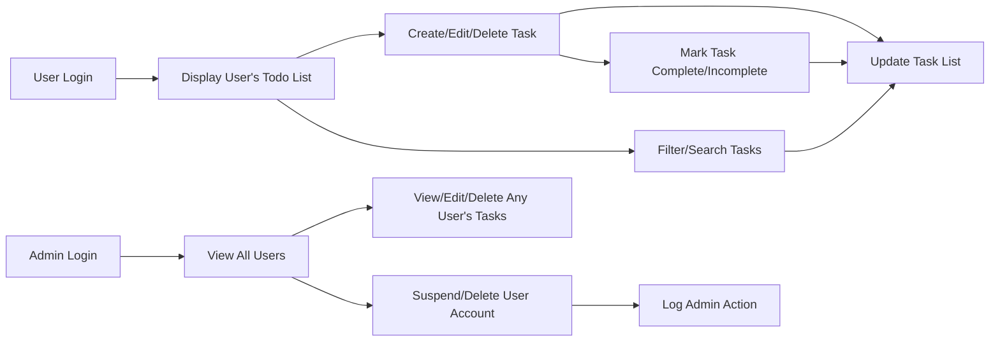

# Todo List Application Requirements

## Introduction
A simple Todo List application aims to let users manage personal tasks efficiently with only essential features required for minimum usability. The service is structured to ensure private data, clarity of task status, reliable session management, and proper admin oversight.

## User Actors and Roles
### 1. User
A registered individual who can manage their own list of todos, access only their own data, filter and search within their own tasks, and update profile or authentication information.

### 2. Admin
A privileged actor who can view and manage any user's tasks, search and filter among all users, and perform account suspension, reactivation, or removal actions. Visible in all logs and audit trails.

## Functional Requirements

### Task Management (CRUD)
- WHEN a user submits a non-empty, ≤255-character description, THE system SHALL create a new task, tied to that user's account, with default status "incomplete" and current timestamp.
- IF the description is invalid (empty or >255), THEN THE system SHALL reject creation and inform the user of limit.
- WHEN a user requests to list tasks, THE system SHALL show only their own tasks, ordered newest-first, with paginated pages of 20 for >50 tasks.
- WHEN a user edits a task, IF the task belongs to them and new text is valid, THE system SHALL update the text and log the edit timestamp.
- IF the user attempts to edit/delete a task not theirs, THEN THE system SHALL deny the request and return a permissions error with message.
- WHEN a user deletes their own task, THE system SHALL remove it permanently from their list immediately if no conflicting operation is running.
- WHEN an admin creates, edits, or deletes a task for a user, THE action SHALL be logged with the admin's identity.

### Task Completion/Status Updates
- WHEN a user marks their task as complete/incomplete, THE system SHALL update its status, recording the action timestamp.
- WHEN a user selects multiple own tasks and marks them complete/incomplete, THE system SHALL update all where valid; for any failed task, a reason SHALL be returned.
- IF a user attempts to update any status for another user's task, THEN THE system SHALL deny and notify the user of permission violation.

### List Filtering and Searching
- WHEN a user applies a status filter (complete/incomplete) or enters a text search, THE system SHALL only return their own matching tasks.
- WHEN search or filter results exceed 50 matches, THE system SHALL provide results in sets of 20.
- WHEN a search yields no matches, THE system SHALL provide a standard empty result response.

### Account/Profile Management
- WHEN a new user registers, THE system SHALL require a unique email and a strong password meeting minimum security criteria.
- WHEN a user logs in, THE system SHALL authenticate credentials and provide a JWT token to maintain the session.
- WHEN a user updates their display name, THE system SHALL enforce 2-50 visible characters and apply changes immediately.
- WHEN a user requests password change, THE system SHALL confirm current password and enforce security policy for the new password.
- WHEN a user deletes their own account, THE system SHALL remove their tasks and all personal data, and end all sessions.

### Admin Management Capabilities
- WHEN an admin views or manages users, THE system SHALL allow search/filter by email/registration date.
- WHEN an admin suspends a user, THE system SHALL immediately revoke all active sessions for that user and prevent new logins until restored.
- WHEN an admin deletes an account, THE system SHALL erase all related data and store the reason for the action in the audit log.

## Authentication and Permission Model
- THE system SHALL authenticate all users and admins by secure email/password and maintain sessions using JWT with minimum 30-day inactive timeout.
- THE system SHALL prevent non-admins from accessing or acting on another user's tasks in all features (CRUD, search, filter, status updates, bulk operations, etc.).
- THE permission matrix below defines all allowed and forbidden actions by role.

| Feature                         | user | admin |
|----------------------------------|------|-------|
| Create own todos                 | ✅   | ✅    |
| Read/list own todos              | ✅   | ✅    |
| Update own todos                 | ✅   | ✅    |
| Delete own todos                 | ✅   | ✅    |
| Read others' todos               | ❌   | ✅    |
| Update others' todos             | ❌   | ✅    |
| Delete others' todos             | ❌   | ✅    |
| Search/filter all todos          | ❌   | ✅    |
| Manage user accounts             | ❌   | ✅    |
| Suspend/delete user accounts     | ❌   | ✅    |
| Bulk status updates (own todos)  | ✅   | ✅    |

## Business Rules and Validation
- All task descriptions MUST be between 1 and 255 characters.
- Display names MUST be 2-50 characters.
- Email addresses MUST be unique per user.
- Password changes MUST verify existing password and apply new password security policy.
- Users MAY not view or modify any data except their own; only admins MAY operate on all users/accounts.
- All admin operations affecting user data SHALL be logged with the admin’s identity, timestamp, and explicit reason as needed.
- No user may remain logged in past 30 days of inactivity; system SHALL revoke JWT after this period.

## Error Handling and User Experience
- WHEN a user is denied access, THE system SHALL provide a clear and specific error message with reason code.
- IF the user submits invalid data at any point, THE system SHALL specify which field was problematic and reject the operation.
- WHEN a system-level error occurs, THE system SHALL log internally and return only a generic user message.
- All error responses MUST be consistent in structure and use clear, business-language explanations.

## Performance Expectations
- Todo lists display and update for typical users (<50 tasks) within 1 second.
- Any create, update, or delete (including status changes) reliably reflected in the user list view within 2 seconds.
- Searches and filters up to 1,000 tasks must respond in under 1 second.

## Requirement Traceability Table

| Area                            | user | admin |
|----------------------------------|------|-------|
| Task create/read/update/delete   | ✅   | ✅    |
| Mark task complete/incomplete    | ✅   | ✅    |
| Filtering/searching own todos    | ✅   | ✅    |
| Bulk status update               | ✅   | ✅    |
| Profile management               | ✅   | ✅    |
| View all users/todos             | ❌   | ✅    |
| Suspend/delete users             | ❌   | ✅    |

## Business Workflows

## Final Notes on Minimal Scope
- Only features explicitly covered in above requirements are to be implemented; no extra functionality or technical details (API/schema) beyond business needs.
- All requirements are implementation-ready for backend development; technical choices (API, database schema, etc.) remain at developer discretion.
- This document forms the unambiguous, single source of business truth for building the Todo List backend.