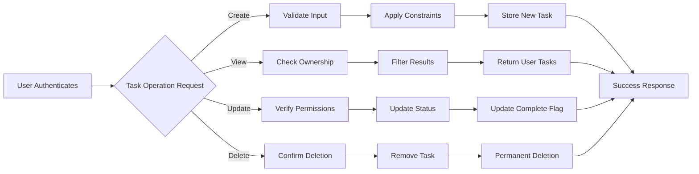

# Todo List Business Rules

This document defines the core business rules and operational constraints for the Todo List application, focusing exclusively on minimum functionality required for authenticated users to manage their personal tasks. The rules ensure system reliability, data integrity, and user privacy while supporting basic CRUD operations: Create tasks, List/View tasks, Mark tasks as complete/incomplete, and Delete tasks.

## Task Validation Rules

WHEN a user creates a new task, THE system SHALL validate that the task title is provided and not empty or containing only whitespace.

WHEN a user submits a task title during creation, THE system SHALL enforce a maximum length of 100 characters for the title.

WHEN a user provides an optional task description, THE system SHALL allow descriptions up to 500 characters in length.

WHEN a user attempts to create a task without a title, THE system SHALL reject the creation and return a validation error message stating "Task title is required".

WHEN a user submits a task title exceeding 100 characters, THE system SHALL prevent submission and display a character count indicator showing the limit.

IF a user provides a description longer than 500 characters, THEN THE system SHALL truncate the description to 500 characters and notify the user of the truncation in the response.

WHEN a user updates an existing task, THE system SHALL re-validate the title and description using the same rules as task creation.

WHEN validation fails during task creation or update, THE system SHALL return specific error messages for each invalid field without processing the submission.

WHEN all validation passes for task operations, THE system SHALL proceed with the requested action (create, update, or delete).

## Business Logic

WHEN an authenticated user accesses the task list, THE system SHALL retrieve and display only tasks owned by that specific user.

WHEN a user creates a new task, THE system SHALL automatically assign ownership to the authenticated user and set the task status to "incomplete".

WHEN a user marks a task as complete, THE system SHALL update the task status to "completed" and record the current timestamp as the completion date.

WHEN a user marks a task as incomplete (unmarking completion), THE system SHALL change the status back to "incomplete" and clear the completion timestamp.

WHEN a user deletes a task, THE system SHALL permanently remove the task from the system and prevent any future access to it.

WHEN a user attempts to operate on a task that does not exist, THE system SHALL return a "task not found" error response.

WHEN a user attempts to access, update, or delete tasks owned by another user, THE system SHALL deny the request and return an "access denied" response.

WHEN the system processes bulk operations (if implemented), THE system SHALL ensure all tasks in the operation belong to the same user before proceeding.

WHEN a user views their task list, THE system SHALL sort tasks by creation date with newest tasks appearing first.

WHEN task statuses change, THE system SHALL immediately reflect these changes in any active user interface without requiring page refresh.

## Data Constraints

THE system SHALL store task titles as strings with a maximum length of 100 characters.

THE system SHALL store task descriptions as optional strings with a maximum length of 500 characters.

THE system SHALL store task completion status as a boolean value where false represents incomplete and true represents complete.

THE system SHALL store task creation timestamps with second-level precision.

THE system SHALL store task completion timestamps with second-level precision when tasks are marked complete.

THE system SHALL associate each task with a unique identifier for internal operations.

THE system SHALL limit individual task titles to ASCII printable characters only to ensure compatibility.

THE system SHALL allow task descriptions to include multi-line content for detailed task information.

THE system SHALL enforce that task creation dates cannot be modified after initial creation.

WHEN task data is stored, THE system SHALL ensure data integrity across all operations, preventing orphaned or inconsistent records.

## Operational Boundaries

THE system SHALL require user authentication for all task operations except viewing public information.

THE system SHALL deny access to task functionality for unauthenticated users.

THE system SHALL restrict user operations to their own tasks only, preventing cross-user access.

THE system SHALL not support task sharing or delegation between users.

THE system SHALL not allow task collaboration features.

THE system SHALL limit task operations to individual CRUD functions without bulk editing or multi-select features.

THE system SHALL require explicit user confirmation before task deletion.

THE system SHALL prevent task restoration after deletion.

THE system SHALL not retain task history or version control beyond current state.

THE system SHALL operate only with authenticated user sessions, expiry handled by JWT token timeouts.

THE system SHALL log all task operations for audit purposes while maintaining user privacy.

The business flow illustrates the validation and permission checks applied to all task operations, ensuring data integrity and user isolation throughout the application's minimum functionality scope.