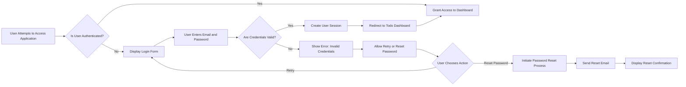
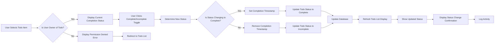

# User Flows and Interaction Patterns for Todo Management

## Introduction

This document outlines the detailed user flows and interaction patterns for the Todo list application. It provides product managers with a comprehensive understanding of how users interact with the system to manage their personal task lists. The document focuses on business workflows, decision points, and user journeys that drive the application's functionality.

The purpose of this document is to:
- Map out complete user interaction patterns from login to task completion
- Identify key decision points and conditional branches in workflows
- Support product planning by showing user journey complexity
- Ensure consistent understanding of user flows across the development team

This document relates to:
- [User Actors Documentation](./02-user-actors.md) for actor definitions and authentication requirements
- [Functional Requirements Documentation](./03-functional-requirements.md) for detailed business logic that underlies these flows

All flowcharts use Mermaid syntax with horizontal left-to-right (LR) orientation for optimal readability, and include decision points marked with diamond shapes.

## Authentication Flow

The authentication flow represents the entry point for all Todo management activities. Authenticated users gain access to their personal Todo functionality, while guests are restricted from system access.

WHEN a user attempts to access the Todo application, THE system SHALL verify the user's credentials or redirect them to create an account.

Flow Description: Users must authenticate before accessing any Todo functionality. Invalid credentials prompt retry or password reset options. Successful authentication creates a session and redirects to the main dashboard.

## Todo Creation Flow

This flow describes how authenticated users create new Todo items in their personal lists.

WHEN an authenticated user wants to create a new Todo item, THE system SHALL provide a form for task details and validate the input before saving.

```mermaid
graph LR
  A["User Selects 'Add Todo' Button"] --> B["Display Todo Creation Form"]
  B --> C["User Enters Task Title"]
  C --> D["User Optionally Enters Description"]
  D --> E["User Optionally Sets Due Date"]
  E --> F["User Optionally Assigns Priority Level"]
  F --> G["User Submits Form"]
  G --> H{"Is Form Valid?"}
  H -->|Yes| I["Generate Unique Todo ID"]
  I --> J["Associate Todo with User"]
  J --> K["Save Todo to Database"]
  K --> L["Update User's Todo List"]
  L --> M["Display Success Message"]
  M --> N["Redirect to Updated Todo List"]
  H -->|No| O["Display Validation Errors"]
  O --> P["Highlight Invalid Fields"]
  P --> Q["Allow User to Correct Input"]
  Q --> R["User Resubmits Form"]
  R --> H
```

Flow Description: Todo creation requires at least a title, with optional fields for enhanced task management. The system validates input before saving and associates each Todo with the authenticated user.

## Task Editing Flow

The task editing flow allows users to modify details of their existing Todo items.

WHEN an authenticated user wants to modify a Todo item they own, THE system SHALL load the task details and allow updates within business rules.

```mermaid
graph LR
  A["User Selects Todo Item to Edit"] --> B{"Is User Owner of Todo?"}
  B -->|No| C["Display Permission Denied Error"]
  B -->|Yes| D["Load Todo Details from Database"]
  D --> E["Display Edit Form with Current Values"]
  E --> F["User Modifies Task Title"]
  F --> G["User Optionally Updates Description"]
  G --> H["User Optionally Changes Due Date"]
  H --> I["User Optionally Adjusts Priority"]
  I --> J["User Submits Changes"]
  J --> K{"Is Form Valid?"}
  K -->|Yes| L["Update Todo in Database"]
  L --> M["Record Change Timestamp"]
  M --> N["Display Success Message"]
  N --> O["Redirect to Updated Todo List"]
  K -->|No| P["Display Validation Errors"]
  P --> Q["Highlight Invalid Fields"]
  Q --> R["Allow User Corrections"]
  R --> S["User Resubmits Changes"]
  S --> K
  C --> T["Redirect to Todo List"]
```

Flow Description: Users can only edit tasks they created. The system validates changes before saving and maintains change history through timestamps.

## Task Completion Flow

This flow handles the marking of Todo items as complete or incomplete, allowing users to track their progress.

WHEN an authenticated user wants to change a Todo item's completion status, THE system SHALL update the status and reflect the change in the user's list.

Flow Description: Task completion affects timestamp tracking, allowing users to track when tasks were finished. Only task owners can modify completion status.

## List Viewing Flow

The list viewing flow describes how users display and navigate their Todo collections.

WHEN an authenticated user accesses their Todo dashboard, THE system SHALL display their personalized task list with relevant filters and sorting options.

```mermaid
graph LR
  A["User Accesses Todo Dashboard"] --> B["Load User's Todo Items"]
  B --> C{"Does User Have Todos?"}
  C -->|No| D["Display Empty State Message"]
  D --> E["Show Create Todo Prompt"]
  C -->|Yes| F["Apply Default Sorting"]
  F --> G["Display Todo List"]
  G --> H["Show Task Count Summary"]
  H --> I["Render Each Todo with Details"]
  I --> J["User Optionally Applies Filters"]
  J --> K{"Filter Selected?"}
  K -->|Yes| L["Apply Filter Criteria"]
  L --> M["Refresh Displayed List"]
  M --> N["Show Filtered Results"]
  K -->|No| O["Maintain Current Display"]
  O --> P["User Optionally Changes Sorting"]
  P --> Q{"Sort Selected?"}
  Q -->|Yes| R["Apply New Sort Order"]
  R --> S["Re-sort Todo List"]
  S --> T["Update Display"]
  T --> V["Show Sorted Results"]
  V --> G
```

Flow Description: Empty lists prompt user action, while populated lists support filtering and sorting to help users manage their tasks effectively.

## Decision Points and Branching Logic

The following table summarizes key decision points across all user flows in the Todo management system:

| Flow | Decision Point | Branch Options | Business Rule |
|------|---------------|----------------|---------------|
| Authentication | Credentials Valid? | Yes: Grant Access No: Show Error | Users must provide valid email/password combination |
| Todo Creation | Form Valid? | Yes: Save Todo No: Display Errors | Title required; other fields optional but must follow format |
| Task Editing | User Owns Todo? | Yes: Allow Edit No: Deny Access | Users can only modify their own tasks |
| Task Editing | Form Valid? | Yes: Save Changes No: Display Errors | Modified data must meet validation requirements |
| Task Completion | Status Changing to Complete? | Yes: Add Timestamp No: Remove Timestamp | Completion tracking requires timestamp |
| Task Completion | User Owns Todo? | Yes: Allow Change No: Deny Access | Users can only modify completion status of their own tasks |
| List Viewing | User Has Todos? | Yes: Show List No: Empty State | Dashboard adapts based on user's task count |
| List Viewing | Filter Applied? | Yes: Filter Results No: Show All | Filters are optional user preference |
| List Viewing | Sort Applied? | Yes: Reorder List No: Default Order | Sorting affects display order only |

Key Business Logic: All decision points enforce user ownership (users can only modify their own content) and maintain data integrity through validation.

## Conclusion

These user flows establish the core interaction patterns for the Todo list application, focusing on authenticated user management of personal task lists. The flows prioritize:

- Ownership Control: Users can only modify their own content
- Validation First: All user input undergoes validation before persistence
- Clear Feedback: Users receive immediate feedback on all actions
- Flexible Navigation: Multiple paths for common actions (filtering, sorting)
- Error Recovery: Clear error states with recovery options

The branching logic ensures robust workflow handling while maintaining simplicity for end users. These flows drive the functional requirements and should be reviewed alongside the broader business context to ensure comprehensive user experience coverage.