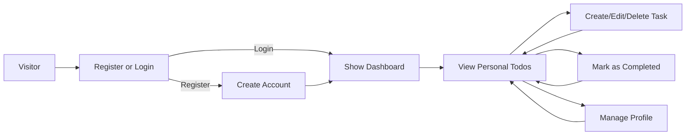
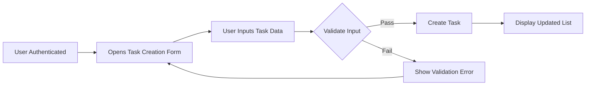
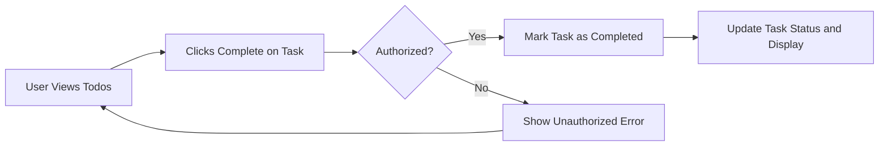
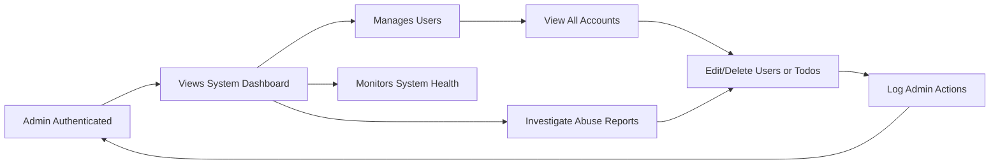

# User Workflow and Scenarios for Todo List Application

## Typical User Journey
The end-to-end experience for users of the todoList system begins from registration and authentication, progressing through daily task management. This journey is designed to provide the least complexity necessary for reliable and secure todo operation.

### Step-by-Step User Journey

- WHEN a visitor accesses the application, THE todoList SHALL prompt them to either register or log in for access to task management features.
- WHEN a user registers, THE todoList SHALL create a distinct user account protected by authentication credentials (username/email and password).
- WHEN a user logs in successfully, THE todoList SHALL display that user's exclusive dashboard, listing all personal todos and account options.
- WHEN an authenticated user logs out or IF their session expires, THE todoList SHALL ensure all sensitive data is inaccessible and a login form is required before further actions.
- WHEN a user accesses their dashboard, THE todoList SHALL display all existing tasks in a comprehensible order (by creation date, priority, or due date if provided).
- IF a user attempts to access, modify, or delete any todo item not created by or owned by themselves, THEN THE todoList SHALL deny the request and deliver a clear, actionable error message explaining the access restriction.
- WHEN a user opts to edit their profile (e.g., password change), THE todoList SHALL validate the new data (e.g., password strength, non-reuse of old password) and apply updates securely upon validation success.
- IF a login session is inactive past session expiration policy, THEN THE todoList SHALL invoke re-authentication before displaying or modifying any user or task data.

#### Mermaid Diagram: General User Flow

## Task Creation Flow
This workflow covers every stage, from motivation to add a new todo to system confirmation and error handling.

- WHEN a user activates the "Add Task" function, THE todoList SHALL present an entry form for at minimum a task title, with optional description and due date fields.
- WHEN a user submits the creation form, THE todoList SHALL validate all entered fields according to rules: non-empty title, description length within maximum, valid future date if provided, and disallow duplicate tasks by title per user (unless completed).
- IF any validation fails, THEN THE todoList SHALL highlight relevant fields and present contextual error messages explicitly detailing the reason for failure and suggested remediation steps.
- WHEN validation is successful, THE todoList SHALL create the new task, associate it with the current user, and update the visible task list without requiring page reload.
- IF backend processing fails (e.g., database unavailable), THEN THE todoList SHALL inform the user of system error and recommend retry actions without losing entered data.

#### Mermaid Diagram: Task Creation

## Task Completion Flow
Covers marking todos as completed, including negative and edge scenarios.

- WHEN a user selects an incomplete todo's "Complete" action, THE todoList SHALL immediately update the item status to completed and record the completion timestamp.
- WHEN a user tries to "Complete" an already completed task, THEN THE todoList SHALL show a non-blocking notification (e.g., toast message) stating the task has already been finished.
- IF a user attempts to mark a task as completed for tasks they do not own, THEN THE todoList SHALL deny the operation and display an explicit access error message.
- WHEN a completion action is successful, THE todoList SHALL remove the task from the "pending" section and add it to "completed" (or change its visual state), updating the dashboard in real-time.
- IF a backend or network failure occurs while updating status, THE todoList SHALL offer user-friendly recovery, enabling a retry with the same data and preserving the current state.

#### Mermaid Diagram: Task Completion

## Admin Oversight Workflow
Administrative processes for monitoring system health, user management, and policy enforcement covering all minimal functions.

- THE admin SHALL access a unified dashboard displaying core system health, daily/aggregate todo statistics, and logs of user and admin actions.
- WHEN admin views the user management section, THE todoList SHALL permit trusted actions on any user account (e.g., view, lock/unlock, delete, reset password).
- WHEN admin observes reports or signs of abuse (e.g., excessive failed logins or inappropriate task content), THE todoList SHALL provide investigation tools, and permit direct intervention including editing or removal of any user's tasks, as well as flagging for further review.
- IF an admin edits or deletes user accounts or todos for disciplinary reasons, THEN THE todoList SHALL securely audit all actions (e.g., time, target, action type, admin identity), and on next user login, explicitly notify the affected party of the change and rationale.
- THE admin SHALL NOT perform any operation that could undermine the integrity of audit trails or system availability (e.g., deleting admin logs or disabling root access).
- WHEN admin privileges are used, THE todoList SHALL require robust authentication (e.g., session renewal or multi-factor for high-risk operations), and immediately log all such events.
- IF admin session expires or is suspended, THEN THE todoList SHALL enforce immediate re-authentication before allowing access to restricted functions.

#### Mermaid Diagram: Admin Workflow

## Actor Responsibilities Table
| Workflow                | User Capabilities                                                    | Admin Capabilities                                               |
|-------------------------|---------------------------------------------------------------------|------------------------------------------------------------------|
| Register/Login/Profile  | Manage own account, change password, view dashboard                 | Manage all accounts: view, lock/unlock, reset password, delete   |
| Task CRUD               | Full access/modify own todos (create, read, update, delete)         | View/edit/delete any todo or account; intervene case of abuse    |
| View Todos              | List and filter own todos; visual separation of pending/completed   | Lists for all users, global stats, analytics, trends             |
| Security/Authentication | Limited to current session; re-auth if expired                      | Full system access (with robust re-auth and audit enforcement)   |
| Error Recovery          | Correction only for own actions; guided by specific error feedback  | System-wide error handling and user support tools                |

## Error and Edge Case Scenarios (all workflows)
- IF user input violates business/validation rules, THEN THE todoList SHALL provide actionable, context-specific error messages.
- IF network/server issues arise, THEN THE todoList SHALL maintain transactional consistency—either all intended changes succeed, or none, with user prompted to retry.
- WHEN unauthorized access is attempted, THE todoList SHALL never reveal sensitive user or system data.
- WHEN duplicate, incomplete, or inconsistent task operations are attempted (e.g., double submission), THE todoList SHALL ensure idempotency and robust user feedback.
- WHEN a role-specific privilege is denied—or a non-Admin attempts an admin function—THE todoList SHALL enforce strict boundaries and explain required permissions.

## Additional Notes
- All flows and requirements herein use minimal scope for a production-grade, secure, and user-friendly Todo List backend as required by product and engineering standards.
- Role-based permissions, authentication, and comprehensive error messaging are integral to all processes.
- Detailed business logic, validation, and workflow diagrams provided ensure that developers can implement without ambiguity or additional input.