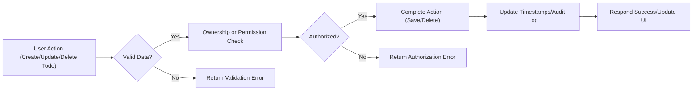

# Business Rules and Validation for Todo List Application

## Business Rules for Todos

### Ownership and Access
- WHEN a todo is created, THE system SHALL ensure the todo is always and only associated with a single, verified user account.
- WHEN a non-admin user attempts to access, change, complete, or delete a todo, THE system SHALL grant permission ONLY if the todo belongs to the requesting user; otherwise, THE system SHALL return a clear error message referencing a permissions violation.
- WHEN an admin user operates, THE system SHALL permit reading, updating, or deleting any user's todos regardless of ownership. All such actions SHALL be recorded in an audit log including the admin user ID, affected todo/user ID, and timestamp.

### Task Operations and State
- WHEN an authenticated user requests to create, read, update, or delete their todo, THE system SHALL process the operation instantly UNLESS the todo is already deleted, in which case THE system SHALL return an error indicating the item no longer exists.
- WHEN a todo is deleted, THE system SHALL ensure it is immediately removed from the user's visible todo lists. IF log retention is enabled for audit purposes, THE system SHALL hide the todo from users but retain an immutable admin-accessible audit log.
- WHEN a todo is created, THE system SHALL set and store a precise creation timestamp; WHEN a todo is updated, THE system SHALL update the last modified timestamp.

### Task Completion and Status
- WHEN a user marks a todo as completed, THE system SHALL record the completion time and move the status to "completed". WHEN a completed todo is re-activated, THE system SHALL reset its status to "pending", remove the completion timestamp, and log the change. THE system SHALL allow viewing a full change history for admins.
- THE system SHALL support three business statuses for todos: "pending", "completed", and "deleted". Only admin users SHALL be able to assign/delete with the "deleted" status.

### Filtering, Sorting, and Searching
- WHEN a user or admin lists todos, THE system SHALL allow filtering by status: "all", "completed", or "pending/incomplete".
- WHEN searching, THE system SHALL enable users to search their todos by any portion of a title using case-insensitive logic. Admins SHALL be able to search todos across all users.

### Data Integrity and Consistency
- WHEN a user attempts to create or update a todo, THE system SHALL prohibit creating two active todos (not deleted) with the same title and scheduled date for that user.
- IF a duplicate is detected on submission, THE system SHALL reject the request and provide a specific message explaining the duplication policy and recommending change.

## Validation Constraints

### Todo Fields and Entry Validation
- Title: WHEN submitting or updating a todo, THE system SHALL require a title 1–100 visible UTF-8 characters in length, with no whitespace-only entries. IF title field is empty, whitespace-only, or uses invalid characters, THE system SHALL reject with a targeted error message.
- Description: WHEN provided, THE system SHALL permit optional descriptions no more than 1,000 UTF-8 characters, with newlines and basic punctuation allowed.
- Status: WHEN updating status, THE system SHALL restrict values only to "pending", "completed", and (for admin) "deleted".
- Scheduled Date: WHEN a scheduled date is supplied, THE system SHALL verify it is not in the past (based on current Asia/Seoul time). IF the value is invalid, THE system SHALL return a clear error stating the field and violated constraint.

### Account-wide Limits and Edge Cases
- THE system SHALL enforce a maximum of 1,000 non-deleted todos per user. IF a user attempts to exceed this, THE system SHALL block the operation and explain the reason.
- IF a user's non-deleted todos reach 900 or more, THE system SHALL display a warning encouraging the user to review and delete unnecessary items.
- Admin users SHALL not be restricted by individual task count constraints.

### General Input Validation
- WHEN any todo submission contains invalid fields (too long, empty, malformed), THE system SHALL specify which field(s) failed, referencing the exact constraint and using friendly, clear language.

### Duplicate Prevention
- WHEN attempting to create or save a todo, THE system SHALL block duplicates—defined as a same-title, same-date (not deleted) todo by the same owner. A descriptive error SHALL be provided prompting correction of either field to allow submission.

## User Account Validation

### Registration Rules
- WHEN a new user registers, THE system SHALL ensure the provided email is unique, matches standard email formats, and is not from disposable or obviously fake domains. IF a duplicate email or invalid address is detected, THE system SHALL block account creation and display an explicit error, offering the option to reset password if the user forgot it.
- WHEN a password is submitted at registration, THE system SHALL enforce a minimum of 8 characters, reject single-character repeats or strict sequences (e.g., "11111111", "abcdefg").

### Email Verification and Account Lifecycle
- WHEN a new account is created, THE system SHALL send a unique email verification link and restrict access until the link is confirmed. IF the link is not confirmed within 24 hours, THE system SHALL expire the pending registration and delete associated data.

### Profile Updates
- WHEN a user updates their profile, THE system SHALL re-validate changed fields using the same logic as during registration (including name and email constraints).

### Account Deletion and Data Management
- WHEN a user requests account deletion, THE system SHALL remove all their todos and account information (excluding audit logs) within 48 hours, unless legal retention overrides apply. WHEN performed by admin, THE system SHALL record the action in audit logs, identifying the operator and target.

### Authentication and Sessions
- THE system SHALL grant access to sensitive actions only to authenticated users with valid, non-expired sessions. IF a session is found expired when an action is attempted, THE system SHALL immediately block the operation and direct the user to log in again.

## Error Handling and Performance
- WHEN multiple users or processes attempt simultaneous modifications to the same todo or user, THE system SHALL enforce serializable transactions or locking to avoid race conditions and guarantee data consistency.
- IF a user attempts to operate on a resource that has already been deleted, THE system SHALL immediately inform the user that the resource is gone and prevent further actions on it.
- THE system SHALL process all valid operations within 1 second for normal load, and return explicit error messages for all constraint violations, permission errors, or system issues.

## Mermaid Diagram – Todo Business Rule Compliance Flow

---

All requirements herein use EARS format for maximum clarity, specificity, and testability. These business rules and validation criteria SHALL be strictly enforced in backend logic to ensure robust data integrity, seamless permission boundaries, and a consistent user experience for both standard and admin users, irrespective of possible frontend or external system issues.