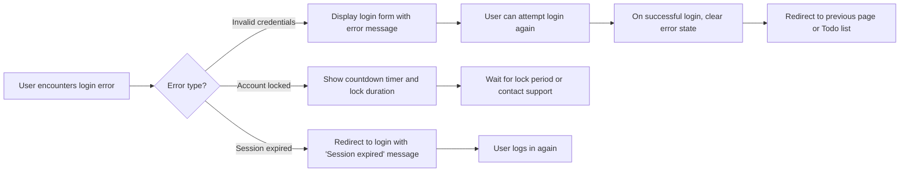
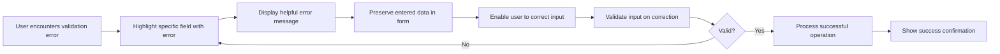
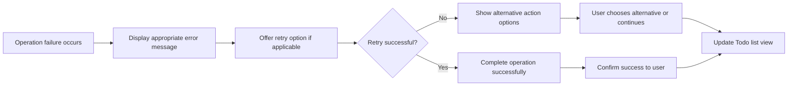

# Error Handling and Recovery Requirements for Todo Application

## Overview

This document defines the comprehensive error handling requirements for the Todo list application. The focus is on minimum functionality while ensuring robust user experience through proper error scenarios, clear communication, and effective recovery processes. All requirements are specified from the user's perspective in natural language, allowing backend developers to implement appropriate technical error handling mechanisms.

The error handling strategy prioritizes user-friendly communication and seamless recovery flows that align with the application's minimalist approach. Errors are categorized by type and include specific scenarios related to Todo operations.

## Authentication Errors

### Login Credential Validation

WHEN a user submits invalid login credentials during authentication, THE system SHALL display an error message stating "Invalid username or password" and SHALL NOT reveal which specific credential was incorrect.

WHEN a user attempts to log in with an account that does not exist, THE system SHALL respond with the same generic authentication error message and SHALL provide a link to the registration process.

WHEN a user exceeds the maximum number of login attempts (5 failed attempts within 15 minutes), THE system SHALL temporarily lock the account for 30 minutes and SHALL display a message indicating "Account temporarily locked due to too many failed attempts. Please try again in 30 minutes."

### Session Management Errors

WHEN a user's authentication session expires due to inactivity (after 24 hours), THE system SHALL redirect the user to the login page and SHALL display a message stating "Your session has expired. Please log in to continue."

WHEN a user attempts to access Todo operations without a valid authentication token, THE system SHALL return an unauthorized error and SHALL redirect to the login page with a message "Please log in to access your Todo list."

### User Registration Errors

WHEN a user attempts to register with an email address that already exists in the system, THE system SHALL display an error message stating "An account with this email address already exists" and SHALL offer options to log in or reset password.

WHEN a user provides an invalid email format during registration, THE system SHALL display an error message stating "Please provide a valid email address" and SHALL maintain the entered form data.

WHEN a user submits a password that does not meet the minimum requirements during registration, THE system SHALL display an error message stating "Password must be at least 8 characters long and contain at least one uppercase letter, one lowercase letter, and one number."

## Validation Errors

### Todo Creation Validation

WHEN a user attempts to create a Todo item without providing a title, THE system SHALL display an error message stating "Todo title is required" and SHALL keep the creation form open with entered data preserved.

WHEN a user attempts to create a Todo item with a title exceeding 100 characters, THE system SHALL display an error message stating "Todo title cannot exceed 100 characters" and SHALL automatically truncate the text while allowing the user to edit.

WHEN a user attempts to create a Todo item with a description exceeding 500 characters, THE system SHALL display an error message stating "Todo description cannot exceed 500 characters" and SHALL allow the user to continue with truncated content or edit the description.

WHEN a user attempts to create a Todo item with invalid due date format, THE system SHALL display an error message stating "Please provide a valid date format (YYYY-MM-DD)" and SHALL suggest the correct format.

### Todo Update Validation

WHEN a user attempts to update a Todo item that no longer exists, THE system SHALL display an error message stating "This Todo item no longer exists" and SHALL redirect the user to their Todo list overview.

WHEN a user attempts to edit a Todo item without permission (not the owner), THE system SHALL display an error message stating "You do not have permission to edit this Todo item" and SHALL prevent the operation.

WHEN a user attempts to mark a Todo item as complete or incomplete without permission, THE system SHALL display an error message stating "You do not have permission to modify this Todo item" and SHALL maintain the previous state.

### Batch Operation Validation

WHEN a user attempts to delete multiple Todo items where some items no longer exist, THE system SHALL process valid deletions and SHALL display a warning message stating "Some Todo items could not be deleted because they no longer exist" followed by a list of successfully deleted items.

WHEN a user attempts to bulk update Todo items where some updates fail, THE system SHALL apply successful updates and SHALL display specific error messages for failed items with reasons.

## Operation Failures

### System Availability Issues

WHEN the system encounters a temporary database connection failure during Todo operations, THE system SHALL display an error message stating "Service temporarily unavailable. Please try again in a few moments" and SHALL automatically retry the operation up to 3 times.

WHEN the system experiences high load that prevents immediate Todo operations, THE system SHALL display an error message stating "System is experiencing high traffic. Please try again in a few minutes" and SHALL queue the operation for later processing if applicable.

WHEN a Todo creation or update operation times out, THE system SHALL display an error message stating "Operation timed out. Your changes may not have been saved. Please check your Todo list or try again."

### Data Integrity Issues

WHEN concurrent users attempt to modify the same Todo item simultaneously, THE system SHALL allow the last valid operation to succeed and SHALL notify other users with a message stating "This Todo item was modified by another user. Please refresh your view to see the latest changes."

WHEN a Todo operation results in data corruption that prevents normal functioning, THE system SHALL quarantine the affected data and SHALL display an error message stating "This operation encountered an unexpected error. Our team has been notified and will resolve this issue."

### Third-Party Service Failures

WHEN external email service is unavailable during password reset requests, THE system SHALL still create the reset token and SHALL display a message stating "Password reset token created. Email delivery is currently delayed. You can try the reset link again later."

WHEN backup synchronization fails during Todo operations, THE system SHALL complete the primary operation and SHALL log the backup failure for later retry without affecting user experience.

## User Recovery Processes

### Authentication Recovery Flow

WHEN a user experiences any authentication error, THE system SHALL provide a clear path back to successful authentication and SHALL not permanently block access unless security requirements dictate otherwise.

### Data Validation Recovery

WHEN users encounter validation errors during Todo operations, THE system SHALL maintain their progress and SHALL provide immediate feedback on how to resolve the issue.

### Operation Failure Recovery

WHEN operational failures occur, THE system SHALL automatically attempt recovery where possible and SHALL provide users with clear next steps or alternative actions.

### Data Loss Prevention

WHEN a user accidentally initiates a destructive operation (like deleting a Todo item), THE system SHALL display a confirmation dialog stating "Are you sure you want to delete this Todo item? This action cannot be undone."

WHEN a user confirms a destructive operation, THE system SHALL provide an "Undo" option for 30 seconds that allows restoration of the deleted Todo item.

WHEN the undo period expires for a deleted Todo item, THE system SHALL permanently remove the item and SHALL display a message stating "Todo item permanently deleted."

### Progressive Disclosure for Errors

WHEN multiple validation errors occur on a form, THE system SHALL display errors in order of priority and SHALL allow users to address them incrementally rather than showing all errors simultaneously.

WHEN users encounter complex error scenarios, THE system SHALL provide progressive help starting with brief messages and offering detailed explanations accessible through "Learn more" links.

## Error Message Standards

All error messages SHALL follow these business requirements:

WHEN displaying error messages, THE system SHALL use clear, non-technical language that users can understand without prior knowledge, SHALL suggest actionable next steps whenever possible, SHALL avoid blame language that makes users feel at fault, and SHALL maintain consistent tone and terminology across all error scenarios.

WHEN providing error feedback, THE system SHALL keep error messages concise while providing sufficient context, SHALL make them specific rather than generic, and SHALL include helpful information about how to resolve the issue.

WHEN error messages include technical details, THE system SHALL explain them in plain language or omit them entirely if they don't help users resolve the problem.

## Performance Considerations for Error Handling

WHEN errors occur, THE system SHALL respond within 2 seconds to maintain user experience expectations.

WHEN automatic retry mechanisms are implemented, THE system SHALL use exponential backoff to avoid overwhelming external services.

WHEN errors result in redirected responses, THE system SHALL preserve user context and SHALL avoid losing unsaved work.

## Security Considerations in Error Handling

WHEN authentication errors occur due to security violations, THE system SHALL log security events without exposing sensitive information in error messages.

WHEN users encounter errors that could indicate security issues, THE system SHALL provide generic responses that don't reveal system internals.

WHEN password-related errors occur, THE system SHALL not provide hints about password strength or content.

## Monitoring and Analytics

THE system SHALL log all errors with sufficient detail for developers to diagnose issues while protecting user privacy.

THE system SHALL track error patterns to identify common failure points and SHALL prioritize improvements accordingly.

THE system SHALL provide anonymous error reporting that helps improve the service without compromising user data.

## Summary

The error handling requirements for the Todo application focus on creating a trustworthy and user-friendly experience despite potential failures. By clearly communicating problems, preserving user progress where possible, and providing clear recovery paths, the system maintains the minimalist approach while ensuring reliability.

Backend developers should implement these requirements to create error handling that feels natural and helpful rather than obstructive. The emphasis on business logic allows for flexible technical implementations that prioritize user experience in error scenarios.

All error handling SHALL reinforce the application's core value: helping users manage their tasks effectively, even when problems occur. The recovery processes SHALL be designed to get users back to productive Todo management as quickly as possible.