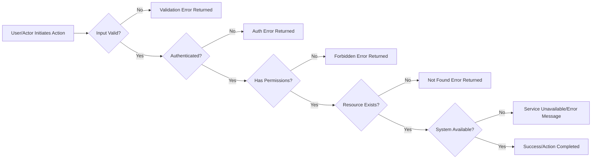

# Error Handling and Recovery – Todo List Application

Clear, actionable error handling and recovery are essential to delivering a reliable, user-friendly Todo List Application. This specification defines comprehensive backend requirements for managing all foreseeable error conditions, using EARS for requirement expression and structured step-by-step recovery logic. All requirements apply to backend implementation directly, enabling uniform, predictable user experiences and robust reliability throughout the system.

## 1. Common Error Scenarios

### 1.1 Authentication and Authorization Errors
- WHEN a user provides invalid login credentials, THE system SHALL deny authentication and present a generic error: "Your login credentials are incorrect. Please try again." (THE system SHALL NOT expose specifics about whether the email or password was incorrect.)
- WHEN a user’s session has expired or is otherwise invalid, THE system SHALL invalidate tokens and require sign-in, with the message: "Your session has expired. Please log in again."
- WHEN a user attempts any action requiring authentication without being logged in, THE system SHALL block the action and prompt for authentication: "This action requires authentication. Please sign in."
- WHEN a user attempts to access or modify another user's data, THE system SHALL deny access and return: "You do not have permission to edit this task."
- WHEN a user attempts to access admin-only functionality but lacks admin rights, THE system SHALL block the action and display: "This action is restricted to administrators only."

### 1.2 Data Validation & Business Logic Errors
- WHEN required fields are missing in create or update requests, THE system SHALL reject the request and include details: "Some required fields are missing or invalid. Title and due date are required."
- WHEN provided field values violate length, format, or constraint rules (e.g., title exceeds character limit, due date is in the past), THE system SHALL reject and provide: "Title must be less than 200 characters. Due date cannot be in the past."
- WHEN a user attempts to update or delete a todo item that does not exist, THE system SHALL not alter data and SHALL return: "The requested todo item was not found."
- WHEN a user tries to mark an already completed task again as complete, THE system SHALL respond idempotently: acknowledge no change and do not error.

### 1.3 Resource Not Found / Ownership Errors
- WHEN a user or admin requests a non-existent todo item or profile, THE system SHALL reply with: "The requested resource was not found."
- WHEN a user tries to interact with already deleted resources, THE system SHALL convey: "The resource is no longer available."

### 1.4 System & Maintenance Errors
- WHEN the database or core services are unavailable, THE system SHALL return: "Service is temporarily unavailable. Please try again later." and ensure graceful fallback with no partial operations.
- WHEN an unexpected backend error occurs, THE system SHALL log technical details for administration without exposing them to users; users receive: "An unexpected error occurred. Please try again later."
- WHEN the system is under scheduled maintenance and changes are disallowed, THE system SHALL show: "Service is temporarily unavailable due to maintenance."
- WHEN the system times out handling a request, THE system SHALL respond: "The service is busy. Please try again shortly."

### 1.5 Rate Limits & Abuse Detection
- WHEN a user exceeds rate limits, THE system SHALL block excess requests and provide: "You are making requests too quickly. Please slow down."
- WHEN abusive or automated access is detected, THE system SHALL immediately suspend the session and require admin review prior to restoration, with: "Access has been temporarily suspended due to unusual activity. Please contact support."

### 1.6 Admin Oversight Errors
- WHEN an admin attempts to delete a user that does not exist, THE system SHALL reply: "The requested user account could not be found."
- WHEN an admin attempts a redundant or already-completed action (e.g., double-deletion), THE system SHALL confirm completion: "Action has already been completed."

## 2. Error Message Guidelines
- THE system SHALL only return user-facing messages in plain en-US, omitting any technical details or stack traces
- THE system SHALL never reveal sensitive information, such as whether an email is registered or provide internal error codes directly
- All error messages SHALL be actionable, clearly stating what failed and (when feasible) how users can proceed or recover
- Error responses for unauthenticated or unauthorized actions SHALL instruct users to authenticate or contact an administrator as appropriate
- THE system SHALL log detailed trace/error information server-side for admin review of unhandled and critical error states

**Sample User Error Messages**
- "Your login credentials are incorrect. Please try again."
- "Your session has expired. Please log in again."
- "This action requires authentication. Please sign in."
- "You do not have permission to edit this task."
- "The requested todo item was not found."
- "Some required fields are missing or invalid."
- "An unexpected error occurred. Please try again later."
- "Service is temporarily unavailable due to maintenance."
- "You are making requests too quickly. Please slow down."
- "The requested user account could not be found."

## 3. Recovery Procedures (EARS Format)

### Authentication & Authorization Recovery
- WHEN a user fails to authenticate, THE system SHALL display a generic error and prompt for retry
- WHEN a session is invalid, THE system SHALL require re-authentication and provide a clear expiring-session message
- WHEN a user action requires higher permissions, THE system SHALL explain and guide correction (login or contact admin)

### Data Validation & Logic Recovery
- WHEN missing or malformed input fields are detected, THE system SHALL reject the request and list missing or invalid fields in the response
- WHEN trying to update or delete an absent resource, THE system SHALL ensure idempotency (no change, clear message)

### System & Maintenance Recovery
- WHEN services or DBs are unavailable, THE system SHALL display a temporary outage message and ensure all failed change requests are atomic and rolled back
- WHEN a request exceeds performance thresholds, THE system SHALL inform the user about current unavailability and avoid partial actions

### Rate Limiting & Abuse Recovery
- WHEN rate limit is hit, THE system SHALL block excess requests until allowed, and signal retry time
- WHEN abuse is detected, THE system SHALL immediately block the session, instruct user to contact support, and flag for admin review

### Admin Oversight Recovery
- WHEN duplicate, inconsistent or already-completed admin actions are attempted, THE system SHALL acknowledge the completed state and explain no further action is taken

## 4. Error Handling Lifecycle Diagram

All diagram node labels use double quotes, correct arrow syntax, and contain meaningful, concise descriptions as per standard.

## 5. Additional Backend Error Handling Policies
- THE backend SHALL standardize error response status codes using industry conventions (e.g., 400, 401, 403, 404, 429, 500, 503) mapped to error categories above, ensuring consistent API behavior
- All errors SHALL be logged server-side; technical and trace details are for admin access, not user exposure
- THE backend SHALL guarantee idempotent handling for all safe-to-repeat or retried user actions, e.g., repeated delete requests
- THE system SHALL provide the foundation for localized error messages, with support for future extension to other languages

## 6. User-Facing Recovery and Support Guidance
- Every error message SHALL suggest a user action where possible: e.g., retry, check your input, log in, or contact support
- For persistent or unclear errors, THE system SHALL instruct end users to contact support or admin, using concise, friendly, and actionable closing messages
- All backend logic for error handling, message selection, and recovery SHALL be self-contained so frontend applications do not interpret security or business behavior on their own
- Recovery flows SHALL prioritize protecting data integrity, user privacy, and offering actionable paths forward for users and admins

---

This error handling and recovery specification is the definitive backend implementation guide for the Todo List Application. All requirements must be followed as written to ensure predictable, robust, and user-friendly error management throughout production environments.