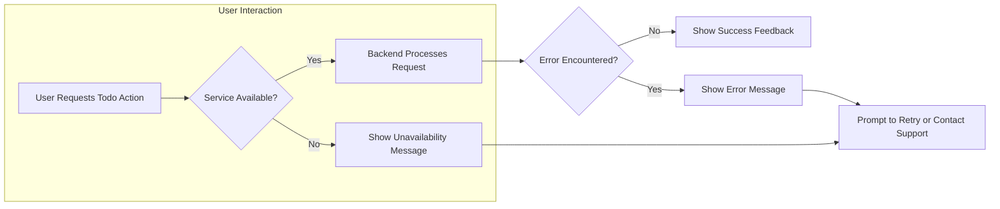

# Todo List Application Requirement Analysis Report

## 1. Introduction
### a. Purpose
The Todo List application aims to provide the minimum functional set to allow users to effectively manage their personal and work-related tasks. The goal is to enable any user, regardless of technical expertise, to keep track of their tasks in a user-friendly and reliable manner.

### b. Scope
The scope is strictly limited to the essential capabilities required for basic todo management by individual users, with a simple administrative role for support and oversight if needed. No collaborative or social features are in scope. Cross-device synchronization will be handled in accordance with non-functional requirements. 

---

## 2. User Actors
### a. Regular User
- Individuals who use the application to manage personal todo lists.

### b. Admin
- (Optional, only if needed for survivability) Manages users, audits operations, and oversees correct operation. No direct management of individual tasks except for regulatory/legal purposes or to support error recovery.

---

## 3. Minimum Functional Requirements
### a. Task Management (CRUD)
- WHEN a user is authenticated and accesses the application, THE user SHALL be able to create a new todo item by specifying a title and, optionally, a description and due date.
- WHEN a user views their todo list, THE system SHALL display all tasks currently associated with that user, ordered by status and due date.
- WHEN a task is created, updated, or deleted, THE system SHALL persist the change and reflect it in all active sessions for that user within 3 seconds (see Non-functional Requirements).
- WHEN a user selects a todo item, THE system SHALL display all available information about the task (e.g., title, status, due date, description).
- WHEN a user marks a todo item as completed or re-opens it, THE system SHALL update the status accordingly and record the completion timestamp.
- WHEN a user edits a todo, THE system SHALL allow only modifications to the title, description, or due date. Task status can only be set to 'completed' or 'pending.'
- WHEN a user deletes a task, THE system SHALL remove the task from all views, with an option to undo within 30 seconds.
- THE system SHALL enforce that each user can manage only their own tasks. Admins may not edit/delete user tasks directly.

### b. Task Completion/Status Update
- WHEN a task is marked complete, THE system SHALL log the completion timestamp and update the status for that user across all sessions within 3 seconds.
- WHEN a completed task is re-opened, THE system SHALL reset the status and clear the completion timestamp.

### c. List Filtering and Searching
- WHEN a user searches within their todo list, THE system SHALL filter visible tasks to those matching the entered query within 2 seconds for up to 500 tasks.
- WHEN a user applies predefined filters (by status, due date, etc.), THE system SHALL display the results within 2 seconds.

---

## 4. Authentication & Authorization
### a. Registration & Login
- WHEN a user wishes to use the application for the first time, THE system SHALL provide a secure sign-up form requiring a unique email address and password with minimum strength requirements.
- WHEN a user logs in, THE system SHALL securely authenticate the credentials, create a user session, and redirect to that user's todo list. Invalid credentials SHALL never reveal which part (email or password) failed.
- Registration and login SHALL be rate-limited to mitigate brute-force attempts. Error messages SHALL be non-revealing and actionable.

### b. Session Management
- WHEN a user is logged in, THE system SHALL issue a secure session token (e.g., JWT or equivalent) with a timeout of 1 hour of inactivity.
- THE system SHALL support secure logout, immediate session termination upon password change, and blacklisting of tokens when required.

### c. Access Control Matrix
| Actor       | Create Task | Read Tasks | Update Task | Delete Task | Admin Functions |
|-------------|-------------|------------|-------------|-------------|-----------------|
| Regular User| Yes         | Yes        | Yes         | Yes (own)   | No              |
| Admin       | No          | No         | No          | No          | Yes             |

---

## 5. User Workflow & Business Scenarios
### a. Typical User Journey
- WHEN a new user signs up, THE system SHALL automatically create an empty todo list for that user.
- WHEN a user adds a new task, THE system SHALL return visual and status feedback immediately (task added, error, etc.).
- WHEN a user edits or completes a task, THE system SHALL display feedback as to success/failure.
- WHEN a user accidentally deletes a task, THE system SHALL offer an undo option for 30 seconds following deletion.

### b. Edge Cases
- WHEN a user submits a duplicate title, THE system SHALL allow it but enforce unique internal task IDs.
- WHEN a user tries to update a task not owned by them, THE system SHALL deny the action and log the attempt.
- WHEN session expires, THE user SHALL be prompted to re-authenticate without data loss.
- WHEN connectivity is lost during a write, THE system SHALL retry in the background and alert the user to status.

---

## 6. Business Rules & Validation
- EACH task SHALL have a non-empty title, up to 255 UTF-8 characters; descriptions are optional up to 1,000 characters. Due date is optional but must be a valid ISO8601 date in the future.
- Maximum number of active tasks per user is 1,000; when this is exceeded, THE system SHALL prompt the user to complete or archive older tasks before allowing new creation.
- Task status allowed values: "pending", "completed". Only these two states are allowed.
- Title and description fields SHALL reject leading/trailing whitespace and all control characters.
- WHEN a user attempts an invalid action (e.g., setting a due date in the past), THE system SHALL display a clear error and prevent the operation.

---

## 7. Error Handling & Recovery Scenarios
- WHEN an operation fails due to system or network error, THE system SHALL show an actionable and friendly error message, with an option to retry or view offline cached tasks if available.
- WHEN a backend failure is detected (e.g., DB unavailable), THE system SHALL fall back to read-only mode, and inform the user, preserving any unsaved changes for later synchronization.
- WHEN a user is rate-limited, THE system SHALL display a message indicating when they may retry.
- WHEN an undoable action times out (e.g., after 30 seconds), THE system SHALL inform the user and finalize the action.

---

## 8. Non-functional Requirements
### a. Performance
- THE application SHALL respond to user-driven requests (view, create, edit, delete) in under 2 seconds under standard load (up to 1,000 concurrent users).
- At peak load (up to 2,000 concurrent users), 95% of requests must complete within 5 seconds.
- Real-time updates BETWEEN multiple devices for the same user SHALL propagate within 1 second; eventual consistency for all user sessions within 3 seconds.
- Search/filter operations SHALL return results within 2 seconds for up to 500 tasks.
- Max projected user count is 10,000 without loss of responsiveness.

### b. Usability
- Core actions and feedback responses (add/edit/complete/delete/filter) SHALL be simple, intuitive, and consistently accessible.
- Immediate feedback (success/error/status) SHALL be provided to users after every action.
- Error messages and system notifications SHALL be concise and free of technical language.
- Application SHALL be fully functional and consistent on both desktop and mobile devices.

### c. Availability & Reliability
- The Todo List application SHALL provide 99.5% uptime per 30-day rolling period.
- The system SHALL be resilient to server instance failures and must never lose or corrupt user data due to backend errors.
- System SHALL automatically recover from unexpected failures and inform backend operators if user-facing delays exceed 10 seconds.
- Scheduled maintenance or prolonged outages SHALL be communicated to users at least 24 hours in advance, and sessions shall be gracefully signed out with in-progress tasks preserved where possible.
- Data redundancy with daily backups and point-in-time recovery for the previous 7 days.

### d. System Reliability Flow Diagram

---

## 9. Out-of-Scope Features
- No social/sharing/collaborative features.
- No reminders, push notifications, or recurring tasks.
- No user-to-user communication features.
- No advanced admin/statistical dashboards beyond basic error/audit support.

---

This requirements analysis report fully describes the minimal todo list functionality for initial backend implementation, incorporating all key business and non-functional requirements as specified above.