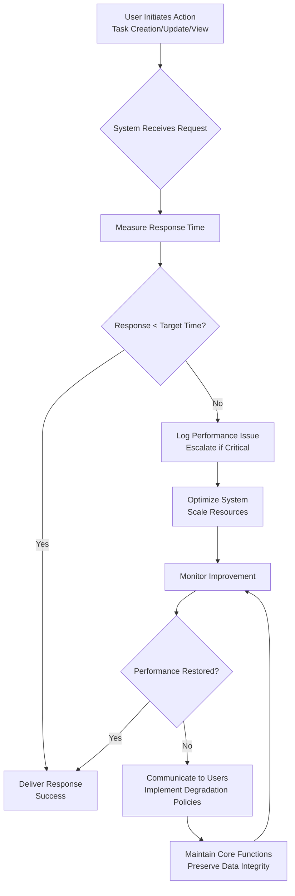

# TodoList Performance Expectations

## Overview

This document defines the performance expectations for the TodoList application as a task management service that supports authenticated users in managing their personal todo items. Performance directly impacts user satisfaction and business success by ensuring the application feels responsive and reliable during daily task operations. These requirements are expressed in business terms, focusing on user experience outcomes while providing measurable targets that guide technical implementation decisions.

The TodoList service provides minimum functionality for task management with an emphasis on immediate usability. Performance requirements balance technical capabilities with business needs: maintaining user engagement through fast response times, supporting growing user bases through scalable architecture, and ensuring reliability that builds trust in the service. These expectations integrate with the service vision of providing simple, effective task organization that users can depend on throughout their day.

## Response Time Requirements

The TodoList application must provide responsive interactions that feel instantaneous to users during common task management activities. Response times impact user productivity and satisfaction, with slow performance creating friction in daily task workflows.

WHEN a user submits a new task through the TodoList application, THE system SHALL confirm the task creation and display it in the user's task list within 1 second to maintain workflow momentum.

WHEN a user requests to view their complete task list, THE system SHALL load and display all tasks, including current completion status and task details, within 500 milliseconds to enable quick task reviews during busy periods.

WHEN a user marks an existing task as completed or reopens a completed task, THE system SHALL update the task status and reflect the change immediately in the user interface within 1 second.

WHEN a user deletes a task from their list, THE system SHALL permanently remove the task from the system and update the displayed list within 1 second while requiring explicit user confirmation.

WHILE a user performs multiple rapid task management actions in sequence, SUCH AS creating several tasks in a row or updating multiple task statuses, THE system SHALL maintain average response times under 2 seconds per action to prevent user fatigue.

IF a user's task collection exceeds 100 tasks, THEN THE system SHALL load and display the most recent 50 tasks within 2 seconds, with clear indicators for viewing additional tasks to manage large collections efficiently.

WHEN a user searches through their task list using title or description keywords, THE system SHALL return matching results instantly, ideally within 300 milliseconds, to support quick task discovery during task planning sessions.

WHILE users perform input validation during task creation, SUCH AS typing task titles or descriptions, THE system SHALL provide real-time feedback on validation errors within 500 milliseconds to prevent user frustration with form completion.

## User Experience Metrics

Performance requirements extend beyond raw response times to encompass qualitative user experience indicators that affect how users perceive and interact with the TodoList service. These metrics ensure the application feels responsive and reliable in real-world usage scenarios.

THE system SHALL ensure that at least 95% of all user interactions, INCLUDING task creation, status updates, and list viewing, complete successfully within 2 seconds to maintain a sense of immediacy in task management.

WHEN users experience performance variations throughout their usage session, THE system SHALL maintain consistent response patterns to avoid user confusion about system reliability.

WHILE users handle their daily task workflows, INCLUDING morning task reviews, midday updates, and evening planning, THE system SHALL provide consistent performance regardless of usage timing.

IF response times begin to degrade due to increased system load, THEN THE system SHALL gracefully maintain core functionality for existing user sessions while prioritizing task management operations.

WHEN users perform bulk operations, SUCH AS marking multiple tasks complete simultaneously, THE system SHALL process up to 50 tasks within 3 seconds total to support efficient task management during meetings or planning sessions.

WHILE multiple users access the system concurrently during peak hours, SUCH AS business start times or end-of-day planning, THE system SHALL maintain individual user responsiveness without significant performance impacts.

THE system SHALL provide users with clear performance indicators, SUCH AS loading states during lengthy operations, to set appropriate expectations and maintain user confidence in system reliability.

## Load Handling Requirements

The TodoList application must support growing user communities while maintaining performance commitments. Load handling requirements ensure the service scales responsively as user adoption increases and usage patterns evolve.

WHEN multiple users access the TodoList service simultaneously during peak usage periods, THE system SHALL maintain response times under 3 seconds for individual user operations to preserve the personal task management experience.

IF the system experiences temporary load spikes from viral content or promotional activities, THEN THE system SHALL automatically scale resources to maintain performance targets without requiring manual intervention.

WHILE handling concurrent operations across hundreds of users, THE system SHALL prioritize core task management functions like creating, updating, and viewing tasks over background processes like data synchronization.

WHEN system capacity reaches predefined thresholds, THE system SHALL implement queuing mechanisms to ensure all user operations eventually complete successfully without data loss.

THE system SHALL support concurrent task management for up to 1000 active users performing typical workflows, SUCH AS morning task creation and midday status updates, within established time limits.

WHILE processing complex queries or bulk operations, THE system SHALL maintain system stability and prevent performance degradation for other users' basic task operations.

IF system load approaches maximum capacity during user growth periods, THEN THE system SHALL provide clear indicators to users about expected performance and suggest optimal usage times when available.

WHEN performing background maintenance operations, SUCH AS data optimization or cleanup, THE system SHALL minimize impact on active user performance during business hours.

THE system SHALL implement intelligent load distribution mechanisms to balance user requests across available system resources during high-demand periods.

## System Availability Standards

Reliability forms the foundation of user trust in the TodoList service. Availability requirements ensure users can depend on accessing their task information when needed, supporting the business model of daily task management reliability.

THE TodoList system SHALL maintain 99.5% uptime annually, EXCLUDING planned maintenance windows, to ensure users can access their tasks for daily planning and progress tracking.

WHEN unplanned service outages occur due to system failures or external factors, THE system SHALL restore full functionality within 4 hours to minimize business disruption for task-dependent users.

IF data integrity issues are detected during system operations, THE system SHALL quarantine affected data segments and restore from secure backups within 1 hour while maintaining user access to unaffected tasks.

WHILE conducting scheduled maintenance activities, SUCH AS software updates or infrastructure improvements, THE system SHALL limit downtime to under 30 minutes per occurrence with advance notice provided to active users.

THE system SHALL support geo-redundant operations to maintain 98% service availability during regional disruptions, natural disasters, or network outages that affect primary data centers.

WHEN system components experience individual failures, THE system SHALL automatically redirect user requests to healthy system instances without requiring user action or noticeable service degradation.

WHILE restoring system functionality after outages, THE system SHALL preserve all user task data and session states to prevent loss of work or user frustration during recovery periods.

THE system SHALL provide users with service status information through accessible channels so users can make informed decisions about task management during potential service disruptions.

## Business Impact Analysis

Performance expectations directly influence business success by affecting user acquisition, retention, and operational efficiency. Slow or unreliable systems create barriers to user adoption while responsive performance drives positive word-of-mouth and user loyalty.

WHEN the TodoList application maintains sub-second response times for core operations, THE system SHALL improve user retention rates by reducing task management friction and increasing daily usage frequency.

IF response times exceed 2 seconds for routine operations, THEN THE system SHALL potentially lose user engagement as users seek alternative task management solutions with better performance characteristics.

WHILE users experience reliable availability during critical business periods, SUCH AS project planning or deadline management, THE system SHALL build user confidence and reduce support requests related to system reliability issues.

WHEN the system demonstrates consistent performance under load, THE system SHALL support business growth by enabling direct user referrals and positive reviews that drive organic acquisition.

THE system SHALL maintain performance standards that directly contribute to business objectives, INCLUDING user satisfaction scores above industry benchmarks and reduced operational costs from minimized support escalations.

## Performance Monitoring Requirements

To ensure ongoing compliance with performance expectations, the TodoList application requires systematic monitoring and measurement of key performance indicators. These monitoring requirements provide business visibility into system performance and enable proactive optimization.

THE system SHALL capture and analyze response time metrics for all user-facing operations to identify performance trends and optimization opportunities over time.

WHEN performance metrics fall below established thresholds, THE system SHALL generate automated alerts to technical teams for investigation and resolution before user impact becomes significant.

WHILE collecting performance data, THE system SHALL maintain user privacy by aggregating metrics without exposing individual user behavior patterns or personal task information.

THE system SHALL provide business stakeholders with performance dashboards showing uptime statistics, response time distributions, and usage patterns to support data-driven decisions.

WHEN performing routine performance assessments, THE system SHALL measure actual user experience metrics against defined targets to validate business value delivery.

WHILE tracking performance over extended periods, THE system SHALL identify peak usage patterns and system capacity utilization to support capacity planning and infrastructure investment decisions.

THE system SHALL conduct performance load testing under various user concurrency scenarios to validate scaling assumptions and identify potential bottleneck operations.

## Degradation Policies

When performance challenges occur due to unexpected circumstances or infrastructure limitations, the TodoList application requires structured degradation policies to minimize business impact while maintaining core functionality.

IF system performance begins to degrade due to unexpected load or resource constraints, THEN THE system SHALL prioritize task data integrity operations over non-essential features to ensure user tasks remain accessible and accurate.

WHEN faced with temporary capacity limitations, THE system SHALL implement grace period policies allowing existing user sessions to complete while managing new request volumes appropriately.

WHILE operating in degraded performance modes, THE system SHALL provide clear user communication about expected service restoration timelines and alternative access methods if available.

THE system SHALL maintain minimum service levels during degradation periods, ensuring that core task operations remain functional even with extended response times.

IF degradation extends beyond acceptable business thresholds, THEN THE system SHALL activate escalation protocols for rapid resolution and user communication to maintain service credibility.

WHEN performance degradation affects business-critical functionality, SUCH AS task creation during peak planning periods, THE system SHALL provide fallback mechanisms to preserve core user workflows.

## User Communication During Performance Issues

Transparent communication during performance incidents builds user trust and sets appropriate expectations while the system addresses underlying issues.

WHEN the system experiences temporary slowdowns or outages, THE system SHALL display user-friendly status messages explaining the situation and expected resolution timeframes.

WHILE performance issues are being resolved, THE system SHALL provide regular status updates through appropriate channels if the incident extends beyond initial expectations.

THE system SHALL avoid technical jargon in performance communication, focusing instead on business impact descriptions like "task saving may take slightly longer than usual."

WHEN service is restored after performance incidents, THE system SHALL notify affected users and provide confirmation that their task data and recent changes are preserved.

WHILE communicating about performance improvements or scheduled maintenance, THE system SHALL balance transparency with user reassurance about system reliability and data safety.

This performance expectations document establishes the business foundation for delivering a responsive, reliable TodoList service. The requirements balance technical performance with user experience needs, ensuring the application supports productive task management workflows. Performance standards are expressed in measurable, business-relevant terms that guide technical implementation while maintaining focus on user satisfaction and business value delivery.

For detailed user scenarios that these performance requirements support, reference the [Primary User Scenarios Document](./05-todoList-primary-user-scenarios.md). Availability and reliability standards complement the security requirements outlined in the [Security and Compliance Document](./09-todoList-security-compliance.md).

*Developer Note: This document defines business requirements only. All technical implementations (caching strategies, database optimization, CDN usage, etc.) are at the discretion of the development team while maintaining compliance with these performance expectations.*