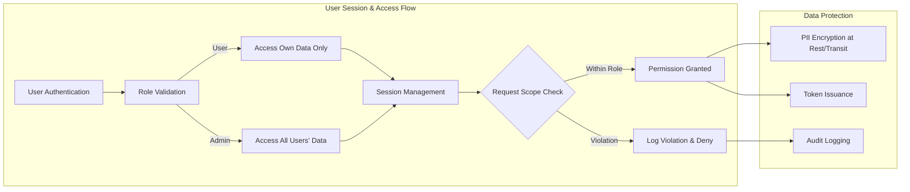

# Security and Compliance Requirements for Todo List Application

## Access Control Policies

Access controls define business-driven boundaries for system usage, protecting user data and upholding privacy obligations.

### User Authentication and Authorization
- WHEN a user attempts to access any service feature, THE application SHALL require authentication using valid, unique user credentials (e.g., email and password).
- WHEN a user authenticates, THE system SHALL generate a secure session using a robust mechanism, such as JWT, valid for a limited and configurable period.
- WHEN a user is not authenticated and requests a protected resource, THE system SHALL deny the request and prompt for authentication.
- WHEN a user accesses, edits, or deletes a todo item, THE system SHALL verify the user's identity and grant permission ONLY if the todo belongs to that user OR if the user has administrative privileges.
- WHEN a user attempts to modify another user's todos or account, THE system SHALL reject the request unless the user is an admin.
- WHEN a user logs out, THE system SHALL immediately revoke any active tokens for that user and end the session.
- WHEN a session expires or presents an invalid token, THE system SHALL deny access and require re-authentication.
- User roles SHALL be enforced for all business actions:
  - Regular users SHALL operate solely on their own data (todos, account info, etc.).
  - Admin users SHALL have access to all todo and user data for management, audit, and monitoring purposes.

#### Permission Matrix
| Feature / Action                                | User | Admin |
|------------------------------------------------|------|-------|
| View own todos                                 | ✅   | ✅    |
| Create/modify/delete own todos                 | ✅   | ✅    |
| View/modify/delete others' todos               | ❌   | ✅    |
| Manage user accounts                           | ❌   | ✅    |
| Access system health reports                   | ❌   | ✅    |
| Export own data                                | ✅   | ✅    |
| Export all user data                           | ❌   | ✅    |
| Manage/compliance audit logs                   | ❌   | ✅    |

#### Role Violation Handling
- WHEN a user attempts an unauthorized action (outside their role), THE system SHALL deny the request, log the incident (with user, action, timestamp), and display a clear error message.
- WHEN repeated unauthorized actions are detected from the same user, THE system SHALL alert an administrator for possible review.

### Session and Token Management
- WHEN a session token is issued, THE system SHALL include user ID, roles, and explicit permission claims in the token payload, with secure signature and encryption.
- WHEN a session is idle for over 30 minutes (configurable), THE system SHALL expire the session and require user re-authentication.
- WHEN logout is triggered by the user or admin, THE system SHALL provide logout from all sessions/devices.
- THE system SHALL allow revocation of tokens at any time by either the user (for own account) or admins (for any user).

## Data Protection and Security Standards

### Sensitive Data Handling
- WHEN saving or processing any personal data—including names, emails, credentials, todo content—THE system SHALL treat all such data as sensitive and SHALL:
  - Store passwords ONLY as one-way, salted hashes using modern algorithms (bcrypt, Argon2, or equivalent)
  - Transmit all sensitive data exclusively over encrypted TLS connections
  - NEVER log, display, or expose raw credentials/tokens outside secured and ephemeral memory areas
  - Enforce least-privilege access throughout UI/API exposure—users see only their own todo data; admins see all

### Data Encryption
- WHEN storing sensitive data at rest (including tokens, password hashes), THE system SHALL use strong encryption algorithms and maintain secure key management with rotation and compromise response procedures.
- WHEN regulatory or high-security requirements apply, THE system SHALL allow for configurable encryption keys and policies.

### Data Minimization and Retention
- WHEN user data is no longer needed, THE system SHALL enable permanent deletion upon user request, subject to legal retention obligations.
- WHEN a user requests account or todo deletion, THE system SHALL irreversibly remove associated data barring legal requirements for further retention.
- WHEN a user requests data export, THE system SHALL process and deliver a copy, responding within required business timeframes (e.g., 30 days by default, configurable).
- THE system SHALL keep audit logs of all admin actions affecting more than one user, with a one-year minimum retention for compliance as a business standard.

### Monitoring, Logging, and Intrusion Detection
- WHEN authentication attempts, record updates, or access violations occur, THE system SHALL log these events, including timestamp, resource(s), user, and result.
- WHEN logs reference user activity, THE system SHALL ensure that no sensitive data (e.g., passwords, raw tokens, personal messages) is stored within them.
- WHEN suspicious activity patterns (e.g., multiple failed logins, token abuse) are detected, THE system SHALL notify an admin for review.
- WHEN a potential intrusion or security breach is detected, THE system SHALL escalate to compliance and management immediately and initiate incident response.

### Security Best Practices
- THE application SHALL adhere to industry best practices—regular dependency updates, strong HTTP security headers (HSTS, CSP, X-Content-Type-Options), and limited lifespan for access tokens.
- WHEN a security update is released, THE development and operations teams SHALL apply patches within a business-determined, risk-based timeframe (e.g., within 7 days for critical vulnerabilities).

## Compliance Obligations

### GDPR and Global Privacy Alignment
- WHEN collecting, processing, or storing user PII, THE system SHALL uphold users' data subject rights: access, rectification, erasure, portability, objection, restriction, and withdrawal of consent.
- WHEN a user first interacts with the Todo List application, THE system SHALL present a clear privacy notice explaining data use and protection.
- WHEN obtaining user consent for data processing, THE system SHALL implement a mechanism for users to review and withdraw consent at any time.
- WHEN handling data breaches affecting user rights/freedoms, THE system SHALL enable business processes for notifying users and regulatory authorities promptly and within regulatory deadlines.

### Other Privacy and Compliance Standards
- THE system SHALL embed privacy by design, incorporating data protection into all development and operational processes as a business priority.
- WHEN operating across multiple regions or jurisdictions, THE application SHALL enable restricting data transfers to only compliant regions/countries.
- WHEN legally required, THE system SHALL apply specialized policies (e.g., CCPA, PIPA) based on user locality.
- Compliance and audit logs SHALL be available to authorized business or legal officers for regulatory inquiries, audit trails, or internal reviews.

## Mermaid Diagram: Security Workflow Overview

## Summary for Implementation
All requirements listed are mandatory for the Todo List application's backend development, forming the legal and business-driven foundation for design and operational workflows. Requirements use unambiguous business language and EARS-compliant statements to remove ambiguity for backend engineers and promote testable, enterprise-grade security and privacy features.