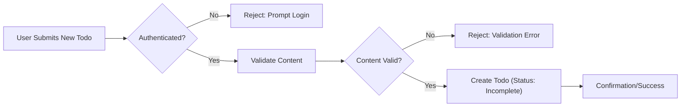
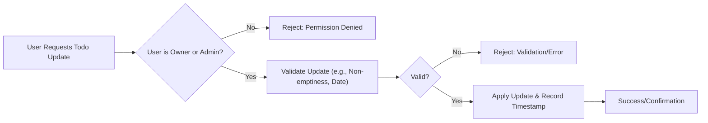
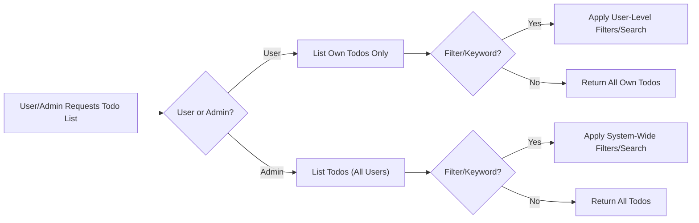
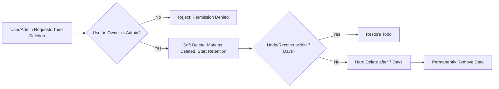
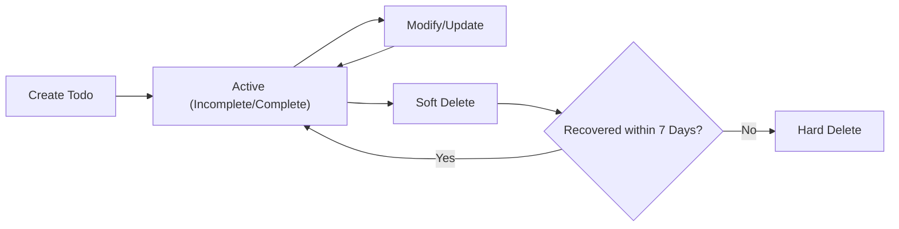

# Todo List Application Requirements – Data Flow & Lifecycle

## Data Creation Process

A todo item begins its lifecycle when a user or admin creates it. The system distinguishes between standard users and admins in terms of permissions, logging, and error recovery.

**User Actor – user**
- WHEN a user, authenticated by the system, submits a request to create a new todo, THE system SHALL validate that todo content is not empty and does not exceed maximum character length (configurable, e.g., 255 characters).
- WHEN validation passes, THE system SHALL create a new todo entry linked to the user's account, store a creation timestamp, and mark the todo as "incomplete" by default.
- IF a user submits a todo with empty content or content exceeding maximum length, THEN THE system SHALL reject the request with a user-friendly error message.
- IF a non-authenticated user attempts creation, THEN THE system SHALL deny the request and respond with an authentication prompt.

**User Actor – admin**
- WHEN an admin creates a todo (e.g., for testing, demonstration, or user support), THE system SHALL record the admin as the actor in the audit log and link the correct user if creating on behalf of another account.

**Business Rules**
- THE system SHALL NOT permit the creation of duplicate (identical content and due date) incompleted todos by the same user.

## Data Update/Modification Flow

Users and admins may update todo records—modifying content, metadata, or status. Permissions and business validation rules safeguard data integrity at all times.

**User Actor – user**
- WHEN a user edits or updates their own todo, THE system SHALL validate that modified content is not empty and meets all length restrictions before saving changes.
- WHEN a user marks a todo as complete/incomplete, THE system SHALL record the updated status and timestamp the operation.
- IF a user tries to modify or complete a todo they do not own, THEN THE system SHALL deny the request, returning a permissions error.
- IF a user tries to update a deleted or non-existent todo, THEN THE system SHALL refuse the update and present a not found error.
- WHEN a user modifies a todo’s due date, THE system SHALL ensure the new date is not in the past relative to the current date/time.

**User Actor – admin**
- WHEN an admin updates any todo, THE system SHALL log the operation, including the actor and modification details, for auditing.
- WHEN an admin marks a user’s todo as complete/incomplete, THE system SHALL document the change and include contextual audit data.
- WHERE admins respond to disputes or abuse reports, THE system SHALL allow admin correction/updating of user todo, with all such actions fully traceable.

**Business Rules**
- THE system SHALL prevent setting content to empty during any modification.
- THE system SHALL only allow updates to valid, non-deleted todos.

## Data Retrieval and Filtering

The retrieval process enables users and admins to access todo information based on access level, search criteria, and filtering.

**User Actor – user**
- WHEN a user requests their todo list, THE system SHALL return only todos owned by that user.
- WHEN a user applies filters (completion status, keyword search, date range), THE system SHALL restrict queries to that user's records.
- IF a user accesses data not owned by them, THEN THE system SHALL block access and return a privacy error message.
- WHEN paginating, THE system SHALL sort results by creation date, latest first.

**User Actor – admin**
- WHEN an admin requests todos, THE system SHALL allow full access, enabling filtering by user, status, or date.
- WHEN searching, THE system SHALL permit admin-level search across all user todo records. Auditing and activity review are supported by relevant filters.

**Business Rules**
- THE system SHALL restrict data returns according to the requestor's permissions.
- THE system SHALL enable searching, filtering, and pagination per business requirements.

## Data Deletion and Retention

This process governs removal of todos and the lifespan of task data. Retention, recovery, and compliance are outlined here.

**User Actor – user**
- WHEN a user deletes their own todo, THE system SHALL mark it as deleted, record a deletion timestamp, and allow recovery for a retention window of 7 days (soft delete).
- IF a user tries deleting a todo they do not own, THEN THE system SHALL reject the action and return a permission error.
- WHEN a retention window expires, THE system SHALL hard-delete the todo, permanently removing it and its associated data.
- IF a user attempts to recover a hard-deleted todo, THEN THE system SHALL not find it and return an unrecoverable status.

**User Actor – admin**
- WHEN an admin deletes todos, THE system SHALL log the actor, reason (if provided), and operation in the system audit log.
- WHERE a legal/compliance hold exists, THE system SHALL prevent hard deletion until the hold expires.
- WHEN admins view deleted tasks, THE system SHALL provide filter/search options for all deleted and in-retention-period items.

**Business Rules**
- THE system SHALL soft delete tasks by default; hard delete occurs only after retention expiration.
- THE system SHALL maintain an audit log on every deletion and recovery action (actor, timestamp, reason).
- THE system SHALL display user-friendly retention and recovery info at time of deletion.

## Full Todo Lifecycle Overview

A todo item typically experiences:
1. Creation – With validation and actor association.
2. Update/modification – With owner checks and audit logging.
3. Retrieval – Permissioned, filtered access.
4. Soft delete – Hides from standard views, retains recoverability for 7 days.
5. Hard delete – Irreversible removal post-retention, with audit trail.

## Appendix: Terminology
- **Soft delete:** Temporarily hiding a todo for user recovery.
- **Hard delete:** Permanent erasure of a todo and its data after retention.
- **Retention period:** The time window in which a deleted todo may be recovered (7 days by default).
- **Audit log:** Security/compliance record of all todo creation, modification, and deletion activities, including timestamps and responsible actors.
