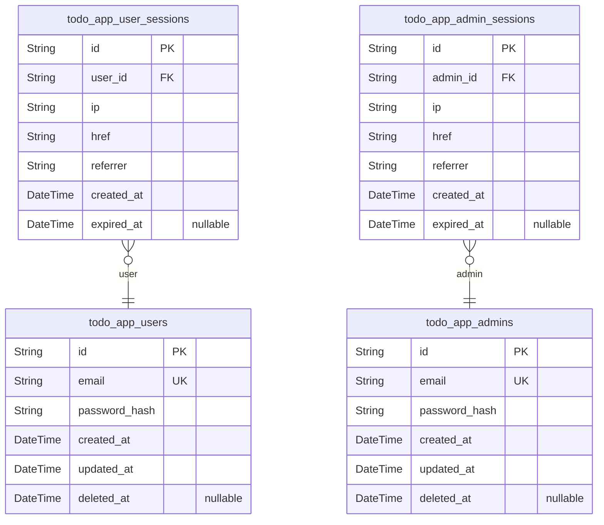
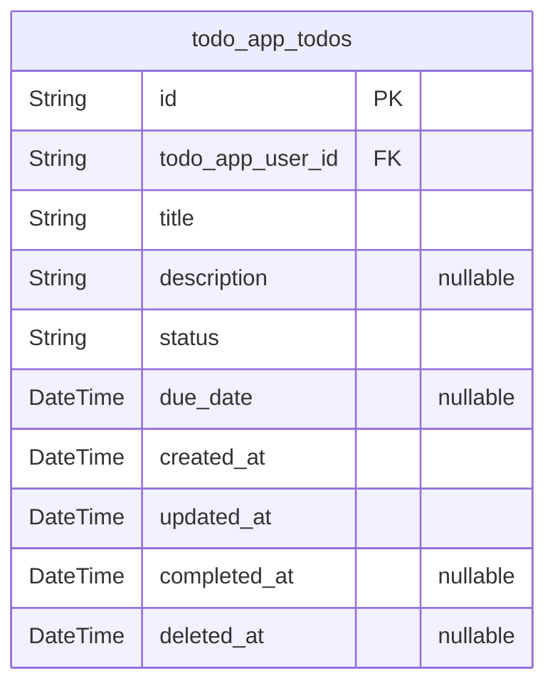

# Prisma Markdown

> Generated by [`prisma-markdown`](https://github.com/samchon/prisma-markdown)

- [Actors](#actors)
- [Todos](#todos)

## Actors

### `todo_app_users`

Registered user accounts for managing personal todo items.

This model stores unique member identities for end users of the Todo
application. Each record captures essential account details required for
secure authentication, session management, and privacy enforcement per
user. All registered users are uniquely identified by email, with
password hashing for credential security. Users may create, update,
complete, and delete their own todos, with strict enforcement that no
user may access or modify another account's todos. The table supports
account recovery and compliance with data erasure policies. Admin
accounts are managed separately to preserve strong privilege separation.

Properties as follows:

- `id`: Primary Key.
- `email`
  > Unique email address for authentication and account notifications.
  > Enforced as unique across all users.
- `password_hash`
  > Securely hashed representation of the user's password. Plaintext values
  > are never stored or processed.
- `created_at`: Timestamp when the user account was created.
- `updated_at`: Timestamp for the last update to the user's account data.
- `deleted_at`: Soft delete timestamp for GDPR/account deletion and recovery workflows.

### `todo_app_user_sessions`

Session records for authenticated user activity tracking.

This subsidiary table logs all active and historical login sessions for
each user, enabling secure authentication state management, audit trails,
and session expiry enforcement. It captures the context of each login,
including IP, originating URL, and referrer information, as well as
lifecycle timestamps. Each session references its owner user and is never
shared across users. Sessions may expire naturally or be terminated for
security reasons. The table enforces auditability and supports forensic
analysis during security events or account changes.

Properties as follows:

- `id`: Primary Key.
- `user_id`
  > References the unique user who owns this session. {@link
  > todo_app_users.id}.
- `ip`: IP address from which the session was initiated.
- `href`: URL of the application entry point for the session.
- `referrer`: Referrer URL initiating sign-in session.
- `created_at`: Timestamp when the session was created.
- `expired_at`
  > Session expiration timestamp. Set when the session naturally concludes or
  > is terminated.

### `todo_app_admins`

System administrator accounts with global oversight authority.

This model manages all privileged identities authorized to oversee,
support, and manage the entire Todo application, including all user and
todo records. Admin accounts are strictly segregated from regular user
accounts to preserve least-privilege policy and support regulatory
compliance. Each admin is identified by a unique email, with a securely
hashed password for exclusive authentication. Deletion and modification
actions by admins are audited, and extended account management privileges
are restricted to this class. Suitable for future extension to audit or
multi-role administration.

Properties as follows:

- `id`: Primary Key.
- `email`
  > Unique email address for administrator authentication. Must be unique
  > across all admins.
- `password_hash`
  > Hashed password credential for administrator authentication. Plaintext
  > passwords are never stored.
- `created_at`: Creation timestamp for the administrator account.
- `updated_at`: Last update timestamp for the administrator record.
- `deleted_at`: Soft delete timestamp for compliance or admin removal events.

### `todo_app_admin_sessions`

Session tracking for administrator authentication events.

This model logs all authentication sessions for administrators only,
capturing the connection context and session lifecycle details for
compliance and audit purposes. Each session is strictly tied to a unique
admin account and includes IP, href, referrer, and timestamps. The
subsidiary stance enforces that sessions are managed through admin
workflows, and each login event is auditable for security reviews. No
overlap occurs with user session management, preserving strong privilege
boundaries. Supports account lockout, session expiry, and future
multifactor authentication enhancements.

Properties as follows:

- `id`: Primary Key.
- `admin_id`
  > References the unique administrator who owns this session. {@link
  > todo_app_admins.id}.
- `ip`: IP address from which the administrator session was created.
- `href`: Entry URL for admin session sign-in.
- `referrer`: Referrer URL that originated the admin session.
- `created_at`: Session initiation timestamp.
- `expired_at`: Timestamp marking the end or expiry of the administrator's session.

## Todos

### `todo_app_todos`

Primary business entity for all todo tasks in the application.

Represents an individual todo item uniquely owned by a single user
([todo_app_users](#todo_app_users)). Each todo captures the required title, optional
description, and full set of business lifecycle states (active,
completed, deleted) via the status field and corresponding timestamps.
Enforces unique todo titles among a user's active items, supports
optional due date, and maintains full audit fields for creation,
modification, completion, and soft deletion. Todos are strictly private
and accessible only to the user and system administrators; all visibility
and permissions are managed at the application layer. All state
transitions (completion, deletion, recovery) are reflected in status and
timestamp columns; permanent erasure after retention period is carried
out by application logic. The model allows efficient queries on
ownership, state, and business constraints, and is ready for
enterprise-scale extensions (archiving, snapshot/audit, future features).

Properties as follows:

- `id`: Primary Key.
- `todo_app_user_id`
  > Owner of this todo. References the primary key in the users table. {@link
  > todo_app_users.id}.
- `title`
  > Required, user-defined name of todo item. Must be unique among active
  > todos for the same user. Maximum 100 characters.
- `description`
  > Optional, user-supplied description of the todo. Maximum 1000 characters.
  > May be null if the user chooses not to enter details.
- `status`
  > Current business status of the todo. One of: 'active', 'completed',
  > 'deleted'. Transitions controlled by user actions and business rules.
- `due_date`
  > Optional due date for task completion. Null if no due date is set. Must
  > be a future date at the time of entry.
- `created_at`: Timestamp of todo creation (UTC, immutable). Set once at row insertion.
- `updated_at`
  > Timestamp of last update to title, description, due date, or other
  > editable fields. Updated automatically on modification.
- `completed_at`
  > Timestamp when todo was marked as completed. Only set when
  > status='completed'; otherwise null.
- `deleted_at`
  > Timestamp when todo was deleted (soft delete). Set when status
  > transitions to 'deleted', otherwise null. Used for retention/erasure
  > rules.
