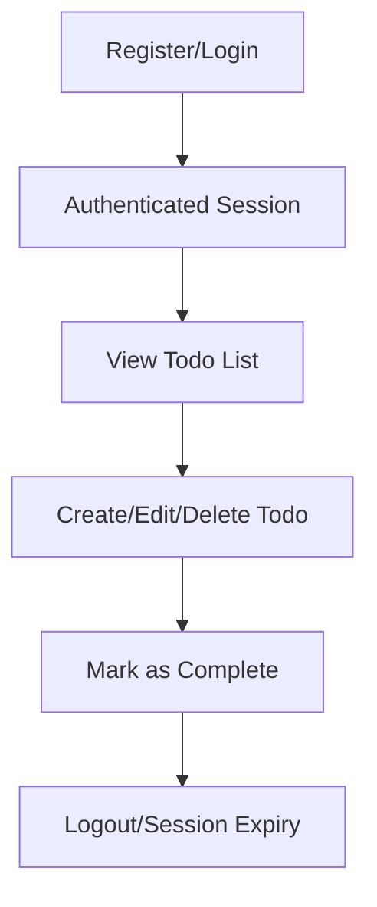

# Todo List Requirements Analysis

## Service Overview & Vision
The Todo List application (service prefix: `todoApp`) is designed as a minimal, focused productivity tool to enable users to manage personal tasks. The vision is to deliver a simple, reliable, and accessible task management platform accessible via web or mobile, with a streamlined user experience prioritizing ease of use and rapid task interaction. The service is intended for everyday users seeking a straightforward solution to organize their daily to-dos without any unnecessary complexity.

### Goals
- Provide core todo management (create, update, complete, delete) with an intuitive UX
- Minimize cognitive and operational load—just the tasks, nothing extra
- Ensure robust authentication and user data privacy
- Be accessible, responsive, and reliable for individual task-tracking needs

### Target Market
Any individual with the need for basic personal task tracking and organization, regardless of age, background, or profession.

## Problem Definition
Many existing productivity apps are overloaded with features, causing users to lose focus on essential daily task management. For basic needs, such as remembering chores, shopping, work tasks, or assignments, most people require only the most essential CRUD (Create, Read, Update, Delete) functions. Users currently lack a distraction-free tool that guarantees privacy, clear ownership, and fail-safe persistence of entries.

### Key Pain Points
- Over-complicated solutions for a simple need
- Poor reliability or loss of data
- Privacy concerns: tasks are personal and must remain private

## Core Value Proposition
The todoApp offers the absolute minimum feature set to reliably capture and manage daily tasks:
- Focused only on user account management and individual task CRUD
- Fast, clutter-free interaction—no social, project, or collaborative overhead
- Strong guarantees that only authenticated users can view/manipulate their own todos
- Privacy and security as first-class citizens

## Service Operation Overview
### User Onboarding
Users can create an account, log in using secure authentication, and immediately begin entering and managing personal todo items. The service operates exclusively as a user-centric, single-owner task tracker.

### Main Service Workflow
1. User authenticates (sign up/sign in) securely
2. User creates todo items by entering a title (and optional description)
3. User can mark a todo as completed, edit it, or delete it
4. Only authenticated users can access their todos—data is never shared
5. Each action (create/edit/complete/delete) is reflected immediately in the user’s list

### Todo Lifecycle
Each todo transitions through the following business states:
- **Active:** Awaiting completion
- **Completed:** Marked as finished by the user
- **Deleted:** Removed when the user chooses to delete (removal rules apply)

### Access Control Overview
All operations are strictly scoped to the authenticated user's account. No user can access, view, or modify items belonging to others. Admin features are excluded to preserve simplicity and ensure personal privacy.

## User Actors and Authentication
### Actors
| Actor        | Description                                               |
|-------------|-----------------------------------------------------------|
| User        | Registered account holder managing their personal todos    |

#### Permissions Matrix
| Feature         | User |
|-----------------|------|
| View Own Todos  | Yes  |
| Create Todo     | Yes  |
| Update Todo     | Yes  |
| Complete Todo   | Yes  |
| Delete Todo     | Yes  |
| View Others’    | No   |
| Admin Actions   | No   |

### Authentication Flows
- Users register with a unique identifier (email or username) and password
- Passwords must be securely hashed and never stored or transmitted in plaintext
- Session management is handled via secure, tamper-proof tokens (e.g., JWT)
- Sessions expire after a defined inactivity period; re-authentication is required

### Security Expectations
- Only authenticated sessions can call any todo CRUD operation
- Repeated failed login attempts must be rate-limited to prevent brute-force attacks
- Password reset requires proof of ownership (email challenge)
- No public endpoints expose or leak user-specific data

## Primary User Scenarios
### Registration and Login
WHEN a person visits the todoApp, THE system SHALL provide means to register or log in using email/username and password. Successful authentication SHALL direct the user to their personal todo list.

### Managing Todos
- WHEN a logged-in user enters a new todo item title and submits, THE service SHALL create a new todo belonging to the user and display the updated list instantly.
- WHEN the user checks a todo as complete, THE service SHALL update the item’s status and move/combine it with other completed tasks for clarity.
- WHEN a user edits a todo, THE service SHALL allow only edits to the title/description, persisting changes immediately.
- WHEN a user deletes a todo, THE system SHALL remove only that task from their personal list and reflect changes instantly.

### Log Out and Session Expiry
WHEN a user logs out or their session expires, THE system SHALL require re-authentication before any further access to todo data.

## Special and Exception Scenarios
- WHEN a user attempts to register with an already-used identifier, THE system SHALL reject the request and display a clear error message.
- WHEN login credentials are incorrect, THE system SHALL limit repeated attempts and provide generic error messages to avoid leaking information.
- WHEN an unauthenticated user attempts any todo operation, THE system SHALL deny the request and prompt for login.
- WHEN network or server errors occur while saving or updating todos, THE system SHALL inform the user and provide clear recovery actions.

## Performance Requirements
- All authenticated CRUD operations SHALL respond within 1 second 95% of the time under normal usage conditions.
- Todo list updates SHALL propagate instantly in the UI to prevent confusion or data-loss perception.
- System SHALL be available 99.95% of the time annually.
- WHEN under heavy load, THE system SHALL degrade gracefully (e.g., by queueing writes or providing clear feedback).

## Security and Compliance
- All data transfers SHALL use encrypted protocols (HTTPS/TLS only).
- User passwords and authentication tokens SHALL be handled as strictly confidential.
- WHEN a security-critical action is attempted by an unauthenticated user, THE system SHALL record the incident for audit and provide a generic user-facing error.
- The service SHALL comply with general data privacy principles (e.g., GDPR), ensuring users can request deletion of their data at any time.
- Deleted todos SHALL be unrecoverable after a defined grace period (see business rules).

## Business Rules and Constraints
- A todo item consists of: title (required), description (optional), completion status, timestamps for creation/completion, and unique ownership by user
- Each user SHALL only see and manipulate their own tasks
- Title max length: 100 chars; description max 500 chars
- Each todo SHALL be automatically marked completed only via explicit user action
- Deleted todos SHALL be immediately invisible, with final erasure after grace period (e.g., 7 days)
- Data retention: user tasks retained only as long as the user account is active, or until user requests deletion

## External Integrations and Dependencies
- No external services are required for minimum functionality; service must function independently.
- Future consideration: optional integration with basic notification/email services for reminders or task updates, implemented only if minimum core requirements are satisfied and user privacy can be maintained.

---

## Summary Table: Core TodoApp Business Requirements (EARS Format)
| WHEN                                       | THE SYSTEM SHALL                                                        |
|---------------------------------------------|------------------------------------------------------------------------|
| user submits new todo                       | create the todo for their account, display updated list                |
| user checks todo as completed               | update item’s status, move/combine with completed section              |
| user edits todo                             | allow title/description updates, persist immediately                   |
| user deletes todo                           | remove the item from list, reflect change instantaneously              |
| login is attempted with invalid credentials | limit attempts, provide non-specific error                             |
| unauthenticated access to todo features     | deny operation, prompt for login                                       |
| registration with duplicate identifier      | reject request, show clear message                                     |
| network/server error saving/updating todo   | show user-friendly error, provide recovery even if operation failed    |
| data privacy event (e.g., delete request)   | erase all relevant records permanently after grace period              |
| any writers under load                      | maintain 1 sec response time 95% of time, show clear queuing if needed |

---

## Sample Minimal Mermaid Diagram: User Interaction Flow

---

All requirements above are defined in natural language, using EARS format for demand statements, and are intended for immediate backend implementation. No APIs, schema, or technical design included.