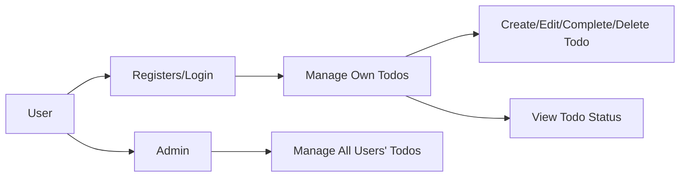

# Todo List Application – Service Requirements

## Service Vision and Goals

The Todo List application SHALL provide a digital personal task management tool that is minimalistic, reliable, and intuitive. WHEN a user wants to organize their daily, weekly, or long-term tasks, THE system SHALL enable rapid task entry, clear presentation of current and completed work, and seamless updating or removal of items, while maintaining a frictionless experience free from unnecessary complexity.

### EARS Requirements
- WHEN a user creates a todo, THE system SHALL immediately store that item and update the user’s task list.
- WHEN a user marks a todo as complete, THE system SHALL move the item to a completed section, visibly separate from active todos, without deleting it unless explicitly removed.
- WHEN a user edits a todo, THE system SHALL save changes in a way that does not impact other todo items.
- WHEN a user deletes a todo, THE system SHALL permanently remove that item from the user’s todo list.
- WHEN a user views their dashboard, THE system SHALL SHOW all current (incomplete) todos and previously completed todos, clearly distinguished by status.
- WHEN a user is not authenticated, THE system SHALL prevent all access to any todo functionality.
- WHEN an admin logs in, THE system SHALL allow full read and write access to all users’ todo items, including the ability to delete or update any todo and manage user accounts.

## Target Market and Users

Individuals who need a light-weight, distraction-free digital method to manage and keep track of their personal or professional tasks. Designed especially for:
- Users preferring simpler alternatives to paper lists or complex project management tools.
- People focused on essential productivity and task tracking, not collaboration.

### Actor Table
| Actor  | Description                                                                                                      |
|--------|------------------------------------------------------------------------------------------------------------------|
| User   | Registered user; manages personal todos; can create, edit, complete, or delete only their own todos.             |
| Admin  | Administrator; can view, edit, delete, or restore any todo in the system; can manage user accounts and perform maintenance. |

### Permissions Matrix
| Actor  | Create Todo | Edit Own Todo | Complete Own Todo | Delete Own Todo | View Own Todos | View All Todos | Manage All Todos | Manage Users |
|--------|-------------|---------------|-------------------|-----------------|---------------|---------------|------------------|--------------|
| User   | Yes         | Yes           | Yes               | Yes             | Yes           | No            | No               | No           |
| Admin  | Yes         | Yes           | Yes               | Yes             | Yes           | Yes           | Yes              | Yes          |

## Scope of Service

The Todo List application SHALL include ONLY these baseline features:
- User registration and authentication: All access is private; no guest use.
- Secure management of a personal todo list: Create, edit, complete, and delete (CRUD) own todos.
- Visual separation of completed versus pending todos at all times.
- Strict enforcement: Only the creator (User) can view/change their own todos.
- Admin: Can view and manage all users and todos for oversight, integrity, and support purposes.

### Explicit Exclusions
- No categories, labels, tags, reminders, priorities, sharing, or bulk operations.
- No collaboration, guest access, or group/enterprise use.
- No task recurrence or advanced filtering.
- No notifications or external integrations.
- No storage or processing of data unrelated to todo CRUD.

## Authentication and Authorization (Natural Language)
- Registration is required prior to use; unauthenticated users SHALL have zero access to todos.
- Login requires valid credentials (username/email + password).
- All interactions require a valid authenticated session; session timeouts cause automatic logout.
- Users may only access or modify their own data.
- Admin users are privileged and may perform all user and data actions. Admin rights are tightly controlled and are not assignable by other users.
- THE system SHALL implement strong password requirements and hash all credentials.

## Business Model and Value Proposition

A minimal, distraction-free todo service fits a market gap for users seeking simplicity in daily task tracking. THE unique selling proposition is the elimination of bloat while safeguarding usability and privacy. Launch strategy is free access focused on retention and stability, not monetization. Future revenue could arise from opt-in premium upgrades or expanded feature sets beyond core functionality.

## Success Metrics
- Number of newly registered and active users.
- Number of active todos managed per user.
- Task completion rates for each user.
- Day 7/30/90 user retention rates.
- Measured user satisfaction (quantitative/qualitative).
- Reliable data security and zero data loss incidents.
- Over 99.9% uptime and minimal system maintenance downtime.

## Workflow Mermaid Diagram

## Privacy and Data Security
- Personal todos are always private unless accessed by an admin under policy.
- All data transmission SHALL use SSL/TLS.
- Data is never sold, re-used, or shared outside the user’s explicit activity.
- No analytics or tracking beyond performance and security monitoring.

## Operational Constraints
- All functionality applies only after user authentication.
- THE system SHALL scale to at least 1,000 concurrent users with consistent performance.
- Data retention: Todos are kept until explicitly deleted by owner or admin.

## Summary Statement
THE Todo List application SHALL enable personal productivity with the least possible complexity or friction, consistently enforce user boundaries, and adhere to robust privacy and security standards for all users.