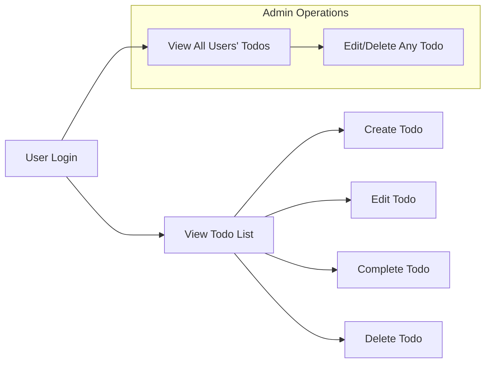

# Core Value Proposition of the Todo List Service

## Essential Features

### Fundamental Functionality
- WHEN a user registers using a valid email and password, THE system SHALL create a secure, individual account and initialize an empty private todo list.
- WHEN a user authenticates successfully, THE system SHALL establish a secure session and allow access only to that user’s personal todos.
- WHEN the user is authenticated, THE system SHALL permit creation, viewing, editing, marking as completed, and deletion of todo items that belong to the signed-in user, with each action transparent and reverting only by explicit user command.
- WHEN a todo is marked as completed, THE system SHALL visually differentiate this item and maintain it in the user’s historical activity, enabling retrieval or permanent deletion only at the user’s request.
- WHEN a todo item is edited, THE system SHALL save changes exactly as entered, retaining its completed/pending state as appropriate unless the edit changes that state.
- WHEN a todo is deleted by its rightful owner, THE system SHALL remove this item with irreversibility and prevent any access to its content thereafter.

### Minimal, Intuitive Design
- WHEN a user is within the application, THE user interface SHALL show only the features required for managing current and historical todos, with no superfluous menus, social elements, or distractions.
- WHEN a user attempts to add or edit a todo, THE system SHALL enforce validation: all todo titles SHALL be mandatory and non-empty, and blank or duplicate todos SHALL trigger a real-time validation error.
- WHEN a user attempts an action on a todo they do not own, THE system SHALL block the operation and provide a clear error message regarding permissions.
- WHEN a session expires or is invalid, THE system SHALL prevent all access to todo data and SHALL require re-authentication before exposing any personal or list data.

## Unique Differentiators

### Privacy-first Personalization
- WHEN a todo is created, viewed, or modified, THE system SHALL ensure that only its creator can perform those actions, except for users with explicit admin rights.
- WHEN an admin signs in, THE system SHALL permit delegated access to view, modify, and delete todos across all users for support and compliance tasks, but SHALL record and audit such actions for transparency.
- WHEN any access attempt occurs from an unauthenticated or guest user, THE system SHALL immediately deny the request, preventing data leakage.

### Ultra-minimalist Scope
- THE system SHALL exclude sharing, tagging, collaboration, or reminder features by design. Each user’s experience SHALL remain focused solely on their individual productivity and private task management.
- WHEN requests are made for unsupported features (e.g., reminders, labels), THE system SHALL return a notice explaining the intentional scope and minimal feature philosophy.

### Data Portability and Reliability
- WHEN required by the user, THE system SHALL provide an export function for the todo list in a common format (e.g., CSV or JSON), ensuring data can be migrated or backed up without vendor lock-in.
- WHEN database or data reliability issues are detected, THE system SHALL log the incident, inform the user with actionable recovery or retry instructions, and prevent further corruption or inconsistency.
- WHEN a user resumes use after logout, device change, or session expiration, THE system SHALL restore all personal todo lists exactly as persisted, with no loss in completeness or order.

## Key Benefits

### Immediate, Undistracted Productivity
- WHEN a user accesses the application, THE default experience SHALL be an immediate presentation of all active todo items, with a single clear call to action for adding, completing, or editing tasks.
- THE user’s focus SHALL be preserved by hiding unnecessary options, content, or notifications unrelated to the core tasks of todo management.
- WHEN a task is added or completed, THE list SHALL update instantly and the application SHALL retain this state across sessions and devices.

### Robust Security and Control
- WHEN the user is authenticated, all personal todo data SHALL be protected by authenticated session security, with explicit privilege separation between normal and admin accounts.
- WHEN the admin actor operates within the application, all admin actions (including bulk deletes or edits on user data) SHALL be strictly recorded, auditable, and limited by access controls.
- WHEN security or session issues occur (such as invalid tokens, suspicious activity, or unauthorized requests), THE system SHALL revoke the session and require fresh authentication before granting any access.

### Predictable User Experience
- WHEN a user switches devices or returns after an absence, THE application SHALL recognize their session or require a new login, restoring todo list state rapidly and accurately on successful authentication.
- THE system SHALL provide consistent functionality and error handling, ensuring users always understand the state of their todo lists and next available actions.

### Strategic Foundation for Expansion
- BY focusing on a core, reliable, minimal todo list engine, THE application SHALL allow business owners and developers to add future enhancements (like notifications, collaboration, analytics) using this stable foundation without requiring disruptive changes to fundamental flows.

---

---

The Todo List service enables users to quickly capture and complete tasks with the least friction possible. Every process, from registration and authentication to todo list manipulation, is constructed for secure, private, and distraction-free use. By emphasizing only the most vital features, and by building in robust session and admin capabilities, the service guarantees user productivity, security, and reliable growth possibilities for the future.