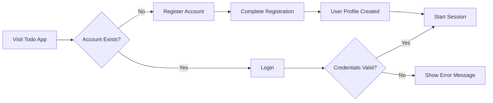
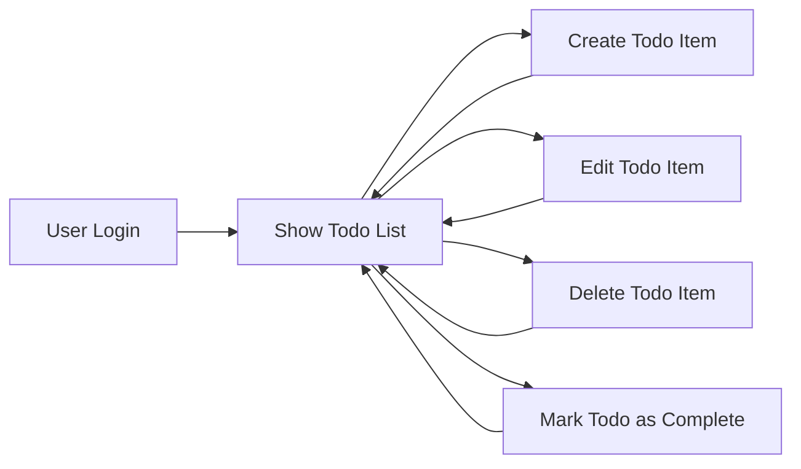
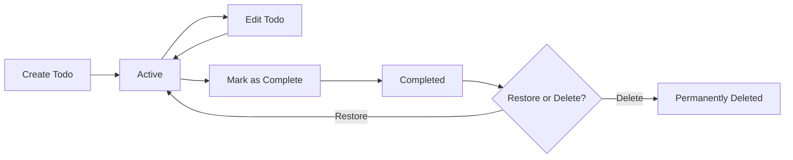
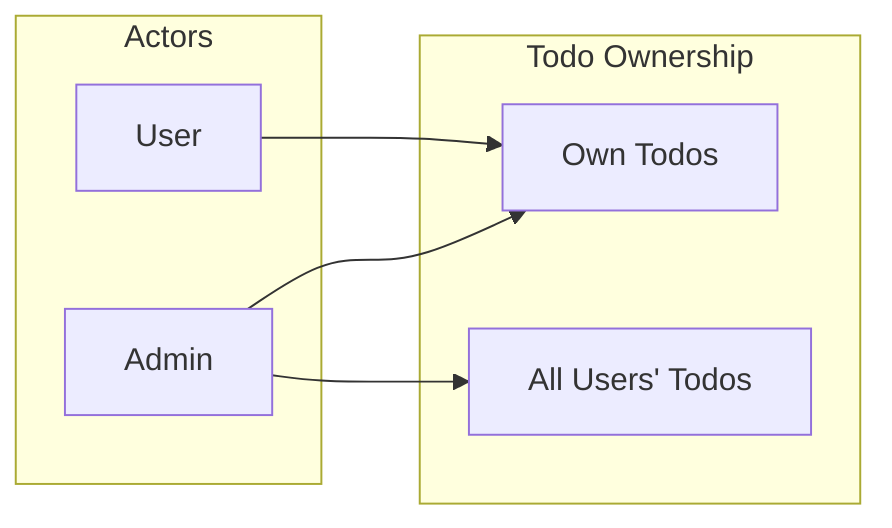

# Todo List Application Requirement Analysis

## User Onboarding

Users are required to register with a valid email and password to access core features. Guest access is not permitted.

- WHEN a new visitor accesses the application, THE system SHALL present options to register or log in.
- THE user SHALL be able to create a new account with a valid email and password only if that address is not already registered.
- WHEN the registration form is submitted, THE system SHALL validate for correct email format, minimum password length (at least 8 characters), and check for duplicates.
- IF validation fails (e.g., duplicate email, invalid email format, short password), THEN THE system SHALL display a specific and actionable error message.
- WHEN registration is successful, THE system SHALL create a unique user profile and begin the first authenticated session automatically.
- WHEN a returning user accesses the login, THE system SHALL allow them to authenticate with their email and password.
- IF login fails (due to incorrect credentials or inactive account), THEN THE system SHALL show precise guidance and a recovery path, including password reset.
- WHEN authentication succeeds, THE system SHALL redirect the user to their personal Todo list.

## Main Service Workflow

Authenticated users interact with the Todo list application as follows:

- WHEN a user is authenticated, THE system SHALL display their own todo list, sorted by most recent items first (descending creation or due date order).
- THE user SHALL be able to create new todos, each requiring a description. Optional fields MAY include due date or priority.
- WHEN the user submits a new todo, THE system SHALL validate presence of a description and immediately display the item in the list.
- THE user SHALL be allowed to view, edit, complete, and delete only their own items.
- WHEN editing a todo, THE system SHALL show an editor pre-filled with the current values and SHALL validate and update the record only if the input passes business rules.
- WHEN a todo is marked as complete, THE system SHALL update its state and may move it to a separate completed section.
- IF the user attempts to operate on (view/edit/delete/complete) another user’s todo (without admin rights), THEN THE system SHALL deny the action and display a specific insufficient permissions message.
- WHEN an admin is authenticated, THE system SHALL allow viewing, editing, and deleting todos belonging to any user for maintenance, support, and moderation.

## Todo Lifecycle

Every todo item passes through lifecycle states.

- WHEN a todo item is created, THE system SHALL associate it with the creator and set its status to “active”.
- WHILE a todo is active, THE creator SHALL be able to edit all fields (description, due date, priority).
- WHEN a todo is marked as completed, THE system SHALL record completion time and update the list to show it in the "completed" section.
- IF system supports restoration, THEN a completed todo MAY be moved back to "active" state at the user’s request, else the action is rejected.
- WHEN a todo is deleted, THE system SHALL remove it from both active and completed lists, and MAY optionally send it to an "archived" or "trash" area for a retention period (configurable, e.g., 30 days), after which it is permanently deleted.
- IF a user tries to edit a completed or deleted todo (without restore), THEN THE system SHALL display a clear rejection message ("Action not supported on completed/deleted todos").
- IF unsupported actions are attempted (e.g., restore deleted, edit another user’s todo), THEN THE system SHALL deny and log the action for audit.

## Access Control Overview

All system access is governed by business requirements for authentication and role-based permissions.

- THE system SHALL restrict all core features (view, add, edit, complete, delete) to authenticated users only.
- WHERE actor: “user”, the system SHALL permit management of only the user’s own todos.
- WHERE actor: “admin”, THE system SHALL grant access to view, modify, and delete todos of any user and perform user support or maintenance actions.
- IF an unauthorized operation is attempted (e.g., edit another’s todo, delete as non-owner), THEN THE system SHALL deny the request, provide a clear feedback message, and log the incident.
- Every todo’s creation, modification, and state transitions SHALL be tracked and attributed (by user ID and timestamp) for audit and accountability.
- THE system SHALL provide business-appropriate rationales when denying actions (e.g., "Users can only modify their own todos").
- All tokens, sessions, and access checks operate strictly on actor identity and permissions, not just authentication state.

## Business Rules and Error Handling

- WHEN creating or editing a todo, THE system SHALL validate that the description is required, and optional metadata follows allowed formats (e.g., due date is a valid date in the future, priority is from allowed set).
- IF an operation violates a rule (e.g., edit after completion, unauthorized delete), THEN THE system SHALL return an actionable, user-friendly error with EARS conditions stated clearly.
- All error messages SHALL specify the actionable path for correction (e.g., “You may only edit your own incomplete todos.”)
- WHEN access is denied, THE system SHALL log enough information for security and auditing, including user ID and attempted action.
- WHEN the application experiences an internal error, THE system SHALL show a general error notification with no technical details, and system administrators SHALL be notified for investigation.

## Summary Table: Main Requirements (EARS Format)

| Condition                                              | System Action                                                                                     |
|--------------------------------------------------------|--------------------------------------------------------------------------------------------------|
| WHEN user is not authenticated                         | SHALL present login/register and restrict access to todos                                         |
| WHEN registration fields are invalid                   | SHALL show user-friendly error message with specific guidance                                     |
| WHEN new todo is created                              | SHALL require description and show it immediately in the user's list                             |
| WHEN user attempts to modify non-owned todo            | SHALL deny and inform user of owner-only permissions                                             |
| WHEN admin accesses all users' todos                   | SHALL allow view/edit/delete of all records                                                      |
| WHEN todo is completed                                | SHALL record time and move to completed section                                                  |
| WHEN completed todo is restored (if supported)         | SHALL move back to active state, else deny                                                       |
| WHEN todo is deleted                                  | SHALL remove from lists, optionally move to archive for retention period before permanent delete |
| WHEN unsupported action is attempted                   | SHALL provide clear denial message and log event for audit                                       |

## Notes
- No API or technical schema details are specified here; all requirements are strictly business- and user-facing in natural language.
- User roles, data validation, workflows, and auditability are described for backend engineers to translate into robust system behaviors.
- Each process is described using EARS format to support precise and testable requirements for development and QA.