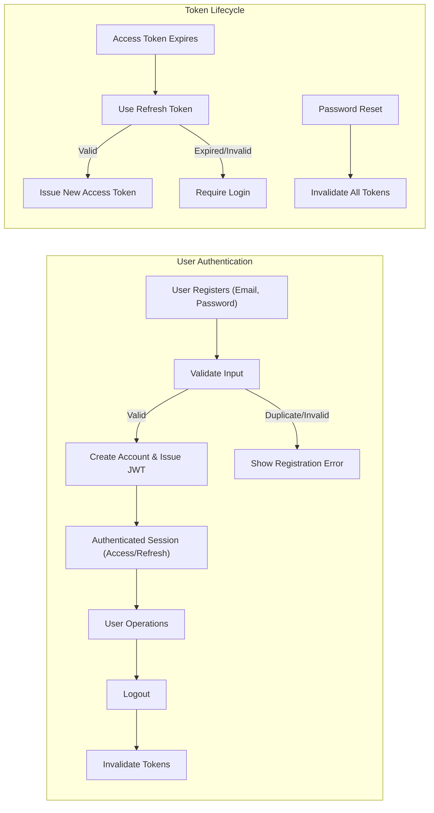

# User Actors and Authentication Requirements for Todo List Application

## 1. User Actor Table

| Actor Name | Description | Capabilities | Restrictions |
|-----------|-------------|--------------|--------------|
| user | A registered user who can create, view, edit, complete, and delete their own todo items. Has access to all basic application functionality. | - Create, view, edit, complete, delete personal todos. - Update personal account. - Request password reset. - Log in/out. | - Cannot access or modify other users' todos. - Cannot manage user/system settings. |
| admin | Application administrator able to manage all users and todos. | - All user capabilities. - Manage any user's todos. - View all user accounts. - Perform maintenance and user management. | - Cannot perform actions restricted by business policy. |

## 2. Core Authentication Flows

Authentication and authorization are enforced for all business functions. All endpoints require valid JWT (JSON Web Token) session. The application implements these flows:

### 2.1 Registration
- WHEN a new user submits valid email and password, THE system SHALL create an account and issue new JWT.
- IF duplicate email detected, THEN THE system SHALL show error and prevent registration.
- WHEN account created, THE system SHALL log in the user and provide access+refresh tokens.

### 2.2 Login
- WHEN user submits correct credentials, THE system SHALL return valid JWT tokens and set session.
- IF authentication fails, THEN THE system SHALL show error without exposing existence of accounts.
- WHEN logout, THE system SHALL invalidate tokens immediately.

### 2.3 Password Reset and Management
- WHEN password reset requested, THE system SHALL email a secure reset token (if registered email supplied).
- WHEN user provides valid reset and new password, THE system SHALL update credentials and expire all prior tokens.
- WHEN password changes, THE system SHALL force logout on all old sessions/tokens.

### 2.4 Token and Session Handling
- THE system SHALL issue JWT access tokens (30 min expiry) and refresh tokens (30 days).
- WHEN access token expires, THE system SHALL allow refresh with valid refresh token, else require full login.
- JWT tokens contain userId, role, permissions in payload.

## 3. Permissions and Restrictions

### For "user"
- THE user SHALL manage only their own todos.
- IF user attempts to access/modify another's data, THEN THE system SHALL return permission denied (no information leak).
- WHEN creating a todo, THE system SHALL link item to user's userId.
- THE user MAY update own account, but SHALL NOT see or edit others'.

### For "admin"
- THE admin SHALL have all user capabilities for own todos AND for all other user's todos.
- THE admin SHALL view/update/delete/complete any user's todo or account.
- IF admin attempts a disallowed action (per future policy), THE system SHALL show a specific business error.

## 4. Security and Token Policies

- JWT tokens used for all stateless authentication and permission checks
- Access token lifespan: 30 min; Refresh token lifespan: 30 days
- JWT fields: userId, role, permissions; signed using secure secret and best-practice rotation
- Tokens must be stored securely on client (prefer httpOnly cookie)
- Logout or password change MUST invalidate *all* tokens for user
- Expired/invalid/forged tokens always denied; security logs maintained
- Authentication errors, lockouts, password resets are securely recorded for review and alerting

## 5. Permission Matrix

| Action | user | admin |
|--------|------|-------|
| Register | ✅ | ❌ |
| Login | ✅ | ✅ |
| Logout | ✅ | ✅ |
| View own todos | ✅ | ✅ |
| Create todo | ✅ | ✅ |
| Edit own todo | ✅ | ✅ |
| Complete own todo | ✅ | ✅ |
| Delete own todo | ✅ | ✅ |
| View any user's todos | ❌ | ✅ |
| Edit any user's todo | ❌ | ✅ |
| Complete any user's todo | ❌ | ✅ |
| Delete any user's todo | ❌ | ✅ |
| Manage all users | ❌ | ✅ |
| Initiate password reset | ✅ | ✅ |
| Change password | ✅ | ✅ |

## 6. Business Requirements (EARS Format)

- WHEN a new user registers, THE system SHALL validate the email/password strictly and issue session tokens.
- WHEN a user logs in, THE system SHALL issue signed JWT with userId, role, permissions.
- IF login fails, THEN THE system SHALL show generic error with no sensitive details.
- WHEN access token expires, THE system SHALL permit session refresh using valid refresh token only.
- IF refresh token is expired/invalid, THEN THE system SHALL require reauthentication.
- WHEN user tries to access another user's todo or data, THE system SHALL reject with permission-denied and no data leakage.
- WHEN admin accesses any user's todo/data, THE system SHALL allow all capabilities unless restricted by explicit policy.
- WHEN logout or password change completes, THE system SHALL invalidate all tokens (access and refresh) and close sessions.
- WHEN repeated logins fail, THE system SHALL lock the account for security and require account recovery.
- WHEN password reset is requested, THE system SHALL email a one-time secure reset token and enforce expiration.
- THE system SHALL never reveal user existence details in authentication error messages.

## 7. Authentication Flow (Mermaid Diagram)

## 8. Error and Edge Case Handling

- Unauthorized operations result in access denied and security log entry
- Tampered or duplicated tokens force immediate session revocation and forensic logging
- Repeated login failures trigger lockout and alert recovery workflow

## 9. Performance and Compliance

- System response to authentication and authorization actions must be under 2 seconds
- All critical actions, errors, and suspicious activities are logged for compliance & audit
- User data and session management comply with privacy/data security regulations
