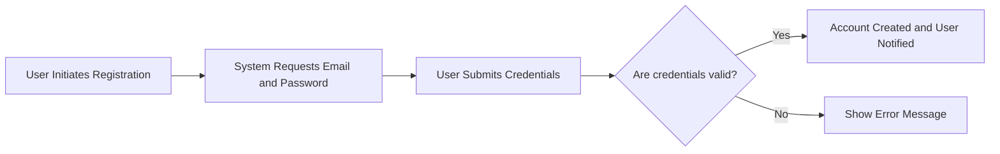
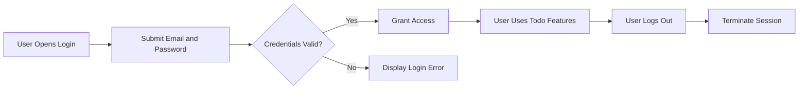
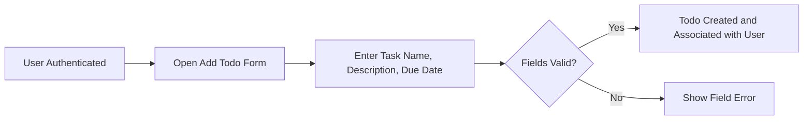
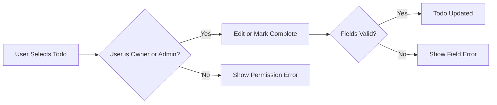
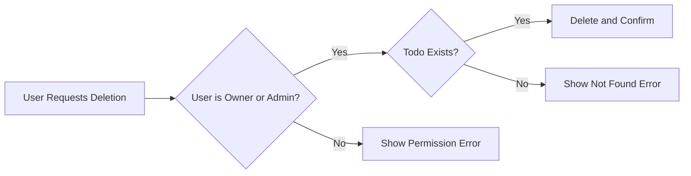

# Todo List Service — Minimum Business Requirements

## 1. Introduction and Scope
The Todo List Service enables individual users to manage personal tasks efficiently. This requirements document covers only the minimum feature set necessary for a working, secure, multi-user Todo list, capturing essential business rules, error handling, and security from a backend development perspective. It is platform-agnostic and does NOT specify database or API implementation details.

## 2. User Actors and Roles
| Actor | Description                                  |
|-------|----------------------------------------------|
| user  | Regular member; can manage their own todos   |
| admin | Administrator; full access to all user todos |

- Registration is allowed ONLY for 'user' (member) role.
- 'admin' accounts may only be set up by system operators (not via regular flows).

## 3. Main User Journeys and Scenarios

### 3.1 Registration
- WHEN a new visitor attempts to register, THE system SHALL collect a valid email and password.
- WHEN data is submitted, THE system SHALL validate: email format, unique email, and password is ≥8 characters.
- IF the email already exists, THEN THE system SHALL reject the registration with a specific error (no generic failures).
- IF registration data fails validation, THEN THE system SHALL show the exact validation issue.
- Registration is only available to unauthenticated actors.

### 3.2 Login and Logout
- WHEN an existing user provides valid email and password, THE system SHALL authenticate and issue a secure session token.
- IF authentication fails, THEN THE system SHALL give a generic error message only (no hint which field is wrong).
- WHEN an authenticated user logs out, THE system SHALL invalidate their session and notify them.
- WHEN a user session is inactive for 30 days, THE system SHALL expire and require login.
- IF an account is locked or deactivated, THEN THE system SHALL prevent new sessions and inform the user.

### 3.3 Creating Todo Items
- WHEN a logged-in user creates a todo, THE system SHALL require a non-empty name (max 100 characters), optional description (≤500), and optional due date (today or future).
- WHEN valid, THE system SHALL associate the todo with the current user's account.
- IF invalid or required fields are missing, THEN THE system SHALL reject with actionable errors.
- IF a 'user' tries to create for another user, THE system SHALL deny (permissions error). 'admin' may create todos for anyone.

### 3.4 Completing and Editing Todos
- WHEN a user marks their own todo complete, THE system SHALL record the completion and timestamp.
- WHEN editing, THE system SHALL apply identical validation as creation.
- IF user edits or completes someone else's todo (and is not admin), THE system SHALL deny with a permissions error.
- Admin may edit/complete any todo, and editing completed todos is allowed.

### 3.5 Deleting Todos
- WHEN a user requests to delete their todo, THE system SHALL remove and confirm deletion.
- IF attempting to delete another’s todo without admin status, THE system SHALL reject with a permissions error.
- IF target todo does not exist/is already deleted, THE system SHALL show a not-found error.
- Admin may delete any todo.

## 4. Permission Matrix
| Operation                                | user (member) | admin |
|-------------------------------------------|:-------------:|:-----:|
| Register own account                      |      ✅       |  ❌   |
| Login/Logout                              |      ✅       |  ✅   |
| Create Todo (self)                        |      ✅       |  ✅   |
| Create Todo (other users)                 |      ❌       |  ✅   |
| Complete/Edit Todo (self)                 |      ✅       |  ✅   |
| Complete/Edit Todo (others)               |      ❌       |  ✅   |
| Delete Todo (self)                        |      ✅       |  ✅   |
| Delete Todo (others)                      |      ❌       |  ✅   |

## 5. Business Requirements (EARS Format)
- WHEN any operation is denied due to permissions, THE system SHALL respond with a clear permissions error.
- WHEN users submit overly long fields, THE system SHALL reject and specify the maximum allowed length.
- WHEN account authentication token is missing or expired, THE system SHALL require login before accessing any personal data.
- WHEN the system detects repeated failed login attempts, THE system SHALL temporarily lock the account and notify the user.
- WHEN a registration attempt omits required fields or provides invalid data, THE system SHALL explain exactly what field is at fault.
- WHEN an admin performs any supported action, THE system SHALL always permit unless the target todo cannot be found.
- WHEN a network/system error prevents an operation, THE system SHALL display a retry or failure message to the user.

## 6. Workflow Mermaid Diagrams

### 6.1 Registration Flow

### 6.2 Login & Logout Flow

### 6.3 Creating a Todo Item

### 6.4 Completing/Editing a Todo Item

### 6.5 Deleting a Todo Item

## 7. Comprehensive Error & Edge Scenarios
- IF a registration request omits required fields or format validation fails, THEN THE system SHALL specify the field issue explicitly.
- IF failed login attempts exceed the allowed limit, THEN THE system SHALL lock the account temporarily and deliver a lockout notice to the user.
- IF session token has expired or is missing, THEN THE system SHALL request login before allowing any access to personal todos.
- IF input data is too long for any field, THEN THE system SHALL provide a maximum length error.
- IF a network or server error blocks a todo operation, THEN THE system SHALL explain the error and recommend retrying.
- IF an admin attempts an operation, THE system SHALL allow unless the target todo is non-existent.

## 8. Out-of-Scope Topics for Minimal Implementation
- Bulk operations (e.g. mass deletion, import/export)
- Notifications or reminders (including third-party integrations)
- User profile management beyond registration and credentials
- Todo labels, tags, or prioritization mechanisms
- Any API or database schema specification or technical implementation detail

## 9. Success Metrics & Minimal Feature Completion
- Successful registration, login, and session flows per all rules above
- CRUD operations for todo items, enforcing all validations and permissions
- All user and admin actions logged for audit, with error conditions traceable
- Minimum requirement: system prevents all unauthorized access and handles business rule errors with actionable messages