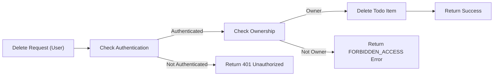
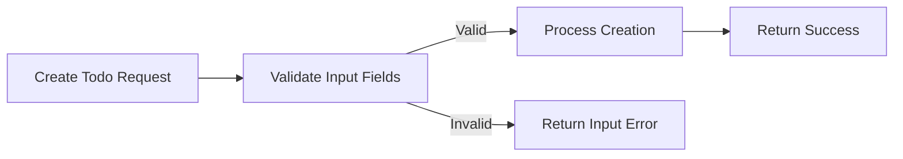

# Special and Exception Scenarios for Todo List Application

## Introduction
Special scenarios, exception flows, and edge cases in the Todo List application are explicitly defined to ensure robust, user-friendly, and predictable operation. The system provides clear, actionable guidance for backend developers to handle all non-standard interactions reliably. Each business requirement is written using EARS format to support verifiable outcomes and strong testability. This document covers bulk usage, validation and error handling, feedback, and system-wide exceptions with concrete examples and implementation-ready requirements.

## 1. Bulk Operations (if supported)
Bulk operations enable users to efficiently complete or delete multiple todo items at once, balancing productivity with safety and simplicity. Supported operations are strictly limited.

### 1.1 Supported Bulk Actions
- Completing multiple todo items simultaneously
- Deleting multiple todo items simultaneously
  - Only allowed if all specified todo item IDs exist and belong to the requesting user
  - Admins may bulk-delete any items without ownership restriction, but all IDs must be valid
  - Maximum bulk operation size is 50 items

### 1.2 EARS Bulk Operations Requirements
- WHEN a user initiates a bulk completion request,
  THE system SHALL check that all provided todo IDs exist and are owned by the user; if not,
  THE system SHALL fail the operation and identify the first failing item in the error message.
- WHEN a user initiates a bulk delete request,
  THE system SHALL ensure all targeted todos exist and belong to the user (or user is admin);
  IF any todo is invalid or inaccessible,
  THE system SHALL reject the operation and provide a precise error message.
- WHEN a bulk operation contains more than 50 items,
  THE system SHALL reject the request and state the maximum limit exceeded.
- WHEN an admin initiates a bulk operation,
  THE system SHALL bypass per-item ownership checks but still require all items be valid IDs.

### 1.3 Example
A user selects 20 todo items that they own and requests completion. The system validates ownership and existence, updates completion status in bulk, and provides a success summary. If 1 of the 20 items does not exist, the operation fails and the response states: "Todo item not found: ID 1732".

## 2. Handling Invalid Input
User input validation ensures system reliability and user understanding. All input is strictly checked per business rules.

### 2.1 Validation Scenarios
- Titles must not be empty or whitespace only
- Todo IDs must follow valid format (e.g., UUID)
- All required fields must be present in the request
- Due dates, if provided, must be in the future and ISO 8601 format
- Unknown/extraneous fields are either ignored or rejected if security risk suspected

### 2.2 EARS Input Validation Requirements
- WHEN a create or update request contains an empty or whitespace-only title,
  THE system SHALL reject the request and return error: "Title cannot be empty."
- WHEN a request contains a todo item ID with invalid format,
  THE system SHALL reject the request and explain: "Invalid todo item ID format."
- WHEN a required field such as 'title' is missing from the request,
  THE system SHALL reject the request and include: "Missing required field: title."
- WHEN a due date is supplied, IF the date is not in the future or not ISO 8601,
  THE system SHALL reject the request with error: "Invalid due date. Must be a future ISO 8601 date."
- WHEN extraneous fields are present in the request body,
  THE system SHALL process valid fields and ignore others except when security risk is detected, in which case the request SHALL be rejected and a relevant message provided.

### 2.3 Example
User tries to create a todo with no title. System responds: "Missing required field: title."
User submits a todo with due date "2021-01-01" (in past). System: "Invalid due date. Must be a future ISO 8601 date."

## 3. Error and Exception Flows
All error conditions are handled with explicit messages, error codes, and standard HTTP responses. The system always provides clear, actionable feedback for all operational errors.

### 3.1 Not Found, Forbidden, Unauthorized
- WHEN a user queries, updates, completes, or deletes a todo that does not exist,
  THE system SHALL return error code TODO_NOT_FOUND and message: "Todo item not found."
- WHEN a user tries to act on a todo not owned by them,
  THE system SHALL return: error code FORBIDDEN_ACCESS and message: "Access denied to this todo item."
- WHEN a user performs any todo operation while not authenticated,
  THE system SHALL return HTTP 401 Unauthorized and message: "Authentication required."

### 3.2 Zero-change & Rate Limiting
- WHEN a request produces zero effective change (e.g., updating with same title),
  THE system SHALL return success with message: "No changes detected. Todo remains the same."
- WHEN a user exceeds permitted request rate,
  THE system SHALL return HTTP 429 Too Many Requests and include information about retry timing.

### 3.3 Server Errors
- WHEN any operation encounters an unforeseen server error,
  THE system SHALL return HTTP 500 with message: "An unexpected error occurred. Please try again later."

### 3.4 Examples
User attempts to delete a todo not owned by them: System responds with code FORBIDDEN_ACCESS, message "Access denied to this todo item."
Non-authenticated user issues any todo operation: System responds HTTP 401 Unauthorized.

## 4. User Feedback Scenarios
User feedback is designed to be understandable, actionable, and not expose sensitive system details.

### 4.1 Error Messaging
- All errors include a human-readable explanation, an error code (if applicable), and no technical details beyond what the user needs to know.

### 4.2 EARS User Feedback Requirements
- WHEN an error occurs,
  THE system SHALL provide a human-readable message and, where applicable, an error code.
- WHEN a previously failed operation is retried and succeeds,
  THE system SHALL confirm the success and reference the previous failure resolved.
- WHEN an error occurs,
  THE system SHALL log the error details internally (including technical diagnostics), but SHALL expose only user-oriented feedback to the end user.

### 4.3 Examples
User resubmits a corrected todo after prior failure: System: "Todo updated successfully. Previous date error has been resolved."

## 5. Mermaid Diagrams for Exception Flows

## 6. Summary
This document provides complete, specific, and testable requirements for all special scenarios, errors, and exception conditions in the Todo List application. All requirements are actionable for backend developers, specified in EARS format, and immediately ready for use in implementation and testing of robust, user-friendly behavior.