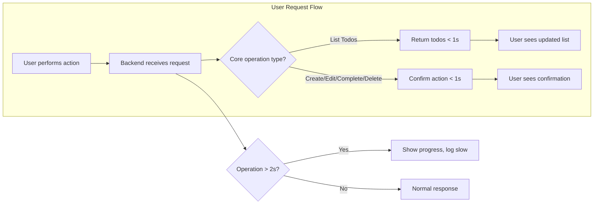

# Performance Requirements for Todo List Application

## Introduction

For the Todo List application, the system's performance directly shapes user satisfaction and reliability perceptions. Users expect rapid and consistent responses to all todo-related actions, reflecting real-time changes without perceivable delay. Performance requirements defined here set the minimum acceptable standards by which the backend will be architected, deployed, and validated. These requirements are written using the EARS methodology, providing actionable, testable business expectations that directly support backend engineering, testing, and operations.

## Response Time Expectations

- WHEN a user views, creates, edits, completes, or deletes a todo item, THE system SHALL complete the requested operation and return all relevant data (updated lists, new/edited item data, confirmation) within 1 second under normal load (up to 100 todos per user).
- WHEN a backend operation requires more than 2 seconds to complete, THE system SHALL provide a visible progress indicator to the user and initiate background logging for diagnostics.
- WHEN a backend operation fails to complete in 2 seconds due to network or server delay, THE system SHALL notify the user of the delay and present the option to retry.
- WHEN the system successfully completes any backend request, THE user SHALL receive confirmation with the latest, updated data set immediately reflected in the UI.

## Data Consistency

- WHEN a user performs any create, update, complete, or delete action on a todo, THE system SHALL guarantee that all future reads return the most recent (current) version of their todo data without delay.
- WHEN multiple authorized actors operate on the same todo dataset (e.g., user and admin), THE system SHALL always reflect the most accurate and current data after any modification.
- WHEN a backend failure or partial update occurs, THE system SHALL prevent presentation of stale, partially-saved, or inconsistent data to any user and SHALL return a clear, actionable error message.
- WHEN users are authenticated and logged in, THE system SHALL ensure all their todo actions are executed atomically and never result in intermediate or partially-committed data states.

## Throughput and Simultaneous User Load

- WHEN up to 100 concurrent authenticated users perform todo operations, THE system SHALL maintain the response time requirements for all actions (view, create, edit, complete, delete) outlined above, without performance degradation for individual users.
- WHEN transient spikes in traffic occur, THE system SHALL queue incoming requests transparently and complete each user's action within 3 seconds maximum, except in documented outage scenarios.
- WHEN administrative bulk operations (such as an admin viewing/managing multiple users' todos) are performed, THE system SHALL process batched requests at a rate of at least 10 operations per second, and each request in a batch SHALL be confirmed or failed within 2 seconds.

## System Availability

- WHEN unplanned downtime or maintenance is required, THE system SHALL notify all active users in advance whenever possible and restore regular operations as quickly as practical.
- THE system SHALL achieve at least 99.5% uptime each calendar month, excluding scheduled and properly announced maintenance.
- WHEN an unexpected outage occurs, THE system SHALL provide real-time service status to users, ensure no data loss or corruption occurs, and resume all business operations automatically on recovery.

## Performance Acceptance Criteria

- All core actions (list, create, edit, complete, delete) SHALL meet sub-1-second response times for up to 100 concurrent users.
- Data consistency SHALL be immediate and atomic with no exposure of stale or partially-updated information.
- The Todo List service SHALL transparently scale to support concurrent loads and maintain all individual user SLAs as specified.
- Monthly uptime SHALL exceed 99.5%, excluding maintenance, with prompt user notification for downtime events.
- System SHALL recover automatically from transient infrastructure issues, with all business processes resuming as soon as dependencies are available.

## Performance Workflow Diagram

## Summary

This document provides comprehensive, explicit performance standards for the Todo List application's backend, establishing clear, testable commitments to response speed, consistency, concurrency, and availability. Backend engineers, testers, and operators SHALL use this specification to design, validate, and monitor all core backend services throughout the application's lifecycle.