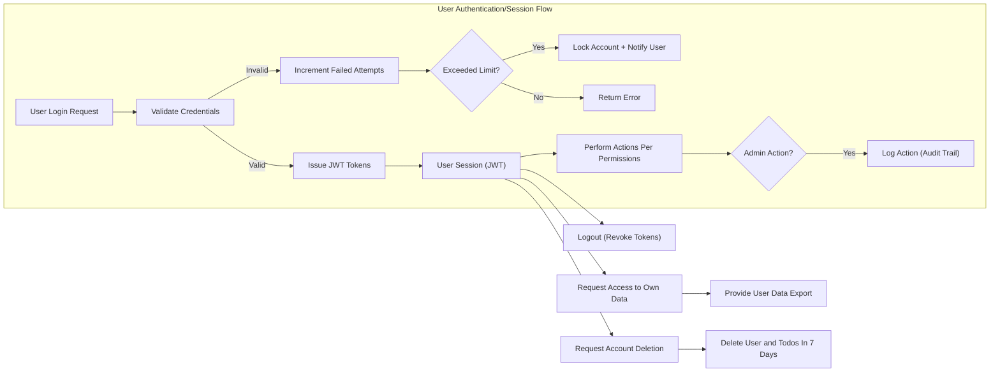

# Security and Compliance Requirements for the Todo List Service

## 1. Authentication Security

### 1.1 General Principles
- WHEN any user (of any role, including admin) attempts an operation within the system, THE "todoApp" system SHALL require that the user is properly authenticated using secure, established authentication methods.
- WHEN a user session is active, THE session SHALL be managed using secure, signed JWT tokens stored in accordance with best security practices.

### 1.2 Password Management
- WHEN a user sets or resets a password, THE system SHALL enforce all of the following: minimum 8 total characters, at least one letter, and at least one number.
- WHEN a password is changed or set, THE system SHALL hash and salt the password using an industry-recognized cryptographically secure algorithm, and never store plaintext secrets.
- WHEN password reset operations are performed, THE system SHALL verify user identity through email or other trusted channels and log the event for traceability.

### 1.3 Brute-force and Account Takeover Protection
- WHEN 5 consecutive failed login attempts from any user occur within a 15-minute window, THE system SHALL automatically lock the account for 10 minutes, send a notification to the user’s registered email, and on future login attempts, display a clear message explaining the account lock status.

### 1.4 Session and Token Security
- THE system SHALL use access tokens (JWT) that expire within 30 minutes, and refresh tokens that expire no later than 14 days after issuance.
- WHEN any session token (access or refresh) expires, THE system SHALL require re-authentication; expired tokens SHALL be irrevocable and invalid for further use.
- WHEN a user logs out, THE system SHALL immediately revoke all tokens associated with that session.
- THE JWT signing secret or private key SHALL be managed separately from the application codebase and must never be exposed through logs or process inspection.

### 1.5 Permission Model and Least Privilege
- WHEN a user requests an action that is outside their allowed permissions (for example, attempting to read or modify another user’s todo), THE system SHALL deny the operation, log the attempt, and clearly notify the user of insufficient access rights.
- WHERE the acting user has the role "admin", THE system SHALL allow full access to all todo items and administrative actions; WHERE the acting user is a standard "user", THE system SHALL strictly restrict data access and operations to only that user’s own content.

### 1.6 Transport Layer Security (TLS)
- THE system SHALL require all traffic between client and server as HTTPS, never plain HTTP.
- WHEN HTTP requests are received, THE system SHALL redirect these as HTTPS and log the attempt as a low-risk but reportable security event.

### 1.7 Multi-Factor Authentication (MFA) [Optional/Future]
- WHERE multi-factor authentication is enabled, THE system SHALL require an additional step for admin logins and SHALL support extensibility for broader MFA adoption in the future.

---

## 2. Privacy by Design

### 2.1 Data Minimization and Purpose Limitation
- THE system SHALL only collect the minimum personal information necessary to enable core todo list functionality (specifically: email, password, and optional display name).
- WHEN introducing requests for additional information or attributes, THE system SHALL provide an explicit reason and obtain user consent before any extra data collection occurs.

### 2.2 Consent and Transparency
- THE system SHALL present a privacy notice at registration and in account settings, clearly outlining what information is collected, its purpose, how it is used, and how long it will be kept.
- WHEN explicit consent is required, THE system SHALL record the user’s consent with date, time, and specific content, and retain these logs securely.

### 2.3 Right of Access and Erasure
- WHEN a user requests access to their data, THE system SHALL provide a copy of all personal and todo-related information in a readable, portable format within 30 days.
- WHEN a user requests account deletion, THE system SHALL delete all personal data and associated todo items within 7 days except as required for legal or regulatory retention, and provide confirmation to the user.

### 2.4 User Data Isolation and Admin Controls
- WHERE users are registered in the platform, THE system SHALL strictly isolate all user data such that only the data owner (or authorized admin) may access or modify their own items.
- WHERE an administrator performs actions that access user data, THE system SHALL log such operations with actor, affected user, timestamp, and action type for traceability.

---

## 3. Data Retention Policy

### 3.1 Retention Duration and Rules
- THE system SHALL retain user todo data for as long as the account is active and user consent is maintained.
- WHEN a user deletes their account, THE system SHALL permanently and irreversibly delete all personal and todo data within 7 days unless local law requires otherwise. No backup shall be kept longer than 30 days from account deletion.

### 3.2 Backup and Recovery
- THE system SHALL ensure that backups including any user data are retained no longer than 30 days after account deletion and are used solely for recovery from catastrophic failure or accidental deletion.
- WHEN user data backups are restored, THE system SHALL restore only affected user data and log recovery events with actor and reason.

### 3.3 Logging and Audit Trails
- THE system SHALL maintain security and operations logs (including access, permission violations, token use, and admin activity) for at least 90 days.
- WHEN any log may include personal data, THE system SHALL pseudonymize or redact sensitive information to minimize privacy exposure in the case of log access.

---

## 4. Compliance Considerations

### 4.1 Regulatory Compliance
- WHERE users or data are subject to European GDPR, California CCPA, or similar regional regulations, THE system SHALL, by default, apply protections for consent, access, and data erasure that meet or exceed the strictest requirement present.
- WHERE required by local or regional law to notify in the event of breach, THE system SHALL notify affected users within 72 hours and provide actionable recommendations.

### 4.2 Third-Party Services and Data Sharing
- WHEN integrating with any external vendor (e.g., mail delivery, analytics), THE system SHALL transmit only the minimum necessary personal data for that function and ensure that the third party attests to a privacy policy meeting or exceeding that of the "todoApp" system.
- THE system SHALL maintain a public, regularly updated list of all third-party service providers who may access stored user data.

---

## 5. Security and Privacy Workflow Diagram

---

## 6. Summary of Key Security and Privacy Requirements

- All authentication, session, and permission systems SHALL default to least privilege, deny by default, and full traceability.
- All personal data collection and processing SHALL be minimized, transparent, and consented to; access and erasure rights are clearly supported and audited.
- Session tokens are time-limited; expired or revoked tokens must be unusable; logout operations always invalidate tokens immediately.
- All data transmissions must use TLS (HTTPS); insecure requests are redirected and logged as security events.
- Logging, auditing, and admin access to data is always recorded, and critical operations are logged for at least 90 days.
- GDPR, CCPA, and other regional privacy safeguards are enforced for all users; breach notification policy ensures affected users are notified rapidly.
- Integrations with third-party providers transmit only minimum required data and are subject to equivalent privacy/security agreements.

---

This set of requirements is written in natural language and EARS format to guide backend application developers in implementing a secure, privacy-conscious, and regulation-compliant Todo application. All features, workflows, and user interactions must conform to these security and privacy mandates as a fundamental part of system functionality.