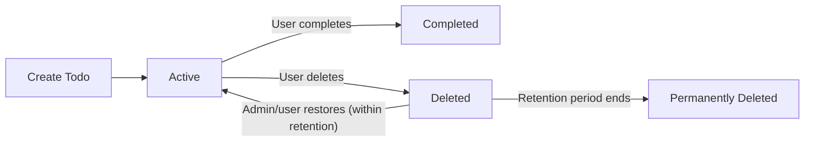

# Todo List Application — Business Requirements and Constraints

## 1. Todo Item State Lifecycle

Every Todo item SHALL exist in exactly one of three business-defined states at any given time:
- "Active": Pending completion; actionable by the owner.
- "Completed": Marked finished by the actor who owns the item or by an admin. Immutable after completion.
- "Deleted": Marked removed and hidden from standard active lists, but retained for 30-day recovery period. Not immediately erased.

### 1.1 State Transitions (EARS Format)
- WHEN a user creates a Todo, THE item SHALL begin in the "Active" state.
- WHEN a user marks a Todo as completed, THE item SHALL move to "Completed".
- WHEN a user deletes a Todo, THE item SHALL move to "Deleted" and remain recoverable for a 30-day window.
- WHEN the 30-day retention ends, THE system SHALL permanently erase the item so it is inaccessible and non-recoverable.
- WHEN a Todo in "Deleted" is restored by owner or admin within 30 days, THE item SHALL return to "Active" with previous content.
- IF a user attempts to edit or complete a "Deleted" or "Completed" Todo, THEN THE system SHALL deny the action and show an actionable error.

### 1.2 State Transition Rules
- WHERE an item is "Deleted" but within retention, THE owner SHALL be permitted to restore to "Active".
- WHERE an item is "Completed", THE owner SHALL ONLY be able to view (not modify).

### 1.3 Mermaid Diagram: Todo Item Lifecycle

## 2. Validation Rules and Limits

### 2.1 Field Validation (EARS Format)
#### Title
- THE title field SHALL be mandatory for each Todo item.
- THE title SHALL consist of 1-100 characters of non-blank text.
- IF user submits empty or whitespace for title, THEN THE system SHALL reject the item creation/edit and display an error.
#### Description
- THE description field SHALL be optional.
- WHERE given, THE description SHALL be ≤ 1,000 characters.
#### Due Date
- WHERE provided, THE due date SHALL be a valid date in the future.
- IF not provided, THE Todo SHALL have no deadline.
- IF user tries to set a due date to a past date, THEN THE system SHALL deny with actionable error.

### 2.2 User-specific and Uniqueness Limits
- THE system SHALL allow a maximum of 1,000 Active Todos per user at any time.
- IF user at maximum, THEN THE system SHALL deny further creations and specify the reason.
- EACH Todo SHALL have a unique title among the user’s active Todos.
- EACH Todo SHALL be owned by one user; no shared ownership except by admin action in business-justified scenarios.

## 3. Operational Constraints (Business Only)

### 3.1 Ownership, Access, Permissions
- ONLY the Todo owner (or admins) SHALL have permission to modify, complete, or delete the Todo.
- Admins SHALL have access to all Todo items and all operations for compliance or support.
- WHERE a user deletes a Todo, THE item SHALL disappear from active lists and be visible only in deleted views (if product supports this).

### 3.2 Completion and Editing Restrictions
- IF a Todo is "Completed", THEN users SHALL be unable to re-complete or edit, but may view.
- IF a Todo is "Deleted", THEN no edits or completion permitted unless restored.

### 3.3 Retention, Archiving, Data Loss Prevention
- Deleted Todos SHALL be retained 30 days before permanent erasure.
- Restore operation during this window SHALL return status to "Active" with content preserved.
- AFTER 30 days, THE system SHALL permanently erase, disallowing all access.

### 3.4 Error Handling and Edge Cases
- IF user/admin acts outside permissions or state rules, THEN THE system SHALL report specific error per item.
- IN batch operations, THE system SHALL process permitted items, reject forbidden ones, and provide per-item error feedback.
- IF maintenance, system error, or rule failure occurs, THEN THE user SHALL see a clear, actionable message with no technical jargon.

## 4. Summary Table: States and Transitions
| State        | Possible Transitions                                        | Actors       |
|--------------|------------------------------------------------------------|--------------|
| Active       | Complete, Delete                                           | Owner/Admin  |
| Completed    | View only                                                  | Owner/Admin  |
| Deleted      | Restore (≤30d), Permanent delete (after 30d)               | Owner/Admin  |
| Permanently Deleted | None                                                | System       |

## 5. Additional Business Rules

- All state transition, permission, and retention rules APPLY equally to bulk operations, with individual rule enforcement and error reporting.
- THE system SHALL audit all state changes for compliance and troubleshooting.

---

> All requirements herein must be interpreted as business needs. Technical details (schema, APIs, database) are defined in the next phase.