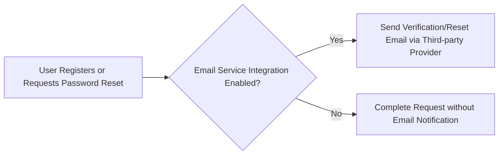

# External Integrations Requirements for todoApp

## Introduction
TodoApp is designed as a standalone service focusing on robust, reliable todo management. The service is intended to operate effectively with the absolute minimum of external dependencies, in alignment with the vision for simplicity, reliability, and privacy. This requirements specification details current and foreseeable integration requirements involving external third-party services—framed to ensure the service is both lean at launch and extensible for future business and user needs.

## Third-Party Service Integration Requirements
- WHEN the application is deployed for the first release, THE todoApp SHALL NOT depend on any third-party integrations for its core todo management functionality.
- WHERE functionality such as account registration or password recovery is required, THE todoApp SHALL support the option to integrate with an external transactional email service for delivering critical user notifications, such as account verification and password reset emails.
- IF legal compliance (such as audit logging or regulatory record-keeping) becomes a requirement, THEN THE todoApp SHALL be extensible to support integration with compliance or auditing platforms, ensuring all business rules and legal obligations can be satisfied.
- THE todoApp SHALL NOT implement or require analytic, advertisement, cloud storage, or push/SMS/in-app notification integrations for the minimum viable release.

## Conditional Email Notification Workflows
- WHEN users are required to verify their email account, AND email delivery is enabled, THE system SHALL send a verification email through a designated external transactional email service. Otherwise, the verification flow SHALL be completed without email notification.
- WHEN a user requests a password reset, AND email delivery is enabled, THE system SHALL transmit a one-time password reset link or token via a configured external email provider.
- THE only supported notifications in the minimum specification SHALL be user-initiated, critical events (account registration verification, password reset). No promotional or marketing notifications SHALL be supported.
- WHEN sending any critical notification, THE system SHALL log the notification transaction results (success/failure) for later troubleshooting and business audit purposes.

### Mermaid Diagram: Conditional Email Integration

## Notification Requirements & Limitations
- THE todoApp SHALL operate without notification functionality if no integration is enabled.
- WHERE email delivery is supported and enabled, ONLY user-triggered notifications related to security or access SHALL be permitted.
- THE todoApp SHALL NOT support automated reminders, push notifications, SMS, or in-app notifications for the minimal product launch.
- THE service SHALL log the outcome of attempted notifications where implemented, enabling basic trouble analysis and business oversight.

## Data Security and Compliance for Integrations
- WHERE integration with external services is configured, THE todoApp SHALL require proper encryption and data-protection for any user information transmitted outside the core system, following industry best practice and local regulatory standards.
- WHEN a new integration is added, THE system SHALL undergo privacy and security review to assess risks and adherence to applicable compliance standards.
- WHERE external communication involves personal user data, consent and relevant notices SHALL be provided to users in accordance with prevailing privacy regulations.

## Future Integration Extensibility
- THE system architecture SHALL enable external service integrations to be added or removed at deployment time without impacting core functionality or causing service downtime.
- All business-critical data (such as todo items, users, and completion status) SHALL always be stored within the todoApp's own controlled data environment and protected independently of any third-party services.
- WHEN additional integrations for analytics, cloud storage, or authentication are required by new business needs, THE todoApp SHALL allow independent configuration of each integration so that disabling any integration does not compromise the ability to use or manage todos.
- THE service SHALL provide comprehensive documentation of all current and planned integrations in an external integration register for developer reference.

## Integration Principles and Governance
- Every external integration SHALL be optional, independently configurable, and must never be a runtime requirement for baseline use of the todo application.
- The todoApp's build and deployment pipeline SHALL allow for the enabling or disabling of integrations via configuration without changing business logic code.
- Integration with external vendors SHALL require a change record and business review before going live, with results documented for future audit and compliance needs.
- Ongoing review of integration impact on service stability, privacy, compliance, and user experience SHALL be conducted regularly as the todoApp evolves.

## Summary
TodoApp will operate as a fully functional, self-contained todo management system for its minimum viable product release. The only supported external integration at launch—if enabled—will be for email notification related to critical user-initiated workflows. All other integrations are considered future enhancements and must follow the specified business principles for modularity, security, user privacy, documentation, and auditable governance. The service is engineered for business agility and compliance, never compromising core functionality or user control regardless of integration status.