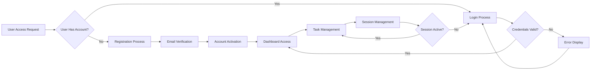

# Todo List Application - User Roles and Authentication Requirements

## User Role Definitions

### Primary User Role: User

The Todo list application implements a single user role designed for personal task management. This role-based architecture ensures simplicity while maintaining security and data isolation.

**Role Name**: User  
**Role Type**: Member  
**Primary Purpose**: Personal task management and organization  
**Target Audience**: Individuals seeking simple task tracking functionality  

### User Role Characteristics

The User role encompasses individuals who need to manage personal tasks through the Todo list application. This role is designed for:

- Personal productivity management
- Individual task tracking and organization
- Self-contained task management without collaboration features
- Simplified user experience focused on core functionality

**User Profile Attributes**:
- Unique user identification for data isolation
- Personal task workspace with complete ownership
- Authentication credentials for secure access
- Session management for continued usage

## Authentication Requirements

### Core Authentication Functions

The authentication system provides secure access control while maintaining simplicity for non-technical users. The system implements industry-standard practices without unnecessary complexity.

#### User Registration
WHEN a new user wants to create an account, THE system SHALL provide a registration process that requires:
- Valid email address for account identification
- Secure password creation with strength validation
- Email verification to confirm account ownership
- Automatic account activation upon successful verification

#### User Login
WHEN a registered user wants to access their tasks, THE system SHALL authenticate users through:
- Email and password credential validation
- Session token generation for authenticated state
- Secure session management with appropriate timeout
- Remember me functionality for convenience

#### Session Management
WHILE a user is logged in, THE system SHALL maintain:
- Active session state across application usage
- Secure token storage and transmission
- Automatic session refresh for continued access
- Session invalidation upon logout or timeout

#### Password Recovery
IF a user forgets their password, THEN THE system SHALL provide:
- Secure password reset process via email
- Time-limited reset token generation
- Password strength validation during reset
- Notification of password change completion

#### Account Security
THE system SHALL implement security measures including:
- Password encryption using industry-standard hashing
- Protection against brute force attacks
- Session hijacking prevention
- Secure credential transmission

### Authentication Flow

## Permission Structure

### Permission Matrix

The application implements a straightforward permission structure focused on personal task management. Each user has complete control over their own tasks while being restricted from accessing other users' data.

| Action | User Role | Description |
|--------|-----------|-------------|
| Create Tasks | ✅ | Add new tasks to personal list |
| View Tasks | ✅ | View all personal tasks |
| Edit Tasks | ✅ | Modify existing personal tasks |
| Delete Tasks | ✅ | Remove personal tasks |
| Mark Complete | ✅ | Change task completion status |
| Manage Account | ✅ | Update personal account settings |
| Access Other Data | ❌ | Cannot access other users' tasks |

### Access Control Principles

#### Data Isolation
THE system SHALL enforce strict data isolation where:
- Each user can only access their own tasks
- Task data is segregated by user ownership
- No cross-user data visibility is permitted
- User-specific filtering is automatically applied

#### Operation Permissions
WHEN performing any task operation, THE system SHALL validate:
- User ownership of the target task
- Permission level for the requested action
- Authentication state before operation execution
- Data integrity after operation completion

#### Session-Based Access Control
WHILE a user session is active, THE system SHALL maintain:
- User context for all operations
- Permission validation for each action
- Secure data access boundaries
- Audit trail of user activities

## User Capabilities

### Core Task Management Functions

#### Task Creation
WHEN a user wants to add a new task, THE system SHALL enable:
- Task title input with validation
- Optional task description
- Default task status as incomplete
- Automatic task assignment to current user
- Timestamp recording for creation time

#### Task Viewing
WHEN a user accesses their task list, THE system SHALL display:
- All tasks belonging to the authenticated user
- Task titles and descriptions
- Current completion status
- Creation and modification timestamps
- Sorting and filtering options

#### Task Editing
WHEN a user modifies an existing task, THE system SHALL allow:
- Title and description updates
- Status changes between complete/incomplete
- Timestamp updates for modifications
- Preservation of task ownership
- Validation of input data

#### Task Deletion
WHEN a user removes a task, THE system SHALL:
- Verify user ownership before deletion
- Remove task from user's task list
- Maintain deletion audit records
- Confirm deletion completion
- Prevent recovery of deleted tasks

#### Status Management
WHEN a user changes task completion status, THE system SHALL:
- Toggle between complete and incomplete states
- Update status timestamp
- Maintain status history
- Reflect changes immediately in display
- Preserve other task attributes

### Account Management Functions

#### Profile Management
THE system SHALL provide users with:
- Email address viewing and updating
- Password change functionality
- Account information display
- Session management options
- Account deletion capability

#### Preferences Management
WHERE user preferences are supported, THE system SHALL allow:
- Display preference settings
- Notification preferences
- Default task behaviors
- Interface customization options
- Data export capabilities

## Security Considerations

### Authentication Security

#### Credential Protection
THE system SHALL implement:
- Secure password storage using bcrypt or equivalent
- Salted password hashing for enhanced security
- Protection against password guessing attacks
- Secure credential transmission over HTTPS
- Password complexity requirements

#### Session Security
WHILE managing user sessions, THE system SHALL ensure:
- Secure session token generation
- Token expiration and refresh mechanisms
- Protection against session fixation
- Secure token storage recommendations
- Session invalidation on logout

#### Access Security
THE system SHALL enforce:
- Rate limiting on authentication attempts
- IP-based access restrictions where applicable
- Account lockout after failed attempts
- Secure password reset workflows
- Protection against common attack vectors

### Data Protection

#### Privacy Requirements
THE system SHALL protect user privacy by:
- Ensuring data isolation between users
- Implementing appropriate access controls
- Providing data deletion capabilities
- Maintaining data confidentiality
- Complying with privacy regulations

#### Data Integrity
THE system SHALL maintain data integrity through:
- Validation of all user inputs
- Prevention of unauthorized data modification
- Audit logging of critical operations
- Backup and recovery procedures
- Error handling and data consistency checks

### Compliance Considerations

#### Security Standards
THE system SHALL adhere to:
- Industry standard security practices
- Data protection regulations
- Secure coding guidelines
- Regular security assessments
- Vulnerability management processes

#### User Rights
THE system SHALL respect user rights including:
- Right to access personal data
- Right to correct inaccurate data
- Right to delete personal data
- Right to data portability
- Right to account termination

---

> *Developer Note: This document defines **business requirements only**. All technical implementations (authentication architecture, JWT token structure, database design, security implementations, etc.) are at the discretion of the development team.*