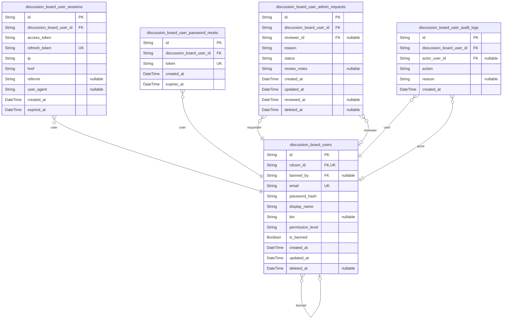
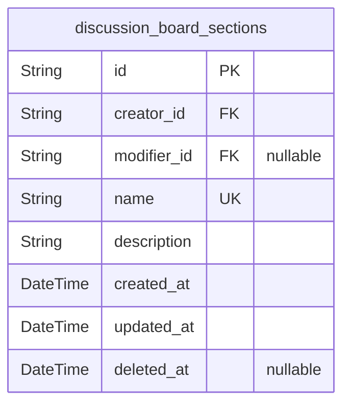
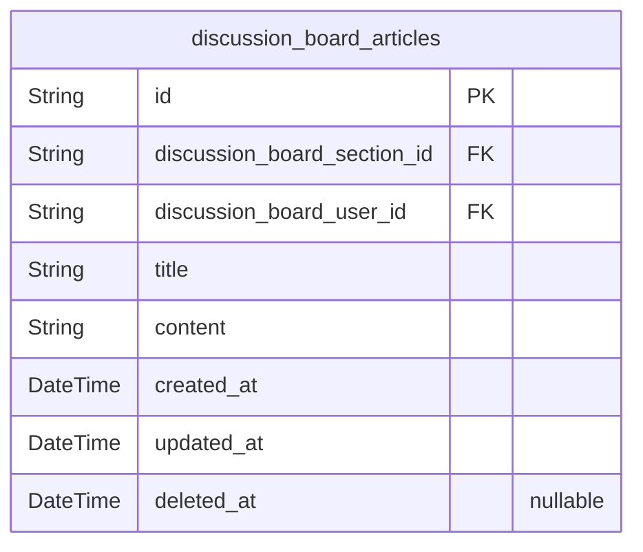
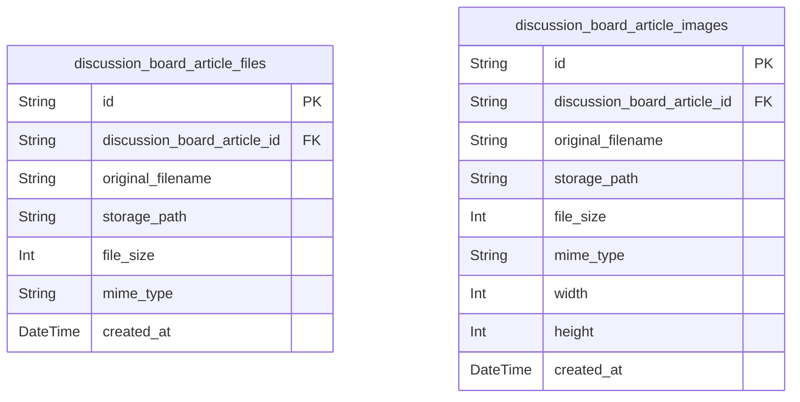
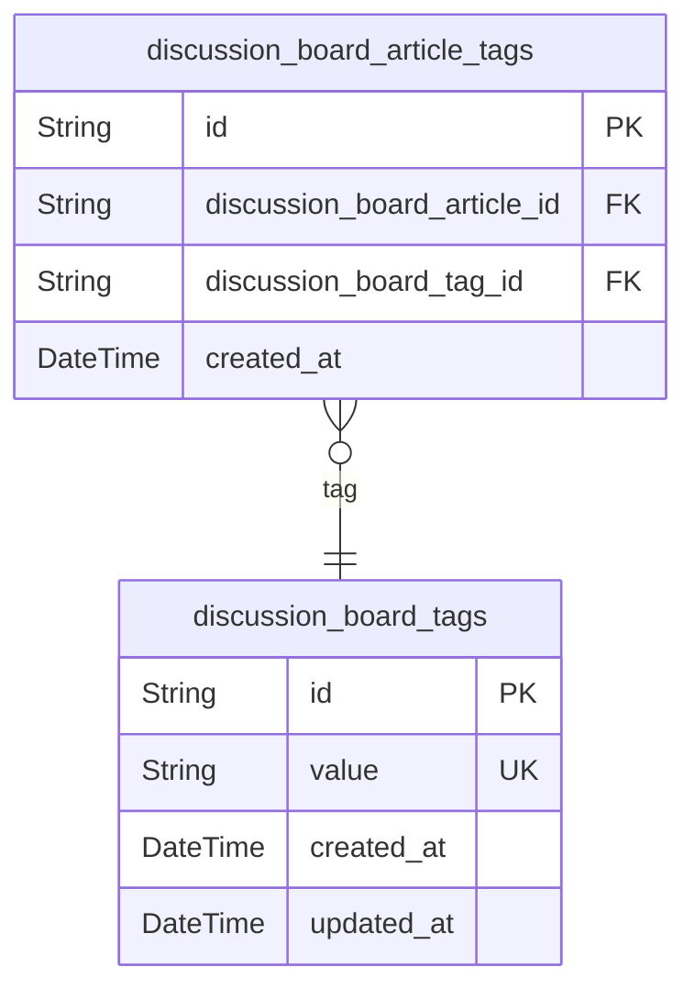
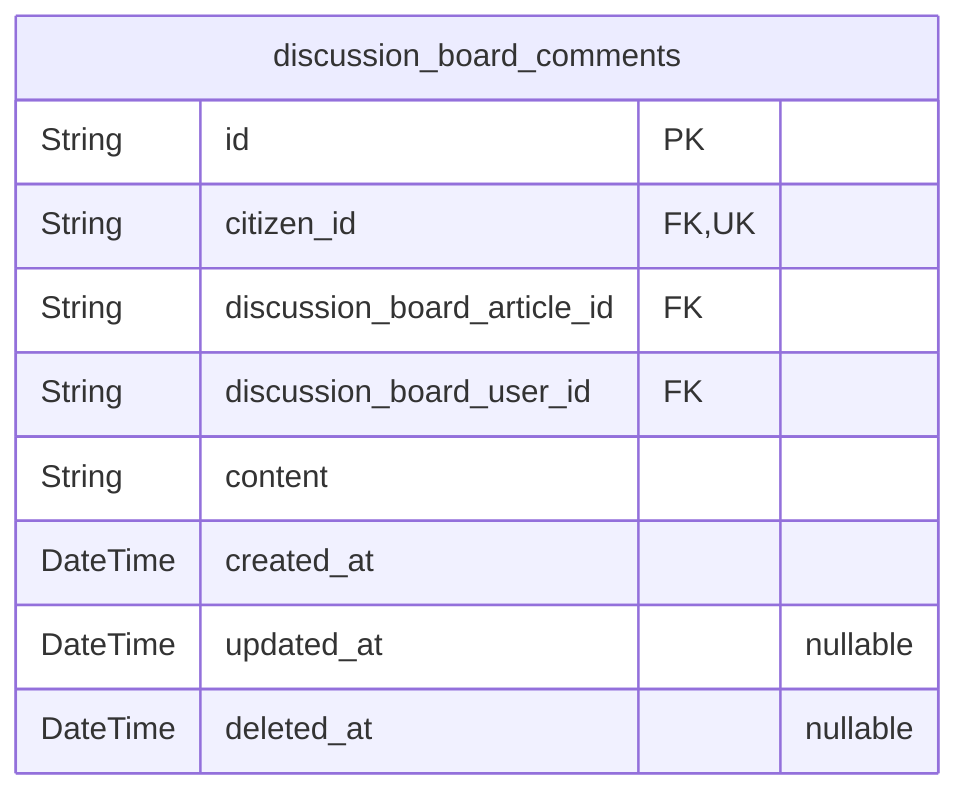
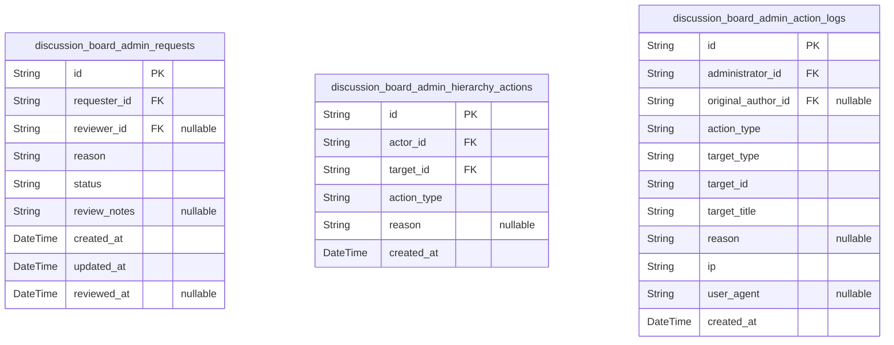
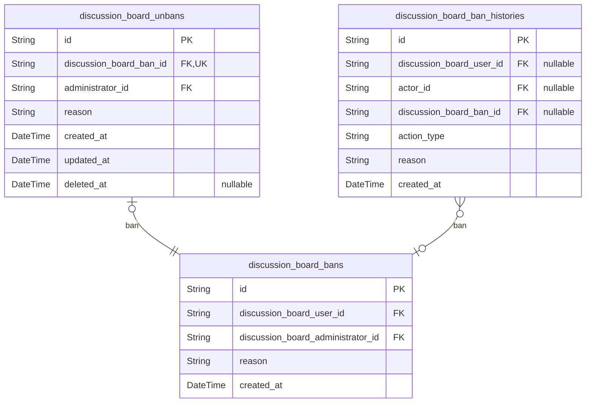

# Prisma Markdown

> Generated by [`prisma-markdown`](https://github.com/samchon/prisma-markdown)

- [Actors](#actors)
- [Systematic](#systematic)
- [Sections](#sections)
- [Articles](#articles)
- [Attachments](#attachments)
- [Tags](#tags)
- [Comments](#comments)
- [Administration](#administration)
- [Banning](#banning)

## Actors

### `discussion_board_users`

User accounts with email/password authentication, permission levels
(MEMBER, ADMINISTRATOR, SUPER_ADMINISTRATOR), ban status, and profile
information (display name, bio).

Each user has a unique email address for authentication, a password hash
for security, and a permission level that determines their access rights
within the platform. The permission_level field stores one of three
values: MEMBER (regular user), ADMINISTRATOR (can moderate content,
manage sections, ban users), or SUPER_ADMINISTRATOR (can also manage
admin hierarchy and approve admin requests).

The profile fields (display_name and bio) provide identity information
visible to other users. The is_banned flag indicates whether the user is
currently prohibited from logging in, though their existing content
remains visible.

Users reference a citizen sequence ID for human-readable sequential
identification. Related entities include sessions ({@link
discussion_board_user_sessions}), password resets ({@link
discussion_board_user_password_resets}), admin requests ({@link
discussion_board_user_admin_requests}), and audit logs ({@link
discussion_board_user_audit_logs}).

Properties as follows:

- `id`: Primary Key.
- `citizen_id`
  > Sequential ID reference from the citizen sequence for human-readable user
  > identification. [discussion_board_user_citizens.id](#discussion_board_user_citizens)
- `banned_by`
  > Administrator who banned this user, if applicable. Null when user is not
  > banned or was banned by a super admin who was later demoted. {@link
  > discussion_board_users.id}
- `email`
  > Unique email address used for authentication. Must be a valid email
  > format and unique across all users.
- `password_hash`
  > Secure hash of the user's password. Never store plain text passwords.
  > Uses bcrypt or similar secure hashing algorithm.
- `display_name`
  > User's display name shown on their profile and alongside their content.
  > Visible to other users.
- `bio`
  > Optional biographical text for the user's profile. Can be null for users
  > who haven't filled it in.
- `permission_level`
  > User's permission level determining their access rights. One of: MEMBER,
  > ADMINISTRATOR, or SUPER_ADMINISTRATOR.
- `is_banned`
  > Flag indicating whether the user is currently banned from the platform.
  > Banned users cannot log in but their content remains visible.
- `created_at`: Timestamp when the user account was created.
- `updated_at`
  > Timestamp when the user account was last updated (profile changes,
  > permission changes, etc.).
- `deleted_at`
  > Timestamp when the user account was soft-deleted. Null for active
  > accounts. When a user deletes their account, their articles and comments
  > are cascade deleted.

### `discussion_board_user_sessions`

JWT authentication sessions for users, tracking access tokens, refresh
tokens, and connection metadata across multiple devices.

Each session represents a single authenticated device/browser instance.
The refresh token uniquely identifies the session and enables token
rotation. Access tokens are short-lived (15-30 minutes) while refresh
tokens have longer expiration periods (7-30 days).

Sessions support multi-device authentication, allowing users to be logged
in on multiple devices simultaneously. Connection metadata (IP, href,
referrer) provides security auditing and fraud detection capabilities.

Relationship: Each session belongs to exactly one {@link
discussion_board_users}. Sessions are cascade-deleted when the parent
user is deleted.

Properties as follows:

- `id`: Primary Key.
- `discussion_board_user_id`
  > The user who owns this session. References {@link
  > discussion_board_users.id}. A user can have multiple active sessions
  > across different devices.
- `access_token`
  > JWT access token for API authentication. Short-lived token (typically
  > 15-30 minutes) used to authenticate API requests. Can be regenerated
  > using the refresh token.
- `refresh_token`
  > JWT refresh token for session persistence. Long-lived token (typically
  > 7-30 days) used to obtain new access tokens. This uniquely identifies the
  > session.
- `ip`
  > IP address from which the session was initiated. Used for security
  > auditing, geographic analysis, and fraud detection.
- `href`
  > URL of the page where the login was initiated. Captures the entry point
  > for the authentication request, useful for tracking user flows.
- `referrer`
  > Referrer URL that led the user to the login page. Useful for tracking
  > traffic sources and user navigation paths.
- `user_agent`
  > User agent string from the client browser. Identifies the browser,
  > operating system, and device type for session management.
- `created_at`
  > Timestamp when the session was created (login time). Records the initial
  > authentication moment.
- `expired_at`
  > Timestamp when the refresh token expires. Marks the end of the session's
  > validity period. Sessions can be terminated earlier through logout or
  > revocation.

### `discussion_board_user_password_resets`

Password reset tokens for email-based password recovery. Stores secure
tokens with expiration timestamps that allow users to reset their
passwords. Each token is single-use and should be deleted after
successful password reset. Tokens expire after a defined period
(typically 15-60 minutes) for security. A user may have multiple reset
requests over time, but typically only one active token at a time.
References the [discussion_board_users](#discussion_board_users) table for user association.

Properties as follows:

- `id`: Primary Key.
- `discussion_board_user_id`
  > The user who requested the password reset. References {@link
  > discussion_board_users.id}.
- `token`
  > Secure password reset token (hashed using cryptographic algorithm). This
  > token is sent to the user's email and must be presented to complete the
  > password reset. Should be generated using a cryptographically secure
  > random generator.
- `created_at`
  > Timestamp when the password reset request was created. Used for audit
  > logging and determining token age.
- `expires_at`
  > Timestamp when the password reset token expires. After this time, the
  > token is invalid and a new reset request must be made. Non-null by
  > default for security - all tokens must have a defined expiration period
  > (typically 15-60 minutes).

### `discussion_board_user_admin_requests`

Administrator request records submitted by users seeking administrative
privileges. Each request captures the user's reason for requesting admin
status and tracks the approval workflow from submission through review by
super administrators.

Requests progress through three states: pending (awaiting review),
approved (user granted admin status), and rejected (request declined).
Super administrators review pending requests and record their decision
with optional notes. Users may submit new requests after rejection.

Business rules enforced:
- Only one pending request per user at any time
- Users with existing admin status cannot submit requests
- Banned users cannot submit requests
- Request reason must be substantive (minimum 50 characters)

Related entities: [discussion_board_users](#discussion_board_users) for requester identity,
[discussion_board_users](#discussion_board_users) for reviewer attribution.

Properties as follows:

- `id`: Primary Key.
- `discussion_board_user_id`
  > The user who submitted this administrator request. References {@link
  > discussion_board_users.id}. A user may have multiple requests over time
  > (e.g., after rejection), but only one pending request at any given time.
- `reviewer_id`
  > The super administrator who reviewed and decided on this request.
  > References [discussion_board_users.id](#discussion_board_users). Null while request is in
  > pending status. Populated when request is approved or rejected.
- `reason`
  > The user's explanation of why they should become an administrator. Must
  > be substantive and detailed, with a minimum of 50 characters to ensure
  > meaningful reasoning is provided. Used by super administrators during
  > review to assess the request.
- `status`
  > Current state of the administrator request. Values: 'pending' (awaiting
  > review by super administrator), 'approved' (user granted administrator
  > privileges), 'rejected' (request declined). Only pending requests appear
  > in super administrators' review queue.
- `review_notes`
  > Optional notes provided by the reviewing super administrator when
  > approving or rejecting the request. May contain feedback, conditions, or
  > explanation of the decision. Null if no notes were provided or request is
  > still pending.
- `created_at`
  > Timestamp when the administrator request was submitted by the user. Used
  > for chronological ordering of requests and calculating time elapsed in
  > pending status.
- `updated_at`
  > Timestamp when the request was last modified. Updated when status changes
  > from pending to approved or rejected, or when review notes are added.
- `reviewed_at`
  > Timestamp when the request was reviewed by a super administrator. Set
  > when status transitions from pending to approved or rejected. Null while
  > request is pending.
- `deleted_at`
  > Timestamp when the request was soft-deleted. Admin requests are typically
  > retained for audit purposes but may be soft-deleted for moderation or
  > cleanup purposes.

### `discussion_board_user_audit_logs`

Immutable audit trail of user-related administrative actions including
bans, unbans, permission level changes (promotions/demotions), and other
authorization events. Provides comprehensive logging for compliance and
security auditing.

Each audit entry captures the target user, the type of action performed,
the administrator who performed it (if applicable), the reason for the
action, and the timestamp. Used for security monitoring, compliance
reporting, and accountability tracking.

Properties as follows:

- `id`: Primary Key.
- `discussion_board_user_id`
  > The user who was the target of this audit action. References {@link
  > discussion_board_users.id}.
- `actor_user_id`
  > The administrator who performed this action. Nullable for
  > system-initiated actions. References [discussion_board_users.id](#discussion_board_users).
- `action`
  > Type of audit action performed. Values: 'password_change' (user changed
  > their own password), 'account_deleted' (user deleted their account),
  > 'permission_granted' (user promoted to admin/super admin),
  > 'permission_revoked' (user demoted from admin), 'banned' (user was
  > banned), 'unbanned' (user was unbanned).
- `reason`
  > Human-readable reason or description for the action. Required for
  > administrative actions (bans, unbans, permission changes), optional for
  > user-initiated actions.
- `created_at`: Timestamp when the audit action occurred.

## Systematic

```mermaid
erDiagram
"discussion_board_user_citizens" {
  String id PK
  Int citizen_id UK
  DateTime created_at
}
"discussion_board_section_citizens" {
  String id PK
  DateTime created_at
}
"discussion_board_article_citizens" {
  String id PK
  Int citizen_id UK
  DateTime created_at
}
"discussion_board_comment_citizens" {
  String id PK
  DateTime created_at
}
"discussion_board_admin_request_citizens" {
  String id PK
  DateTime created_at
}
"discussion_board_ban_citizens" {
  String id PK
  DateTime created_at
}
"discussion_board_admin_hierarchy_action_citizens" {
  String id PK
  DateTime created_at
}
"discussion_board_admin_action_log_citizens" {
  String id PK
}
"discussion_board_unban_citizens" {
  String id PK
  DateTime created_at
}
"discussion_board_ban_history_citizens" {
  String id PK
}
```

### `discussion_board_user_citizens`

Citizen sequence table for generating sequential IDs for user entities.
Each new user references a citizen_id from this sequence. Provides
human-readable sequential identifiers for users, enabling easier
reference and display compared to UUID-based primary keys.

Properties as follows:

- `id`: Primary Key.
- `citizen_id`
  > Sequential citizen ID number for user identification. Auto-incremented
  > for each new user, providing human-readable sequential identifiers.
- `created_at`: Timestamp when the citizen sequence record was created.

### `discussion_board_section_citizens`

Citizen sequence table for generating sequential, human-readable IDs for
section entities.

This infrastructure table provides a dedicated sequence generator for
section IDs, enabling the creation of sequential identification numbers
(e.g., Section #1, Section #2) that are easier for users to reference
than UUIDs. Each new section entity consumes one citizen record from this
sequence.

The sequence is maintained independently from the main section table to
ensure consistent, gap-free sequential numbering for user-facing
identifiers.

Properties as follows:

- `id`: Primary Key.
- `created_at`
  > Timestamp when this sequence number was created. Used for audit trail and
  > ordering of sequence allocation.

### `discussion_board_article_citizens`

Citizen sequence table for generating sequential, human-readable IDs for
article entities.

Each time a new article is created, the system references a record from
this sequence to generate a sequential citizen ID. This provides
human-readable article identifiers (e.g., "Article #123") separate from
the UUID primary key. The sequence ensures uniqueness and maintains
chronological ordering for article identification.

This is a subsidiary table supporting the {@link
discussion_board_articles} primary entity.

Properties as follows:

- `id`: Primary Key.
- `citizen_id`
  > Sequential citizen ID number for human-readable article identification.
  > Auto-incremented to provide unique sequential identifiers (e.g., 123 for
  > "Article #123").
- `created_at`
  > Timestamp when the citizen ID was allocated. Used for audit trail to
  > track when article IDs were generated.

### `discussion_board_comment_citizens`

Citizen sequence table for generating sequential IDs for comment
entities. Each new comment references a citizen_id from this sequence,
providing human-readable sequential identifiers for the discussion
board's comment system. This table serves as infrastructure for the
Comments component, ensuring consistent and traceable comment
identification across the platform.

Properties as follows:

- `id`
  > Primary Key. Unique citizen sequence identifier used as reference for
  > sequential comment IDs.
- `created_at`
  > Timestamp when this citizen sequence entry was created. Used for auditing
  > and ordering the sequence generation.

### `discussion_board_admin_request_citizens`

Citizen sequence table for generating sequential, human-readable IDs for
administrator request entities.

This infrastructure table supports the ID generation system for admin
requests, providing a stable sequence counter that enables sequential
numeric identifiers (e.g., #1, #2, #3) for administrator request
tracking. Each new admin request references a citizen_id from this
sequence, ensuring consistent and auditable request numbering.

Part of the systematic infrastructure layer that provides foundational ID
generation services across all platform entities.

Properties as follows:

- `id`
  > Primary Key. Unique identifier for this citizen sequence entry,
  > referenced by administrator request records to establish their sequential
  > ID.
- `created_at`
  > Timestamp when this citizen sequence entry was created. Used for auditing
  > the sequence generation process and tracking when new admin request IDs
  > were allocated.

### `discussion_board_ban_citizens`

Citizen sequence table for generating sequential IDs for ban entities.

This infrastructure table supports the discussion_board_bans table by
providing a pool of pre-generated sequential identifiers. Each ban record
references a citizen_id from this sequence to maintain human-readable
sequential numbering while using UUID-based internal identifiers.

Citizen sequences enable the system to assign sequential, user-friendly
IDs (e.g., 'Ban #123') to ban records while maintaining the security and
distributed system benefits of UUID primary keys.

Properties as follows:

- `id`: Primary Key.
- `created_at`: Timestamp when this citizen sequence record was created.

### `discussion_board_admin_hierarchy_action_citizens`

Citizen sequence table for generating sequential IDs for admin hierarchy
action entities.

This infrastructure table provides the foundation for assigning
human-readable sequential identifiers to admin hierarchy actions
(promotions and demotions). Each time an admin hierarchy action is
created, it references a citizen_id from this sequence, enabling
user-friendly identification while maintaining the UUID-based primary key
system.

The sequence supports the Administration domain's governance workflow by
providing monotonically increasing IDs that are easier for administrators
to reference in communications and audit logs compared to raw UUIDs.

Properties as follows:

- `id`
  > Primary Key. Unique identifier for the citizen sequence entry, used as a
  > reference by admin hierarchy action records.
- `created_at`
  > Timestamp when this citizen sequence entry was created. Used for audit
  > trail and sequence ordering verification.

### `discussion_board_admin_action_log_citizens`

Citizen sequence table for generating sequential, human-readable IDs for
admin action log entities.

Each new admin action log entry references a citizen record from this
sequence to provide a stable, sequential identifier suitable for
user-facing display and audit trail correlation. This table exists solely
to generate unique identifiers - no additional data is stored.

Referenced by: [discussion_board_admin_action_logs.citizen](#discussion_board_admin_action_logs)

Properties as follows:

- `id`: Primary Key.

### `discussion_board_unban_citizens`

Citizen sequence table for generating sequential IDs for unban entities.
Each new unban action references a citizen_id from this sequence,
enabling human-readable unban identifiers. This is an append-only table
that serves as the source of unique identifiers for the unban system.

Properties as follows:

- `id`
  > Primary Key. Unique identifier for this citizen sequence entry, used as a
  > human-readable reference for unban records.
- `created_at`
  > Timestamp when this citizen sequence entry was created. Used for audit
  > trail of ID generation events.

### `discussion_board_ban_history_citizens`

Citizen sequence table for generating sequential, human-readable IDs for
ban history entities.

This infrastructure table provides a dedicated sequence for ban history
audit trail records, ensuring each ban history entry receives a unique,
sequential identifier. The citizen pattern enables friendly ID generation
that can be displayed in user interfaces while maintaining the benefits
of UUID primary keys for internal database operations.

Used by the Banning component to assign sequential IDs to {@link
discussion_board_ban_histories} records.

Properties as follows:

- `id`: Primary Key.

## Sections

### `discussion_board_sections`

Discussion board sections that organize articles by topic categories such
as Politics, Economy, and Current Affairs. Each section has a unique name
and description, managed exclusively by administrators. Sections serve as
the primary organizational structure for articles, and deletion of a
section triggers cascade deletion of all articles within that section.
The table tracks both the creator and last modifier administrator for
audit purposes.

Properties as follows:

- `id`: Primary Key.
- `creator_id`
  > The administrator who created this section. References {@link
  > discussion_board_users.id}.
- `modifier_id`
  > The administrator who last modified this section. References {@link
  > discussion_board_users.id}.
- `name`
  > Unique name of the section. Used for display and identification. Must be
  > unique across all sections.
- `description`
  > Detailed description of the section's purpose and the types of
  > discussions it contains.
- `created_at`: Timestamp when the section was created.
- `updated_at`: Timestamp when the section was last updated.
- `deleted_at`
  > Timestamp when the section was soft-deleted. Null if the section is
  > active. Soft delete preserves section data for audit trails while hiding
  > from active browsing.

## Articles

### `discussion_board_articles`

Primary content entity for discussion board articles.

Articles are the main discussion content created by users within
sections. Each article has a title, content body, is assigned to exactly
one section, and has an author (user). Articles support soft deletion to
preserve banned users' content visibility.

Relationships:
- Belongs to a [discussion_board_section](#discussion_board_section) via section reference
- Authored by a [discussion_board_user](#discussion_board_user) via user reference
- Has associated [discussion_board_article_files](#discussion_board_article_files) for file attachments
- Has associated [discussion_board_article_images](#discussion_board_article_images) for image
attachments
- Has associated [discussion_board_article_tags](#discussion_board_article_tags) for tag associations
- Has associated [discussion_board_comments](#discussion_board_comments) for discussion

Business rules:
- Title: 3-200 characters, required
- Content: 10-50,000 characters, required
- Author can edit their own articles
- Author can delete their own articles (soft delete)
- Administrators can delete any article
- Cascade deletes attachments, images, tags, and comments when hard deleted

Properties as follows:

- `id`: Primary Key.
- `discussion_board_section_id`
  > Section where this article is published. Every article must belong to
  > exactly one section. References [discussion_board_sections.id](#discussion_board_sections).
- `discussion_board_user_id`
  > Author of this article. The user who created and owns this article.
  > References [discussion_board_users.id](#discussion_board_users).
- `title`
  > Article title. Must be between 3 and 200 characters. Used for display and
  > search indexing.
- `content`
  > Article content body. Text content between 10 and 50,000 characters.
  > Supports plain text formatting.
- `created_at`
  > Timestamp when the article was created. Automatically set on article
  > creation.
- `updated_at`
  > Timestamp when the article was last updated. Updated automatically when
  > article is modified.
- `deleted_at`
  > Timestamp when the article was soft-deleted. Null if article is active.
  > Used to preserve banned users' content visibility while hiding from
  > normal browsing.

## Attachments

### `discussion_board_article_files`

File attachments for articles storing PDF, document, spreadsheet,
presentation, and archive files.

Each file attachment records the original filename as uploaded by the
user, the server-side storage path, file size in bytes for quota
enforcement (10MB individual limit, 50MB total per article), and MIME
type for validation. Supports common document formats including PDF, Word
documents (DOC/DOCX), Excel spreadsheets (XLS/XLSX), PowerPoint
presentations (PPT/PPTX), and archive files (ZIP, RAR, 7Z).

Files are cascade deleted when their parent article is deleted. Maximum
10 files per article enforced at application layer.

Properties as follows:

- `id`: Primary Key.
- `discussion_board_article_id`
  > Parent article this file is attached to. Files are cascade deleted when
  > article is deleted. [discussion_board_articles.id](#discussion_board_articles)
- `original_filename`
  > Original filename as uploaded by the user. Preserved for display and
  > download purposes. Maximum 255 characters.
- `storage_path`
  > Server-side storage path where the file is physically stored. Used for
  > file retrieval and deletion operations.
- `file_size`
  > File size in bytes. Used for enforcing the 10MB individual file limit and
  > 50MB total limit per article.
- `mime_type`
  > MIME type of the file (e.g., application/pdf,
  > application/vnd.openxmlformats-officedocument.wordprocessingml.document).
  > Used for content-type headers during download and file type validation.
- `created_at`
  > Timestamp when the file was uploaded. Used for chronological ordering of
  > attachments.

### `discussion_board_article_images`

Image attachments for discussion board articles. Stores JPEG, PNG, GIF,
WebP, and BMP images with original filename for display, storage path,
file size in bytes, MIME type, and pixel dimensions. Limited to 20 images
per article with 5MB individual file limit and 8000x8000 maximum
dimensions. Cascade deleted when parent article is removed. Managed
through article creation and editing operations.

Properties as follows:

- `id`: Primary Key.
- `discussion_board_article_id`
  > Reference to the article this image belongs to. {@link
  > discussion_board_articles.id}
- `original_filename`
  > Original filename as uploaded by the user, preserved for display
  > purposes. Used when users download the image to provide the original
  > filename.
- `storage_path`
  > Unique storage path where the image file is physically stored.
  > System-generated path to prevent filename conflicts and security issues.
- `file_size`
  > Size of the image file in bytes. Maximum allowed is 5MB (5,242,880
  > bytes). Used for validation and storage quota tracking.
- `mime_type`
  > MIME type of the image. Supported values: image/jpeg, image/png,
  > image/gif, image/webp, image/bmp. Used for content-type headers when
  > serving images.
- `width`
  > Image width in pixels. Maximum allowed is 8000 pixels. Validated during
  > upload to ensure image integrity and dimension compliance.
- `height`
  > Image height in pixels. Maximum allowed is 8000 pixels. Validated during
  > upload to ensure image integrity and dimension compliance.
- `created_at`: Timestamp when the image was uploaded and attached to the article.

## Tags

### `discussion_board_tags`

Master table for unique tag values used in article categorization and
discovery.

Tags provide flexible, user-defined categorization beyond the
section-based structure. Each tag is a free-form text value normalized to
lowercase, supporting alphanumeric characters, hyphens, and underscores
only. Tags persist independently of articles and are reused across the
platform.

Tags are associated with articles through the {@link
discussion_board_article_tags} junction table, enabling many-to-many
relationships. Each article can have up to 15 tags. Tags support
case-insensitive comparison and automatic duplicate removal through the
normalization process.

The unique constraint on the value field ensures tag uniqueness across
the platform. Tags can be used for article filtering (single or multiple
tags with OR logic) and discovery through the tag-based browsing
interface.

Properties as follows:

- `id`: Primary Key.
- `value`
  > Normalized tag value in lowercase. Must be 1-50 characters containing
  > only alphanumeric characters, hyphens (-), and underscores (_). Tags are
  > case-insensitive for comparison purposes (e.g., "Politics" and "politics"
  > are treated as the same tag). Leading and trailing whitespace is trimmed
  > during normalization. Duplicate tags are automatically removed.
- `created_at`
  > Timestamp when the tag was first created. Automatically set upon tag
  > creation.
- `updated_at`
  > Timestamp when the tag record was last updated. Initially matches
  > created_at on creation.

### `discussion_board_article_tags`

Junction table implementing the many-to-many relationship between
articles and tags.

This table enables flexible article categorization beyond section-based
organization. Users can associate up to 15 tags per article during
creation or editing. The table supports tag-based article discovery and
filtering workflows.

**Cascade Behavior**: When an article is deleted, all its tag
associations are automatically removed. Tags themselves persist
independently and can be reused across other articles, supporting tag
normalization and platform-wide consistency.

**Business Rules**:
- Maximum 15 tags per article (enforced at application layer)
- Tag values are case-insensitive and normalized to lowercase in {@link
discussion_board_tags.value}
- Duplicate tag associations for the same article are prevented by unique
constraint

Properties as follows:

- `id`: Primary Key.
- `discussion_board_article_id`
  > Reference to the tagged article. Uses cascade deletion to automatically
  > remove tag associations when the parent article is deleted, maintaining
  > referential integrity without orphaned records.
  >
  > Target article's [discussion_board_articles.id](#discussion_board_articles).
- `discussion_board_tag_id`
  > Reference to the associated tag. Preserves the tag record when
  > article-tag associations are deleted, allowing tag reuse across the
  > platform and maintaining the master tag registry.
  >
  > Target tag's [discussion_board_tags.id](#discussion_board_tags).
- `created_at`
  > Timestamp when the tag was associated with the article. Used for auditing
  > tag assignments and supporting chronological queries if needed.

## Comments

### `discussion_board_comments`

Single-level comments attached to articles with author reference, content
(up to 10,000 characters), creation and edit timestamps, and soft delete
flag for audit preservation. Comments are sorted chronologically (oldest
first) to maintain natural conversation flow. Each comment belongs to
exactly one article and is written by one user. Administrators can delete
any comment for moderation purposes, while users can only delete their
own comments.

Properties as follows:

- `id`: Primary Key.
- `citizen_id`
  > Sequential citizen identifier for human-readable comment numbering.
  > References [discussion_board_comment_citizens.id](#discussion_board_comment_citizens).
- `discussion_board_article_id`
  > Reference to the parent article. [discussion_board_articles.id](#discussion_board_articles).
  > Comments are cascade deleted when the article is deleted.
- `discussion_board_user_id`
  > Reference to the comment author. [discussion_board_users.id](#discussion_board_users).
  > Comments are cascade deleted when the user account is deleted.
- `content`
  > The comment body text. Must contain at least 1 non-whitespace character
  > and cannot exceed 10,000 characters. Leading and trailing whitespace is
  > trimmed before storage.
- `created_at`
  > Timestamp when the comment was posted. Automatically set on creation and
  > never modified.
- `updated_at`
  > Timestamp when the comment was last edited. Null if the comment has never
  > been edited. Updated only when content is modified.
- `deleted_at`
  > Timestamp when the comment was soft-deleted. Null for active comments.
  > When set, the comment is excluded from public display but preserved for
  > audit purposes.

## Administration

### `discussion_board_admin_requests`

User submissions to become administrators with reason, status
(pending/approved/rejected), and review workflow tracking.

This table implements the administrator request system where
authenticated users submit requests to become administrators. Super
administrators review pending requests and approve or reject them with
optional notes. The system enforces the rule that a user may have only
one pending request at any time through a unique constraint on
(requester_id, status) for pending status.

All request records are retained for audit purposes regardless of
outcome. Request history is preserved to support merit-based evaluation
and transparency in the governance process. When a request is approved,
the requester's permission level is updated to ADMINISTRATOR in the
[discussion_board_users](#discussion_board_users) table.

Key relationships:
- [discussion_board_users](#discussion_board_users) (requester): The user who submitted the
admin request
- [discussion_board_users](#discussion_board_users) (reviewer): The super administrator who
reviewed the request

Properties as follows:

- `id`: Primary Key.
- `requester_id`
  > The user who submitted this administrator request. References {@link
  > discussion_board_users.id}.
- `reviewer_id`
  > The super administrator who reviewed this request. Null if the request is
  > still pending. References [discussion_board_users.id](#discussion_board_users).
- `reason`
  > User's explanation of why they should become an administrator. Must be at
  > least 50 characters to ensure meaningful justification.
- `status`
  > Current state of the administrator request. Valid values: 'pending'
  > (awaiting review), 'approved' (user granted admin status), 'rejected'
  > (request denied). Users may submit new requests after rejection.
- `review_notes`
  > Optional notes from the super administrator who reviewed this request.
  > May contain explanation for approval or rejection decision. Null if
  > request is pending.
- `created_at`: Timestamp when the administrator request was submitted.
- `updated_at`: Timestamp when the administrator request was last modified.
- `reviewed_at`
  > Timestamp when the request was reviewed by a super administrator. Null if
  > the request is still pending.

### `discussion_board_admin_hierarchy_actions`

Immutable audit trail records of administrator hierarchy changes within
the platform.

Captures promotion and demotion actions between regular administrator and
super administrator roles. Each record tracks the acting administrator
(who performed the action), the target administrator (who was affected),
the action type, and an optional reason.

This table supports the governance requirements where:
- Super administrators can promote regular administrators to super
administrator status
- Super administrators can demote other super administrators to regular
administrator status
- Self-demotion prevention is enforced at the application layer

Records are append-only for compliance and audit purposes. Historical
data is never modified or deleted.

Properties as follows:

- `id`: Primary Key.
- `actor_id`
  > The administrator who performed the hierarchy action (promoter or
  > demoter). References [discussion_board_users.id](#discussion_board_users).
- `target_id`
  > The administrator who was affected by the hierarchy action (promoted or
  > demoted). References [discussion_board_users.id](#discussion_board_users).
- `action_type`
  > The type of hierarchy action performed. Valid values are 'PROMOTION'
  > (regular admin to super admin) or 'DEMOTION' (super admin to regular
  > admin).
- `reason`
  > Optional explanation for the hierarchy action. May contain justification
  > for the promotion or demotion decision.
- `created_at`
  > Timestamp when the hierarchy action was performed. Records are immutable
  > after creation.

### `discussion_board_admin_action_logs`

Comprehensive audit trail of all administrative actions including content
moderation (article/comment deletion), section management
(create/edit/delete), user banning/unbanning, admin hierarchy changes,
and admin request reviews. This table serves as the single source of
truth for all administrative accountability, supporting filtering by date
range, administrator, and action type for compliance and audit purposes.
Logs are immutable and cannot be modified or deleted, including by super
administrators.

Properties as follows:

- `id`: Primary Key.
- `administrator_id`
  > The administrator who performed this action. References {@link
  > discussion_board_users.id}.
- `original_author_id`
  > Reference to the user who created the original content that was acted
  > upon. Applicable for ARTICLE_DELETE and COMMENT_DELETE actions. Null for
  > actions that don't involve user-created content (SECTION_*, BAN_USER,
  > UNBAN_USER, PROMOTE_ADMIN, DEMOTE_ADMIN, APPROVE_REQUEST,
  > REJECT_REQUEST). References [discussion_board_users.id](#discussion_board_users).
- `action_type`
  > The type of administrative action performed. Values: ARTICLE_DELETE
  > (moderation), COMMENT_DELETE (moderation), SECTION_CREATE, SECTION_EDIT,
  > SECTION_DELETE (section management), BAN_USER, UNBAN_USER (user
  > management), PROMOTE_ADMIN, DEMOTE_ADMIN (hierarchy management),
  > APPROVE_REQUEST, REJECT_REQUEST (admin request workflow).
- `target_type`
  > The type of entity that was acted upon. Values: ARTICLE, COMMENT,
  > SECTION, USER, ADMIN_REQUEST. Used with target_id to identify the
  > affected entity.
- `target_id`
  > UUID of the entity that was acted upon. References the primary key of the
  > target table determined by target_type (discussion_board_articles,
  > discussion_board_comments, discussion_board_sections,
  > discussion_board_users, or discussion_board_admin_requests). Polymorphic
  > reference validated at application level.
- `target_title`
  > Human-readable title or truncated preview of the affected content. For
  > articles: article title. For comments: first 100 characters. For
  > sections: section name. For users: display name. For admin requests:
  > requester display name.
- `reason`
  > Optional reason or notes provided by the administrator for this action.
  > Required for ban actions (10-1000 characters), optional for other action
  > types. Used for ban reasons, deletion justifications, and review notes.
- `ip`
  > IP address of the administrator at the time of action. Captured for
  > security audit and accountability purposes.
- `user_agent`
  > User agent string of the administrator's browser/client at the time of
  > action. Captured for device identification and security auditing.
- `created_at`
  > Timestamp when the administrative action was performed. Automatically set
  > upon creation.

## Banning

### `discussion_board_bans`

Records of user bans performed by administrators.

Each ban record captures the target user, the administrator who performed
the ban,
the reason for the ban (10-1000 characters), and the timestamp. Ban
records are
immutable and persist for audit purposes even after unbanning.

Related tables:
- [discussion_board_users](#discussion_board_users) - Target users and administrator actors
- [discussion_board_unbans](#discussion_board_unbans) - Records of ban removal
- [discussion_board_ban_histories](#discussion_board_ban_histories) - Immutable audit trail

Properties as follows:

- `id`: Primary Key.
- `discussion_board_user_id`: The banned user who cannot login. [discussion_board_users.id](#discussion_board_users).
- `discussion_board_administrator_id`
  > The administrator who performed the ban action. {@link
  > discussion_board_users.id}.
- `reason`
  > Reason for the ban, recorded for transparency and audit. Must be between
  > 10 and 1000 characters.
- `created_at`: Timestamp when the ban was created.

### `discussion_board_unbans`

Records unban actions that reverse active ban records. Each unban
references the original ban record, the administrator who performed the
unban, and includes a required reason text (10-1000 characters). This
table maintains a complete audit trail of unbanning decisions for
compliance and administrative review. One-to-one relationship with {@link
discussion_board_bans} ensures each ban can only be reversed once.
Supports the administrative workflow for restoring user access after ban
appeals or policy reversals.

Properties as follows:

- `id`: Primary Key.
- `discussion_board_ban_id`
  > Reference to the original ban record being reversed. Each ban can only
  > have one unban action, creating a one-to-one relationship. {@link
  > discussion_board_bans.id}
- `administrator_id`
  > The administrator who performed the unban action. References the users
  > table since administrators are users with elevated permissions. {@link
  > discussion_board_users.id}
- `reason`
  > The reason for unbanning the user. Required text field with minimum 10
  > characters and maximum 1,000 characters. Provides documentation for the
  > administrative decision and supports audit requirements. Stored as
  > plaintext without markdown or HTML interpretation.
- `created_at`
  > Timestamp when the unban action was performed. Records when the user's
  > access was restored.
- `updated_at`
  > Timestamp when the unban record was last modified. Typically unchanged
  > after initial creation as unban records are generally immutable.
- `deleted_at`
  > Timestamp for soft deletion of the unban record. Used for audit
  > preservation when records are administratively removed.

### `discussion_board_ban_histories`

Immutable audit trail for all ban and unban administrative actions.

This table serves as a compliance-focused, append-only record of all user
ban and unban operations performed by administrators. Each entry captures
the complete context of the action including the affected user, the
administrator who performed the action, the reason provided, and
timestamp.

**Key Characteristics:**
- Immutable: Records cannot be modified or deleted once created
- Persistent: Records survive even when referenced users or ban records
are deleted
- Compliance-ready: Supports filtering by date range, administrator, and
action type

**Action Types:**
- BAN: Records when a user is banned from the platform
- UNBAN: Records when a previously banned user has their access restored

**Relationships:**
- References [discussion_board_users](#discussion_board_users) for both target user and
administrator
- May reference [discussion_board_bans](#discussion_board_bans) for unban actions to link
back to the original ban record

**Query Patterns:**
- Filter by action type for reporting
- Filter by administrator for accountability tracking
- Filter by date range for compliance audits
- Filter by target user for user history viewing

Properties as follows:

- `id`: Primary Key.
- `discussion_board_user_id`
  > The user who was banned or unbanned. Nullable to support FR-AUDIT-005:
  > when a user account is deleted, audit records are retained with
  > anonymized references. [discussion_board_users.id](#discussion_board_users)
- `actor_id`
  > The administrator who performed the ban or unban action. Nullable to
  > support FR-AUDIT-005: when an administrator account is deleted, audit
  > records are retained with anonymized references. {@link
  > discussion_board_users.id}
- `discussion_board_ban_id`
  > Reference to the original ban record for unban actions. NULL for BAN
  > actions. Used to trace the complete ban lifecycle. Nullable to preserve
  > audit records if the original ban record is deleted. {@link
  > discussion_board_bans.id}
- `action_type`
  > Type of administrative action performed. BAN indicates a user was banned
  > from the platform; UNBAN indicates a previously banned user had their
  > access restored. Used for filtering and reporting.
- `reason`
  > The reason text provided for the ban or unban action. Required for all
  > actions (minimum 10 characters, maximum 1,000 characters as per business
  > rules). Stored in plaintext without markdown or HTML interpretation.
- `created_at`
  > Timestamp when the ban or unban action was executed. Used for
  > chronological sorting and date range filtering in audit reports.
  > Automatically recorded by the system at the time of action.
