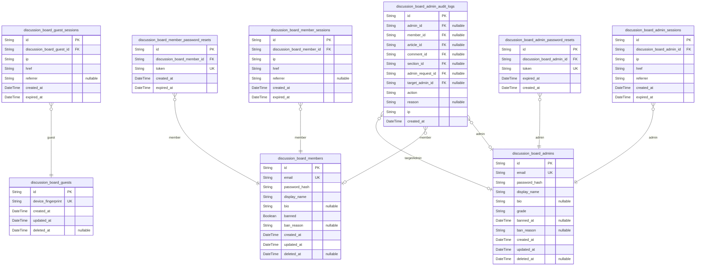
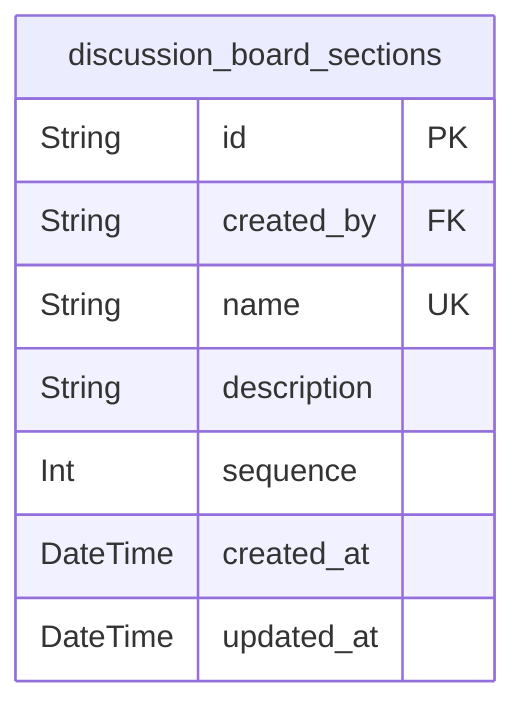
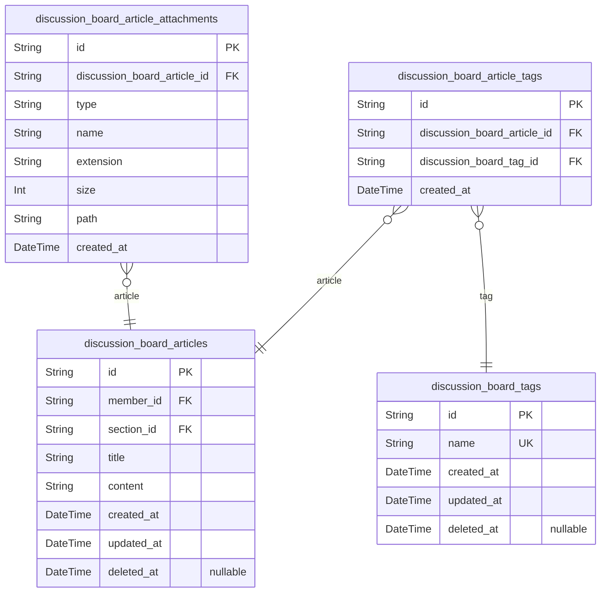
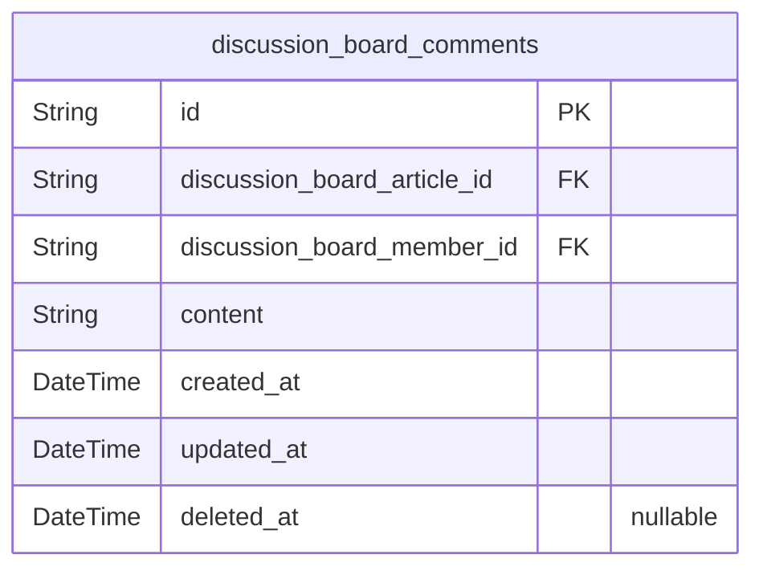
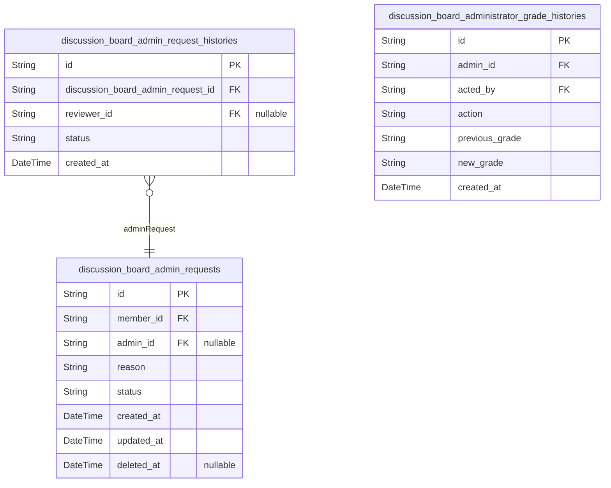

# Prisma Markdown

> Generated by [`prisma-markdown`](https://github.com/samchon/prisma-markdown)

- [Actors](#actors)
- [Sections](#sections)
- [Articles](#articles)
- [Comments](#comments)
- [AdminRequests](#adminrequests)

## Actors

### `discussion_board_guests`

Temporary guest accounts identified by device fingerprint for tracking
unauthenticated visitors.

Guest actors represent unauthenticated visitors who browse the discussion
board without logging in. They are tracked via device fingerprint rather
than traditional credentials like email and password.

Key characteristics:
- No authentication credentials (email/password) required
- Device fingerprint provides anonymous identification
- Read-only access to public content (sections, articles, comments)
- Cannot create, edit, or delete any content
- Sessions tracked through [discussion_board_guest_sessions](#discussion_board_guest_sessions) table

Relationships:- Has many sessions via {@link
discussion_board_guest_sessions.guest_id}

This actor table serves as the foundation for tracking guest activity
while maintaining privacy without requiring authentication.

Properties as follows:

- `id`: Primary Key.
- `device_fingerprint`
  > Unique device fingerprint for identifying anonymous visitors without
  > requiring authentication credentials. Used for tracking guest sessions
  > across page views.
- `created_at`: Timestamp when the guest account was first created.
- `updated_at`: Timestamp when the guest account was last updated.
- `deleted_at`
  > Timestamp when the guest account was soft deleted. Null if the account is
  > active.

### `discussion_board_guest_sessions`

Session tracking for guest actors, recording temporary access tokens with
connection metadata.

Guest sessions capture the context of unauthenticated visitor access,
including IP address for security tracking, the current page URL (href),
and referrer information. Each session has a defined expiration time to
limit the validity of guest access tokens.

Relationships:
- Belongs to [discussion_board_guests](#discussion_board_guests) as the parent actor record

Sessions are append-only records used for security auditing and temporary
access management. Unlike authenticated member sessions, guest sessions
do not require password reset functionality.

Properties as follows:

- `id`: Primary Key.
- `discussion_board_guest_id`
  > Reference to the guest actor who owns this session. {@link
  > discussion_board_guests.id}
- `ip`
  > IP address from which the guest session was initiated. Used for security
  > tracking and fraud prevention.
- `href`
  > The URL page the guest was viewing when the session was created. Captures
  > navigation context for analytics.
- `referrer`
  > The URL from which the guest navigated to the current page. Used for
  > traffic source analysis and tracking.
- `created_at`
  > Timestamp when the guest session was created. Used for session lifecycle
  > management and security auditing.
- `expired_at`
  > Timestamp when the guest session expires. Sessions must have explicit
  > expiration for security - no indefinite sessions allowed.

### `discussion_board_members`

Registered member accounts with email/password authentication, profile
information (display name, bio), and account status.

Members are authenticated discussion board participants who can create
articles with attachments and tags, write comments, edit/delete their own
content, manage their profile, submit admin requests, and view other
member profiles. Each member has a unique email address for login
identification, a securely hashed password, and optional profile details
(display name, bio). Account status includes an active/banned flag with
an optional ban reason for administrative moderation.

Relationships:
- Has many [discussion_board_articles](#discussion_board_articles) as author
- Has many [discussion_board_comments](#discussion_board_comments) as author
- Has many [discussion_board_admin_requests](#discussion_board_admin_requests) as requester
- Has many [discussion_board_member_sessions](#discussion_board_member_sessions) for session tracking

Properties as follows:

- `id`: Primary Key.
- `email`
  > Unique email address used as the primary identifier for authentication
  > and login. Must be unique across all member accounts.
- `password_hash`
  > Securely hashed password for authentication. Stored using bcrypt or
  > similar secure hashing algorithm. Never stored in plain text.
- `display_name`
  > Public display name shown on profile and all contributions (articles,
  > comments). Can be modified by the member at any time.
- `bio`
  > Optional biographical text for member profile. Members can use this to
  > describe themselves to other users.
- `banned`
  > Flag indicating whether the member account is currently banned. Banned
  > members cannot log in or access member-only features. Defaults to false.
- `ban_reason`
  > Explanation for why the member was banned. Only set when banned is true.
  > Administrators must provide a reason when banning a member.
- `created_at`
  > Timestamp when the member account was created. Set automatically upon
  > registration.
- `updated_at`
  > Timestamp when the member account was last modified. Updated
  > automatically when profile fields change.
- `deleted_at`
  > Timestamp when the member account was soft-deleted. Null if account is
  > active. Account deletion is irreversible.

### `discussion_board_member_sessions`

Member login sessions tracking JWT authentication with connection
metadata for auditing and security. Each session belongs to exactly one
member and maintains an expiration timestamp. When a new session is
created for a member with an existing active session, the previous
session is terminated to enforce the single active session policy.
Sessions are validated on each request by checking the expiration and
member's ban status.

Properties as follows:

- `id`: Primary Key.
- `discussion_board_member_id`: The member who owns this session. [discussion_board_members.id](#discussion_board_members)
- `ip`
  > Client IP address from which the login originated, used for security
  > auditing and session validation.
- `href`
  > The URL path where the login was initiated, providing context for the
  > authentication request.
- `referrer`: The HTTP referrer header value provided by the client, if available.
- `created_at`
  > Timestamp when the session was created, marking the start of the
  > authentication period.
- `expired_at`
  > Timestamp when the session expires. Must be set to enforce session
  > lifetime limits. Active sessions have expired_at greater than current
  > time.

### `discussion_board_member_password_resets`

Password reset tokens for member account recovery with expiration tracking.

This table stores time-limited tokens that allow members to reset their
passwords through an email-based recovery flow. Each token is unique and
expires after a defined period for security purposes.

Key characteristics:
- Tokens are one-time-use and unique across the system
- Expiration is mandatory (non-null expired_at) for security
- Multiple tokens can exist per member over time (history of reset requests)
- Tokens are invalidated after use or expiration

Relationships:
- Each reset token belongs to exactly one {@link
discussion_board_members.member}
- Referenced during the password reset verification process

Properties as follows:

- `id`: Primary Key.
- `discussion_board_member_id`
  > The member who requested this password reset. {@link
  > discussion_board_members.id}.
- `token`
  > Unique password reset token generated for secure account recovery. This
  > cryptographically secure token is sent to the member's email and must be
  > presented to complete the password reset process.
- `created_at`
  > Timestamp when the password reset token was generated. Used for audit
  > trail and token age verification.
- `expired_at`
  > Timestamp when this reset token expires. After this time, the token is
  > invalid and a new reset request must be made. Mandatory for security -
  > tokens must have a defined lifetime.

### `discussion_board_admins`

Administrator accounts with email/password authentication and elevated
platform privileges.

This table stores the core identity and authentication credentials for
administrator users, who have extended capabilities beyond regular
members including content moderation, user management, and administrative
request processing. Administrators are classified into two grades:
regular administrators who can manage content and users, and super
administrators who additionally manage administrator requests and grade
assignments.

Administrators authenticate through email and password, establishing
sessions tracked in [discussion_board_admin_sessions](#discussion_board_admin_sessions). Password
reset flows are managed through {@link
discussion_board_admin_password_resets}, and all administrative actions
are logged in [discussion_board_admin_audit_logs](#discussion_board_admin_audit_logs) for audit
compliance.

Administrators retain all member capabilities including article creation,
commenting, and profile management. The grade field determines the scope
of administrative privileges available to each user. Super administrators
can promote regular administrators to super status and demote other super
administrators to regular status, but cannot demote themselves.

Properties as follows:

- `id`: Primary Key.
- `email`
  > Administrator's email address used as unique identifier for
  > authentication. Must be a valid email format and unique across all
  > administrator accounts.
- `password_hash`
  > Securely hashed password for authentication. Stored using strong
  > cryptographic hashing algorithm, never in plain text.
- `display_name`
  > Administrator's display name shown on their profile and associated
  > content. Can be modified by the administrator at any time.
- `bio`
  > Optional biographical text displayed on the administrator's profile. May
  > be empty or null if not provided.
- `grade`
  > Administrator privilege level. Valid values: 'regular' (standard admin
  > capabilities including content moderation and user banning) or 'super'
  > (all regular capabilities plus administrator request approval and grade
  > management).
- `banned_at`
  > Timestamp when the administrator was banned from the platform. Null
  > indicates the account is not banned. Banned administrators cannot
  > authenticate or access the platform.
- `ban_reason`
  > Reason recorded when an administrator is banned. Only set when banned_at
  > is not null. Required for transparency in administrative actions.
- `created_at`: Timestamp when the administrator account was created.
- `updated_at`: Timestamp when the administrator account was last modified.
- `deleted_at`
  > Timestamp when the administrator account was soft-deleted. Null for
  > active accounts. When set, the account is considered deleted but retained
  > for audit purposes.

### `discussion_board_admin_sessions`

Administrator login sessions tracking JWT authentication tokens and
connection metadata for security auditing.

Each session represents an authenticated admin connection with IP
address, access URL, and referrer information. Sessions are created upon
successful login and terminated through logout, expiration, or when a new
session replaces an existing one (single session policy). The expired_at
timestamp supports both access token expiration validation and refresh
token lifecycle management.

Properties as follows:

- `id`: Primary Key.
- `discussion_board_admin_id`: Administrator who owns this session. [discussion_board_admins.id](#discussion_board_admins)
- `ip`
  > IP address from which the admin logged in, captured for security auditing
  > and session validation.
- `href`
  > URL path the admin was accessing when the session was created, useful for
  > redirecting after authentication.
- `referrer`
  > HTTP referrer header from the login request, providing context about how
  > the admin arrived at the login page.
- `created_at`: Timestamp when the session was created upon successful authentication.
- `expired_at`
  > Timestamp when the session expires, used for both access token validation
  > and refresh token lifecycle management. Sessions past this time require
  > re-authentication.

### `discussion_board_admin_password_resets`

Password reset tokens for administrator account recovery with secure
single-use tokens and expiration tracking.

When an administrator requests a password reset, a unique token is
generated and stored with an expiration timestamp. The token allows the
administrator to securely reset their password without being logged in.
Tokens are invalidated after use or upon expiration.

This table maintains a one-to-many relationship with {@link
discussion_board_admins}, allowing the system to track reset request
history while typically ensuring only one active token per administrator
at a time through application logic.

Properties as follows:

- `id`: Primary Key.
- `discussion_board_admin_id`
  > The administrator account requesting password reset. {@link
  > discussion_board_admins.id}
- `token`
  > Unique cryptographic token for password reset verification. This secure
  > random string is sent to the administrator's email and must be presented
  > to complete the password reset process.
- `expired_at`
  > Expiration timestamp for the reset token. After this time, the token
  > becomes invalid and a new reset request must be initiated.
- `created_at`
  > Timestamp when the password reset request was created. Used for audit
  > trail and rate limiting purposes.

### `discussion_board_admin_audit_logs`

Immutable audit trail recording all administrative actions for security
compliance and accountability.

Captures administrator-initiated operations including user bans and
unbans, content moderation (article and comment deletions), section
management (creation, modification, deletion), admin request approvals
and rejections, and administrator grade changes (promotions and
demotions). Each entry records the acting administrator, target entity,
action type, optional reason, source IP address, and timestamp.

Records are append-only and preserved even when referenced entities
(members, articles, comments, sections, admin requests) are deleted,
ensuring complete audit history for compliance and forensic purposes.

Properties as follows:

- `id`: Primary Key.
- `admin_id`
  > Administrator who performed the action. {@link
  > discussion_board_admins.id}. Set to null if the administrator account is
  > deleted.
- `member_id`
  > Target member for ban or unban actions. {@link
  > discussion_board_members.id}. Set to null if the member account is
  > deleted.
- `article_id`
  > Target article for deletion actions. {@link
  > discussion_board_articles.id}. Set to null when the article is
  > permanently deleted.
- `comment_id`
  > Target comment for removal actions. [discussion_board_comments.id](#discussion_board_comments).
  > Set to null when the comment is permanently deleted.
- `section_id`
  > Target section for creation, modification, or deletion actions. {@link
  > discussion_board_sections.id}. Set to null when the section is deleted.
- `admin_request_id`
  > Target admin request for approval or rejection actions. {@link
  > discussion_board_admin_requests.id}. Set to null if the request record is
  > removed.
- `target_admin_id`
  > Target administrator for promotion or demotion actions. {@link
  > discussion_board_admins.id}. Set to null if the administrator account is
  > deleted.
- `action`
  > Type of administrative action performed. Values include: 'ban' for user
  > bans, 'unban' for user unbans, 'promote' for admin grade promotion,
  > 'demote' for admin grade demotion, 'delete_article' for article deletion,
  > 'delete_comment' for comment removal, 'create_section' for section
  > creation, 'update_section' for section modification, 'delete_section' for
  > section deletion, 'approve_request' for admin request approval,
  > 'reject_request' for admin request rejection.
- `reason`
  > Explanation or justification for the action. Required for ban actions to
  > inform the banned user, and optional for other actions such as content
  > deletion rationale or promotion/demotion justification.
- `ip`
  > Source IP address from which the administrative action was initiated,
  > recorded for security auditing and forensic analysis.
- `created_at`
  > Timestamp when the administrative action was recorded, used for
  > chronological audit trail queries.

## Sections

### `discussion_board_sections`

Thematic categories that organize articles into distinct discussion topics.

Sections serve as the primary navigation hierarchy for the discussion
board, allowing users to discover articles by topic areas such as
Politics, Economy, and Current Affairs. Each section has a unique name
and descriptive text explaining what types of articles belong in that
section.

Administrators create, edit, and delete sections. Section deletion is
restricted to empty sections that contain no articles, ensuring
referential integrity. All sections are publicly visible to all users
including unauthenticated guests.

Key relationships:
- Created by [discussion_board_admins](#discussion_board_admins) (audit trail)
- Contains many [discussion_board_articles](#discussion_board_articles) (one-to-many)

Properties as follows:

- `id`: Primary Key.
- `created_by`
  > Administrator who created this section. Required for audit trail per
  > business rule [291] which mandates recording the creating administrator's
  > identity. [discussion_board_admins.id](#discussion_board_admins)
- `name`
  > Unique name identifying the topic area. Must be 1-100 characters,
  > case-insensitive unique, and may contain alphanumeric characters, spaces,
  > hyphens, and underscores. Leading and trailing whitespace is trimmed.
- `description`
  > Descriptive text explaining what types of articles belong in this
  > section. Must be 1-500 characters. Leading and trailing whitespace is
  > trimmed.
- `sequence`
  > Display order for navigation and listing. Lower numbers appear first.
  > Used for configurable section ordering in the navigation hierarchy.
- `created_at`: Timestamp when the section was created.
- `updated_at`
  > Timestamp when the section was last modified. Updated when administrator
  > edits the section name or description.

## Articles

### `discussion_board_articles`

Main article entity representing the primary content unit where users
share their perspectives on economic or political topics.

Each article has a title (headline), content (full text body), and
creation timestamp. Articles belong to exactly one Section for topic
categorization and have exactly one author (Member) who owns the content.
Authors have exclusive rights to edit and delete their articles;
administrators can delete any article.

Articles can have multiple tags (managed via {@link
discussion_board_article_tags}) for flexible categorization, and multiple
attachments (managed via [discussion_board_article_attachments](#discussion_board_article_attachments))
including files and images. When an article is deleted, all associated
comments and attachments are cascade deleted.

Title length: 1-200 characters. Content minimum: 20 characters.

Properties as follows:

- `id`: Primary Key.
- `member_id`
  > The author (member) who created and owns this article. {@link
  > discussion_board_members.id}
- `section_id`
  > The section to which this article belongs for topic categorization.
  > [discussion_board_sections.id](#discussion_board_sections)
- `title`
  > The headline or subject of the article, summarizing the topic being
  > discussed. Required field with length constraint of 1-200 characters.
  > Displayed in article lists and detail views.
- `content`
  > The full body text containing the author's ideas and arguments on the
  > topic. Required field with minimum length of 20 characters. Displayed on
  > the article detail page for full reading.
- `created_at`
  > The date and time when the article was published. Recorded automatically
  > upon article creation and displayed to show when the article was posted.
- `updated_at`
  > The date and time when the article was last modified. Updated
  > automatically when the author edits the article content, title, or other
  > attributes.
- `deleted_at`
  > Timestamp for soft delete. When set, the article is removed from public
  > view but retained in the database. Null for active articles.

### `discussion_board_tags`

Reusable tag master entity for flexible article categorization enabling
cross-section topic discovery.

Tags provide user-defined categorization that complements section-based
organization. Each tag is stored as free text with case-sensitive
preservation, allowing organic content organization based on actual
discussion topics.

Users can filter articles by one or more tags, search for articles by
matching tag keywords, and discover related content across sections
through tag associations. The unique name constraint prevents duplicate
tags while supporting the many-to-many relationship with articles via the
[discussion_board_article_tags](#discussion_board_article_tags) junction table.

Properties as follows:

- `id`: Primary Key.
- `name`
  > Tag name as free text entered by the author. Stored case-sensitive with
  > maximum 50 characters. Trimmed of leading and trailing whitespace. Used
  > for article filtering and cross-section topic discovery.
- `created_at`
  > Timestamp when the tag was first created. Records the moment a new tag is
  > introduced to the system.
- `updated_at`
  > Timestamp when the tag record was last modified. Updated on any change to
  > tag properties.
- `deleted_at`
  > Timestamp when the tag was soft-deleted. Null for active tags. Set when a
  > tag is deprecated without breaking existing article-tag associations.

### `discussion_board_article_tags`

Junction table establishing the many-to-many relationship between
articles and tags for flexible multi-tag categorization and cross-section
topic discovery.

Each record represents a single tag assignment to an article, enabling
articles to have multiple tags and tags to be reused across many
articles. The table enforces uniqueness to prevent duplicate tag
assignments on the same article.

When an article is deleted, all its tag associations are automatically
removed (cascade delete). Similarly, when a tag is deleted, all article
associations for that tag are removed.

This subsidiary table is managed exclusively through the article entity -
tags are added or removed during article creation and editing operations.

Properties as follows:

- `id`: Primary Key.
- `discussion_board_article_id`
  > The article that has this tag assigned. References {@link
  > discussion_board_articles.id}.
- `discussion_board_tag_id`
  > The tag assigned to this article. References {@link
  > discussion_board_tags.id}.
- `created_at`
  > Timestamp when this tag was assigned to the article. Used for audit trail
  > and sorting tag assignments chronologically.

### `discussion_board_article_attachments`

File and image attachments associated with discussion board articles.

Each attachment provides supplementary content for articles, supporting
both document files and images. Attachments are classified by type (file
or image) to enable appropriate handling and display. When an article is
deleted, all associated attachments are automatically removed.

Supported file formats: PDF, DOC, DOCX, XLS, XLSX, TXT, CSV (max 20MB per
file).
Supported image formats: JPEG, PNG, GIF, WEBP (max 10MB per image).
Maximum 10 attachments per article with total size limit of 50MB.

Related entities:
- [discussion_board_articles](#discussion_board_articles): Parent article that owns this
attachment

Properties as follows:

- `id`: Primary Key.
- `discussion_board_article_id`
  > The article this attachment belongs to. Each attachment is associated
  > with exactly one article and is cascade deleted when the article is
  > removed. [discussion_board_articles.id](#discussion_board_articles)
- `type`
  > Attachment type classification. Must be either 'file' for document
  > attachments (PDF, DOC, DOCX, XLS, XLSX, TXT, CSV) or 'image' for image
  > attachments (JPEG, PNG, GIF, WEBP). This classification determines
  > appropriate handling and display behavior.
- `name`
  > Original filename as uploaded by the user. Preserved for user reference
  > and download display. Security-sensitive characters are sanitized while
  > maintaining readability.
- `extension`
  > File extension without the leading dot (e.g., 'pdf', 'jpg', 'png'). Used
  > for format validation and content-type determination during download.
- `size`
  > File size in bytes. Used for enforcing size limits (20MB max for files,
  > 10MB max for images) and tracking storage usage. Also supports the 50MB
  > total limit per article.
- `path`
  > Storage path or URI where the attachment file is stored. Points to the
  > actual file location in the storage system (local filesystem path or
  > cloud storage URI).
- `created_at`
  > Timestamp when the attachment was uploaded. Recorded during article
  > creation or editing to track attachment history.

## Comments

### `discussion_board_comments`

Member comments on articles with flat single-level structure.

Represents a registered member's written response to an article. Comments
follow a flat,
single-level structure without nested replies, keeping discussions
straightforward and
easy to follow. Each comment is permanently linked to its article and
attributed to the
member who created it.

Comments are displayed in chronological order (oldest first) on articles
and in user
profiles. Authors can modify their own comment content while preserving
the original
creation timestamp. Administrators can delete any comment for moderation
purposes.
When an article is deleted, all associated comments are cascade deleted.

Key relationships:
- Belongs to [discussion_board_articles](#discussion_board_articles) as the commented article
- Belongs to [discussion_board_members](#discussion_board_members) as the comment author

Business constraints:
- Content must be 10-10,000 characters
- No nested replies allowed (flat structure only)
- Comments from banned users remain visible with their attribution
- Cascade deleted when parent article is removed

Properties as follows:

- `id`: Primary Key.
- `discussion_board_article_id`
  > The article this comment belongs to. Required association - every comment
  > must be linked to exactly one article. Cascade deleted when the parent
  > article is removed. [discussion_board_articles.id](#discussion_board_articles)
- `discussion_board_member_id`
  > The member who authored this comment. Required association - every
  > comment must have an identified author. Comments from banned members
  > remain visible with their display name attribution. {@link
  > discussion_board_members.id}
- `content`
  > The text content of the comment representing the member's opinion,
  > question, or feedback. Must be between 10 and 10,000 characters. Empty or
  > whitespace-only content is rejected. Content is stored and displayed
  > exactly as submitted, subject to administrator moderation.
- `created_at`
  > Timestamp when the comment was created. Used for chronological ordering
  > (oldest first). Preserved even after comment edits - no separate edited
  > timestamp is maintained.
- `updated_at`
  > Timestamp when the comment was last updated. Updated when the author
  > modifies the comment content.
- `deleted_at`
  > Timestamp when the comment was soft-deleted. Set when either the author
  > or an administrator removes the comment. Null for active comments.

## AdminRequests

### `discussion_board_admin_requests`

Administrator privilege elevation requests submitted by members seeking
admin status.

Represents a formal application process where members submit requests
with a written reason for administrative privileges. Super administrators
review pending requests and approve or reject them. The status lifecycle
is: pending (awaiting review) → approved (user becomes regular admin) or
rejected (user remains member). The system maintains complete history of
all requests for audit purposes.

Key relationships:
- Requester: [discussion_board_members.id](#discussion_board_members) - member who submitted
the request
- Reviewer: [discussion_board_admins.id](#discussion_board_admins) - super admin who reviewed
(null if pending)

Business rules:
- Only one pending request per member at any time
- Rejected requests allow resubmission
- Approved requests grant regular administrator privileges immediately
- Complete history preserved for audit

Properties as follows:

- `id`: Primary Key.
- `member_id`
  > The member who submitted this administrator privilege request. References
  > [discussion_board_members.id](#discussion_board_members).
- `admin_id`
  > The super administrator who reviewed and decided on this request. Null
  > while request is pending. References [discussion_board_admins.id](#discussion_board_admins).
- `reason`
  > The written explanation provided by the requesting member explaining why
  > they should be granted administrator privileges. Required field - request
  > submission fails if empty or whitespace.
- `status`
  > Current status of the administrator request. Lifecycle: pending (awaiting
  > review) → approved (granted admin status) or rejected (user remains
  > member). Valid values: 'pending', 'approved', 'rejected'. Status
  > transitions are one-way only - approved/rejected requests cannot change
  > status.
- `created_at`: Timestamp when the admin request was submitted by the member.
- `updated_at`
  > Timestamp when the request was last modified (e.g., status changed from
  > pending to approved/rejected).
- `deleted_at`
  > Timestamp for soft deletion. Admin request records are preserved for
  > audit purposes even after deletion.

### `discussion_board_admin_request_histories`

Audit trail preserving the complete history of admin request status
transitions.

Each record captures a point-in-time state change for an administrator
privilege request, including the new status, the super administrator who
performed the action (if applicable), and the timestamp of the change.
This enables historical tracking of the request lifecycle from submission
through approval or rejection.

Relationships:
- Belongs to [discussion_board_admin_requests](#discussion_board_admin_requests) as the request being
tracked
- Reviewer references [discussion_board_admins](#discussion_board_admins) (the super
administrator who approved/rejected)

Business Rules:
- Initial 'pending' status has null reviewer (set on request creation)
- 'approved' or 'rejected' status records include the reviewing super admin
- Records are append-only and never modified after creation

Properties as follows:

- `id`: Primary Key.
- `discussion_board_admin_request_id`
  > The admin request whose status change is being recorded. {@link
  > discussion_board_admin_requests.id}
- `reviewer_id`
  > The super administrator who reviewed and changed the request status. Null
  > for initial 'pending' status when the request is first created. {@link
  > discussion_board_admins.id}
- `status`
  > The status of the admin request at this point in time. Valid values:
  > 'pending' (awaiting review), 'approved' (accepted by super admin),
  > 'rejected' (declined by super admin).
- `created_at`
  > Timestamp when this history record was created, marking when the status
  > change occurred.

### `discussion_board_administrator_grade_histories`

Audit trail of administrator grade changes recording promotions to super
administrator and demotions to regular administrator.

This table captures grade change events performed by super administrators
outside the admin request workflow. When a super administrator directly
promotes a regular administrator to super administrator grade, or demotes
another super administrator to regular administrator grade, the action is
recorded here with complete audit information.

The table preserves the complete history of all grade changes including
the target administrator, the acting super administrator who performed
the action, the action type, the previous and new grades, and the
timestamp. This supports compliance requirements and administrative
oversight of privilege changes.

Properties as follows:

- `id`: Primary Key.
- `admin_id`
  > The administrator whose grade was changed. {@link
  > discussion_board_admins.id}. This is the target of the promotion or
  > demotion action.
- `acted_by`
  > The super administrator who performed the grade change action. {@link
  > discussion_board_admins.id}. Only super administrators can promote or
  > demote other administrators.
- `action`
  > The type of grade change action performed. Valid values are 'promotion'
  > (regular to super) or 'demotion' (super to regular). This field
  > categorizes the administrative action for filtering and reporting.
- `previous_grade`
  > The administrator's grade before this change. Valid values are 'regular'
  > for regular administrators or 'super' for super administrators. This
  > preserves the state before the action for audit trail completeness.
- `new_grade`
  > The administrator's grade after this change. Valid values are 'regular'
  > for regular administrators or 'super' for super administrators. This
  > records the resulting state after the action.
- `created_at`
  > The timestamp when the grade change action was performed. This is the
  > audit record creation time and should not be modified after initial
  > creation.
