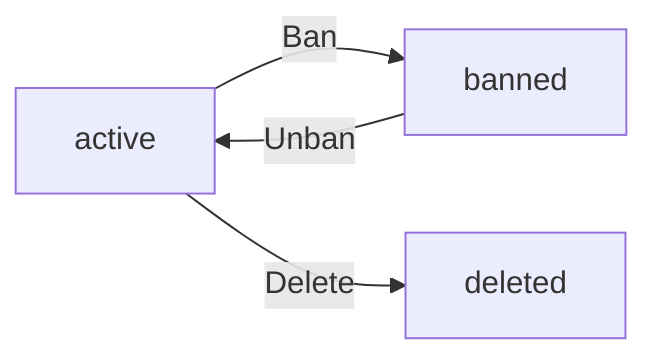

**discussionBoard — Actor definitions, permission matrix, authentication, session, account lifecycle**

Actor definitions, permission matrix, authentication, session, account lifecycle

# Actor Definitions

Define all user actor types with their roles and what they can do.

## guest Actor

A guest is an unauthenticated visitor who can browse and read content on the discussion board without logging in. Guests can view the list of all sections and browse articles within any section. They can read the full content of any article, including the title, author, content, attachments, tags, and time posted. Guests can download attached files and images from articles. They can search articles by title or content and filter search results by tags. Guests can view all comments on articles, seeing the author, content, and time posted for each comment. Guests cannot create articles, write comments, or perform any action that requires authentication. They cannot submit administrator requests or access any user-specific features such as profiles. When a guest attempts to perform restricted actions, they are prompted to sign up or log in.

### Guest Identity and Authentication Status

THE guest SHALL be an unauthenticated visitor who has not logged into the discussion board.

THE system SHALL identify a user as a guest when no valid authentication credentials are presented.

THE guest SHALL have read-only access to the discussion board content.

THE system SHALL NOT allow guests to create, edit, or delete any content on the platform.

THE system SHALL NOT allow guests to submit administrator requests or access user-specific features.

THE guest SHALL not have access to user profiles or any user-specific functionality.

WHEN a guest attempts to perform any action requiring authentication, THE system SHALL prompt the user to sign up or log in.

### Guest Section Browsing

THE system SHALL allow guests to view the list of all sections on the discussion board.

WHEN a guest views the section list, THE system SHALL display each section's name and description.

THE system SHALL allow guests to browse articles within any section without authentication.

WHEN a guest selects a section, THE system SHALL display the paginated list of articles in that section.

THE system SHALL allow guests to view the article list sorted by newest first or oldest first.

WHEN a guest browses articles in a section, THE system SHALL display the title, author, tags, comment count, and time posted for each article.

THE system SHALL NOT display the full article content in the section's article list.

### Guest Article Reading

THE system SHALL allow guests to view any single article with its full content.

WHEN a guest views an article, THE system SHALL display the title, author, content, attachments, tags, and time posted.

THE system SHALL allow guests to download attached files and images from any article.

THE system SHALL allow guests to access all public content on the discussion board regardless of section.

WHEN a guest attempts to access a non-existent article, THE system SHALL display an appropriate error message.

### Guest Search Capabilities

THE system SHALL allow guests to search articles by title or content.

WHEN a guest performs a search, THE system SHALL return matching articles from all sections.

THE system SHALL allow guests to filter search results by tags.

THE system SHALL display search results in a paginated format.

WHEN a guest's search returns no results, THE system SHALL display a message indicating no articles were found.

THE system SHALL allow guests to combine text search with tag filtering.

### Guest Comment Viewing

THE system SHALL allow guests to view all comments on any article.

WHEN a guest views comments on an article, THE system SHALL display the author, content, and time posted for each comment.

THE system SHALL display comments sorted by oldest first.

THE system SHALL NOT allow guests to write comments on any article.

THE system SHALL NOT allow guests to edit or delete any comments.

### Authentication Required Actions

WHEN a guest attempts to create an article, THE system SHALL reject the request and prompt authentication.

WHEN a guest attempts to write a comment, THE system SHALL reject the request and prompt authentication.

WHEN a guest attempts to edit any content, THE system SHALL reject the request and prompt authentication.

WHEN a guest attempts to delete any content, THE system SHALL reject the request and prompt authentication.

WHEN a guest attempts to attach files or images, THE system SHALL reject the request and prompt authentication.

WHEN a guest attempts to view a user profile, THE system SHALL reject the request and prompt authentication.

WHEN a guest attempts to submit an administrator request, THE system SHALL reject the request and prompt authentication.

THE authentication prompt SHALL provide options to sign up for a new account or log in with an existing account.

## member Actor

A member is an authenticated user who has completed registration and can fully participate in the discussion board. Members can create articles in any section with a required title, content, and section selection. They can attach multiple files and images to their articles and add free-text tags for categorization. Members can edit their own articles to modify the title, content, attachments, and tags at any time. They can delete their own articles, which removes all associated content. Members can write comments on any article, with comments appearing in chronological order. They can edit and delete their own comments. Members have a personal profile with a display name and bio that other users can view. Their profile displays all articles and comments they have written. Members can submit a request to become an administrator by providing a reason for their application. They can change their password and delete their account, which permanently removes all their articles and comments.

### Member Authentication Status

A member is an authenticated user who has successfully completed the registration process and logged into the discussion board.

WHEN a user successfully authenticates with valid credentials, THE system SHALL grant the user member status with full participation privileges.

THE system SHALL maintain the member's authentication status throughout their active session.

IF a member's session expires, THE system SHALL require re-authentication before allowing any member-only operations.

WHILE a user holds member status, THE system SHALL allow the user to perform all member-permitted operations defined in this section.

Members may perform all actions available to guests (defined in guest Actor section) plus the additional capabilities defined below.

### Article Creation Capabilities

Members can create articles in any section of the discussion board.

WHEN a member creates an article, THE system SHALL:
1. Require a title
2. Require content as text
3. Require selection of one section where the article will be published
4. Record the member as the article author
5. Record the time of creation

THE system SHALL allow members to attach multiple files to their articles.

THE system SHALL allow members to attach multiple images to their articles.

THE system SHALL allow members to add free-text tags to their articles for categorization.

IF a member submits an article without a title, THE system SHALL reject the request.

IF a member submits an article without content, THE system SHALL reject the request.

IF a member submits an article without selecting a section, THE system SHALL reject the request.

### Article Management

Members can manage articles they have authored.

WHEN a member edits their own article, THE system SHALL allow modification of the title, content, attachments, and tags.

WHEN a member deletes their own article, THE system SHALL remove the article and all associated content including comments and attachments.

IF a member attempts to edit an article authored by another user, THE system SHALL reject the request.

IF a member attempts to delete an article authored by another user, THE system SHALL reject the request.

Members cannot edit or delete articles authored by other members or administrators.

### Comment Participation

Members can participate in discussions by writing comments on articles.

WHEN a member writes a comment on an article, THE system SHALL:
1. Record the comment content
2. Record the member as the comment author
3. Record the time of creation
4. Associate the comment with the article

THE system SHALL display comments in chronological order with oldest comments appearing first.

THE system SHALL allow members to edit their own comments.

THE system SHALL allow members to delete their own comments.

IF a member attempts to edit a comment authored by another user, THE system SHALL reject the request.

IF a member attempts to delete a comment authored by another user, THE system SHALL reject the request.

Comments are single-level only with no nested replies permitted.

### Member Profile Management

Each member has a personal profile containing display name and bio.

THE system SHALL provide each member with a profile containing:
1. A display name
2. A bio text

WHEN a member edits their profile, THE system SHALL allow modification of the display name and bio.

THE system SHALL allow members to set a display name that identifies them to other users.

THE system SHALL allow members to write a bio to describe themselves.

Profile changes take effect immediately upon submission.

### Viewing Other Member Profiles

Members can view profiles of other users on the discussion board.

WHEN a member views another user's profile, THE system SHALL display:
1. The user's display name
2. The user's bio
3. A list of all articles written by that user
4. A list of all comments written by that user

THE system SHALL allow members to access any other member's profile regardless of authentication status.

Profile visibility extends to all registered users regardless of their role.

### Administrator Request Submission

Members can request to become administrators of the discussion board.

WHEN a member submits an administrator request, THE system SHALL:
1. Record the reason text provided by the member
2. Set the request status to pending
3. Record the time of submission
4. Associate the request with the requesting member

THE system SHALL allow members to submit only one pending administrator request at a time.

IF a member has a pending administrator request, THE system SHALL prevent submission of additional requests until the existing request is resolved.

Administrator requests are reviewed by super administrators (defined in admin Actor section).

### Account Management

Members can manage their own account settings and lifecycle.

WHEN a member changes their password, THE system SHALL:
1. Require the current password for verification
2. Require a new password
3. Update the member's password upon successful verification

IF the current password provided during password change is incorrect, THE system SHALL reject the request.

WHEN a member deletes their account, THE system SHALL:
1. Remove the member's user record
2. Delete all articles authored by the member
3. Delete all comments authored by the member
4. Remove the member's profile information

THE system SHALL perform account deletion as an irreversible operation.

Account deletion removes all traces of the member's participation content from the discussion board.

## admin Actor

An admin is a privileged user who can perform content moderation and platform management in addition to all member capabilities. There are two grades of administrators: regular administrators and super administrators. Regular administrators can create, edit, and delete sections that organize the discussion board. They can delete any article or comment, regardless of who authored it, for moderation purposes. Administrators can ban users from the platform, which prevents banned users from logging in while keeping their existing content visible. They can unban users and view the list of all banned users along with the recorded ban reasons. Super administrators have additional capabilities: they can view pending administrator requests and approve or reject them. Super administrators can promote regular administrators to super administrator status and can demote other super administrators to regular administrator status. A super administrator cannot demote themselves. Both grades of administrators retain all member privileges and can continue writing articles and comments.

### Administrator Roles and Grades

THE system SHALL support two grades of administrators: regular administrator and super administrator.

THE system SHALL grant administrator users all capabilities available to members.

THE system SHALL distinguish between regular administrators and super administrators based on their assigned grade.

Regular administrators SHALL have authority over section management, content moderation, and user banning.

Super administrators SHALL have all regular administrator capabilities plus administrator request management and administrator grade management.

IF a user is not assigned an administrator grade, THE system SHALL NOT grant them any administrator privileges.

WHEN an administrator performs any action, THE system SHALL verify their grade permits that specific action.

### Section Management

WHEN an administrator creates a section, THE system SHALL require a name and description.

THE system SHALL allow administrators to create new sections for organizing the discussion board.

THE system SHALL allow administrators to edit existing sections including their name and description.

THE system SHALL allow administrators to delete sections from the discussion board.

IF a section contains articles, THE system SHALL allow administrators to delete the section and handle the contained articles according to system policy.

WHEN an administrator modifies a section, THE system SHALL record the modification time.

### Content Moderation

THE system SHALL allow administrators to delete any article regardless of author.

THE system SHALL allow administrators to delete any comment regardless of author.

WHEN an administrator deletes an article, THE system SHALL remove the article and all associated comments.

WHEN an administrator deletes a comment, THE system SHALL remove only that comment while preserving the article and other comments.

IF a non-administrator attempts to delete another user's article or comment, THE system SHALL reject the request.

### User Ban Management

THE system SHALL allow administrators to ban users from the platform.

WHEN an administrator bans a user, THE system SHALL require a ban reason to be recorded.

THE system SHALL prevent banned users from logging in.

THE system SHALL preserve banned users' existing articles and comments as visible content.

THE system SHALL allow administrators to unban previously banned users.

THE system SHALL allow administrators to view the list of all banned users.

WHEN an administrator views the list of banned users, THE system SHALL display each banned user along with their recorded ban reason.

### Administrator Request Management

THE system SHALL allow super administrators to view pending administrator requests.

WHEN a super administrator approves an administrator request, THE system SHALL change the requesting user's role to regular administrator.

WHEN a super administrator rejects an administrator request, THE system SHALL NOT change the requesting user's role.

THE system SHALL record the super administrator's decision for each administrator request.

IF a regular administrator attempts to approve or reject administrator requests, THE system SHALL reject the request.

### Administrator Grade Management

THE system SHALL allow super administrators to promote regular administrators to super administrator status.

THE system SHALL allow super administrators to demote other super administrators to regular administrator status.

THE system SHALL NOT allow a super administrator to demote themselves.

IF a super administrator attempts to demote themselves, THE system SHALL reject the request.

IF a regular administrator attempts to promote or demote administrators, THE system SHALL reject the request.

WHEN a super administrator changes another administrator's grade, THE system SHALL update that administrator's privileges immediately.

# Authentication Flows

Registration, login, session management, and token policies.

## Registration and Login

Define user registration and login flows including validation and error handling.

### User Registration

### Registration Flow

WHEN a guest submits a registration request, THE system SHALL require an email address and a password.

THE system SHALL validate that the email address conforms to a valid email format.

THE system SHALL validate that the password meets minimum security requirements.

IF the email address is already registered, THE system SHALL reject the registration request.

IF the email format is invalid, THE system SHALL reject the registration request.

IF the password does not meet security requirements, THE system SHALL reject the registration request.

WHEN all validation passes, THE system SHALL create a new user account with the provided email and password.

WHEN a user account is created, THE system SHALL initialize the account with a default display name and empty bio.

### Password Requirements

THE system SHALL require passwords to meet minimum complexity requirements.

IF a password is submitted that does not meet complexity requirements, THE system SHALL reject the registration request with an appropriate error message.

### Duplicate Email Handling

IF a registration is attempted with an email already in use, THE system SHALL reject the request.

THE system SHALL NOT reveal whether an email is already registered when rejecting a registration request for security reasons.

### Registration Success

WHEN registration is successful, THE system SHALL create the user account and authenticate the user.

THE system SHALL NOT require email verification before allowing access to the platform.

### User Login

### Login Flow

WHEN a user submits a login request, THE system SHALL require an email address and a password.

THE system SHALL validate the provided credentials against stored user records.

IF the email address is not registered, THE system SHALL reject the login request.

IF the password does not match the stored password for the email, THE system SHALL reject the login request.

IF both email and password are valid, THE system SHALL authenticate the user.

### Banned User Login Prevention

IF the user account is banned, THE system SHALL reject the login request.

WHEN rejecting a login from a banned user, THE system SHALL NOT allow access to the platform.

### Login Failure Handling

THE system SHALL NOT indicate whether the failure was due to an unrecognized email or incorrect password.

THE system SHALL provide a generic error message for failed login attempts.

### Login Success

WHEN login is successful, THE system SHALL establish an authenticated session for the user.

THE system SHALL grant access to all member-level capabilities upon successful login.

### Authentication Process

### Authentication Mechanism

THE system SHALL authenticate users exclusively through email and password credentials.

THE system SHALL NOT support alternative authentication methods such as social login or single sign-on.

### Authentication Verification

WHEN a user attempts to perform an authenticated action, THE system SHALL verify the user's authentication status.

IF the user is not authenticated, THE system SHALL deny access to authenticated operations.

### Password Comparison

THE system SHALL compare submitted passwords against stored password hashes.

THE system SHALL NOT store passwords in plain text.

### Authentication State

THE system SHALL maintain authentication state during the user's active session.

WHEN a user's session expires or is terminated, THE system SHALL require re-authentication.

## Session and Token Policy

Define session duration, token refresh, and expiration policies.

### Session Lifecycle

WHEN a member successfully logs in, THE system SHALL create a new session for the user.

THE system SHALL associate each session with exactly one member account.

WHILE a session is active, THE system SHALL maintain the session state until it expires or the member logs out.

WHEN a member logs out, THE system SHALL terminate the session immediately.

THE system SHALL allow only one active session per member at a time.

WHEN a new session is created for a member with an existing active session, THE system SHALL terminate the previous session.

IF a banned user attempts to access a session, THE system SHALL reject the request and prevent session creation.

### JWT Token Generation

WHEN a session is created, THE system SHALL generate a JSON Web Token (JWT) for authentication.

THE system SHALL include the following claims in each JWT:
- User identifier
- Session identifier
- Token expiration timestamp
- Token type (access or refresh)

THE system SHALL sign each JWT using a secure cryptographic algorithm.

THE system SHALL NOT store sensitive user information (such as passwords) in JWT claims.

WHEN a JWT is generated, THE system SHALL return the token to the member's client.

THE system SHALL NOT expose JWT tokens in server-side logs or error messages.

### Access Token Expiration

THE system SHALL set an expiration time for each access token.

THE system SHALL define the access token expiration period as a fixed duration from the time of generation.

WHEN an access token expires, THE system SHALL reject any API request that uses the expired token.

IF an access token is presented after its expiration time, THE system SHALL return an authentication error.

THE system SHALL NOT automatically extend access token expiration without member interaction.

THE system SHALL provide the token expiration time to the member's client upon token generation.

### Refresh Token Policy

WHEN a session is created, THE system SHALL generate a refresh token alongside the access token.

THE system SHALL define a refresh token expiration period longer than the access token expiration period.

WHEN a member presents a valid refresh token, THE system SHALL issue a new access token.

WHEN a member presents a valid refresh token, THE system SHALL issue a new refresh token.

THE system SHALL invalidate the previous refresh token when issuing a new one.

IF a refresh token is expired, THE system SHALL reject the refresh request and require the member to log in again.

WHEN a session is terminated (by logout or new session creation), THE system SHALL invalidate all associated refresh tokens.

IF an invalid refresh token is presented, THE system SHALL reject the request and terminate the associated session.

### Token Validation

WHEN an API request is made, THE system SHALL validate the JWT token before processing the request.

THE system SHALL verify the JWT signature using the stored cryptographic key.

THE system SHALL validate that the token has not expired based on the expiration claim.

THE system SHALL verify that the session associated with the token is still active.

IF a member's account is banned, THE system SHALL reject all token validation requests for that member.

THE system SHALL reject tokens that have been tampered with or have invalid signatures.

THE system SHALL return an appropriate error message when token validation fails without revealing security details.

# Account Lifecycle

Account state transitions and lifecycle management.

## Account States and Transitions

Define account states (active, suspended, deleted) and valid transitions.

### Account State Definition

THE system SHALL maintain exactly one state for each user account at any given time.

THE system SHALL define the following account states:
1. **Active** — the user can log in and use the platform normally
2. **Banned** — the user cannot log in; their existing content remains visible
3. **Deleted** — the account no longer exists; all user content is removed

WHEN a new user completes registration, THE system SHALL set the account state to "active".

THE system SHALL persist the current state as part of the user account record.

### Account Suspension

WHEN an administrator bans a user, THE system SHALL change the account state from "active" to "banned".

WHEN an administrator bans a user, THE system SHALL record the ban reason.

THE system SHALL allow administrators to view the ban reason for each banned user.

WHILE an account is in "banned" state, THE system SHALL prevent the user from logging in.

WHILE an account is in "banned" state, THE system SHALL keep all articles and comments created by that user visible to other users.

WHEN an administrator unbans a user, THE system SHALL change the account state from "banned" to "active".

WHEN an administrator unbans a user, THE system SHALL remove the ban reason from the active record.

IF a banned user attempts to log in, THE system SHALL reject the login attempt and display an appropriate message.

### Account Deletion

WHEN a user requests account deletion, THE system SHALL change the account state from "active" to "deleted".

WHEN an account transitions to "deleted" state, THE system SHALL permanently remove all articles created by that user.

WHEN an account transitions to "deleted" state, THE system SHALL permanently remove all comments created by that user.

WHEN an account transitions to "deleted" state, THE system SHALL permanently remove all attachments associated with that user's articles.

IF the account is already in "deleted" state, THE system SHALL reject any subsequent deletion request.

IF a banned user requests account deletion, THE system SHALL reject the deletion request.

WHEN an account is deleted, THE system SHALL remove the user's authentication credentials.

THE system SHALL NOT allow recovery of a deleted account or its associated content.

### State Transition Rules

THE system SHALL permit the following state transitions:

1. **Active → Banned**: administrators can ban active users
2. **Banned → Active**: administrators can unban banned users
3. **Active → Deleted**: users can delete their own active accounts

THE system SHALL NOT permit the following transitions:

1. **Banned → Deleted**: banned users cannot delete their accounts
2. **Deleted → Any**: deleted accounts cannot transition to any other state
3. **Banned → Banned**: an account cannot be banned twice

IF a state transition is requested that violates these rules, THE system SHALL reject the request.

THE system SHALL maintain an audit trail of all state transitions including:
- The previous state
- The new state
- The timestamp of the transition
- The actor who initiated the transition (user themselves, or administrator)