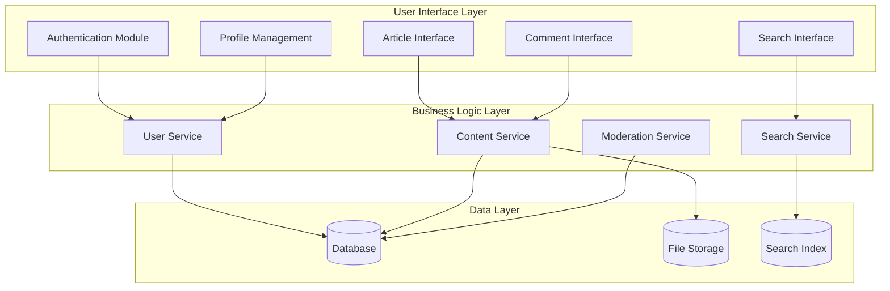
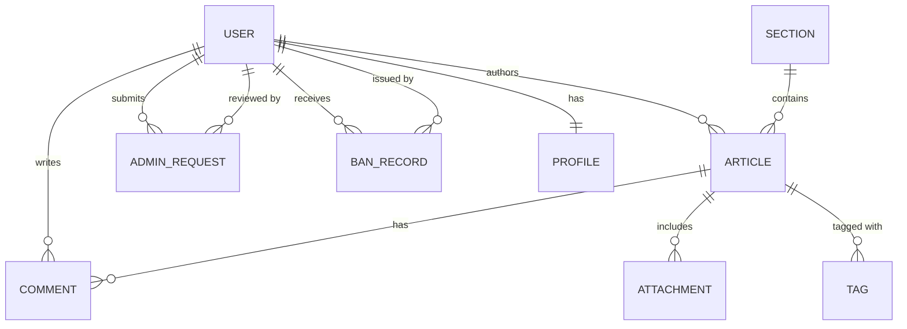
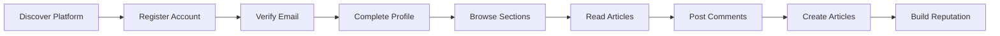
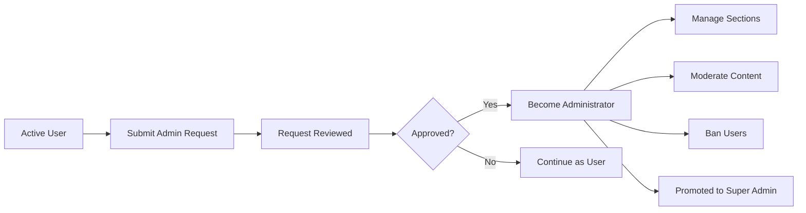

# Economic/Political Discussion Board - Service Overview

## Executive Summary

The Economic/Political Discussion Board is a specialized online platform designed to facilitate meaningful discourse on economic and political topics. In an era of fragmented social media and algorithm-driven content, this platform provides a structured, moderated environment where users can engage in substantive discussions, share well-researched articles, and build a community around informed debate.

The platform distinguishes itself through thoughtful content organization via sections, rich article creation capabilities with file and image attachments, a transparent administrator hierarchy, and robust moderation tools that maintain discussion quality while preserving user engagement.

## Business Justification

### Why This Service Exists

**The Problem**: Current online discussion platforms suffer from several critical issues that degrade the quality of economic and political discourse:

1. **Lack of Structure**: General-purpose social media platforms treat all content equally, making it difficult to organize discussions by topic or find relevant historical discussions.

2. **Poor Content Persistence**: Valuable articles and discussions get buried in timeline-based feeds, with no systematic way to retrieve or reference them later.

3. **Inadequate Moderation**: Many platforms either over-moderate (suppressing legitimate discourse) or under-moderate (allowing harassment and low-quality content to flourish).

4. **No Content Richness**: Simple text-only discussions limit the ability to share research papers, data visualizations, and supporting evidence that elevate economic and political debates.

5. **Opaque Administration**: Users often don't understand moderation decisions or how administrators are selected, leading to distrust and community fragmentation.

**The Opportunity**: There is a clear market gap for a discussion platform that:
- Prioritizes content quality and organization over engagement metrics
- Provides transparent governance through a clear administrative hierarchy
- Supports rich content including files, images, and tags
- Maintains discussion quality through user-driven moderation with clear accountability

### Market Context

The demand for specialized discussion platforms has grown significantly, particularly for:
- Academic and research communities seeking structured debate forums
- Professional analysts and commentators requiring persistent, searchable content
- Civic-minded individuals wanting substantive political discourse
- Economic researchers sharing data and analysis

Existing general-purpose platforms (Reddit, Twitter/X, Facebook Groups) fail to serve these users adequately because they prioritize viral content over substantive discussion.

## Target Audience

### Primary User Segments

**1. Knowledge Seekers**
- Individuals seeking informed perspectives on economic and political issues
- Students and researchers looking for primary sources and analysis
- Civic-minded citizens wanting to understand policy implications
- Characteristics: Value depth over brevity, appreciate structured discussions, seek evidence-based arguments

**2. Content Contributors**
- Subject matter experts sharing analysis and research
- Journalists and commentators building an audience
- Academics disseminating findings to broader audiences
- Characteristics: Need rich media support, value attribution and profile visibility, require content organization tools

**3. Community Moderators**
- Individuals willing to take administrative responsibility
- Users invested in maintaining discussion quality
- Those seeking recognition through administrative roles
- Characteristics: Active participation history, interest in governance, commitment to fair moderation

**4. Platform Administrators**
- Super administrators: Platform founders or designated leadership
- Regular administrators: Approved moderators managing day-to-day operations
- Characteristics: Strategic thinkers, conflict resolvers, policy enforcers

### Secondary Audiences

- **Lurkers/Readers**: Users who consume content without actively participating
- **Casual Participants**: Users who occasionally comment but don't create articles
- **Researchers**: Academic users mining discussion data for research purposes

## Core Value Proposition

### For All Users

WHEN a user accesses the platform, THE system SHALL provide a structured environment where economic and political discussions are organized into clearly defined sections, enabling users to find relevant content efficiently.

WHEN a user creates or views content, THE system SHALL support rich article creation with file attachments, image embeds, and tagging, allowing users to share comprehensive, evidence-based content.

### For Content Contributors

WHEN a user creates an article, THE system SHALL preserve their content permanently (unless deleted by the author), ensuring valuable discussions remain accessible over time.

WHEN a user contributes content, THE platform SHALL provide user profiles that showcase an author's contribution history, building reputation and credibility within the community.

### For Community Moderators

WHEN a user requests administrative privileges, THE platform SHALL offer a transparent administrator selection process where any user can request administrative privileges, ensuring governance is accessible to committed community members.

WHEN administrators moderate content, THE system SHALL provide clear tools for section management, content removal, and user banning with documented reasons.

### For Platform Governance

WHEN managing administrative hierarchy, THE platform SHALL implement a two-tier administrative hierarchy (regular administrator and super administrator) with clear promotion and demotion pathways, ensuring accountable and scalable governance.

WHEN a user is banned, THE system SHALL prevent their login while preserving their historical content, maintaining discussion continuity while enforcing community standards.

## Competitive Differentiation

### Comparison with Existing Platforms

| Feature | This Platform | Reddit | Twitter/X | Facebook Groups |
|---------|--------------|--------|-----------|-----------------|
| Content Organization | Structured sections | Subreddits | Hashtags only | Basic categories |
| Rich Media Support | Files, images, tags | Limited | Limited | Limited |
| Admin Transparency | Request-based hierarchy | Opaque | Opaque | Opaque |
| Content Persistence | Permanent | Archived | Ephemeral | Variable |
| Moderation Clarity | Documented reasons | Variable | Unclear | Unclear |
| Discussion Depth | Structured, single-level | Nested threads | Linear | Linear |

### Unique Differentiators

**1. Transparent Administrator Hierarchy**
- Unlike platforms with hidden moderation decisions, this system provides:
  - Open application process for administrative roles
  - Clear distinction between regular and super administrators
  - Documented reasons for user bans
  - Visible administrative actions

**2. Rich Content Support**
- File attachments for research papers and supporting documents
- Image embeds for charts, graphs, and visual evidence
- Flexible tagging for cross-topic discoverability
- Full content preservation and searchability

**3. Balanced Moderation Model**
- Banned users' content remains visible (preserves discussion context)
- Clear demotion rules prevent administrative abuse
- Super administrators cannot self-demote (accountability mechanism)
- Two-tier system allows delegation while maintaining oversight

**4. Quality-Focused Architecture**
- No algorithmic feed manipulation
- User-controlled sorting (newest/oldest)
- Paginated content for systematic browsing
- Search functionality across titles and content

## Revenue Strategy

### Revenue Model Framework

While the primary focus is building a quality discussion community, several sustainable revenue pathways exist:

**Phase 1: Community Building (Years 1-2)**
- Focus entirely on user acquisition and content quality
- No monetization to avoid friction in community growth
- Build critical mass of active contributors

**Phase 2: Premium Features (Years 2-3)**
- **Verified Expert Badges**: Paid verification for subject matter experts with credentials
- **Enhanced Profiles**: Premium profile customization and analytics
- **Ad-Free Experience**: Subscription option for removing any advertising

**Phase 3: Sustainable Revenue (Year 3+)**
- **Contextual Advertising**: Non-intrusive, topic-relevant advertising in sections
- **Sponsored Sections**: Organizations can sponsor dedicated discussion sections
- **API Access**: Research institutions can access anonymized discussion data
- **Premium Analytics**: Advanced content performance metrics for power users

### Revenue Principles

1. **User Experience First**: Monetization never degrades the core discussion experience
2. **Transparency**: All sponsored content clearly labeled
3. **Data Privacy**: User data never sold; only aggregated, anonymized insights offered
4. **Community Benefit**: Revenue reinvested in platform improvements and moderation

### Growth Strategy

**User Acquisition**:
- Content marketing through high-quality featured articles
- Partnerships with academic institutions and think tanks
- Referral programs rewarding active contributors
- SEO optimization for economic and political topics

**User Retention**:
- Quality moderation maintaining discussion standards
- Profile reputation systems encouraging continued contribution
- Regular community events and featured discussions
- Responsive feature development based on user feedback

## Success Metrics

### Key Performance Indicators (KPIs)

**Engagement Metrics**:
- **Monthly Active Users (MAU)**: Target 10,000+ by end of Year 1
- **Daily Active Users (DAU)**: Target 30% of MAU ratio
- **Articles Created per Month**: Target 500+ by end of Year 1
- **Comments per Article**: Target 5+ average, indicating healthy discussion
- **Session Duration**: Target 8+ minutes, suggesting quality engagement

**Content Quality Metrics**:
- **Articles with Attachments**: Percentage of articles including files/images (target 40%+)
- **Tag Usage Rate**: Average tags per article (target 3+)
- **Search Usage**: Percentage of sessions including search activity (target 20%+)
- **Article Completion Rate**: Users reading full article content (target 70%+)

**Community Health Metrics**:
- **User Retention Rate**: 30-day retention target 40%+
- **Administrator Application Rate**: Users seeking admin roles (indicates community investment)
- **Moderation Actions Ratio**: Bans per 1000 users (should remain low, target <5)
- **User-Reported Issues**: Low volume indicates self-policing community

**Governance Metrics**:
- **Admin Action Transparency**: Percentage of bans with documented reasons (target 100%)
- **Admin Response Time**: Time from content report to action (target <24 hours)
- **Admin Retention**: Administrator tenure and activity levels

### Success Criteria by Phase

**Launch Phase (Months 1-6)**:
- 1,000 registered users
- 100+ articles created
- 5+ sections with active discussion
- 2+ approved administrators
- System stability with 99.5%+ uptime

**Growth Phase (Months 6-18)**:
- 5,000+ registered users
- 500+ articles created
- 10+ active sections
- 5+ approved administrators
- Active search functionality usage
- Established content moderation patterns

**Maturity Phase (Month 18+)**:
- 10,000+ registered users
- Self-sustaining content creation cycle
- Active administrator request pipeline
- Recognized platform in economic/political discourse community
- Sustainable revenue streams established

## Platform Vision

The Economic/Political Discussion Board aims to become the definitive online destination for structured, evidence-based discourse on economic and political topics. By combining thoughtful content organization, rich media support, transparent governance, and quality-focused moderation, the platform addresses the fundamental failures of existing discussion platforms.

Success means creating a self-sustaining community where:
- Quality contributions are recognized and preserved
- Moderation is transparent and fair
- Users feel ownership through administrative participation
- Discussions remain accessible and valuable over time

The platform serves not just as a discussion board, but as a knowledge repository and community governance experiment that could inform how online communities operate in the future.

## System Architecture Overview

### Core Functional Modules

### Data Entity Relationships

## Service Components

### Authentication and Authorization Module

THE system SHALL provide a unified authentication module that handles:
- User registration with email and password
- User login with credential validation
- Password change functionality
- Account deletion with cascade content removal
- Session management with JWT tokens
- Permission-based access control

### User Profile Module

THE system SHALL provide a profile management module that handles:
- Profile creation upon registration
- Profile viewing for all users
- Profile editing by profile owner
- Activity history display (articles and comments)

### Content Management Module

THE system SHALL provide a content management module that handles:
- Article creation with rich content support
- File and image attachment management
- Tag association and filtering
- Article editing by authors
- Article deletion by authors or administrators
- Comment creation and management

### Section Organization Module

THE system SHALL provide a section management module that handles:
- Section creation by administrators
- Section editing by administrators
- Section deletion with article handling
- Section browsing by all users

### Search and Discovery Module

THE system SHALL provide a search module that handles:
- Full-text search across articles
- Tag-based filtering
- Paginated result display
- Sorting options (newest/oldest)

### Moderation Module

THE system SHALL provide a moderation module that handles:
- Administrator request workflow
- Content moderation (article/comment deletion)
- User banning with reason tracking
- Ban list management
- Administrative hierarchy management

## User Journey Overview

### New User Journey

### Administrator Journey

## Integration Points

### Internal Integrations

THE system SHALL integrate the following internal components:
- Authentication service with all protected endpoints
- Content service with search indexing
- User profile service with content attribution
- Moderation service with user management

### External Integration Capabilities

THE system SHALL support future integration with:
- Email notification services
- File storage providers (cloud storage)
- Search indexing services
- Analytics platforms

## Deployment Considerations

### Infrastructure Requirements

THE system SHALL be deployable on:
- Cloud infrastructure (AWS, GCP, Azure)
- Containerized environments (Docker, Kubernetes)
- Traditional server environments

### Scalability Design

THE system architecture SHALL support:
- Horizontal scaling for API servers
- Database read replicas for query performance
- CDN integration for file attachments
- Caching layer for frequently accessed content

## Security Foundation

### Authentication Security

THE system SHALL implement:
- Secure password hashing (bcrypt or argon2)
- JWT-based session management
- Token refresh mechanisms
- Protection against brute force attacks

### Authorization Security

THE system SHALL implement:
- Role-based access control (RBAC)
- Permission checks on all protected resources
- Administrative action logging
- Session invalidation on permission changes

### Data Security

THE system SHALL implement:
- Encryption for sensitive data at rest
- HTTPS for all communications
- Input validation and sanitization
- Protection against common web vulnerabilities (XSS, CSRF, SQL Injection)

## Quality Assurance

### Performance Standards

THE system SHALL meet the following performance targets:
- Page load time: Under 2 seconds
- API response time: Under 500ms for most operations
- File upload time: Under 5 seconds for files within size limits
- Search response time: Under 2 seconds for typical queries

### Reliability Standards

THE system SHALL maintain:
- 99.5% uptime target
- Graceful degradation under load
- Automated error recovery where possible
- Comprehensive logging for troubleshooting

## Future Evolution

### Planned Enhancements

THE platform SHALL be designed to accommodate future features:
- Article bookmarking and collections
- User following and activity feeds
- Article versioning and edit history
- Advanced search with filters and operators
- API for third-party integration
- Mobile application support

### Extensibility Design

THE system architecture SHALL support:
- Plugin architecture for future features
- Webhook support for external integrations
- Customizable notification preferences
- Localization and internationalization