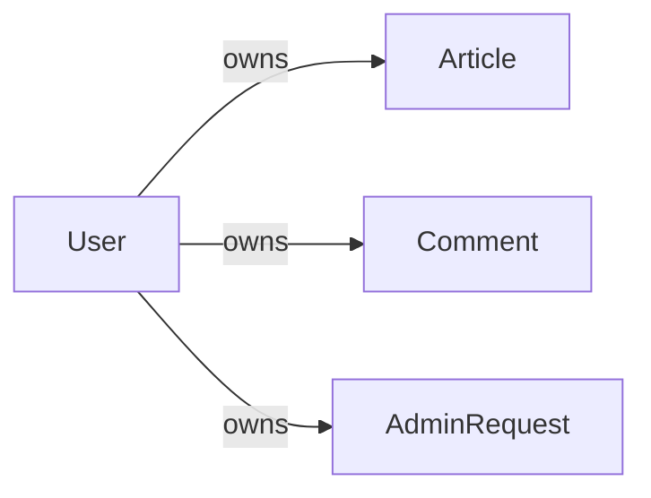
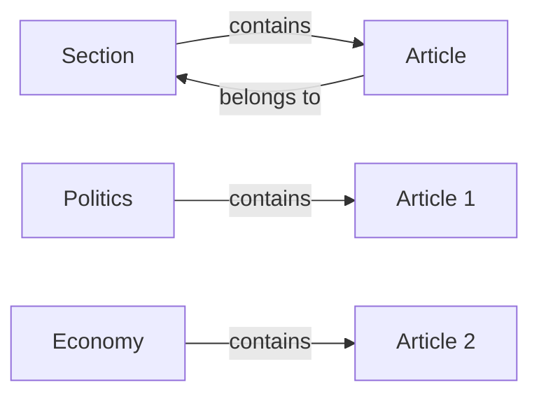
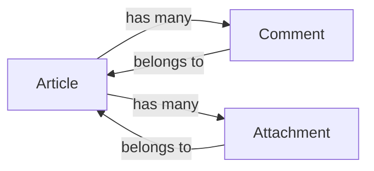
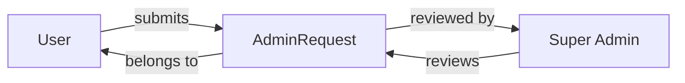
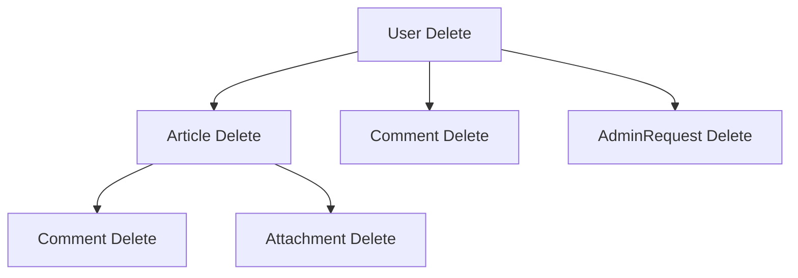
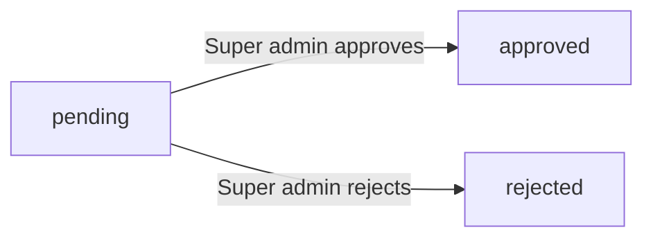
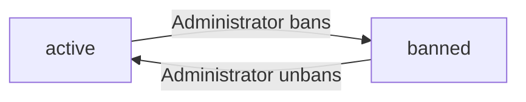
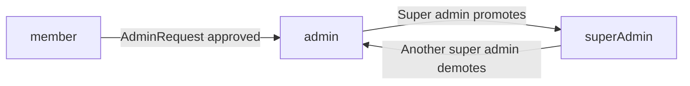

**discussionBoard — Business concepts, relationships, and states from user perspective**

Business concepts, relationships, and states from user perspective

# Domain Concepts

Describe what each concept means to users and why it exists.

## User Concept

A User represents an individual who participates in the discussion board. Users are the core actors in the system, enabling the creation of content and interaction with others. Every user begins by registering with an email address and password, establishing their unique identity on the platform. The email serves as the primary identifier for logging in and must be unique across the system. Users can personalize their presence through a display name and bio text, which appear on their profile page for others to see. Profiles showcase a user's contributions, listing all articles and comments they have authored. Users have full control over their own content, including the ability to edit and delete their articles and comments. Users can also manage their account security by changing their password when needed. Account deletion is available, which permanently removes the user along with all their articles and comments. Some users may take on administrative roles, gaining additional capabilities to manage the platform. Users can be banned by administrators, which prevents them from logging in while leaving their existing content visible.

### User Registration and Identity

### User Registration

WHEN a person registers on the platform, THE system SHALL require a unique email address.
WHEN a person registers on the platform, THE system SHALL require a password.
WHEN a person submits a registration request, THE system SHALL create a new user account.
IF an email address is already registered, THE system SHALL reject the registration request.

### Email as Identity

THE system SHALL use the email address as the primary identifier for each user.
THE system SHALL ensure each email address is associated with exactly one user account.
WHEN a user logs in, THE system SHALL identify the user by their email address.

### User Identity

THE system SHALL assign a unique identifier to each user upon registration.
THE system SHALL maintain the user's identity across all their contributions (articles and comments).
WHEN a user's account is deleted, THE system SHALL remove all associations with that user identity.

### Login Authentication

### Login Process

WHEN a user attempts to log in, THE system SHALL require their email address and password.
WHEN a user submits valid credentials, THE system SHALL authenticate the user and establish a session.
IF the email address does not exist in the system, THE system SHALL reject the login attempt.
IF the password does not match the stored password for the email, THE system SHALL reject the login attempt.

### Password Security

THE system SHALL store user passwords in a securely encrypted form.
WHEN a user requests to change their password, THE system SHALL require authentication of the current password.
WHEN a user successfully changes their password, THE system SHALL update the stored credentials.
IF a banned user attempts to log in, THE system SHALL deny access regardless of correct credentials.

### Session Management

WHEN a user successfully logs in, THE system SHALL grant access to member-only features.
WHEN a user logs out, THE system SHALL terminate their session.

### User Profile

### Profile Content

THE system SHALL provide each user with a profile containing a display name and bio text.
WHEN a user views their own profile, THE system SHALL display their display name, bio, and contribution history.
WHEN a user views another user's profile, THE system SHALL display that user's display name, bio, and contribution history.

### Display Name Personalization

WHEN a user sets their display name, THE system SHALL store and display it on their profile and contributions.
WHEN a user edits their display name, THE system SHALL update the name shown on all their past contributions.
THE system SHALL allow users to change their display name at any time.

### Bio Text

WHEN a user edits their bio, THE system SHALL store the bio text on their profile.
THE system SHALL display the bio text when any user views the profile.

### Contributor History

WHEN a user profile is viewed, THE system SHALL display a list of all articles authored by that user.
WHEN a user profile is viewed, THE system SHALL display a list of all comments authored by that user.
THE system SHALL maintain the contributor history throughout the user's account lifetime.

### Account Management

### Self-Service Account Operations

THE system SHALL allow authenticated users to change their own password.
THE system SHALL allow authenticated users to edit their own display name.
THE system SHALL allow authenticated users to edit their own bio text.
THE system SHALL allow authenticated users to delete their own account.

### Account Deletion

WHEN a user deletes their account, THE system SHALL permanently remove the user record.
WHEN a user deletes their account, THE system SHALL delete all articles authored by that user.
WHEN a user deletes their account, THE system SHALL delete all comments authored by that user.
WHEN a user deletes their account, THE system SHALL remove their profile from public view.
THE system SHALL NOT allow recovery of a deleted account.

### Administrative Roles

### Administrator Status

THE system SHALL support users with administrative privileges.
THE system SHALL distinguish between regular administrators and super administrators.
WHEN a user is granted administrator status, THE system SHALL record their administrator grade.

### Role Hierarchy

THE system SHALL allow super administrators to manage regular administrators.
THE system SHALL allow super administrators to promote regular administrators to super administrator status.
THE system SHALL allow super administrators to demote other super administrators to regular administrator status.
THE system SHALL NOT allow a super administrator to demote themselves.

### Administrative Capabilities

Administrators SHALL retain all capabilities of regular members, including creating articles and comments.
THE system SHALL grant administrators additional capabilities to manage platform content and users.

### User Banning

### Ban Status

THE system SHALL support banning users from the platform.
WHEN an administrator bans a user, THE system SHALL record a reason for the ban.
THE system SHALL maintain a list of all banned users accessible to administrators.

### Ban Effects

WHEN a banned user attempts to log in, THE system SHALL deny access.
WHEN a user is banned, THE system SHALL preserve their existing articles and comments.
THE system SHALL continue to display a banned user's articles and comments to other users.
WHEN a user is banned, THE system SHALL retain their profile information.

### Ban Management

THE system SHALL allow administrators to unban previously banned users.
WHEN an administrator views a banned user, THE system SHALL display the ban reason.

## Section Concept

A Section represents a thematic category that organizes articles into meaningful topic areas. Sections structure the discussion board into distinct areas such as Politics, Economy, or Current Affairs. Each section has a name and description that helps users understand what topics belong there. Only administrators can create, edit, and delete sections, ensuring organized and appropriate categorization. Users browse sections to find articles that match their interests, viewing the list of all available sections. When creating an article, users must select one section where their article will be published. This categorization helps readers navigate the platform and locate relevant discussions. The section structure supports a well-organized community where topics are clearly separated and easy to find.

### Topic Categorization

### Purpose of Sections

THE system SHALL organize articles into thematic categories called sections.

THE system SHALL allow each section to represent a distinct topic area for discussion.

### Section Attributes

Each section SHALL have a name that identifies the topic area.

Each section SHALL have a description that explains what types of articles belong in that section.

THE system SHALL display the section name and description to users browsing available sections.

### Category Examples

THE system SHALL support sections such as Politics for political discussions and debates.

THE system SHALL support sections such as Economy for economic topics and financial discussions.

THE system SHALL support sections such as Current Affairs for recent news and ongoing events.

THE system SHALL allow administrators to create additional sections beyond these examples as the community grows.

### Section Organization

### Section Structure

THE system SHALL maintain a list of all available sections.

THE system SHALL present sections as the primary means of organizing content on the discussion board.

THE system SHALL ensure that every article belongs to exactly one section.

### Section Visibility

THE system SHALL make all sections visible to all users regardless of authentication status.

THE system SHALL not hide or restrict access to any section based on user role.

### Topic Structure

THE system SHALL structure discussion areas into clearly separated sections.

THE system SHALL prevent overlap between sections through distinct names and descriptions.

THE system SHALL allow users to understand the purpose of each section through its name and description.

### Administrator Management of Sections

### Section Creation

WHEN an administrator creates a new section, THE system SHALL require a name and description.

THE system SHALL only allow administrators to create new sections.

IF a non-administrator user attempts to create a section, THE system SHALL reject the request.

### Section Modification

WHEN an administrator edits a section, THE system SHALL allow changes to the name and description.

THE system SHALL only allow administrators to edit existing sections.

### Section Deletion

WHEN an administrator deletes a section, THE system SHALL remove the section from the list.

IF a section contains articles, THE system SHALL handle the section deletion according to platform policy.

THE system SHALL only allow administrators to delete sections.

### Content Classification

### Article Classification

WHEN a user creates an article, THE system SHALL require selection of one section for article placement.

THE system SHALL not allow an article to exist without being assigned to a section.

THE system SHALL display the section assignment prominently on each article.

### Section Assignment Rules

WHEN a user creates an article, THE system SHALL present a list of all available sections for selection.

THE system SHALL not allow users to create new sections during article creation.

THE system SHALL allow users to select only from existing sections defined by administrators.

### Reclassification

WHEN an author edits their article, THE system SHALL allow changing the section assignment.

THE system SHALL allow administrators to reclassify any article to a different section.

### Browsing by Section

### Section Discovery

THE system SHALL provide users the ability to view the complete list of all sections.

THE system SHALL display each section's name and description in the section list.

### Section Navigation

WHEN a user selects a section, THE system SHALL display all articles within that section.

THE system SHALL provide navigation from any section listing to its contained articles.

THE system SHALL allow users to navigate between different sections freely.

### Discussion Areas Access

THE system SHALL organize the discussion board into clearly accessible discussion areas through sections.

THE system SHALL enable users to find articles matching their interests by browsing relevant sections.

### Article Placement

### Placement Process

WHEN a user creates an article, THE system SHALL place the article in the selected section.

THE system SHALL immediately display the article in the section's article list after creation.

### Visibility Within Section

THE system SHALL display each article in exactly one section's article list.

THE system SHALL not display articles across multiple sections simultaneously.

### Section Context Display

WHEN a user views an article, THE system SHALL display which section the article belongs to.

THE system SHALL allow users to navigate from an article to its parent section.

### Placement Consistency

THE system SHALL maintain consistent article placement within a single section until the article is deleted or reclassified.

## Article Concept

An Article represents the primary content unit where users share their thoughts and ideas on economic or political topics. Each article consists of a title and body content, created by a registered user and published within a specific section. Users can enhance their articles by attaching files and images, allowing them to share supporting materials and visual content. Multiple attachments can be added to a single article, providing rich context for readers. Articles can also be tagged with free-text keywords, enabling flexible categorization and improved discoverability. The article author has full control over their work and can edit the title, content, attachments, and tags at any time. Authors can also delete their articles when they no longer wish to keep them published. Other users can view articles, read the full content, download attachments, and leave comments. Articles appear in lists showing the title, author, tags, comment count, and posting time.

### Article Entity

An Article represents the primary content unit where users share their thoughts and ideas on economic or political topics.

THE system SHALL define an Article entity with the following core attributes:
1. Title — the headline or subject of the article
2. Content — the body text containing the user's ideas and arguments
3. Tags — free-text keywords for flexible categorization
4. Creation timestamp — the date and time when the article was published

Each article SHALL belong to exactly one Section and have exactly one author (User).

Each article SHALL serve as a container for zero or more Attachments and zero or more Comments.

Each article SHALL have a title that provides a brief summary of the topic being discussed.

Each article SHALL have content that contains the full text of the user's contribution.

THE system SHALL allow an article to exist without any attachments.

THE system SHALL allow an article to exist without any comments.

THE system SHALL display the author's display name alongside the article title in article lists.

THE system SHALL display the creation timestamp to show when the article was published.

### Article Creation

Users create articles to contribute their perspectives on economic and political topics.

WHEN a user creates an article, THE system SHALL require the user to select exactly one Section for the article.

WHEN a user creates an article, THE system SHALL require the user to provide a title.

WHEN a user creates an article, THE system SHALL require the user to provide content text.

WHEN a user creates an article, THE system SHALL record the creating user as the author.

WHEN a user creates an article, THE system SHALL record the current date and time as the creation timestamp.

WHEN a user creates an article, THE system SHALL allow the user to attach zero or more files.

WHEN a user creates an article, THE system SHALL allow the user to attach zero or more images.

WHEN a user creates an article, THE system SHALL allow the user to add zero or more tags.

THE system SHALL publish the article immediately upon creation, making it visible to all users.

THE system SHALL associate the article with the selected section for browsing and categorization purposes.

### Article Title and Content

The title and content are the essential textual components of an article.

THE system SHALL require every article to have a title.

THE system SHALL require every article to have content.

THE system SHALL store the title as text.

THE system SHALL store the content as text.

IF a user attempts to create an article without a title, THE system SHALL reject the request.

IF a user attempts to create an article without content, THE system SHALL reject the request.

THE system SHALL display the title in article lists to allow users to browse articles without viewing full content.

THE system SHALL display both title and content on the article detail page for full reading.

THE system SHALL allow users to search articles by matching keywords in the title.

THE system SHALL allow users to search articles by matching keywords in the content.

The title serves as the headline that summarizes the article's topic for browsing users.

The content serves as the full discussion text where the author presents their ideas and arguments.

### Article Section Assignment

Each article belongs to a specific section for topic categorization.

THE system SHALL require every article to be assigned to exactly one Section.

WHEN a user creates an article, THE system SHALL require the user to select a section from the available sections.

THE system SHALL NOT allow an article to exist without a section assignment.

THE system SHALL display articles within their assigned section when users browse by section.

THE system SHALL allow users to view all articles assigned to a particular section.

THE system SHALL maintain the section assignment throughout the article's lifecycle.

Sections such as Politics, Economy, and Current Affairs organize articles by topic domain, enabling users to find discussions relevant to their interests.

### Article Attachments

Articles can be enhanced with file and image attachments to provide supporting materials.

THE system SHALL allow users to attach files to articles.

THE system SHALL allow users to attach images to articles.

THE system SHALL allow multiple files to be attached to a single article.

THE system SHALL allow multiple images to be attached to a single article.

THE system SHALL allow an article to have both files and images attached simultaneously.

THE system SHALL allow users to download attached files from an article.

THE system SHALL allow users to download attached images from an article.

Attachments provide supporting materials and visual content that enhance the article's argument or provide evidence for claims made in the content.

(For detailed attachment properties and constraints, refer to the Attachment Concept.)

### Article Tags

Tags provide flexible, user-defined categorization for articles.

THE system SHALL allow users to add tags to articles.

THE system SHALL allow multiple tags to be added to a single article.

THE system SHALL allow users to enter tags as free text.

THE system SHALL display tags on the article detail page.

THE system SHALL display tags in article list items.

THE system SHALL allow users to filter articles by tag.

THE system SHALL allow users to search for articles by matching tag keywords.

Tags complement the section assignment by enabling finer-grained topic categorization within a section.

Users can assign any text as a tag, allowing for organic and flexible content organization based on actual discussion topics.

### Article Modification

Authors can modify their articles to correct errors or update information.

THE system SHALL allow article authors to edit their own articles.

WHEN an author edits an article, THE system SHALL allow the author to modify the title.

WHEN an author edits an article, THE system SHALL allow the author to modify the content.

WHEN an author edits an article, THE system SHALL allow the author to add, remove, or modify attachments.

WHEN an author edits an article, THE system SHALL allow the author to add, remove, or modify tags.

THE system SHALL NOT allow users other than the author to edit the article.

Administrators can delete articles but cannot modify the content (refer to Actor permissions in 01-actors-and-auth.md).

Article modification allows authors to improve their contributions over time, correct mistakes, or update information as discussions evolve.

### Article Removal

Authors can remove their articles when they no longer wish to keep them published.

THE system SHALL allow article authors to delete their own articles.

WHEN an author deletes an article, THE system SHALL remove the article from public view.

WHEN an author deletes an article, THE system SHALL delete all comments associated with the article.

WHEN an author deletes an article, THE system SHALL delete all attachments associated with the article.

THE system SHALL NOT allow users other than the author to delete the article (except administrators).

Administrators can delete any article regardless of authorship (refer to Actor permissions in 01-actors-and-auth.md).

Article removal allows authors to withdraw their contributions when they no longer wish to share them or when circumstances change.

### Author Ownership

Every article has a single author who owns and controls the content.

THE system SHALL associate every article with exactly one author (User).

THE system SHALL record the author when the article is created.

THE system SHALL display the author's display name on the article.

THE system SHALL link to the author's profile from the article page.

THE system SHALL list all articles by an author on the author's profile page.

THE author SHALL have exclusive rights to edit the article's title, content, attachments, and tags.

THE author SHALL have exclusive rights to delete the article.

Author ownership ensures accountability for content and gives authors control over their own contributions.

Other users can read, comment on, and download attachments from articles, but cannot modify or delete articles they did not author.

## Comment Concept

A Comment represents a user's response to an article, enabling discussion and interaction between community members. Comments allow users to share their opinions, ask questions, or provide feedback on article content. Each comment contains text written by a registered user and is associated with a specific article. Comments are single-level, meaning users cannot reply to other comments, keeping discussions straightforward and easy to follow. All comments on an article are displayed in chronological order, with the oldest appearing first. Each comment shows the author's identity and the time it was posted. Users can edit their own comments if they want to correct or update their thoughts. Users can also delete their own comments when they no longer wish to keep them visible. Administrators have the ability to delete any comment to moderate discussions and maintain community standards.

### Comment Posting

A Comment represents a registered user's written response to an article.

WHEN a member posts a comment on an article, THE system SHALL:
1. Associate the comment with the article being commented on
2. Record the author as the member who created the comment
3. Record the time the comment was posted
4. Store the comment content as provided by the member

IF the user is not logged in, THE system SHALL not allow comment posting.

IF the user is banned, THE system SHALL not allow comment posting.

THE system SHALL allow members to post comments on any article without restriction.

THE system SHALL allow multiple comments from the same user on the same article.

### Comment Content and User Opinions

Each comment contains text content representing the user's opinion, question, or feedback on the article.

WHEN a member creates a comment, THE system SHALL:
1. Accept text content as the comment body
2. Preserve the original formatting of the comment content
3. Store the content exactly as provided by the user

THE system SHALL allow comments of any length within reasonable limits for discussion.

THE system SHALL NOT impose content restrictions beyond those required for community moderation.

### Comment Display and Chronological Ordering

Comments on an article are displayed to users in chronological order from oldest to newest.

WHEN a user views an article, THE system SHALL:
1. Display all comments associated with that article
2. Show comments sorted by creation time with the oldest first
3. Show each comment with its author's display name
4. Show each comment with its content
5. Show each comment with its posted time

THE system SHALL consistently display comments in the same chronological order for all users viewing the same article.

### Single-Level Comment Structure

Comments follow a flat, single-level structure without nested replies.

WHEN a member posts a comment, THE system SHALL:
1. Create the comment as a direct response to the article
2. NOT allow comments to be replies to other comments
3. NOT support threaded or nested comment discussions

THE system SHALL maintain all comments at the same hierarchical level under the article.

THE system SHALL NOT provide any reply-to-comment functionality.

This single-level structure keeps discussions straightforward and easy to follow.

### Author Attribution

Every comment is attributed to the member who created it.

WHEN a comment is displayed, THE system SHALL:
1. Show the author's display name
2. Link to the author's profile page when the display name is clicked

THE system SHALL preserve the author attribution even if the author's display name is later changed.

IF the author's account is deleted, THE system SHALL retain the comment but remove the author attribution.

THE system SHALL NOT allow anonymous comments; all comments must have an identified author.

### Comment Editing

Members can modify their own comments after posting.

WHEN a member edits their comment, THE system SHALL:
1. Allow modification of the comment content
2. Update the comment with the new content
3. Preserve the original author attribution
4. Preserve the original creation time

IF a member attempts to edit another member's comment, THE system SHALL reject the request.

THE system SHALL NOT create a new comment when editing; it modifies the existing comment.

### Comment Deletion

Members can remove their own comments from articles.

WHEN a member deletes their own comment, THE system SHALL:
1. Remove the comment from the article
2. Remove the comment from all comment listings
3. NOT remove the article itself

IF a member attempts to delete another member's comment, THE system SHALL reject the request.

THE system SHALL NOT allow deleted comments to be recovered by regular members.

Deleted comments are permanently removed from the article's discussion.

### Comment Moderation

Administrators have the ability to remove comments for community moderation purposes.

WHEN an administrator deletes any comment, THE system SHALL:
1. Remove the comment from the article regardless of author
2. Remove the comment from all comment listings

THE system SHALL allow administrators to delete comments from any member.

THE system SHALL NOT notify members when their comments are deleted by administrators.

Administrator deletion follows the same permanent removal behavior as member self-deletion.

### Comment History in User Profiles

A member's profile displays all comments they have written.

WHEN a user views another member's profile, THE system SHALL:
1. Display a list of all comments written by that member
2. Show each comment with its content and associated article
3. Show the time each comment was posted

THE system SHALL NOT show comments from banned users differently in their profile history.

IF a member's account is deleted, THE system SHALL remove all their comments from their profile and all article listings.

## Attachment Concept

An Attachment represents supplementary files or images that users add to their articles to provide additional context or supporting materials. Attachments enhance articles by allowing users to share documents, data files, photographs, diagrams, or other media. Each attachment is categorized as either a file or an image, distinguishing between different types of media. Users can attach multiple files and images to a single article, building a comprehensive resource for readers. When viewing an article, other users can download these attachments to access the shared content. Attachments remain associated with the article and are removed when the article is deleted. The attachment system supports rich content sharing beyond plain text, making articles more informative and engaging.

### Attachment Types and Classification

WHEN a user uploads an attachment, THE system SHALL categorize it as either a file or an image.

THE system SHALL preserve the attachment type classification throughout its lifecycle.

THE system SHALL support both document files and image files as distinct attachment types.

WHEN a user adds an image attachment, THE system SHALL store it separately from file attachments while maintaining the same association to the article.

THE system SHALL allow any combination of files and images within a single article's attachments.

### Article Enhancement Purpose

WHEN a user adds attachments to an article, THE system SHALL associate each attachment with that article as supporting materials.

THE system SHALL enable content enrichment through supplementary files that provide context beyond the article's text.

WHEN an article is viewed, THE system SHALL present all attachments as integral resources for the article.

THE system SHALL maintain attachments as part of the article's complete presentation for all users.

WHEN a user edits an article, THE system SHALL allow modifications to the article's attachments.

### Multiple Attachments Support

WHEN a user creates an article, THE system SHALL permit multiple attachments to be added to a single article.

THE system SHALL track each attachment independently while maintaining its association with the article.

THE system SHALL preserve the order and identity of each attachment within an article.

WHEN multiple attachments exist for an article, THE system SHALL present all attachments for user access.

THE system SHALL allow users to add attachments incrementally during article creation or editing.

### Downloadable Content Access

WHEN a user views an article, THE system SHALL display all attached files and images associated with the article.

WHEN a user requests to download an attachment, THE system SHALL provide the complete attachment content.

THE system SHALL enable file sharing between article authors and all readers with access to the article.

THE system SHALL support media access for any user who can view the article, regardless of whether they created it.

WHEN an article is deleted, THE system SHALL remove all attachments associated with that article.

## AdminRequest Concept

An AdminRequest represents a user's application to become an administrator on the discussion board. Any registered user can submit a request to take on administrative responsibilities. Each request includes a written reason where the user explains why they should be granted administrative privileges. Super administrators review these requests and decide whether to approve or reject them. The request status tracks whether it is pending review, has been approved, or has been rejected. When a request is approved, the user becomes a regular administrator with moderation capabilities. Rejected requests do not prevent users from submitting new requests in the future. The system maintains records of all admin requests, including their status and the decisions made by super administrators.

### Admin Application Purpose

THE system SHALL provide an AdminRequest concept that represents a formal application by a registered user to obtain administrative privileges on the discussion board.

THE system SHALL allow any registered user to submit an AdminRequest to request administrative role elevation.

An AdminRequest SHALL represent a user's intent to take on moderation and administrative responsibilities within the platform.

THE system SHALL maintain AdminRequests as distinct entities separate from regular user profile information.

Each AdminRequest SHALL be uniquely identifiable within the system for tracking and reference purposes.

### Request Submission and Reasoning

WHEN a user submits an AdminRequest, THE system SHALL require a written reason explaining why they should be granted administrative privileges.

THE system SHALL allow free-text input for the request reason field.

THE system SHALL associate each AdminRequest with the requesting user as the requester.

THE system SHALL record the creation timestamp for each AdminRequest when it is submitted.

IF a user submits an AdminRequest without providing a reason, THE system SHALL reject the submission.

THE system SHALL allow users to view their own submitted AdminRequests and their current status.

### Request Status Lifecycle

THE system SHALL track each AdminRequest with one of three statuses: pending, approved, or rejected.

WHEN a new AdminRequest is created, THE system SHALL set its status to pending.

Pending requests SHALL represent AdminRequests that are awaiting review by a super administrator.

Approved requests SHALL represent AdminRequests that have been accepted by a super administrator.

Rejected requests SHALL represent AdminRequests that have been declined by a super administrator.

THE system SHALL maintain a complete history of all AdminRequest status changes.

THE system SHALL preserve the original reason text even after a request's status changes.

### Super Administrator Review Process

THE system SHALL allow only super administrators to review and process pending AdminRequests.

WHEN a super administrator reviews an AdminRequest, THE system SHALL present the request reason for evaluation.

THE system SHALL allow super administrators to either approve or reject each pending request.

WHEN a super administrator approves an AdminRequest, THE system SHALL record the reviewing super administrator as the reviewer.

WHEN a super administrator rejects an AdminRequest, THE system SHALL record the reviewing super administrator as the reviewer.

Super administrators SHALL be able to view the list of all pending AdminRequests awaiting review.

### Role Elevation and Promotion

WHEN an AdminRequest is approved, THE system SHALL elevate the requesting user to regular administrator status.

THE system SHALL grant administrative privileges to users whose AdminRequest has been approved.

WHEN an AdminRequest is rejected, THE system SHALL NOT change the user's current role.

THE system SHALL allow users with rejected AdminRequests to submit new AdminRequests in the future.

THE system SHALL allow multiple AdminRequests from the same user over time, tracking each independently.

THE system SHALL ensure that approved role elevation grants regular administrator privileges, not super administrator privileges.

A user's promotion to administrator SHALL take effect immediately upon approval of their AdminRequest.

# Domain Relationships

Describe how concepts relate to each other from a business perspective.

## Conceptual Relationships

Describe how concepts relate to each other in business terms.

### User Content Ownership

### Ownership Principle

THE system SHALL establish the User as the owner of all content they create, including Articles and Comments.

WHEN a User creates an Article, THE system SHALL associate the Article with the creating User as the author.

WHEN a User creates a Comment, THE system SHALL associate the Comment with the creating User as the author.

THE system SHALL maintain a record of each User's authored Articles and Comments.

A User SHALL be able to view all Articles they have authored through their profile.

A User SHALL be able to view all Comments they have authored through their profile.

IF a User creates content, THEN THE system SHALL preserve the ownership association for the lifetime of that content.

### Ownership Diagram

THE system SHALL prevent Users from editing or deleting content owned by other Users unless they have Administrator privileges.

### Section-Article Association

### Belongs-To Relationship

THE system SHALL organize Articles within Sections.

WHEN a User creates an Article, THE system SHALL require the User to select exactly one Section for the Article.

THE system SHALL associate each Article with exactly one Section.

A Section SHALL be able to contain zero or more Articles.

THE system SHALL display Articles grouped by their associated Section.

WHEN a User browses a Section, THE system SHALL show all Articles associated with that Section.

### Association Diagram

IF a Section is deleted by an Administrator, THEN THE system SHALL handle all Articles associated with that Section according to deletion policy.

### Article Component Relationships

### Has-Many Relationships

THE system SHALL associate Comments and Attachments with Articles.

WHEN a User adds a Comment to an Article, THE system SHALL associate the Comment with that specific Article.

THE system SHALL allow multiple Comments to be associated with a single Article.

WHEN a User uploads Attachments to an Article, THE system SHALL associate those Attachments with that specific Article.

THE system SHALL allow multiple Attachments to be associated with a single Article.

An Article SHALL have zero or more Comments.

An Article SHALL have zero or more Attachments.

### Component Diagram

WHEN a User views an Article, THE system SHALL display all Comments and Attachments associated with that Article.

IF an Article is deleted, THEN THE system SHALL delete all Comments and Attachments associated with that Article.

### AdminRequest Relationships

### Requester and Reviewer Associations

THE system SHALL associate each AdminRequest with exactly one User as the requester.

WHEN a User submits an AdminRequest, THE system SHALL record the submitting User as the requester.

THE system SHALL allow Super Administrators to review AdminRequests.

WHEN a Super Administrator approves or rejects an AdminRequest, THE system SHALL record the reviewing Super Administrator.

A User SHALL be able to view the status of their own AdminRequests.

Super Administrators SHALL be able to view all pending AdminRequests.

### AdminRequest Association Diagram

THE system SHALL maintain the association between an AdminRequest and its requester regardless of approval status.

### Cascading Delete Behavior

### Relationship Preservation on Deletion

THE system SHALL define cascading delete rules based on ownership relationships.

WHEN a User deletes their account, THE system SHALL delete all Articles authored by that User.

WHEN a User deletes their account, THE system SHALL delete all Comments authored by that User.

WHEN a User deletes their account, THE system SHALL delete all AdminRequests submitted by that User.

WHEN an Article is deleted, THE system SHALL delete all Comments associated with that Article.

WHEN an Article is deleted, THE system SHALL delete all Attachments associated with that Article.

### Cascade Diagram

IF an Administrator deletes an Article created by another User, THEN THE system SHALL delete all Comments and Attachments associated with that Article.

THE system SHALL NOT cascade delete Users when an Article is deleted.

THE system SHALL NOT cascade delete Sections when an Article is deleted.

## Lifecycle and Retention

Describe business rules for concept lifecycle and data retention from a user perspective.

### User Account Lifecycle

### Account Creation

WHEN a new user registers, THE system SHALL create a user account with status "active".

THE system SHALL associate the user profile (display name and bio) with the created account.

### Account Deletion

WHEN a user deletes their account, THE system SHALL permanently remove the user account.

WHEN a user deletes their account, THE system SHALL delete all articles authored by that user.

WHEN a user deletes their account, THE system SHALL delete all comments authored by that user.

THE system SHALL NOT retain any user data after account deletion is completed.

IF a user attempts to delete their account while banned, THE system SHALL allow the deletion to proceed.

### Account Banning Lifecycle

WHEN an administrator bans a user, THE system SHALL change the user account status to "banned".

WHEN an administrator bans a user, THE system SHALL record a ban reason.

WHILE a user is banned, THE system SHALL prevent the user from logging in.

WHILE a user is banned, THE system SHALL retain all articles and comments authored by that user.

WHEN an administrator unbans a user, THE system SHALL change the user account status to "active".

THE system SHALL preserve the ban reason record for administrative reference even after unbanning.

### Content Lifecycle

### Article Lifecycle

WHEN a user creates an article, THE system SHALL store the article with status "published".

WHEN a user edits their own article, THE system SHALL update the article content while preserving the article's identity.

WHEN a user deletes their own article, THE system SHALL permanently remove the article.

WHEN an administrator deletes an article, THE system SHALL permanently remove the article.

WHEN an article is deleted, THE system SHALL delete all comments associated with that article.

WHEN an article is deleted, THE system SHALL delete all attachments (files and images) associated with that article.

THE system SHALL NOT provide a recovery mechanism for deleted articles.

### Comment Lifecycle

WHEN a user posts a comment on an article, THE system SHALL store the comment.

WHEN a user edits their own comment, THE system SHALL update the comment content while preserving timestamps.

WHEN a user deletes their own comment, THE system SHALL permanently remove the comment.

WHEN an administrator deletes a comment, THE system SHALL permanently remove the comment.

THE system SHALL NOT provide a recovery mechanism for deleted comments.

### Attachment Lifecycle

WHEN a user attaches files or images to an article, THE system SHALL store each attachment.

WHEN an article is deleted, THE system SHALL delete all attachments associated with that article.

THE system SHALL NOT provide individual attachment deletion separate from article deletion.

### Administrative Entity Lifecycle

### Section Lifecycle

WHEN an administrator creates a section, THE system SHALL store the section with name and description.

WHEN an administrator edits a section, THE system SHALL update the section name and description.

WHEN an administrator deletes a section, THE system SHALL permanently remove the section.

IF an administrator attempts to delete a section containing articles, THE system SHALL reject the deletion request.

THE system SHALL require all articles to be deleted or moved before a section can be deleted.

### Administrator Request Lifecycle

WHEN a user submits an administrator request, THE system SHALL create the request with status "pending".

WHEN a super administrator approves a request, THE system SHALL change the request status to "approved".

WHEN a super administrator approves a request, THE system SHALL grant administrator privileges to the requesting user.

WHEN a super administrator rejects a request, THE system SHALL change the request status to "rejected".

THE system SHALL retain all administrator requests (pending, approved, and rejected) for administrative reference.

### Administrator Grade Lifecycle

WHEN a super administrator promotes a regular administrator, THE system SHALL upgrade the administrator to super administrator status.

WHEN a super administrator demotes another super administrator, THE system SHALL downgrade the administrator to regular administrator status.

IF a super administrator attempts to demote themselves, THE system SHALL reject the request.

### Data Retention Rules

### Content Retention

THE system SHALL retain articles and comments indefinitely while their parent entities exist.

THE system SHALL retain user profile information (display name and bio) while the user account exists.

THE system SHALL retain section information while the section exists.

THE system SHALL retain attachments while the associated article exists.

### Deletion Permanence

THE system SHALL perform all deletions as permanent removals without archive or recovery options.

THE system SHALL NOT maintain recycle bins, trash folders, or temporary deletion states.

THE system SHALL NOT allow administrators to restore deleted content.

### Banned User Retention

WHILE a user is banned, THE system SHALL retain the user's articles and comments in their original locations.

THE system SHALL continue to display banned users' articles and comments to other users.

THE system SHALL retain the ban reason indefinitely for administrative reference.

### Administrative Record Retention

THE system SHALL retain administrator request history (pending, approved, rejected) indefinitely.

THE system SHALL retain ban records including reasons indefinitely.

THE system SHALL allow administrators to view historical administrator requests and ban records.

# Enums and State Machines

Enum type definitions and state transitions.

## Enum Definitions

Define all enum types with their allowed values and descriptions.

### User Account Status

THE system SHALL define a User Account Status enum with the following values:

| Value | Description |
|-------|-------------|
| active | The user account is in normal standing and can perform all permitted actions |
| banned | The user account has been prohibited from logging in to the platform |

WHEN a user account is created, THE system SHALL set the account status to "active".

WHEN an administrator bans a user, THE system SHALL change the account status from "active" to "banned".

WHEN an administrator unbans a user, THE system SHALL change the account status from "banned" to "active".

WHILE a user account status is "banned", THE system SHALL prevent the user from logging in to the platform.

### Administrator Request Status

THE system SHALL define an Administrator Request Status enum with the following values:

| Value | Description |
|-------|-------------|
| pending | The request has been submitted and is awaiting review by a super administrator |
| approved | The request has been approved by a super administrator and the user has become an administrator |
| rejected | The request has been rejected by a super administrator |

WHEN a user submits a request to become an administrator, THE system SHALL create the request with status "pending".

WHEN a super administrator approves an administrator request, THE system SHALL change the status from "pending" to "approved".

WHEN a super administrator rejects an administrator request, THE system SHALL change the status from "pending" to "rejected".

THE system SHALL preserve the status history of each administrator request.

### Attachment Type

THE system SHALL define an Attachment Type enum with the following values:

| Value | Description |
|-------|-------------|
| file | A downloadable file attachment (e.g., PDF, document) |
| image | An image attachment that can be displayed inline or downloaded |

WHEN a user attaches a file to an article, THE system SHALL record the attachment type as "file".

WHEN a user attaches an image to an article, THE system SHALL record the attachment type as "image".

THE system SHALL allow multiple attachments of both types on a single article.

### Administrator Grade

THE system SHALL define an Administrator Grade enum with the following values:

| Value | Description |
|-------|-------------|
| admin | A regular administrator with standard administrative privileges |
| super | A super administrator with full administrative privileges including user management |

WHEN a user's administrator request is approved, THE system SHALL assign the administrator grade "admin".

WHEN a super administrator promotes a regular administrator, THE system SHALL change the administrator grade from "admin" to "super".

WHEN a super administrator demotes another super administrator, THE system SHALL change the administrator grade from "super" to "admin".

THE system SHALL NOT allow a super administrator to demote themselves.

## State Transitions

Define valid state transition paths for stateful concepts.

### AdminRequest Status Transitions

THE AdminRequest status SHALL have three states: pending, approved, and rejected.

WHEN a user submits an administrator request, THE system SHALL set the status to pending.

WHEN a super administrator approves a pending request, THE system SHALL transition the status from pending to approved.

WHEN a super administrator rejects a pending request, THE system SHALL transition the status from pending to rejected.

THE system SHALL NOT allow transition from approved status back to pending or to rejected.

THE system SHALL NOT allow transition from rejected status back to pending or to approved.

WHEN an AdminRequest is approved, THE system SHALL grant administrator privileges to the requesting user.

WHILE an AdminRequest is in pending status, THE system SHALL allow the requesting user to view their request status.

IF an AdminRequest status is not pending, THEN THE system SHALL prevent further status changes.

### User Ban Status Transitions

THE User ban status SHALL have two states: active and banned.

WHEN an administrator bans a user, THE system SHALL transition the user status from active to banned.

WHEN an administrator unbans a user, THE system SHALL transition the user status from banned to active.

THE system SHALL record a ban reason when transitioning a user from active to banned.

WHILE a user is in banned status, THE system SHALL prevent the user from logging in.

THE system SHALL maintain the user's articles and comments visibility when transitioning from active to banned.

WHEN transitioning from active to banned, THE system SHALL preserve the user's existing content.

WHEN a user status transitions to banned, THE system SHALL allow administrators to view the ban reason.

THE system SHALL NOT allow non-administrators to view ban reasons.

### User Role State Transitions

THE User role SHALL have three states: member, admin, and superAdmin.

WHEN a new user registers, THE system SHALL assign the role of member.

WHEN a super administrator approves an AdminRequest, THE system SHALL transition the requesting user from member to admin.

WHEN a super administrator promotes an admin, THE system SHALL transition the user from admin to superAdmin.

WHEN a super administrator demotes another super administrator, THE system SHALL transition the user from superAdmin to admin.

THE system SHALL NOT allow a super administrator to demote themselves.

THE system SHALL NOT allow direct transition from member to superAdmin.

IF a user attempts to demote themselves from superAdmin, THEN THE system SHALL reject the operation.

WHILE a user holds the admin or superAdmin role, THE system SHALL grant administrative capabilities in addition to regular member capabilities.

THE system SHALL allow multiple users to hold the admin role simultaneously.

THE system SHALL allow multiple users to hold the superAdmin role simultaneously.