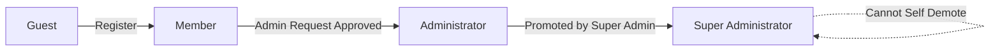
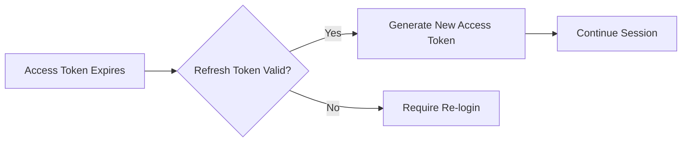

# User Actors and Authentication

## Overview

The Economic/Political Discussion Board implements a unified user authentication system where all authenticated users share the same actor type but possess different permission levels. This design enables seamless permission escalation while maintaining a consistent authentication flow across all user types.

## User Actor Definition

### Single Actor Model

THE system SHALL implement a single user actor type with permission levels stored as user attributes rather than separate actor types.

This unified approach provides:
- Consistent authentication flow for all users
- Flexible permission management through role attributes
- Simplified token structure with embedded permission data
- Seamless permission escalation through admin promotion workflow

### User Entity Structure

THE system SHALL maintain the following user identity information:

| Attribute | Type | Description |
|-----------|------|-------------|
| Email | String | Unique identifier for authentication, required |
| Password | String | Hashed password, required |
| Display Name | String | Public-facing name, editable by user |
| Bio | Text | User biography, optional |
| Permission Level | Enum | One of: MEMBER, ADMINISTRATOR, SUPER_ADMINISTRATOR |
| Ban Status | Boolean | Whether user is currently banned |
| Ban Reason | Text | Reason for ban if banned, null otherwise |
| Created At | Timestamp | Account creation time |
| Updated At | Timestamp | Last profile update time |

## Authentication Flow

### User Registration

WHEN a new user submits registration with email and password, THE system SHALL:

1. Validate email format and uniqueness
2. Validate password strength requirements
3. Hash the password using secure hashing algorithm
4. Create user account with MEMBER permission level
5. Create empty user profile with default values
6. Return success confirmation

THE system SHALL reject registration when:
- Email is already registered
- Email format is invalid
- Password does not meet security requirements

### User Login

WHEN a user submits login credentials, THE system SHALL:

1. Validate email and password are provided
2. Look up user by email address
3. Verify user exists and is not banned
4. Verify password hash matches stored hash
5. Generate JWT access token with user permissions
6. Generate JWT refresh token for session renewal
7. Return tokens and user profile information

WHEN a banned user attempts to log in, THE system SHALL reject the login attempt and display the ban reason.

### User Logout

WHEN a user requests logout, THE system SHALL invalidate the current session tokens.

THE system SHALL support logout from:
- Current device only (single session termination)
- All devices (complete session revocation)

### Password Management

#### Password Change

WHEN an authenticated user requests password change, THE system SHALL:

1. Require current password verification
2. Validate new password meets security requirements
3. Update password hash in storage
4. Invalidate all existing sessions except current
5. Generate new tokens for current session

#### Password Reset (Future Consideration)

WHEN a user requests password reset via email, THE system SHALL:

1. Generate secure reset token with expiration
2. Send reset link to registered email
3. Allow single-use password reset within expiration window

### Account Deletion

WHEN a user requests account deletion, THE system SHALL:

1. Require password confirmation
2. Delete all articles authored by the user
3. Delete all comments authored by the user
4. Delete user profile information
5. Delete user authentication record
6. Return confirmation of complete deletion

THE system SHALL perform cascade deletion of all user content when account is deleted.

## Permission Hierarchy

### Permission Levels

THE system SHALL implement four distinct permission levels:

### Guest (Non-Authenticated User)

Users who have not logged in possess guest-level permissions.

Guest users CAN:
- View public sections
- Browse article lists
- Read article content and comments
- View user profiles
- Search articles

Guest users CANNOT:
- Create articles or comments
- Edit any content
- Access administrative functions
- View banned user list

### Member (Authenticated Regular User)

Users with MEMBER permission level are regular authenticated users.

Member users CAN:
- All guest capabilities
- Create articles in any section
- Edit own articles
- Delete own articles
- Create comments on articles
- Edit own comments
- Delete own comments
- Attach files and images to own articles
- Add tags to own articles
- View own profile
- Edit own profile (display name, bio)
- View other user profiles
- Change own password
- Delete own account
- Submit administrator request

Member users CANNOT:
- Create, edit, or delete sections
- Delete other users' articles
- Delete other users' comments
- Ban or unban users
- Access administrative functions
- View banned user list

### Administrator

Users with ADMINISTRATOR permission level are regular administrators.

Administrator users CAN:
- All member capabilities
- Create new sections
- Edit existing sections
- Delete sections
- Delete any article
- Delete any comment
- Ban users
- Unban users
- View banned user list
- View ban reasons

Administrator users CANNOT:
- Promote users to administrator
- Promote administrators to super administrator
- Demote super administrators
- Access super administrator functions

### Super Administrator

Users with SUPER_ADMINISTRATOR permission level possess full administrative authority.

Super Administrator users CAN:
- All administrator capabilities
- View pending administrator requests
- Approve administrator requests
- Reject administrator requests
- Promote members to administrators
- Promote administrators to super administrators
- Demote super administrators to administrators

Super Administrator users CANNOT:
- Demote themselves (self-protection rule)

## Token Management

### JWT Token Structure

THE system SHALL use JSON Web Tokens (JWT) for authentication.

#### Access Token Payload

THE system SHALL include the following claims in access tokens:

| Claim | Type | Description |
|-------|------|-------------|
| sub | String | User unique identifier |
| email | String | User email address |
| permissionLevel | String | MEMBER, ADMINISTRATOR, or SUPER_ADMINISTRATOR |
| iat | Number | Token issued timestamp |
| exp | Number | Token expiration timestamp |

#### Refresh Token Payload

THE system SHALL include the following claims in refresh tokens:

| Claim | Type | Description |
|-------|------|-------------|
| sub | String | User unique identifier |
| type | String | Constant value "refresh" |
| iat | Number | Token issued timestamp |
| exp | Number | Token expiration timestamp |

### Token Expiration Policy

THE system SHALL enforce the following token lifetimes:

| Token Type | Lifetime | Rationale |
|------------|----------|-----------|
| Access Token | 15 minutes | Short-lived for security |
| Refresh Token | 7 days | Balance security and usability |

### Token Renewal Flow

WHEN an access token expires, THE system SHALL:

1. Check if refresh token is valid and not expired
2. Verify user is not banned
3. Generate new access token with current permission level
4. Return new access token to client

IF the refresh token is expired or invalid, THEN THE system SHALL require full re-authentication.

### Token Storage

THE system SHALL support the following token storage options:

- **Recommended**: httpOnly cookies for enhanced security against XSS
- **Alternative**: localStorage for simpler client implementation

THE system SHALL implement appropriate CORS and CSRF protection based on storage method.

### Token Invalidation

THE system SHALL invalidate tokens when:

- User explicitly logs out
- User changes password (all sessions except current)
- User account is deleted
- User is banned
- Administrator revokes user sessions

## Session Security

### Concurrent Session Management

THE system SHALL allow users to be logged in from multiple devices simultaneously.

THE system SHALL provide session management capabilities:
- View active sessions (device, location, last activity)
- Terminate specific sessions
- Terminate all other sessions

### Security Measures

THE system SHALL implement the following security measures:

#### Password Security
- Minimum 8 characters length
- Require at least one uppercase letter
- Require at least one lowercase letter
- Require at least one number
- Require at least one special character
- Passwords hashed using bcrypt or argon2

#### Brute Force Protection
WHEN a user fails login attempts consecutively, THE system SHALL:

1. Track failed login attempts per email address
2. After 5 failed attempts, impose 15-minute lockout
3. Display lockout remaining time to user
4. Reset attempt counter after successful login

#### Session Hijacking Prevention
THE system SHALL:
- Generate unique session identifiers
- Bind tokens to user agent fingerprint
- Invalidate tokens on permission level change
- Require re-authentication for sensitive operations

## Permission Matrix

### Content Operations

| Operation | Guest | Member | Administrator | Super Admin |
|-----------|-------|--------|---------------|-------------|
| View sections | ✅ | ✅ | ✅ | ✅ |
| Browse articles | ✅ | ✅ | ✅ | ✅ |
| Read article content | ✅ | ✅ | ✅ | ✅ |
| Read comments | ✅ | ✅ | ✅ | ✅ |
| View user profiles | ✅ | ✅ | ✅ | ✅ |
| Search articles | ✅ | ✅ | ✅ | ✅ |
| Create articles | ❌ | ✅ | ✅ | ✅ |
| Edit own articles | ❌ | ✅ | ✅ | ✅ |
| Delete own articles | ❌ | ✅ | ✅ | ✅ |
| Delete any article | ❌ | ❌ | ✅ | ✅ |
| Create comments | ❌ | ✅ | ✅ | ✅ |
| Edit own comments | ❌ | ✅ | ✅ | ✅ |
| Delete own comments | ❌ | ✅ | ✅ | ✅ |
| Delete any comment | ❌ | ❌ | ✅ | ✅ |

### Section Management

| Operation | Guest | Member | Administrator | Super Admin |
|-----------|-------|--------|---------------|-------------|
| View section list | ✅ | ✅ | ✅ | ✅ |
| Browse articles in section | ✅ | ✅ | ✅ | ✅ |
| Create sections | ❌ | ❌ | ✅ | ✅ |
| Edit sections | ❌ | ❌ | ✅ | ✅ |
| Delete sections | ❌ | ❌ | ✅ | ✅ |

### User Management

| Operation | Guest | Member | Administrator | Super Admin |
|-----------|-------|--------|---------------|-------------|
| View own profile | ❌ | ✅ | ✅ | ✅ |
| Edit own profile | ❌ | ✅ | ✅ | ✅ |
| View other profiles | ✅ | ✅ | ✅ | ✅ |
| Delete own account | ❌ | ✅ | ✅ | ✅ |
| Ban users | ❌ | ❌ | ✅ | ✅ |
| Unban users | ❌ | ❌ | ✅ | ✅ |
| View banned users | ❌ | ❌ | ✅ | ✅ |
| View ban reasons | ❌ | ❌ | ✅ | ✅ |

### Administrative Hierarchy

| Operation | Guest | Member | Administrator | Super Admin |
|-----------|-------|--------|---------------|-------------|
| Submit admin request | ❌ | ✅ | ✅ | ✅ |
| View pending requests | ❌ | ❌ | ❌ | ✅ |
| Approve admin requests | ❌ | ❌ | ❌ | ✅ |
| Reject admin requests | ❌ | ❌ | ❌ | ✅ |
| Promote member to admin | ❌ | ❌ | ❌ | ✅ |
| Promote admin to super admin | ❌ | ❌ | ❌ | ✅ |
| Demote super admin | ❌ | ❌ | ❌ | ✅* |
| Demote self | ❌ | ❌ | ❌ | ❌ |

*Cannot demote themselves

## Administrator Request Workflow

### Request Submission

WHEN a member requests to become an administrator, THE system SHALL:

1. Create administrator request record
2. Store submitted reason text
3. Set request status to PENDING
4. Notify super administrators of new request

### Request Review

WHEN a super administrator reviews a pending request, THE system SHALL display:
- Requesting user information
- Submitted reason
- User account age
- User activity summary (article count, comment count)

### Request Approval

WHEN a super administrator approves a request, THE system SHALL:

1. Update user permission level to ADMINISTRATOR
2. Mark request as APPROVED
3. Record approving super administrator
4. Notify user of approval
5. Invalidate user's existing tokens

### Request Rejection

WHEN a super administrator rejects a request, THE system SHALL:

1. Mark request as REJECTED
2. Record rejecting super administrator
3. Optionally store rejection reason
4. Notify user of rejection

THE system SHALL NOT prevent rejected users from submitting new requests.

## Banning Impact on Authentication

### Login Prevention

WHEN a banned user attempts to log in, THE system SHALL:

1. Detect user's banned status
2. Reject authentication attempt
3. Display ban reason to user
4. Not generate any tokens

### Active Session Termination

WHEN a user is banned while having active sessions, THE system SHALL:

1. Immediately invalidate all existing tokens
2. Prevent new token generation
3. Force logout on next API call

### Content Preservation

THE system SHALL preserve banned users' content:
- Articles remain visible
- Comments remain visible
- Profile remains viewable
- Content attribution maintained

## Authentication Error Handling

### Error Response Format

WHEN an authentication error occurs, THE system SHALL return structured error responses:

| Error Code | Description | User Message |
|------------|-------------|--------------|
| AUTH_INVALID_CREDENTIALS | Email or password incorrect | "Invalid email or password" |
| AUTH_EMAIL_EXISTS | Email already registered | "An account with this email already exists" |
| AUTH_USER_BANNED | User account is banned | "Your account has been banned: [reason]" |
| AUTH_TOKEN_EXPIRED | Access token expired | "Session expired, please log in again" |
| AUTH_TOKEN_INVALID | Token validation failed | "Invalid session, please log in again" |
| AUTH_REFRESH_FAILED | Refresh token invalid | "Session expired, please log in again" |
| AUTH_PERMISSION_DENIED | Insufficient permissions | "You do not have permission to perform this action" |
| AUTH_ACCOUNT_DELETED | Account no longer exists | "Account not found" |

### Error Recovery

WHEN authentication fails, THE system SHALL provide clear recovery paths:

- Invalid credentials: Allow retry with rate limiting
- Account banned: Display ban reason and contact information
- Token expired: Automatic refresh attempt or re-login prompt
- Permission denied: Explain required permission level

## Implementation Notes

### JWT Secret Management

THE system SHALL use secure JWT secret key management:
- Store secrets in environment variables
- Use different secrets for access and refresh tokens
- Rotate secrets periodically
- Support secret rotation without invalidating all sessions

### Permission Check Optimization

THE system SHALL optimize permission checking:
- Embed permission level in JWT payload
- Validate permissions on each authenticated request
- Cache user permission data when necessary
- Update cached permissions on permission change

### Audit Logging

THE system SHALL log authentication events:
- Successful login attempts
- Failed login attempts
- Permission level changes
- Account deletions
- Ban/unban actions

## Related Documents

- [User Profile System](./03-user-profile.md) - Profile management details
- [Administrator System](./08-admin-system.md) - Admin workflow details
- [Banning System](./10-banning-system.md) - Ban management details
- [Exception Handling](./13-exception-handling.md) - Error handling details