**discussionBoard — What operations users can perform, use cases, business workflows**

What operations users can perform, use cases, business workflows

# Core Business Operations

What the system must do for each business concept.

## User Operations

Users register new accounts by providing an email address and password combination. The email address must be unique across all active accounts in the system. Upon successful registration, users can authenticate by logging in with their registered email and password credentials. Users have the ability to change their password at any time while logged into their account. Users can permanently delete their own account, which results in the removal of all their articles and comments from the platform. Each user possesses a profile containing a display name and a bio text that can be edited by the user. Users can view the profiles of other users to see their display name, bio, and a complete list of all articles and comments authored by that user. The system maintains user accounts with authentication credentials and profile information that supports social interaction within the discussion board.

### User Registration Flow

### Account Creation

WHEN a guest submits a registration request, THE system SHALL require an email address and a password.

WHEN a registration request is submitted, THE system SHALL validate that the email address is unique across all existing user accounts.

IF the provided email address is already registered in the system, THE system SHALL reject the registration request.

WHEN the email address is unique and the password meets security requirements, THE system SHALL create a new user account.

WHEN a new account is created, THE system SHALL initialize a user profile with a default display name and empty bio.

WHEN registration is successful, THE system SHALL grant the user member privileges.

IF registration fails due to duplicate email, THE system SHALL allow the user to retry with a different email address.

### Registration Flow Diagram

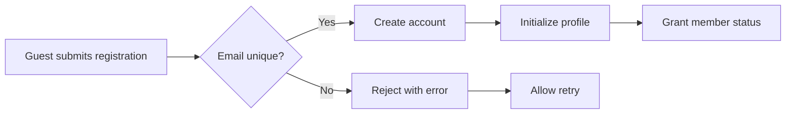

### Login Authentication

### Authentication Process

WHEN a user submits login credentials, THE system SHALL require an email address and password.

WHEN login credentials are submitted, THE system SHALL validate the email and password combination against stored credentials.

IF the email address does not correspond to an existing account, THE system SHALL reject the login attempt.

IF the password does not match the stored credentials for the provided email, THE system SHALL reject the login attempt.

WHEN valid credentials are provided, THE system SHALL authenticate the user and establish a session.

IF the user account has been banned, THE system SHALL deny access and prevent login.

WHEN a banned user attempts to log in, THE system SHALL display a message indicating the account is banned.

### Credential Management

THE system SHALL store user credentials securely for authentication purposes.

WHEN a user is logged in, THE system SHALL maintain their authenticated session.

WHEN a user logs out, THE system SHALL terminate their authenticated session.

### Password Change Operation

### Password Update Process

WHEN an authenticated member requests a password change, THE system SHALL require the current password and a new password.

WHEN a password change is requested, THE system SHALL verify that the provided current password matches the stored password.

IF the current password does not match the stored credentials, THE system SHALL reject the password change request.

WHEN the current password is verified successfully, THE system SHALL update the stored password with the new password.

WHEN a password is successfully changed, THE system SHALL maintain the user's authenticated session.

IF the new password does not meet security requirements, THE system SHALL reject the password change request.

THE system SHALL allow members to change their password at any time while authenticated.

### Account Deletion

### Account Removal Process

WHEN an authenticated member requests account deletion, THE system SHALL permanently remove the user account.

WHEN an account is deleted, THE system SHALL remove all articles authored by that user.

WHEN an account is deleted, THE system SHALL remove all comments authored by that user.

WHEN an account is deleted, THE system SHALL remove all admin requests submitted by that user.

WHEN an account is deleted, THE system SHALL remove the user's profile information.

WHEN an account is deleted, THE system SHALL terminate the user's authenticated session.

THE system SHALL NOT allow recovery of deleted accounts or their associated content.

IF an account is deleted, THE system SHALL prevent future login with the deleted account credentials.

### Account Deletion Cascade

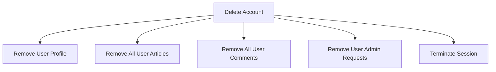

### User Profile Management

### Profile Structure

THE system SHALL provide each user with a profile containing a display name and bio text.

THE system SHALL allow users to set a display name that identifies them on the platform.

THE system SHALL allow users to write a bio text describing themselves.

### Profile Editing

WHEN an authenticated member accesses their own profile, THE system SHALL allow editing of the display name.

WHEN an authenticated member accesses their own profile, THE system SHALL allow editing of the bio text.

WHEN a user updates their display name, THE system SHALL save the new display name immediately.

WHEN a user updates their bio text, THE system SHALL save the new bio text immediately.

THE system SHALL NOT require users to fill in both display name and bio; either or both may be provided.

### Profile Visibility

THE system SHALL make user profiles visible to all users of the platform.

WHEN a user views their own profile, THE system SHALL display the profile with editing capabilities.

WHEN a user views another user's profile, THE system SHALL display the profile in read-only mode.

### Viewing User Profiles

### Profile Viewing Access

WHEN any user views a user profile, THE system SHALL display the user's display name.

WHEN any user views a user profile, THE system SHALL display the user's bio text.

WHEN any user views a user profile, THE system SHALL display a list of all articles authored by that user.

WHEN any user views a user profile, THE system SHALL display a list of all comments authored by that user.

### Article History Display

WHEN a user profile is viewed, THE system SHALL list each article showing its title and the section it belongs to.

THE system SHALL sort the article list with the most recently created articles appearing first.

WHEN a user has not authored any articles, THE system SHALL display an empty article list.

### Comment History Display

WHEN a user profile is viewed, THE system SHALL list each comment showing its content and the article it belongs to.

THE system SHALL sort the comment list with the most recently created comments appearing first.

WHEN a user has not authored any comments, THE system SHALL display an empty comment list.

### Profile Navigation

WHEN a user selects an article from another user's article history, THE system SHALL navigate to that article's full view.

WHEN a user selects a comment from another user's comment history, THE system SHALL navigate to the article containing that comment.

## Section Operations

Sections serve as organizational containers that categorize articles into distinct topic areas such as Politics, Economy, and Current Affairs. Only administrators have the authority to create new sections within the discussion board. Administrators can edit existing sections to modify their name and description as needed. Administrators can delete sections when they are no longer needed or relevant. Each section consists of a name that identifies the topic area and a description that explains what types of discussions belong within that section. All users can browse and view the complete list of available sections in the system. Users can navigate into any specific section to browse the articles contained within that section. Sections provide a top-level navigation structure that helps users find articles relevant to their interests. The section structure supports the thematic organization of the discussion board around economic and political topics.

### Section Creation

WHEN an administrator creates a new section, THE system SHALL require a name for the section.

WHEN an administrator creates a new section, THE system SHALL require a description for the section.

WHEN an administrator creates a new section, THE system SHALL record the section as a new organizational container for articles.

WHEN an administrator creates a new section, THE system SHALL make the section immediately visible to all users.

IF a non-administrator user attempts to create a section, THE system SHALL reject the request.

IF the section name is missing or empty, THE system SHALL reject the creation request.

IF the section description is missing or empty, THE system SHALL reject the creation request.

THE system SHALL allow administrators to create sections at any time without restriction on the number of sections.

### Section Editing

WHEN an administrator edits an existing section, THE system SHALL allow modification of the section name.

WHEN an administrator edits an existing section, THE system SHALL allow modification of the section description.

WHEN an administrator saves changes to a section, THE system SHALL update the section information immediately.

IF a non-administrator user attempts to edit a section, THE system SHALL reject the request.

IF the edited section name is empty, THE system SHALL reject the edit request.

IF the edited section description is empty, THE system SHALL reject the edit request.

IF the section to edit does not exist, THE system SHALL reject the request.

### Section Deletion

WHEN an administrator deletes a section, THE system SHALL remove the section from the list of available sections.

WHEN an administrator deletes a section, THE system SHALL handle all articles within that section according to the deletion policy.

IF a non-administrator user attempts to delete a section, THE system SHALL reject the request.

IF the section to delete does not exist, THE system SHALL reject the request.

THE system SHALL allow administrators to delete any section regardless of its content.

### Section Listing

WHEN a user requests the list of sections, THE system SHALL return all available sections in the system.

WHEN a user views the section list, THE system SHALL display the name and description for each section.

WHEN a user views the section list, THE system SHALL allow guests and members to browse all sections without restriction.

THE system SHALL make the section list accessible to all users including guests and members.

THE system SHALL display sections in a consistent order when presenting the section list.

THE system SHALL not require authentication to view the list of available sections.

### Section Content Browsing

WHEN a user selects a section, THE system SHALL display all articles within that section.

WHEN a user browses a section, THE system SHALL show articles organized under the selected topic.

WHEN a user navigates to a section, THE system SHALL present the articles in a paginated list.

WHEN a user views articles within a section, THE system SHALL use the section as a filter for article discovery.

IF a section contains no articles, THE system SHALL display an empty article list for that section.

IF the selected section does not exist, THE system SHALL display an appropriate error message.

THE system SHALL support topic-based navigation by allowing users to move between sections.

THE system SHALL maintain the relationship between articles and their parent section for browsing purposes.

## Article Operations

Users create articles by providing a required title, required content text, and selecting a section where the article will be published. Users can attach multiple files and images to their articles to supplement the written content. Users can add multiple tags to their articles using free text input, allowing for flexible categorization beyond sections. Articles can be edited by their authors at any time, including modifications to the title, content, attachments, and tags. Users can delete their own articles, which removes them from the system entirely. The article list view displays a paginated collection showing each article's title, author name, associated tags, comment count, and posting time without revealing the full content. Users can sort the article list by newest articles first or oldest articles first based on their preference. Users can search for articles by searching within the title or content text of articles. Search results support pagination and can be filtered by specific tags to narrow down results. When viewing a single article, users see the complete title, full content, all attachments, all tags, and the posting timestamp. Users can download any files or images attached to an article directly from the article view page. Administrators have the ability to delete any article regardless of authorship.

### Article Creation

WHEN a member creates an article, THE system SHALL require a title, content, and section selection.

WHEN a member creates an article, THE system SHALL:
1. Require the title field to be provided
2. Require the content field to be provided as text
3. Require selection of exactly one section from available sections

IF the title is not provided, THE system SHALL reject the article creation request.
IF the content is not provided, THE system SHALL reject the article creation request.
IF no section is selected, THE system SHALL reject the article creation request.

WHEN a member creates an article, THE system SHALL:
1. Allow attachment of multiple files to the article
2. Allow attachment of multiple images to the article
3. Support simultaneous attachment of both files and images
4. Associate all attachments with the created article

WHEN a member creates an article, THE system SHALL:
1. Allow entry of multiple tags as free text
2. Store all provided tags with the article
3. Preserve tag text exactly as entered by the member

WHEN an article is successfully created, THE system SHALL:
1. Record the creating member as the article author
2. Record the creation timestamp
3. Make the article visible in the selected section's article list
4. Make the article searchable by title and content

### Article Editing

WHEN a member edits their own article, THE system SHALL:
1. Allow modification of the article title
2. Allow modification of the article content
3. Allow modification of attached files and images
4. Allow modification of article tags

WHEN a member edits their own article, THE system SHALL:
1. Permit changes to individual fields without requiring changes to all fields
2. Preserve existing values for unmodified fields
3. Update the article while maintaining its association with the original section

IF a member attempts to edit an article they did not author, THE system SHALL reject the edit request.

WHEN attachments are modified during editing, THE system SHALL:
1. Allow addition of new files and images
2. Allow removal of existing attachments
3. Maintain the association between remaining attachments and the article

WHEN tags are modified during editing, THE system SHALL:
1. Allow addition of new tags
2. Allow removal of existing tags
3. Update the article's tag collection to reflect all changes

### Article Deletion

WHEN a member deletes their own article, THE system SHALL:
1. Remove the article from all article lists
2. Remove the article from search results
3. Remove all comments associated with the article
4. Remove all attachments associated with the article
5. Make the article permanently inaccessible

IF a member attempts to delete an article they did not author, THE system SHALL reject the deletion request.

WHEN an administrator deletes any article, THE system SHALL:
1. Allow deletion regardless of article authorship
2. Remove the article from all article lists
3. Remove the article from search results
4. Remove all comments associated with the article
5. Remove all attachments associated with the article
6. Make the article permanently inaccessible

IF a guest attempts to delete an article, THE system SHALL reject the deletion request.

### Article Listing

WHEN a user views the list of articles within a section, THE system SHALL:
1. Display a paginated collection of articles
2. Show each article's title without full content
3. Show each article's author display name
4. Show each article's associated tags
5. Show each article's comment count
6. Show each article's posting timestamp

WHEN a user requests the article list, THE system SHALL provide pagination controls to navigate through multiple pages of articles.

WHEN a user selects the sort order for articles, THE system SHALL:
1. Support sorting by newest articles first
2. Support sorting by oldest articles first
3. Apply the selected sort order to all articles in the current page

WHEN a user changes the sort order, THE system SHALL:
1. Re-sort the entire article list according to the new selection
2. Return to the first page of results with the new sort order applied

IF no sort order is specified, THE system SHALL display articles sorted by newest first as the default order.

### Article Search and Filtering

WHEN a user searches for articles, THE system SHALL:
1. Accept search terms entered by the user
2. Search within article titles for matching text
3. Search within article content for matching text
4. Return articles where the search term appears in either title or content

WHEN a user performs a search, THE system SHALL:
1. Display search results as a paginated list
2. Show each result with title, author, tags, comment count, and posting time

WHEN a user filters articles by tag, THE system SHALL:
1. Accept one or more tags as filter criteria
2. Return only articles that have all specified tags
3. Display filtered results as a paginated list

WHEN a user combines search and tag filtering, THE system SHALL:
1. Apply both search terms and tag filters simultaneously
2. Return only articles matching both the search term and all specified tags

IF no articles match the search criteria or tags, THE system SHALL display an empty result list with an appropriate message.

### Article Viewing and Attachment Download

WHEN a user views a single article, THE system SHALL:
1. Display the complete article title
2. Display the full article content as text
3. Display the author's display name
4. Display all attachments associated with the article
5. Display all tags associated with the article
6. Display the posting timestamp

WHEN a user views an article with attachments, THE system SHALL:
1. List all attached files with their names
2. List all attached images with their names
3. Provide download access for each attached file
4. Provide download access for each attached image

WHEN a user downloads an attachment, THE system SHALL:
1. Retrieve the file or image from storage
2. Deliver the attachment content to the user
3. Maintain the attachment's original format and content

IF an article has no attachments, THE system SHALL display the article without showing an empty attachments section.

IF a user attempts to view a deleted article, THE system SHALL display an indication that the article does not exist.

## Comment Operations

Users can write comments on any article to participate in discussions about the topic. Comments exist as single-level entries directly attached to articles, meaning nested replies to other comments are not supported. Each comment consists of content text written by the user and is timestamped when created. All comments on an article are visible to any user viewing that article. Comments are displayed in chronological order with the oldest comments appearing first, establishing a linear conversation flow. Each comment displays the author's name, the comment content, and the time when it was posted. Users can edit the content of their own comments after they have been submitted. Users can delete their own comments, which removes them from the article's comment thread. Administrators have the authority to delete any comment regardless of who authored it. The comment system enables users to engage in discussions and share their perspectives on articles within the board.

### Comment Creation

### Creating Comments on Articles

WHEN a member submits a comment on an article, THE system SHALL:
1. Require comment content text
2. Associate the comment with the submitting member as the author
3. Associate the comment with the specific article being commented on
4. Record the timestamp when the comment was created
5. Display the comment in the article's comment thread

THE system SHALL support single-level comments only.

IF a member attempts to create a nested reply to an existing comment, THE system SHALL reject the request.

WHEN a comment is successfully created, THE system SHALL add the comment to the article's comment thread.

### Comment Content Requirements

WHEN a member creates a comment, THE system SHALL require content text to be provided.

IF the comment content is empty, THE system SHALL reject the comment creation request.

### Article Association

WHEN a member creates a comment, THE system SHALL associate the comment with exactly one article.

IF the specified article does not exist, THE system SHALL reject the comment creation request.

IF the specified article has been deleted, THE system SHALL reject the comment creation request.

### Comment Viewing and Display

### Comment Thread Visibility

WHEN a user views an article, THE system SHALL display all comments associated with that article.

THE system SHALL make the comment thread visible to any user who can view the article.

THE system SHALL display comments regardless of whether the viewer is a guest, member, or administrator.

### Chronological Ordering

WHEN displaying comments on an article, THE system SHALL order comments chronologically by creation time.

THE system SHALL display the oldest comments first in the comment thread.

THE system SHALL present comments in a linear sequence from earliest to latest.

### Comment Author Display

WHEN displaying a comment, THE system SHALL show the author's display name.

WHEN displaying a comment, THE system SHALL show the comment content text.

WHEN displaying a comment, THE system SHALL show the timestamp when the comment was posted.

### Comment Thread Structure

THE system SHALL present all comments as a flat list without hierarchical threading.

WHEN multiple comments exist on an article, THE system SHALL display them in sequence without nesting or indentation based on reply relationships.

### Comment Editing

### Editing Own Comments

WHEN a member edits their own comment, THE system SHALL allow modification of the comment content.

WHEN a member edits a comment, THE system SHALL preserve the original author association.

WHEN a member edits a comment, THE system SHALL preserve the original creation timestamp.

IF a member attempts to edit a comment authored by another member, THE system SHALL reject the edit request.

IF a member attempts to edit a comment that has been deleted, THE system SHALL reject the edit request.

### Comment Modification Workflow

WHEN a member submits an edit to their comment, THE system SHALL:
1. Validate that the member is the original author
2. Validate that the comment still exists
3. Accept the new content text
4. Update the comment content

IF the edited comment content is empty, THE system SHALL reject the edit request.

WHEN an administrator views a member's comment, THE system SHALL NOT grant the administrator permission to edit the comment content.

### Comment Deletion

### Deleting Own Comments

WHEN a member deletes their own comment, THE system SHALL remove the comment from the article's comment thread.

WHEN a member deletes a comment, THE system SHALL remove the comment permanently.

IF a member attempts to delete a comment authored by another member, THE system SHALL reject the deletion request.

IF a member attempts to delete a comment that has already been deleted, THE system SHALL reject the deletion request.

### Administrator Comment Deletion

WHEN an administrator deletes any comment, THE system SHALL remove the comment from the article's comment thread.

THE system SHALL allow administrators to delete comments regardless of who authored them.

THE system SHALL allow administrators to delete comments from any article.

WHEN an administrator deletes a comment, THE system SHALL remove the comment permanently.

IF an administrator attempts to delete a comment that does not exist, THE system SHALL reject the deletion request.

### Deletion Impact on Comment Thread

WHEN a comment is deleted, THE system SHALL remove the comment from the chronological display without reordering other comments.

WHEN a comment is deleted, THE system SHALL NOT affect the visibility or ordering of remaining comments in the thread.

WHEN a comment is deleted, THE system SHALL NOT leave a placeholder or indication that a comment was removed.

## Attachment Operations

Attachments are files and images that users can associate with their articles to provide supplementary content. Users can upload multiple files and attach them to a single article during creation or editing. Users can upload multiple images and attach them to a single article alongside files and other images. Each attachment has a type indicating whether it is a file or an image. Attachments are timestamped when they are created and added to an article. When viewing an article, users can see all attached files and images in the attachment section. Users can download any file attachment from an article to their local device. Users can view and download any image attachment from an article. Attachments remain associated with the article they were uploaded to and are removed when the article is deleted. The attachment system supports various file and image formats to accommodate different types of supplementary content users may want to share. Attachments enhance articles by providing visual aids, supporting documents, or additional reference materials for readers.

### File Attachment Upload

WHEN a user uploads a file attachment to an article, THE system SHALL:
1. Accept the file from the user
2. Classify the attachment type as "file"
3. Record the creation timestamp
4. Associate the attachment with the specified article

WHEN a user uploads a file attachment, THE system SHALL support various file formats to accommodate different types of supplementary content.

IF the file exceeds the maximum file size limit, THE system SHALL reject the upload.

IF the file type is not supported, THE system SHALL reject the upload.

### Image Attachment Upload

WHEN a user uploads an image attachment to an article, THE system SHALL:
1. Accept the image from the user
2. Classify the attachment type as "image"
3. Record the creation timestamp
4. Associate the attachment with the specified article

WHEN a user uploads an image attachment, THE system SHALL support various image formats to accommodate visual supplementary content.

IF the image exceeds the maximum file size limit, THE system SHALL reject the upload.

IF the image type is not supported, THE system SHALL reject the upload.

### Multiple Attachments per Article

WHEN a user creates or edits an article, THE system SHALL allow multiple file attachments to be added to a single article.

WHEN a user creates or edits an article, THE system SHALL allow multiple image attachments to be added to a single article.

WHEN a user uploads attachments, THE system SHALL support a combination of both files and images attached to the same article.

IF the total number of attachments exceeds the maximum limit per article, THE system SHALL reject the additional attachments.

### Attachment Type Classification

WHEN an attachment is uploaded, THE system SHALL classify each attachment as either "file" or "image" based on its content type.

WHEN the system classifies an attachment, THE system SHALL distinguish between files and images to enable appropriate handling and display.

WHEN viewing attachments, THE system SHALL present files and images according to their classification type.

### Viewing Article Attachments

WHEN a user views an article, THE system SHALL display all attached files and images in the attachment section of the article page.

WHEN viewing an article's attachments, THE system SHALL show each attachment with its type classification indicating whether it is a file or an image.

WHEN viewing an article's attachments, THE system SHALL display the creation timestamp for each attachment.

IF an article has no attachments, THE system SHALL not display an attachment section.

### Downloading File Attachments

WHEN a user requests to download a file attachment from an article, THE system SHALL provide the file for download to the user's device.

WHEN a user downloads a file attachment, THE system SHALL allow any user with article viewing access to download the file.

IF the requested file attachment does not exist, THE system SHALL reject the download request.

### Downloading Image Attachments

WHEN a user requests to download an image attachment from an article, THE system SHALL provide the image for download to the user's device.

WHEN a user views an article, THE system SHALL display image attachments inline in the article view for visual reference.

WHEN a user downloads an image attachment, THE system SHALL allow any user with article viewing access to download the image.

IF the requested image attachment does not exist, THE system SHALL reject the download request.

### Attachment Association with Articles

WHEN an attachment is uploaded, THE system SHALL associate the attachment with exactly one article.

WHEN an attachment is associated with an article, THE system SHALL maintain this association throughout the attachment's lifecycle.

WHEN a user edits an article, THE system SHALL allow the user to add additional attachments to the existing article.

WHEN a user edits an article, THE system SHALL allow the user to remove existing attachments from the article.

### Attachment Removal with Article Deletion

WHEN an article is deleted, THE system SHALL remove all attachments associated with that article.

WHEN an article is deleted, THE system SHALL ensure no orphaned attachments remain in the system.

WHEN a user deletes their own article, THE system SHALL remove all file and image attachments that were associated with that article.

WHEN an administrator deletes any article, THE system SHALL remove all file and image attachments that were associated with that article.

## AdminRequest Operations

Any user can submit a request to become an administrator of the discussion board. Each administrator request includes a reason text field where the user explains why they should be granted administrative privileges. Requests start in a pending status when first submitted and remain pending until reviewed by a super administrator. Super administrators can view a list of all pending administrator requests awaiting review. Super administrators can approve a pending request, which grants the requesting user regular administrator privileges. Super administrators can reject a pending request, which denies the user administrative privileges and leaves them as a regular user. When a request is approved or rejected, the status of the request is updated to reflect the decision. The system maintains a record of all administrator requests including the reason provided and the status outcome. Regular administrators can perform user activities like writing articles and comments in addition to administrative duties. Super administrators can promote regular administrators to super administrator status. Super administrators can demote other super administrators to regular administrator status, but cannot demote themselves. The administrator request workflow ensures that administrative privileges are granted through a controlled approval process.

### Administrator Request Submission

### Request Creation

WHEN a user submits an administrator request, THE system SHALL require a reason text field explaining why the user should be granted administrative privileges.

WHEN a user submits an administrator request, THE system SHALL create the request with a pending status.

IF a user already has a pending administrator request, THE system SHALL reject the submission of a new request.

IF a user is already an administrator, THE system SHALL reject the administrator request submission.

WHEN an administrator request is submitted, THE system SHALL record the requesting user and the submission timestamp.

### Reason Text Requirements

WHEN a user submits an administrator request, THE system SHALL accept the reason text as free-form content.

IF the reason text is empty, THE system SHALL reject the administrator request submission.

THE system SHALL allow users to provide detailed justification for their administrator request through the reason text field.

### Pending Request Status

### Initial Status Assignment

WHEN an administrator request is created, THE system SHALL assign a pending status to the request.

THE system SHALL maintain all administrator requests in pending status until reviewed by a super administrator.

### Status Tracking

THE system SHALL track the status of each administrator request as either pending, approved, or rejected.

WHEN an administrator request status changes, THE system SHALL record the timestamp of the status change.

WHEN an administrator request is approved or rejected, THE system SHALL record the super administrator who made the decision.

THE system SHALL preserve the complete history of each administrator request including the original submission and any status changes.

### Super Administrator Review

### Viewing Pending Requests

WHEN a super administrator views pending requests, THE system SHALL display a list of all administrator requests with pending status.

THE system SHALL display the requesting user's identity and reason text for each pending request in the review list.

THE system SHALL display the submission timestamp for each pending request.

### Review Authority

WHEN reviewing pending requests, THE system SHALL only allow super administrators to approve or reject administrator requests.

THE system SHALL prevent regular administrators from viewing or acting on pending administrator requests.

THE system SHALL prevent regular members from accessing the administrator request review functionality.

### Request Approval Process

### Approval Workflow

WHEN a super administrator approves a pending request, THE system SHALL change the request status to approved.

WHEN a super administrator approves a pending request, THE system SHALL grant the requesting user regular administrator privileges.

WHEN a user is granted administrator privileges, THE system SHALL allow the user to perform all administrative functions available to regular administrators.

WHEN a request is approved, THE system SHALL record the approving super administrator and the approval timestamp.

### Regular Administrator Role

WHEN a user becomes a regular administrator, THE system SHALL grant the user administrative capabilities while preserving their existing member abilities.

THE system SHALL allow regular administrators to create, edit, and delete sections.

THE system SHALL allow regular administrators to delete any article or comment.

THE system SHALL allow regular administrators to ban and unban users.

THE system SHALL allow regular administrators to view the list of banned users.

### Request Rejection Process

### Rejection Workflow

WHEN a super administrator rejects a pending request, THE system SHALL change the request status to rejected.

WHEN a request is rejected, THE system SHALL preserve the user's existing member status without any administrative privileges.

WHEN a request is rejected, THE system SHALL record the rejecting super administrator and the rejection timestamp.

### Rejected Request Handling

IF a user's administrator request is rejected, THE system SHALL allow the user to submit a new administrator request in the future.

THE system SHALL maintain a record of rejected administrator requests for historical reference.

### Administrator Promotion Workflow

### Super Administrator Role

THE system SHALL distinguish between regular administrators and super administrators as two distinct administrator grades.

THE system SHALL allow super administrators to perform all administrative functions available to regular administrators.

THE system SHALL grant super administrators the additional capability to approve or reject administrator requests.

THE system SHALL grant super administrators the capability to promote regular administrators to super administrator status.

THE system SHALL grant super administrators the capability to demote other super administrators to regular administrator status.

### Promotion Process

WHEN a super administrator promotes a regular administrator, THE system SHALL change the administrator's grade to super administrator.

WHEN a regular administrator is promoted to super administrator, THE system SHALL grant the user all super administrator privileges.

THE system SHALL record the promotion decision including the promoting super administrator and the promotion timestamp.

### Administrator Demotion Workflow

### Demotion Process

WHEN a super administrator demotes another super administrator, THE system SHALL change the administrator's grade to regular administrator.

WHEN a super administrator is demoted to regular administrator, THE system SHALL revoke super administrator privileges while preserving regular administrator privileges.

IF a super administrator attempts to demote themselves, THE system SHALL reject the demotion request.

THE system SHALL record the demotion decision including the demoting super administrator and the demotion timestamp.

### Self-Demotion Restriction

THE system SHALL prevent a super administrator from demoting themselves to regular administrator status.

IF a super administrator needs to be demoted, THE system SHALL require another super administrator to perform the demotion.

### Administrative Request History

### Request Record Maintenance

THE system SHALL maintain a complete history of all administrator requests including pending, approved, and rejected requests.

THE system SHALL preserve the reason text for each administrator request regardless of the request status.

THE system SHALL preserve the identity of the requesting user for each administrator request.

THE system SHALL preserve the submission timestamp for each administrator request.

### Approval and Rejection Records

THE system SHALL record the approving or rejecting super administrator for each processed request.

THE system SHALL record the approval or rejection timestamp for each processed request.

THE system SHALL maintain the final status of each administrator request as part of the historical record.

### Privileged User Management

### Administrator Privilege Tracking

THE system SHALL maintain a record of each user's current administrative status as either regular member, regular administrator, or super administrator.

WHEN a user's administrative status changes, THE system SHALL update the user's privilege level accordingly.

THE system SHALL preserve the continuity of user accounts during privilege transitions.

### Role-Based Access

THE system SHALL grant regular administrators access to all administrative functions except super administrator-specific capabilities.

THE system SHALL grant super administrators access to all administrative functions including request approval and administrator grade management.

WHEN a user is granted administrator privileges, THE system SHALL ensure the user can perform user activities such as writing articles and comments in addition to administrative duties.

# Business Actions and Workflows

Business actions and workflows beyond basic CRUD.

## User Actions

Users complete a registration workflow by providing their email address and creating a password for a new account. The login workflow authenticates users through email and password verification, granting access to their account. Users can initiate a password change workflow to update their credentials while logged in. The account deletion workflow allows users to permanently remove their account, which automatically removes all their articles and comments from the system. Each user has a profile containing a display name and bio text that other users can view. Users can edit their own profile information through the profile update workflow. When viewing another user's profile, users can see the display name, bio, a list of all articles written by that user, and a list of all comments made by that user. Banned users are blocked from completing the login workflow and cannot access the platform. Administrators can initiate a ban workflow that records a reason for the ban and prevents the user from logging in. The unban workflow allows administrators to restore access to previously banned users.

### User Registration Workflow

### Registration Process

WHEN a guest submits a registration request, THE system SHALL require an email address and password.

WHEN the email address is already registered, THE system SHALL reject the registration request.

WHEN a valid registration request is submitted, THE system SHALL create a new user account with the provided email and password.

### Email Validation

WHEN an email address is submitted during registration, THE system SHALL verify the email format is valid.

IF the email format is invalid, THE system SHALL reject the registration request.

### Password Requirements

WHEN a password is submitted during registration, THE system SHALL require the password to meet security criteria.

IF the password does not meet security criteria, THE system SHALL reject the registration request.

### Account Activation

WHEN a user account is successfully created, THE system SHALL activate the account immediately.

WHEN the account is activated, THE system SHALL allow the user to log in.

### Profile Initialization

WHEN a new user account is created, THE system SHALL initialize an empty profile with no display name and no bio.

THE system SHALL allow the new user to set their display name and bio after registration.

### Login Authentication Flow

### Login Process

WHEN a user submits login credentials, THE system SHALL authenticate the user using the provided email and password.

WHEN valid credentials are submitted, THE system SHALL grant access to the user account.

### Authentication Failure

IF the email address does not exist in the system, THE system SHALL reject the login attempt.

IF the password does not match the stored credentials, THE system SHALL reject the login attempt.

### Banned User Access Restriction

WHEN a banned user attempts to log in, THE system SHALL deny access to the platform.

IF a user is banned, THE system SHALL display the ban reason during the login attempt.

WHEN the login is rejected due to a ban, THE system SHALL NOT authenticate the user regardless of correct credentials.

### Session Management

WHEN a user successfully logs in, THE system SHALL create an authenticated session for the user.

WHEN a user logs out, THE system SHALL terminate the authenticated session.

### Password Change Process

### Password Change Request

WHEN an authenticated user requests a password change, THE system SHALL require the current password and a new password.

WHEN the current password is verified, THE system SHALL validate the new password against security criteria.

### Password Validation

IF the current password is incorrect, THE system SHALL reject the password change request.

IF the new password does not meet security criteria, THE system SHALL reject the password change request.

### Password Update

WHEN a valid password change request is submitted, THE system SHALL update the stored password for the user account.

WHEN the password is successfully changed, THE system SHALL maintain the user's authenticated session.

### Security Considerations

THE system SHALL NOT allow the new password to be identical to the current password.

THE system SHALL allow the user to use their account immediately after the password is changed.

### Account Deletion Cascade

### Deletion Request

WHEN an authenticated user requests account deletion, THE system SHALL permanently remove the user account.

WHEN an account deletion is requested, THE system SHALL NOT require the user to provide a reason.

### Content Removal

WHEN a user account is deleted, THE system SHALL delete all articles authored by that user.

WHEN a user account is deleted, THE system SHALL delete all comments authored by that user.

THE system SHALL remove the user's articles from all sections where they were posted.

THE system SHALL remove the user's comments from all articles where they were posted.

### Attachment Removal

WHEN a user account is deleted, THE system SHALL delete all file and image attachments associated with the user's articles.

### Deletion Finality

WHEN an account deletion is completed, THE system SHALL NOT allow recovery of the account or its content.

IF a user attempts to register with the same email after deletion, THE system SHALL treat it as a new registration.

### Authentication State

WHEN an account deletion is completed, THE system SHALL terminate the user's authenticated session.

### User Profile Viewing

### Profile Access

WHEN a user views another user's profile, THE system SHALL display the profile owner's display name.

WHEN a user views another user's profile, THE system SHALL display the profile owner's bio text.

THE system SHALL allow any user to view any other user's profile.

### Article History Display

WHEN a user views another user's profile, THE system SHALL display a list of all articles written by that user.

THE system SHALL show the title, section, and time posted for each article in the profile.

### Comment History Display

WHEN a user views another user's profile, THE system SHALL display a list of all comments written by that user.

THE system SHALL show the comment content and the article title for each comment in the profile.

### Own Profile Access

WHEN a user views their own profile, THE system SHALL display the same information visible to other users.

THE system SHALL provide an option to edit the profile when viewing one's own profile.

### Profile Update Workflow

### Display Name Update

WHEN an authenticated user updates their display name, THE system SHALL save the new display name to their profile.

THE system SHALL allow display names to be changed multiple times.

THE system SHALL NOT require display names to be unique across users.

### Bio Text Update

WHEN an authenticated user updates their bio text, THE system SHALL save the new bio to their profile.

THE system SHALL allow the bio to be cleared or updated to empty text.

### Update Validation

WHEN a profile update is submitted, THE system SHALL validate the display name and bio content.

IF the display name or bio violates content rules, THE system SHALL reject the update request.

### Immediate Visibility

WHEN a profile update is completed, THE system SHALL immediately reflect the changes in the profile display.

THE system SHALL show the updated display name in all articles and comments authored by the user.

### User Ban Enforcement

### Ban Initiation

WHEN an administrator bans a user, THE system SHALL record the ban reason.

WHEN a user is banned, THE system SHALL mark the user account as banned.

### Access Restriction

WHEN a user is banned, THE system SHALL prevent the user from logging in.

THE system SHALL display the recorded ban reason when a banned user attempts to log in.

### Content Preservation

WHEN a user is banned, THE system SHALL retain all articles and comments authored by the user.

THE system SHALL continue to display the banned user's articles and comments to other users.

THE system SHALL show the banned user's display name on their existing content.

### Ban Reason Recording

THE system SHALL require a reason to be recorded when banning a user.

THE system SHALL store the ban reason associated with the user account.

### Ban Status

WHEN an administrator views the list of banned users, THE system SHALL display each banned user and their ban reason.

### User Unban Restoration

### Unban Process

WHEN an administrator unbans a user, THE system SHALL remove the banned status from the user account.

WHEN a user is unbanned, THE system SHALL allow the user to log in again.

### Access Restoration

WHEN a user is unbanned, THE system SHALL restore full access to the user account.

THE system SHALL NOT require the user to re-register or create a new account.

### Content Preservation

WHEN a user is unbanned, THE system SHALL maintain all articles and comments authored by the user.

THE system SHALL NOT restore any content that was deleted during the user's ban period.

### Ban Reason Removal

WHEN a user is unbanned, THE system SHALL clear the ban reason from the user account.

THE system SHALL NOT display the previous ban reason to the user.

### Account Lifecycle Management

### Account States

THE system SHALL support three account states: active, banned, and deleted.

WHEN an account is in active state, THE system SHALL allow full platform access.

WHEN an account is in banned state, THE system SHALL prevent login access.

WHEN an account is in deleted state, THE system SHALL NOT retain any user data.

### State Transitions

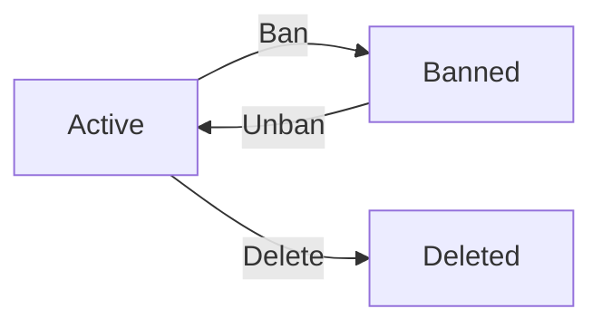

### Lifecycle Events

WHEN a user registers, THE system SHALL create the account in active state.

WHEN an account is banned, THE system SHALL transition from active to banned state.

WHEN an account is unbanned, THE system SHALL transition from banned to active state.

WHEN an account is deleted, THE system SHALL permanently remove all user data and terminate the account.

### Administrator Privileges

Administrators SHALL be able to ban any user except other administrators.
Super administrators SHALL be able to ban regular administrators.

THE system SHALL allow administrators to unban any banned user.

### Deletion Restrictions

THE system SHALL allow users to delete only their own account.
Administrators SHALL NOT be able to delete user accounts on behalf of users.

## Section Actions

Sections organize the discussion board into topic-based categories such as Politics, Economy, and Current Affairs. Section creation and management workflows are restricted to administrators only, ensuring controlled organization of the platform. Each section contains a name and description that help users understand the topics appropriate for discussion within that area. All users can access the section listing workflow to view all available sections in the system. Users can browse articles within a specific section through the section browsing workflow, which displays articles organized under that topic category. Administrators can create new sections through the section creation workflow, providing a name and description for the new category. The section editing workflow allows administrators to modify existing section names and descriptions. Administrators can remove sections through the section deletion workflow, which may affect articles categorized under that section.

### Section Creation Workflow

WHEN an administrator creates a new section, THE system SHALL require a section name.

WHEN an administrator creates a new section, THE system SHALL require a section description.

WHEN an administrator creates a new section, THE system SHALL record the creation timestamp.

WHEN an administrator creates a new section, THE system SHALL make the section immediately available to all users for browsing.

IF the section name is not provided, THE system SHALL reject the creation request.

IF the section description is not provided, THE system SHALL reject the creation request.

IF a member attempts to create a section, THE system SHALL reject the request with an authorization error.

IF a guest attempts to create a section, THE system SHALL reject the request with an authorization error.

WHEN a section is successfully created, THE system SHALL add the section to the available section list.

WHEN an administrator creates a section, THE system SHALL allow the administrator to immediately edit or delete the newly created section.

### Section Editing Workflow

WHEN an administrator edits an existing section, THE system SHALL allow modification of the section name.

WHEN an administrator edits an existing section, THE system SHALL allow modification of the section description.

WHEN an administrator edits an existing section, THE system SHALL preserve all articles associated with that section.

WHEN an administrator edits an existing section, THE system SHALL record the modification timestamp.

IF the modified section name is empty, THE system SHALL reject the edit request.

IF the modified section description is empty, THE system SHALL reject the edit request.

IF a member attempts to edit a section, THE system SHALL reject the request with an authorization error.

IF a guest attempts to edit a section, THE system SHALL reject the request with an authorization error.

WHEN a section name is modified, THE system SHALL display the updated name to all users viewing the section.

WHEN a section description is modified, THE system SHALL display the updated description to all users viewing the section list.

### Section Deletion Workflow

WHEN an administrator deletes a section, THE system SHALL remove the section from the section list.

WHEN an administrator deletes a section, THE system SHALL remove the section from the available categories for new articles.

IF a member attempts to delete a section, THE system SHALL reject the request with an authorization error.

IF a guest attempts to delete a section, THE system SHALL reject the request with an authorization error.

IF an administrator attempts to delete a section containing articles, THE system SHALL handle the article disposition according to platform policy.

WHEN an administrator requests section deletion, THE system SHALL require confirmation before completing the deletion.

WHEN a section is successfully deleted, THE system SHALL no longer display the section in the section list.

IF a user attempts to access a deleted section directly, THE system SHALL indicate that the section no longer exists.

### Section Listing Access

WHEN a user requests the list of sections, THE system SHALL display all available sections.

WHEN a user requests the list of sections, THE system SHALL display each section's name.

WHEN a user requests the list of sections, THE system SHALL display each section's description.

WHEN a guest requests the list of sections, THE system SHALL allow access without requiring authentication.

WHEN a member requests the list of sections, THE system SHALL allow access.

WHEN an administrator requests the list of sections, THE system SHALL allow access.

WHEN the section list is displayed, THE system SHALL organize sections for easy navigation.

WHEN a new section is created by an administrator, THE system SHALL immediately include it in the section list visible to all users.

WHEN a section is deleted by an administrator, THE system SHALL immediately remove it from the section list visible to all users.

### Section Browsing Workflow

WHEN a user selects a section to browse, THE system SHALL display articles associated with that section.

WHEN a user browses a section, THE system SHALL display each article's title.

WHEN a user browses a section, THE system SHALL display each article's author.

WHEN a user browses a section, THE system SHALL display each article's tags.

WHEN a user browses a section, THE system SHALL display each article's comment count.

WHEN a user browses a section, THE system SHALL display each article's time posted.

WHEN a user browses a section, THE system SHALL NOT display the full article content in the list view.

WHEN a user browses a section, THE system SHALL support pagination for the article list.

WHEN a user browses a section, THE system SHALL allow sorting articles by newest first.

WHEN a user browses a section, THE system SHALL allow sorting articles by oldest first.

WHEN a guest browses a section, THE system SHALL allow access without requiring authentication.

IF a user attempts to browse a non-existent section, THE system SHALL indicate that the section does not exist.

## Article Actions

Users can create articles in any section through the article creation workflow, which requires a title, content, and section selection. The article editing workflow allows authors to modify their own articles, including updating the title, content, attachments, and tags. Users can remove their articles through the article deletion workflow, permanently removing the content from the system. The article viewing workflow displays the full article content including title, author information, text content, attachments, tags, and posting timestamp. Users can download attached files and images through the attachment download workflow. The article listing workflow shows paginated lists of articles within a section, displaying title, author, tags, comment count, and posting time without the full content. Users can search articles by title or content through the article search workflow, which returns paginated results. The tag filtering workflow allows users to narrow down article lists by selecting specific tags. Articles can be sorted by newest first or oldest first based on user preference. Administrators can delete any article through the administrative article removal workflow regardless of authorship.

### Article Creation Workflow

WHEN a member creates an article, THE system SHALL require a title, content, and section selection.

WHEN a member creates an article, THE system SHALL allow the member to attach files and images.

WHEN a member creates an article, THE system SHALL allow the member to add one or more tags.

WHEN a member creates an article, THE system SHALL associate the article with the creating member as author.

WHEN a member creates an article, THE system SHALL record the creation timestamp.

IF the title is missing, THE system SHALL reject the article creation request.

IF the content is missing, THE system SHALL reject the article creation request.

IF the section is not selected, THE system SHALL reject the article creation request.

IF the member is banned, THE system SHALL reject the article creation request.

### Article Editing Process

WHEN a member edits their own article, THE system SHALL allow modification of the title, content, attachments, and tags.

WHEN a member edits their own article, THE system SHALL preserve the article's section assignment.

WHEN a member edits their own article, THE system SHALL NOT allow modification of the author.

WHEN a member edits their own article, THE system SHALL NOT allow modification of the creation timestamp.

IF a member attempts to edit another member's article, THE system SHALL reject the request.

IF the article does not exist, THE system SHALL reject the edit request.

IF the member is banned, THE system SHALL reject the edit request.

IF the title becomes empty during editing, THE system SHALL reject the update.

IF the content becomes empty during editing, THE system SHALL reject the update.

### Article Deletion Workflow

WHEN a member deletes their own article, THE system SHALL permanently remove the article from the system.

WHEN a member deletes their own article, THE system SHALL remove all comments associated with the article.

WHEN a member deletes their own article, THE system SHALL remove all attachments associated with the article.

IF a member attempts to delete another member's article, THE system SHALL reject the deletion request.

IF the article does not exist, THE system SHALL reject the deletion request.

IF the member is banned, THE system SHALL reject the deletion request.

WHEN an article is deleted, THE system SHALL NOT display the article in any section listing.

WHEN an article is deleted, THE system SHALL NOT display the article in search results.

### Article Viewing Experience

WHEN a member views an article, THE system SHALL display the complete title.

WHEN a member views an article, THE system SHALL display the full content.

WHEN a member views an article, THE system SHALL display the author's display name.

WHEN a member views an article, THE system SHALL display all attached files and images.

WHEN a member views an article, THE system SHALL display all tags assigned to the article.

WHEN a member views an article, THE system SHALL display the time the article was posted.

WHEN a member views an article, THE system SHALL display all comments in chronological order.

IF the article does not exist, THE system SHALL display an error message.

WHEN a guest views an article, THE system SHALL display the same article content as a member.

WHEN a guest views an article, THE system SHALL display the article without requiring authentication.

### Article Listing Pagination

WHEN a member browses articles within a section, THE system SHALL display a paginated list of articles.

WHEN a member views an article list, THE system SHALL display each article's title.

WHEN a member views an article list, THE system SHALL display each article's author display name.

WHEN a member views an article list, THE system SHALL display each article's tags.

WHEN a member views an article list, THE system SHALL display each article's comment count.

WHEN a member views an article list, THE system SHALL display each article's posting time.

WHEN a member views an article list, THE system SHALL NOT display the full article content.

WHEN a member requests the next page, THE system SHALL display the next set of articles.

WHEN a member requests the previous page, THE system SHALL display the previous set of articles.

IF no articles exist in the section, THE system SHALL display an empty list indicator.

### Article Search Workflow

WHEN a member searches for articles, THE system SHALL allow searching by article title.

WHEN a member searches for articles, THE system SHALL allow searching by article content.

WHEN a member searches for articles, THE system SHALL return matching articles from all sections.

WHEN a member searches for articles, THE system SHALL paginate the search results.

WHEN a member searches for articles, THE system SHALL display each result with title, author, tags, comment count, and posting time.

IF no articles match the search criteria, THE system SHALL display an empty result set.

WHEN a member searches for articles, THE system SHALL NOT display articles in deleted sections.

WHEN a guest searches for articles, THE system SHALL provide the same search functionality as a member.

### Tag Filtering Process

WHEN a member filters articles by tag, THE system SHALL display only articles that contain the selected tag.

WHEN a member filters articles by tag, THE system SHALL preserve the current section context.

WHEN a member filters articles by tag, THE system SHALL paginate the filtered results.

WHEN a member filters articles by tag, THE system SHALL allow selection of multiple tags.

WHEN a member filters articles by multiple tags, THE system SHALL display articles that match any of the selected tags.

IF no articles contain the selected tag, THE system SHALL display an empty result set.

WHEN a member clears tag filters, THE system SHALL restore the full article list.

WHEN a member filters articles by tag, THE system SHALL maintain the current sort order.

### Sorting Articles Workflow

WHEN a member sorts articles by newest first, THE system SHALL display articles in descending order by creation timestamp.

WHEN a member sorts articles by oldest first, THE system SHALL display articles in ascending order by creation timestamp.

WHEN a member changes the sort order, THE system SHALL preserve the current filter settings.

WHEN a member changes the sort order, THE system SHALL preserve the current pagination position.

WHEN a member changes the sort order, THE system SHALL re-display the article list with the new order.

WHEN a member sorts articles within a section, THE system SHALL apply the sort only to that section.

WHEN a member sorts search results, THE system SHALL apply the sort to the search results.

WHEN a member filters by tags, THE system SHALL maintain the selected sort order.

### Administrator Article Removal

WHEN an administrator deletes any article, THE system SHALL remove the article regardless of authorship.

WHEN an administrator deletes an article, THE system SHALL remove all comments associated with the article.

WHEN an administrator deletes an article, THE system SHALL remove all attachments associated with the article.

WHEN an administrator deletes an article, THE system SHALL permanently remove the content from the system.

IF the article does not exist, THE system SHALL display an error message.

WHEN an administrator deletes an article, THE system SHALL NOT display the article in any section listing.

WHEN an administrator deletes an article, THE system SHALL NOT display the article in search results.

WHEN an administrator deletes an article, THE system SHALL NOT display the article in the author's profile.

### Article Attachment Download

WHEN a member requests to download an attachment, THE system SHALL provide the file or image for download.

WHEN a member requests to download an attachment, THE system SHALL allow access regardless of article authorship.

WHEN a guest requests to download an attachment, THE system SHALL provide the file or image for download.

WHEN a member downloads an attachment, THE system SHALL preserve the original file name.

WHEN a member downloads an attachment, THE system SHALL NOT require additional authentication beyond article viewing.

IF the attachment does not exist, THE system SHALL display an error message.

IF the article has been deleted, THE system SHALL NOT allow download of its attachments.

WHEN a member views an article, THE system SHALL display all attachments as downloadable links.

## Comment Actions

Users can write comments on articles through the comment creation workflow, adding their thoughts to the discussion. Comments are limited to a single level with no nested replies, keeping discussions flat and manageable. The comment viewing workflow displays all comments on an article, sorted by oldest first to maintain chronological order. Each comment displays the author name, content, and posting time for context. Users can modify their own comments through the comment editing workflow, allowing corrections or updates to their statements. The comment deletion workflow enables users to remove their own comments from articles. Administrators have the ability to delete any comment through the administrative comment removal workflow, providing moderation capabilities. The comment display workflow ensures comments remain visible and accessible to all users viewing an article. Comments remain attached to their parent article throughout the article lifecycle.

### Comment Creation Workflow

WHEN a member creates a comment on an article, THE system SHALL require the member to be logged in.

WHEN a member creates a comment on an article, THE system SHALL require the article to exist and be accessible.

WHEN a member creates a comment on an article, THE system SHALL require comment content to be provided.

WHEN a member creates a comment on an article, THE system SHALL associate the comment with the member as the author.

WHEN a member creates a comment on an article, THE system SHALL associate the comment with the specified article.

WHEN a member creates a comment on an article, THE system SHALL record the creation timestamp.

IF the comment content is empty, THE system SHALL reject the comment creation.

IF the article does not exist, THE system SHALL reject the comment creation.

IF the member is banned, THE system SHALL reject the comment creation.

### Single-Level Comment Structure

THE system SHALL support only single-level comments on articles.

THE system SHALL NOT support nested replies to comments.

WHEN a member attempts to reply to a comment, THE system SHALL treat the reply as a new comment on the article.

THE system SHALL maintain all comments at the same hierarchical level.

THE system SHALL NOT create parent-child relationships between comments.

### Flat Comment Hierarchy

THE system SHALL organize all comments as direct children of their parent article.

THE system SHALL NOT allow comments to have child comments.

WHEN displaying comments, THE system SHALL present all comments as siblings without indentation or threading.

THE system SHALL treat all comments as equal members of the article's comment collection.

THE system SHALL NOT track reply relationships between comments.

### Comment Viewing Workflow

WHEN a user views an article, THE system SHALL display all comments associated with that article.

WHEN a user views comments on an article, THE system SHALL show each comment's author display name.

WHEN a user views comments on an article, THE system SHALL show each comment's content.

WHEN a user views comments on an article, THE system SHALL show each comment's posting time.

WHEN a guest views comments on an article, THE system SHALL allow the guest to see all comments without logging in.

WHEN a user views comments on an article, THE system SHALL NOT require authentication.

### Chronological Comment Sorting

WHEN displaying comments on an article, THE system SHALL sort comments by oldest first.

WHEN displaying comments on an article, THE system SHALL use the comment creation timestamp for sorting.

THE system SHALL present comments in ascending chronological order.

THE system SHALL NOT provide alternative sorting options for comments within an article.

WHEN two comments have the same timestamp, THE system SHALL order them by their unique identifier.

### Comment Editing Process

WHEN a member edits their own comment, THE system SHALL require the member to be logged in.

WHEN a member edits their own comment, THE system SHALL verify the member is the author of the comment.

WHEN a member edits their own comment, THE system SHALL allow modification of the comment content.

WHEN a member edits their own comment, THE system SHALL preserve the original author.

WHEN a member edits their own comment, THE system SHALL preserve the original creation timestamp.

IF the member is not the author of the comment, THE system SHALL reject the edit.

IF the comment does not exist, THE system SHALL reject the edit.

IF the member is banned, THE system SHALL reject the edit.

### Comment Deletion Workflow

WHEN a member deletes their own comment, THE system SHALL require the member to be logged in.

WHEN a member deletes their own comment, THE system SHALL verify the member is the author of the comment.

WHEN a member deletes their own comment, THE system SHALL remove the comment from the article.

WHEN a member deletes their own comment, THE system SHALL NOT remove the article.

IF the member is not the author of the comment, THE system SHALL reject the deletion.

IF the comment does not exist, THE system SHALL reject the deletion.

IF the member is banned, THE system SHALL reject the deletion.

### Administrator Comment Removal

WHEN an administrator removes a comment, THE system SHALL allow removal of any comment regardless of author.

WHEN an administrator removes a comment, THE system SHALL require the administrator to be logged in.

WHEN an administrator removes a comment, THE system SHALL remove the comment from the article.

WHEN an administrator removes a comment, THE system SHALL NOT require the administrator to be the comment's author.

IF the comment does not exist, THE system SHALL reject the removal.

THE system SHALL allow administrators to remove comments for moderation purposes.

### Comment Moderation Workflow

WHEN an administrator moderates comments, THE system SHALL provide the ability to remove inappropriate comments.

WHEN an administrator moderates comments on an article, THE system SHALL allow removal of individual comments.

WHEN an administrator removes a comment, THE system SHALL record which administrator performed the removal.

THE system SHALL allow administrators to remove comments from any article in any section.

THE system SHALL NOT allow regular members to moderate comments of other members.

### Comment Display Workflow

WHEN displaying a comment, THE system SHALL show the author's current display name.

WHEN displaying a comment, THE system SHALL show the comment content in its entirety.

WHEN displaying a comment, THE system SHALL show the time the comment was posted.

WHEN displaying a comment list, THE system SHALL show all comments for the article.

WHEN a comment's author has been banned, THE system SHALL still display the comment with the author's display name.

WHEN a comment's author has deleted their account, THE system SHALL still display the comment with a marker indicating the author is no longer available.

## Attachment Actions

Users can attach files to their articles during the article creation or editing workflow, enhancing their content with supporting documents. Users can attach images to articles through the image attachment workflow, allowing visual content to accompany written articles. Multiple files and images can be attached to a single article through the multi-attachment workflow, enabling comprehensive content presentation. The attachment viewing workflow displays attached files and images alongside the article content for all viewers. Other users can download attached files and images through the attachment download workflow, accessing the supplementary materials. Attachments remain associated with their parent article throughout the article lifecycle. When an article is edited, users can add new attachments or remove existing ones through the attachment management workflow. When an article is deleted, all associated attachments are removed through the article deletion cascade workflow.

### File Attachment Upload

WHEN a member creates or edits an article, THE system SHALL allow the member to attach files to the article.

WHEN a member uploads a file attachment, THE system SHALL classify the attachment as a file type.

WHEN a member uploads a file attachment, THE system SHALL store the file and associate it with the specified article.

WHEN a member uploads a file attachment, THE system SHALL record the upload timestamp.

IF a guest attempts to upload a file attachment, THE system SHALL reject the request.

WHEN a member uploads a file attachment, THE system SHALL validate the file meets size and format requirements.

IF the file exceeds the maximum allowed size, THE system SHALL reject the upload and notify the member.

IF the file format is not supported, THE system SHALL reject the upload and notify the member.

### Image Attachment Process

WHEN a member creates or edits an article, THE system SHALL allow the member to attach images to the article.

WHEN a member uploads an image attachment, THE system SHALL classify the attachment as an image type.

WHEN a member uploads an image attachment, THE system SHALL store the image and associate it with the specified article.

WHEN a member uploads an image attachment, THE system SHALL record the upload timestamp.

IF a guest attempts to upload an image attachment, THE system SHALL reject the request.

WHEN a member uploads an image attachment, THE system SHALL validate the image meets size and format requirements.

IF the image exceeds the maximum allowed size, THE system SHALL reject the upload and notify the member.

IF the image format is not supported, THE system SHALL reject the upload and notify the member.

### Multiple Attachments Support

WHEN a member creates an article, THE system SHALL allow multiple files to be attached to a single article.

WHEN a member creates an article, THE system SHALL allow multiple images to be attached to a single article.

WHEN a member creates an article, THE system SHALL allow a combination of files and images to be attached to a single article.

WHEN a member edits an article, THE system SHALL preserve all existing attachments unless explicitly removed.

WHEN a member uploads multiple attachments in a single session, THE system SHALL process each attachment independently.

IF one attachment in a batch upload fails validation, THE system SHALL continue processing other valid attachments.

WHEN a member uploads multiple attachments, THE system SHALL maintain the association between each attachment and the parent article.

### Attachment Viewing Access

WHEN a user views an article, THE system SHALL display all attachments associated with the article.

WHEN a guest views an article, THE system SHALL allow the guest to see the list of attachments.

WHEN a member views an article, THE system SHALL allow the member to see the list of attachments.

WHEN a user views an article, THE system SHALL distinguish between file attachments and image attachments in the display.

WHEN a user views an article, THE system SHALL display attachments alongside the article content.

WHEN a user views an article with multiple attachments, THE system SHALL display all attachments in a consolidated view.

IF an article has no attachments, THE system SHALL display the article without an attachment section.

### Attachment Download Workflow

WHEN a guest views an article with attachments, THE system SHALL allow the guest to download attached files.

WHEN a guest views an article with attachments, THE system SHALL allow the guest to download attached images.

WHEN a member views an article with attachments, THE system SHALL allow the member to download attached files.

WHEN a member views an article with attachments, THE system SHALL allow the member to download attached images.

WHEN a user initiates an attachment download, THE system SHALL retrieve the attachment from storage and provide it to the user.

IF a requested attachment no longer exists in storage, THE system SHALL notify the user that the attachment is unavailable.

WHEN a user downloads an attachment, THE system SHALL provide the attachment in its original uploaded format.

### Attachment Management During Edit

WHEN a member edits their own article, THE system SHALL allow the member to add new file attachments.

WHEN a member edits their own article, THE system SHALL allow the member to add new image attachments.

WHEN a member edits their own article, THE system SHALL allow the member to remove existing attachments.

WHEN a member removes an attachment during editing, THE system SHALL delete the attachment from storage.

IF a member attempts to edit another member's article attachments, THE system SHALL reject the request.

IF an admin attempts to edit a member's article attachments, THE system SHALL reject the request.

WHEN an article is edited by its author, THE system SHALL preserve attachments not explicitly removed during the edit.

WHEN a member removes an attachment, THE system SHALL no longer display the attachment with the article.

### Attachment Lifecycle

WHEN an attachment is uploaded, THE system SHALL associate the attachment with exactly one article.

WHEN an attachment is uploaded, THE system SHALL record the creation timestamp for the attachment.

WHEN the parent article of an attachment is deleted, THE system SHALL delete all associated attachments.

WHEN an article is deleted by its author, THE system SHALL remove all attachments linked to that article.

WHEN an article is deleted by an admin, THE system SHALL remove all attachments linked to that article.

WHEN a member account is deleted, THE system SHALL delete all attachments from articles authored by that member.

WHEN a member removes an attachment during editing, THE system SHALL permanently delete the attachment.

IF an attachment is deleted, THE system SHALL no longer allow users to download or view that attachment.

WHEN an attachment exists, THE system SHALL maintain the relationship between the attachment and its parent article until either is deleted.

## AdminRequest Actions

Any user can submit a request to become an administrator through the admin request submission workflow, providing a written reason for their request. The admin request workflow captures the request reason, status, and creation timestamp for tracking purposes. Super administrators can view all pending administrator requests through the pending request viewing workflow. Super administrators can approve requests through the request approval workflow, which grants administrator privileges to the requesting user. When a request is approved, the user becomes a regular administrator with standard administrative capabilities. Super administrators can reject requests through the request rejection workflow, leaving the user as a regular member. The administrator grade system distinguishes between regular administrators and super administrators, with different permission levels. Super administrators can promote regular administrators through the promotion workflow, elevating them to super administrator status. The demotion workflow allows super administrators to reduce other super administrators to regular administrator status. Super administrators cannot demote themselves through the self-protection rule in the demotion workflow. Administrators retain all regular user capabilities including writing articles and comments in addition to their administrative powers. The admin request status changes from pending to approved or rejected based on super administrator decisions.

### Admin Request Submission

WHEN a member submits an administrator request, THE system SHALL:
1. Require a reason text explaining why the user wants to become an administrator
2. Create an AdminRequest record with status "pending"
3. Associate the request with the requesting user
4. Record the creation timestamp

IF the submitting user already has a pending admin request, THE system SHALL reject the new submission.
IF the submitting user is already an administrator (regular or super), THE system SHALL reject the request.

THE system SHALL allow members to include any text content as the reason for their administrator request.

WHEN an admin request is successfully created, THE system SHALL store the following information:
- The requesting user's identity
- The reason text provided by the user
- The current status set to "pending"
- The creation timestamp

### Pending Request Viewing

WHEN a super administrator views pending admin requests, THE system SHALL:
1. Display all AdminRequest records with status "pending"
2. Show the requesting user's display name
3. Show the request reason text
4. Show the creation timestamp for each request

THE system SHALL NOT allow regular administrators to view pending admin requests.
THE system SHALL NOT allow members to view pending admin requests.
THE system SHALL NOT allow guests to view pending admin requests.

WHEN displaying pending requests, THE system SHALL order them by creation timestamp with the oldest first.

WHEN no pending requests exist, THE system SHALL display an empty list to super administrators.

### Request Approval Workflow

WHEN a super administrator approves a pending admin request, THE system SHALL:
1. Verify the request status is "pending"
2. Change the request status to "approved"
3. Convert the requesting user to a regular administrator
4. Record which super administrator approved the request
5. Record the approval timestamp

IF the request is not in "pending" status, THE system SHALL reject the approval operation.
IF the requesting user has been banned, THE system SHALL reject the approval operation.

WHEN an admin request is approved, THE system SHALL grant the user regular administrator privileges immediately.

THE system SHALL allow multiple super administrators to review and approve requests concurrently.
IF two super administrators attempt to approve the same request simultaneously, THE system SHALL process only one approval and reject the duplicate.

### Request Rejection Workflow

WHEN a super administrator rejects a pending admin request, THE system SHALL:
1. Verify the request status is "pending"
2. Change the request status to "rejected"
3. Record which super administrator rejected the request
4. Record the rejection timestamp

IF the request is not in "pending" status, THE system SHALL reject the rejection operation.

WHEN an admin request is rejected, THE system SHALL preserve the request record for historical tracking.
THE system SHALL NOT delete rejected admin requests.

WHEN a request is rejected, THE system SHALL allow the user to submit a new admin request in the future.

THE system SHALL allow super administrators to view rejected requests for reference.

### Administrator Grade Management

THE system SHALL maintain two administrator grades:
1. Regular administrator
2. Super administrator

THE system SHALL distinguish between regular administrators and super administrators based on their assigned grade.

WHEN a user becomes an administrator through request approval, THE system SHALL assign the "regular administrator" grade.

Regular administrators SHALL have the following administrative capabilities:
- Create, edit, and delete sections
- Delete any article
- Delete any comment
- Ban users
- Unban users
- View the list of banned users

Super administrators SHALL have all regular administrator capabilities plus the following additional capabilities:
- View pending admin requests
- Approve or reject admin requests
- Promote regular administrators to super administrator
- Demote other super administrators to regular administrator

THE system SHALL NOT allow regular administrators to perform super administrator-exclusive operations.

### Administrator Promotion Process

WHEN a super administrator promotes a regular administrator to super administrator, THE system SHALL:
1. Verify the target user is currently a regular administrator
2. Update the user's grade to super administrator
3. Grant all super administrator permissions

IF the target user is not a regular administrator, THE system SHALL reject the promotion.
IF the target user is a regular member, THE system SHALL reject the promotion and direct the super administrator to use the admin request approval workflow.

WHEN a regular administrator is promoted to super administrator, THE system SHALL preserve all their existing content (articles, comments).

THE system SHALL record the promotion action including:
- The promoting super administrator's identity
- The promoted user's identity
- The timestamp of promotion

### Administrator Demotion Workflow

WHEN a super administrator demotes another super administrator to regular administrator, THE system SHALL:
1. Verify the target user is currently a super administrator
2. Verify the demoting user is not the same as the target user (self-demotion prevention)
3. Update the target user's grade to regular administrator
4. Retain all regular administrator permissions

IF a super administrator attempts to demote themselves, THE system SHALL reject the operation.
IF the target user is not a super administrator, THE system SHALL reject the demotion.

THE system SHALL allow a super administrator to demote any other super administrator regardless of when they were promoted.

WHEN a super administrator is demoted, THE system SHALL:
- Remove all super administrator-exclusive permissions
- Preserve the user's regular administrator capabilities
- Preserve all their existing content (articles, comments)
- Record the demotion action with timestamp

### Admin Request Status Tracking

THE system SHALL track the following statuses for AdminRequest records:
- "pending" for newly submitted requests awaiting review
- "approved" for requests approved by super administrators
- "rejected" for requests rejected by super administrators

WHEN an admin request is created, THE system SHALL set the status to "pending".
WHEN a super administrator approves a request, THE system SHALL transition the status to "approved".
WHEN a super administrator rejects a request, THE system SHALL transition the status to "rejected".

THE system SHALL preserve all admin request records regardless of status for historical purposes.

THE system SHALL NOT allow status changes after approval or rejection.

Super administrators SHALL be able to filter admin requests by status.
Super administrators SHALL be able to view the full history of a user's admin requests.

### Administrator Capabilities Inheritance

THE system SHALL grant all member capabilities to users with administrator privileges.

Administrators SHALL inherit all member capabilities including:
- Create articles in any section
- Edit their own articles
- Delete their own articles
- Write comments on articles
- Edit their own comments
- Delete their own comments
- Attach files and images to their articles
- Add tags to their articles
- View and edit their own profile
- View other users' profiles

WHEN a user becomes an administrator, THE system SHALL NOT remove or restrict any existing member capabilities.
WHEN an administrator is promoted to super administrator, THE system SHALL NOT remove or restrict any existing member or regular administrator capabilities.
WHEN a super administrator is demoted to regular administrator, THE system SHALL NOT remove any member capabilities.

THE system SHALL ensure administrators can perform all member actions in addition to their administrative actions.

Administrators SHALL be subject to the same rules as members for their personal content:
- Cannot edit articles they did not author
- Cannot delete articles they did not author (unless using administrative delete power)
- Cannot edit comments they did not author
- Cannot delete comments they did not author (unless using administrative delete power)

# Error Scenarios and Edge Cases

Business-level error scenarios, edge case coverage, and expected system behaviors for exceptional conditions.

## User Error Scenarios

When a user attempts to register with an email already in use, the system rejects the registration and displays an appropriate message. Login attempts with incorrect passwords are rejected, and repeated failed attempts may trigger rate limiting to prevent brute force attacks. Users who attempt to log in while banned are denied access and shown a message explaining their account status. Password changes require the current password to be verified before accepting the new password. Account deletion permanently removes the user's profile and all associated content including articles and comments. Users cannot view their own profiles after deletion has been completed. Profile updates with invalid display names or excessively long bio text are rejected with validation messages. When a user attempts to edit another user's profile, the action is denied. Users cannot create articles or comments if their account has been banned. When viewing a banned user's profile, their articles and comments remain visible but administrative actions may be restricted.

### Duplicate Email Registration

WHEN a user attempts to register with an email address that is already registered in the system, THE system SHALL reject the registration request.

THE system SHALL display a message indicating that the email address is already in use.

THE system SHALL NOT reveal specific details about the existing account for security purposes.

WHEN a duplicate email registration is rejected, THE system SHALL suggest the user either use a different email address or log in with their existing account.

THE system SHALL treat email addresses as case-insensitive when checking for duplicates.

IF the user submits an email that matches an existing account with different casing, THE system SHALL reject the registration as a duplicate.

### Invalid Login Credentials

WHEN a user attempts to log in with an incorrect email address or password, THE system SHALL reject the login attempt.

THE system SHALL display a generic error message indicating invalid credentials without specifying which field is incorrect.

IF multiple failed login attempts occur within a defined time period, THE system SHALL apply rate limiting to the account or IP address.

WHEN rate limiting is triggered, THE system SHALL temporarily prevent further login attempts from the affected source.

THE system SHALL inform the user of the rate limit status and when they may retry.

IF rate limiting is applied to an IP address, THE system SHALL block login attempts from that IP for a defined cooldown period.

THE system SHALL allow password reset requests even when rate limiting is in effect.

### Banned User Login Denial

WHEN a banned user attempts to log in, THE system SHALL reject the login attempt.

THE system SHALL display a message informing the user that their account has been banned.

THE system SHALL display the reason for the ban that was recorded at the time of banning.

THE system SHALL NOT allow banned users to access any authenticated features of the platform.

IF a banned user attempts to log in, THE system SHALL NOT reveal any information about other users or platform content beyond the ban message.

THE system SHALL maintain the ban status until an administrator explicitly unbans the account.

### Password Change Verification

WHEN a user requests a password change, THE system SHALL require the user to enter their current password.

IF the current password provided is incorrect, THE system SHALL reject the password change request.

THE system SHALL display an error message indicating that the current password verification failed.

THE system SHALL NOT change the password unless the current password is successfully verified.

IF multiple failed password verification attempts occur, THE system SHALL apply rate limiting to prevent brute force attacks.

WHEN the current password is verified successfully, THE system SHALL allow the user to enter a new password.

IF the new password does not meet the system's password requirements, THE system SHALL reject the new password and display validation errors.

### Account Deletion Cascade

WHEN a user deletes their account, THE system SHALL permanently remove the user's profile information.

THE system SHALL delete all articles authored by the deleted user.

THE system SHALL delete all comments authored by the deleted user.

THE system SHALL remove all attachments associated with the deleted user's articles.

THE system SHALL remove all administrator requests submitted by the deleted user.

WHEN account deletion is initiated, THE system SHALL require explicit confirmation from the user before proceeding.

THE system SHALL NOT allow account deletion to be reversed once confirmed.

IF a user attempts to view their own profile after deletion has completed, THE system SHALL indicate that the account no longer exists.

THE system SHALL NOT retain any personal information after account deletion is complete.

### Profile Validation Errors

WHEN a user attempts to update their display name with an empty value, THE system SHALL reject the update.

IF a user provides a display name exceeding the maximum allowed length, THE system SHALL reject the update and display an appropriate error message.

WHEN a user attempts to submit a bio that exceeds the maximum allowed length, THE system SHALL reject the update.

THE system SHALL display the character limit and current character count when bio validation fails.

IF a user submits a display name that contains prohibited characters or patterns, THE system SHALL reject the update.

THE system SHALL provide clear validation messages indicating which field failed and why.

WHEN profile validation fails, THE system SHALL preserve the user's input values to allow correction without re-entry.

### Unauthorized Profile Editing

WHEN a user attempts to edit another user's profile, THE system SHALL reject the request.

THE system SHALL display an error message indicating that the user does not have permission to edit that profile.

IF a user attempts to change another user's display name or bio, THE system SHALL deny the action.

THE system SHALL allow users to edit only their own profile information.

WHEN an unauthorized profile edit attempt is detected, THE system SHALL log the attempt for security purposes.

THE system SHALL NOT execute any changes to the target profile when an unauthorized edit is attempted.

### Banned User Content Restrictions

WHEN a banned user attempts to create an article, THE system SHALL reject the request.

WHEN a banned user attempts to create a comment, THE system SHALL reject the request.

THE system SHALL allow other users to view articles previously written by a banned user.

THE system SHALL allow other users to view comments previously written by a banned user.

WHEN viewing a banned user's profile, THE system SHALL display their articles and comments in the listing.

THE system SHALL indicate that the user is banned when their profile is viewed.

IF a banned user attempts to edit their existing content, THE system SHALL reject the edit request.

IF a banned user attempts to delete their existing content, THE system SHALL reject the deletion request.

### Account Recovery Scenarios

WHEN a user cannot log in due to a forgotten password, THE system SHALL provide a mechanism for account recovery.

THE system SHALL allow users to initiate a password reset using their registered email address.

IF an account recovery request is submitted for a non-existent email, THE system SHALL NOT reveal whether the email exists.

WHEN an account recovery request is submitted, THE system SHALL send a password reset link to the registered email if the account exists.

THE system SHALL expire password reset links after a defined time period for security.

IF a user attempts to use an expired password reset link, THE system SHALL reject the request and prompt the user to request a new reset link.

THE system SHALL allow only one active password reset link per account at a time.

IF a new password reset is requested, THE system SHALL invalidate any previous reset links.

## Section Error Scenarios

Only administrators can create, edit, or delete sections; regular users attempting these actions receive an access denied response. When an administrator attempts to delete a section that contains existing articles, the system must handle whether deletion is blocked or articles are reassigned. Creating a section with a name that already exists results in a conflict error. Editing a section that has been deleted by another administrator concurrently results in an error indicating the section no longer exists. When users attempt to browse articles in a non-existent section, they receive a not found response rather than an empty list. Sections with no articles still display their name and description to users browsing the section list. When an administrator edits a section name to be empty or too long, validation prevents the change. Concurrent edits by multiple administrators to the same section must be handled to prevent data loss.

### Unauthorized Section Management

### Permission Denial for Non-Administrators

IF a guest or member attempts to create a section, THE system SHALL reject the request with an access denied response.

IF a guest or member attempts to edit a section, THE system SHALL reject the request with an access denied response.

IF a guest or member attempts to delete a section, THE system SHALL reject the request with an access denied response.

THE system SHALL not expose section creation, editing, or deletion functionality to non-administrator users in the user interface.

### Administrator-Only Action Enforcement

WHEN an administrator creates a section, THE system SHALL verify the actor holds administrator privileges before proceeding.

WHEN an administrator edits a section, THE system SHALL verify the actor holds administrator privileges before proceeding.

WHEN an administrator deletes a section, THE system SHALL verify the actor holds administrator privileges before proceeding.

IF an administrator's privileges are revoked during an active session, THE system SHALL deny subsequent section management operations.

### Elevated Privilege Validation

WHEN a section management operation is requested, THE system SHALL validate that the requesting user has the required administrator role.

IF the user account has been banned, THE system SHALL reject any section management request regardless of previous administrator status.

### Section Deletion with Existing Articles

### Deletion Conflict Handling

IF an administrator attempts to delete a section that contains existing articles, THE system SHALL prevent the deletion.

WHEN deletion is blocked due to existing articles, THE system SHALL inform the administrator that the section cannot be deleted while articles exist.

THE system SHALL provide the count of articles within the section when rejecting a deletion request.

### Article Presence Validation

WHEN a section deletion is requested, THE system SHALL check for the presence of any articles within the section.

IF one or more articles exist in the section, THE system SHALL not delete the section.

### Deletion Prerequisite Handling

IF an administrator needs to delete a section with articles, THE system SHALL require all articles to be removed or relocated before deletion can proceed.

THE system SHALL not automatically delete articles when a section deletion is requested.

THE system SHALL not automatically reassign articles to another section during section deletion.

### Duplicate Section Name Validation

### Name Uniqueness Enforcement

IF an administrator creates a section with a name that already exists, THE system SHALL reject the creation request.

WHEN a duplicate section name is detected, THE system SHALL inform the administrator that the section name is already in use.

THE system SHALL enforce section name uniqueness across all sections.

### Duplicate Name During Edit

IF an administrator edits a section name to a value that already exists for another section, THE system SHALL reject the edit request.

THE system SHALL allow an administrator to save a section with its current name unchanged.

### Case Sensitivity in Names

THE system SHALL treat section names as case-sensitive when checking for duplicates.

IF a section named "Politics" exists, THE system SHALL allow creation of a section named "politics" as a distinct name.

### Concurrent Section Edit Conflicts

### Simultaneous Modification Handling

IF multiple administrators edit the same section simultaneously, THE system SHALL detect and handle the conflict.

WHEN an edit conflict is detected, THE system SHALL not silently overwrite one administrator's changes with another's.

THE system SHALL preserve the integrity of section data during concurrent modifications.

### Conflict Resolution

IF an edit conflict occurs, THE system SHALL inform the administrators that another modification has been made.

THE system SHALL provide the current section state when reporting an edit conflict.

WHEN an edit conflict is detected, THE system SHALL require administrators to review and resubmit their changes.

### Data Integrity Preservation

THE system SHALL ensure that section name and description remain consistent across concurrent access attempts.

IF one administrator deletes a section while another is editing it, THE system SHALL reject the edit with an error indicating the section no longer exists.

### Non-Existent Section Access

### Section Reference Validation

IF a user attempts to browse articles in a section that does not exist, THE system SHALL return a not found response.

THE system SHALL not return an empty article list for non-existent sections.

WHEN a non-existent section is accessed, THE system SHALL clearly indicate that the section was not found rather than implying it exists but is empty.

### Deleted Section References

IF an article references a deleted section, THE system SHALL not render the article in any section browse view.

WHEN an article's section is deleted, THE system SHALL handle the article as belonging to no valid section.

THE system SHALL prevent orphaned articles from appearing in section listings.

### Invalid Section ID Handling

IF an invalid section identifier is provided, THE system SHALL return a not found response.

THE system SHALL validate section existence before performing any section-related operation.

### Stale Section Links

IF a user follows a link or bookmark to a deleted section, THE system SHALL display a not found response.

THE system SHALL not redirect users automatically when accessing a deleted section.

### Empty Section Display

### Section Visibility Without Articles

IF a section has no articles, THE system SHALL still display the section in the list of all sections.

WHEN viewing a section with no articles, THE system SHALL show the section name and description.

THE system SHALL display an empty state message when a user browses articles within a section that contains no articles.

### Zero Article Count Representation

THE system SHALL display a section regardless of its article count.

IF a section contains zero articles, THE system SHALL show a comment count of zero in the section context.

WHEN calculating article counts for display, THE system SHALL include sections with zero articles in results.

### Administrator View of Empty Sections

Administrators can view and manage empty sections the same as sections with articles.

IF all articles in a section are deleted, THE system SHALL continue to display the section.

THE system SHALL not automatically delete sections that become empty.

### Section Name Validation Errors

### Empty Name Rejection

IF an administrator attempts to create or edit a section with an empty name, THE system SHALL reject the request.

THE system SHALL require a non-empty section name for all section creation and editing operations.

### Maximum Length Enforcement

IF an administrator creates or edits a section with a name exceeding the maximum allowed length, THE system SHALL reject the request.

IF an administrator creates or edits a section with a description exceeding the maximum allowed length, THE system SHALL reject the request.

THE system SHALL inform the administrator of the character limit when validation fails.

### Minimum Length Enforcement

IF an administrator creates or edits a section with a name shorter than the minimum allowed length, THE system SHALL reject the request.

### Character Validation

IF an administrator creates or edits a section with invalid characters in the name, THE system SHALL reject the request.

THE system SHALL define and enforce a valid character set for section names.

### Whitespace Handling

IF an administrator creates or edits a section with a name containing only whitespace, THE system SHALL reject the request.

THE system SHALL trim leading and trailing whitespace from section names before validation.

## Article Error Scenarios

Users cannot create articles without providing both a title and content as required fields. When a user attempts to create an article in a section that has been deleted, the system rejects the submission. Editing an article that has been deleted by the same user in another session results in a not found error. Users attempting to edit or delete articles they do not own receive an access denied response. Articles with tags containing inappropriate content may be subject to administrator review or removal. When searching for articles, queries that are too short or empty return appropriate validation messages rather than performing searches. Paginated article lists handle edge cases where the requested page exceeds available pages by returning the last available page or an empty result. Sorting options that are invalid default to newest first sorting. Articles created by banned users remain visible unless explicitly deleted by administrators. Downloading attachments from deleted articles results in appropriate error messages.

### Missing Article Title or Content

### Validation Errors for Article Creation

WHEN a user attempts to create an article without providing a title, THE system SHALL reject the submission with a validation error.

WHEN a user attempts to create an article without providing content, THE system SHALL reject the submission with a validation error.

WHEN a user attempts to create an article with both a missing title and missing content, THE system SHALL reject the submission with validation errors for both fields.

WHEN an article title contains only whitespace characters, THE system SHALL treat it as missing and reject the submission.

WHEN article content contains only whitespace characters, THE system SHALL treat it as missing and reject the submission.

IF a required field is missing during article creation, THE system SHALL display a clear message indicating which field is required.

WHEN a user attempts to edit an existing article and removes the title, THE system SHALL reject the edit with a validation error.

WHEN a user attempts to edit an existing article and removes the content, THE system SHALL reject the edit with a validation error.

### Article Creation in Deleted Section

### Section Availability Validation

WHEN a user attempts to create an article in a section that has been deleted, THE system SHALL reject the submission with an error indicating the section is unavailable.

WHEN a user views a section list, THE system SHALL NOT display deleted sections.

WHEN a user attempts to access a deleted section directly, THE system SHALL display an appropriate message indicating the section does not exist.

IF an article submission references a deleted section, THE system SHALL prevent the article from being created.

WHEN a user has a draft article in a section that is subsequently deleted, THE system SHALL prevent publication of that draft.

WHEN an administrator deletes a section containing articles, THE system SHALL handle existing articles according to the deletion policy (defined in Section Error Scenarios).

### Editing Deleted Article

### Article Existence Validation

WHEN a user attempts to edit an article that has been deleted, THE system SHALL reject the edit with an error indicating the article no longer exists.

WHEN a user has an article editing page open and the article is deleted by another user or administrator, THE system SHALL reject any subsequent edit attempts with an appropriate error.

IF a user submits an edit for an article that was deleted during the editing process, THE system SHALL notify the user that the article no longer exists.

WHEN a user attempts to access a deleted article for viewing, THE system SHALL display an error message indicating the article is unavailable.

WHEN a user attempts to delete an article that has already been deleted, THE system SHALL return an appropriate error response.

WHEN concurrent edit attempts occur on an article that is deleted mid-process, THE system SHALL ensure consistent error handling across all requests.

### Unauthorized Article Modification

### Article Ownership Validation

WHEN a user attempts to edit an article they did not author, THE system SHALL reject the request with an access denied error.

WHEN a user attempts to delete an article they did not author, THE system SHALL reject the request with an access denied error.

IF a user is not authenticated and attempts to modify any article, THE system SHALL reject the request and require authentication.

WHEN an administrator attempts to edit an article they did not author, THE system SHALL allow the operation (defined in Actor Permissions).

WHEN an administrator attempts to delete any article, THE system SHALL allow the operation regardless of authorship.

WHEN a banned user attempts to edit their own articles, THE system SHALL reject the request with an access denied error.

WHEN a banned user attempts to delete their own articles, THE system SHALL reject the request with an access denied error.

IF a user's session expires during an edit operation, THE system SHALL require re-authentication before proceeding.

### Inappropriate Tag Handling

### Tag Content Validation

WHEN a user adds tags to an article, THE system SHALL accept the tags as free-form text input.

IF tags contain content that violates platform policies, THE system MAY flag the article for administrator review.

WHEN an administrator identifies inappropriate tags on an article, THE system SHALL allow the administrator to remove or modify the tags.

IF an article with inappropriate tags is reported by users, THE system SHALL make the report available to administrators for review.

WHEN inappropriate tags are removed by an administrator, THE system SHALL preserve the article with remaining valid tags.

IF all tags on an article are removed by an administrator, THE system SHALL allow the article to remain without tags.

WHEN tags are edited on an article, THE system SHALL validate each tag for appropriateness according to platform policies.

THE system SHALL NOT automatically delete articles based solely on inappropriate tags without administrator action.

### Search Query Validation

### Search Input Validation

WHEN a user submits a search query that is empty, THE system SHALL display a message requesting valid search input.

WHEN a user submits a search query containing only whitespace, THE system SHALL treat it as empty and request valid input.

IF a search query is shorter than the minimum required length, THE system SHALL display an appropriate validation message.

WHEN a search query exceeds the maximum allowed length, THE system SHALL truncate the query or request a shorter search term.

WHEN a search query contains only special characters or numbers, THE system SHALL process the search or display guidance on effective searching.

IF a search query produces no results, THE system SHALL display a message indicating no matching articles were found.

WHEN search filters by tags return no results, THE system SHALL display an empty result set with an appropriate message.

THE system SHALL NOT perform searches with invalid or malformed queries without providing user feedback.

### Pagination Overflow Handling

### Pagination Boundary Handling

WHEN a user requests a page number that exceeds the total available pages, THE system SHALL return the last available page.

IF the requested page number is beyond the last page in an empty article list, THE system SHALL return an empty result set.

WHEN a user requests page zero or a negative page number, THE system SHALL return the first page of results.

IF all articles in a paginated view are deleted while a user is browsing, THE system SHALL display an empty result set on the current page.

WHEN the number of pages decreases due to article deletions, THE system SHALL redirect requests for non-existent pages to the last available page.

WHEN a user requests pagination on an empty section, THE system SHALL display an empty article list with appropriate guidance.

IF a user bookmarks or navigates to a specific page that no longer exists, THE system SHALL provide the closest valid page or an empty result.

WHEN pagination is combined with filters that return no results, THE system SHALL display an empty result set regardless of the requested page.

### Invalid Sort Option Handling

### Sort Option Validation

WHEN a user requests an invalid sort option for articles, THE system SHALL default to sorting by newest first.

IF a sort parameter is not recognized by the system, THE system SHALL apply the default sort order.

WHEN a sort option is missing from the request, THE system SHALL apply the default sort order of newest first.

IF a user manipulates sort parameters to invalid values, THE system SHALL gracefully handle the request using the default sort.

WHEN an article list is sorted, THE system SHALL consistently apply the same sort order for all pages within the same pagination sequence.

IF multiple sort options are requested simultaneously, THE system SHALL apply a predetermined priority order or use the default sort.

WHEN sorting by newest first, THE system SHALL display articles with the most recent creation dates at the top of the list.

WHEN sorting by oldest first, THE system SHALL display articles with the earliest creation dates at the top of the list.

### Banned User Article Visibility

### Content Visibility for Banned Users

WHEN a user is banned by an administrator, THE system SHALL preserve all existing articles authored by that user.

WHEN a banned user's articles are viewed by other users, THE system SHALL display the articles normally with author attribution.

IF an administrator views articles authored by a banned user, THE system SHALL display the articles with an indication of the author's banned status.

WHEN a user views a banned user's profile, THE system SHALL display the profile information and article list as normal.

THE system SHALL NOT automatically remove or hide articles when a user is banned.

WHEN an administrator decides to remove a banned user's articles, THE system SHALL allow manual deletion of individual articles.

IF a banned user's article receives new comments, THE system SHALL continue to display the article and accept comments from non-banned users.

WHEN a banned user's article is featured or highlighted in a section, THE system SHALL allow administrators to manually remove such features if desired.

THE system SHALL distinguish between banned user content and deleted content in all error messages and displays.

### Attachment Access for Deleted Articles

### Attachment Availability Validation

WHEN a user attempts to download an attachment from a deleted article, THE system SHALL reject the request with an error indicating the article is unavailable.

IF a user has a direct link to an attachment from a deleted article, THE system SHALL display an appropriate error message instead of the file.

WHEN an article is deleted, THE system SHALL make all associated attachments unavailable for download.

IF a user attempts to access an attachment image that was embedded in a deleted article, THE system SHALL display an error or placeholder instead of the image.

WHEN an attachment is accessed via a valid article, THE system SHALL allow the download if the user has appropriate permissions.

IF an attachment file cannot be found or retrieved, THE system SHALL display an appropriate error message to the user.

WHEN an administrator deletes an article, THE system SHALL handle all associated attachments according to the article deletion policy.

IF a user attempts to download an attachment while the article exists but the attachment has been removed, THE system SHALL display an appropriate error message.

## Comment Error Scenarios

Users cannot submit empty comments or comments that exceed maximum length requirements. When a user attempts to comment on an article that has been deleted, the system rejects the comment and displays an appropriate error. Editing a comment that has already been deleted in another session results in a not found error. Users cannot edit or delete comments they did not write themselves. Comments on articles by banned authors remain visible and can still be created by other users. When viewing comments on an article, if the article is deleted during viewing, subsequent actions fail appropriately. Nested replies are not supported, so any attempt to create threaded comments is rejected. Comment content that violates community guidelines may be deleted by administrators. Pagination of comments handles cases where comments are deleted between page requests. Users who are banned cannot create new comments even on articles they previously commented on.

### Empty Comment Rejection

IF a user attempts to submit a comment without any content, THE system SHALL reject the request and display an error message indicating that comment content is required.

WHEN a user submits a comment containing only whitespace characters, THE system SHALL reject the request as if it were empty.

IF a comment submission fails due to empty content, THE system SHALL preserve any other form data entered by the user for resubmission.

THE system SHALL validate comment content presence before processing any comment creation or edit operation.

### Comment on Deleted Article

IF a user attempts to submit a comment on an article that has been deleted, THE system SHALL reject the request with an appropriate error message.

WHEN a user tries to access the comment creation interface for a deleted article, THE system SHALL prevent the comment form from being displayed.

IF an article is deleted while a user is composing a comment, THE system SHALL reject the comment submission and notify the user that the article no longer exists.

THE system SHALL ensure that comments cannot be created on non-existent articles.

### Editing Deleted Comment

IF a user attempts to edit a comment that has been deleted, THE system SHALL reject the request and display an error indicating the comment cannot be found.

WHEN a user edits a comment in one session while it is deleted in another session, THE system SHALL reject the edit upon submission.

IF a comment is deleted while being edited, THE system SHALL reject any subsequent save operation for that comment.

THE system SHALL notify users when their edit cannot be saved because the comment no longer exists.

### Unauthorized Comment Modification

IF a user attempts to edit a comment written by another user, THE system SHALL reject the request.

IF a user attempts to delete a comment written by another user (excluding administrators), THE system SHALL reject the request.

THE system SHALL allow administrators to delete any comment regardless of authorship.

IF an unauthorized modification attempt is made, THE system SHALL NOT reveal the existence or content of the comment to users who should not have access.

THE system SHALL log unauthorized comment modification attempts for security review.

### Banned Author Article Comments

WHEN an article author is banned, THE system SHALL keep all existing comments on that article visible to other users.

WHEN an article author is banned, THE system SHALL allow other users to create new comments on that article.

THE system SHALL NOT prevent comment creation on articles authored by banned users.

IF a user attempts to view the profile of a banned article author from a comment, THE system SHALL display the profile with the banned status indicated.

Existing comments written by banned users SHALL remain visible on articles unless separately deleted by an administrator.

### Nested Reply Rejection

IF a user attempts to create a nested reply to another comment, THE system SHALL reject the request.

WHEN a user accesses the comment creation interface, THE system SHALL only provide a single-level comment input form.

THE system SHALL enforce that all comments are direct children of articles, not other comments.

IF any client-side manipulation attempts to submit nested comment data, THE system SHALL validate and reject the request.

THE system SHALL NOT provide any user interface elements that suggest nested replies are possible.

### Comment Guideline Violations

IF an administrator determines a comment violates community guidelines, THE system SHALL allow the administrator to delete the comment.

WHEN an administrator deletes a comment for guideline violations, THE system SHALL remove the comment content from public view.

THE system SHALL allow administrators to view deleted comment content for moderation history purposes.

IF a comment is deleted by an administrator, THE system SHALL NOT display the original content to regular users.

Administrators SHALL be able to delete comments from any article regardless of section.

### Comment Pagination Edge Cases

WHEN comments are deleted between page requests, THE system SHALL adjust pagination results accordingly.

IF the last comment on a page is deleted and a user navigates to that page, THE system SHALL redirect to the previous valid page.

WHEN all comments on the last page are deleted, THE system SHALL display the preceding page instead of an empty page.

IF the total number of pages decreases while a user is viewing a higher page number, THE system SHALL automatically redirect to the last valid page.

THE system SHALL ensure pagination controls accurately reflect the current comment count after deletions.

### Banned User Comment Creation

IF a banned user attempts to create a new comment, THE system SHALL reject the request.

WHEN a banned user attempts to access the comment creation interface, THE system SHALL prevent the comment form from being displayed.

THE system SHALL prevent banned users from creating comments on any article, including articles they previously commented on.

IF a user becomes banned while composing a comment, THE system SHALL reject the comment submission.

Banned users SHALL NOT be able to edit or delete their existing comments after being banned.

### Concurrent Comment Deletion

IF a user deletes their comment while another user is viewing the article, THE system SHALL update the comment list upon subsequent page load or refresh.

WHEN an administrator deletes a comment while it is being edited by its author, THE system SHALL reject the edit operation with an appropriate error.

IF multiple deletion requests occur simultaneously, THE system SHALL process the first received request and reject subsequent requests with an appropriate error.

THE system SHALL ensure that a deleted comment cannot be edited or deleted again.

WHEN a comment is successfully deleted, THE system SHALL immediately reflect this change in all comment count displays.

## Attachment Error Scenarios

Files exceeding the maximum allowed size are rejected with a clear message indicating the size limit. Attachments with unsupported file types result in rejection and a list of supported formats. Attempting to upload attachments to an article that does not exist fails with an appropriate error. Users cannot download attachments from articles they cannot access, such as those deleted by the author. When an article is deleted, all associated attachments are also removed and become inaccessible. Uploading images that are corrupted or cannot be processed results in an upload failure. Users attempting to add attachments to articles they do not own are denied access. Multiple attachments with identical filenames are handled to prevent overwriting or confusion. Attachments uploaded during network interruptions may result in partial uploads that need cleanup. When an article is edited to remove attachments, the removed files are deleted from storage.

### File Size Limit Exceeded

IF a user attempts to upload a file that exceeds the maximum allowed size, THE system SHALL reject the upload with a message indicating the size limit.

IF a user attempts to upload a file that exceeds the size limit, THE system SHALL preserve any other valid attachments already uploaded to the article.

IF multiple files are uploaded simultaneously and one exceeds the size limit, THE system SHALL reject only the oversized file while processing valid files.

IF a user repeatedly attempts to upload oversized files, THE system SHALL continue to enforce the size limit without penalizing the user.

### Unsupported File Type Rejection

IF a user attempts to upload a file with a type not supported by the system, THE system SHALL reject the upload with a message listing supported file formats.

IF a user attempts to upload a file with an unsupported type, THE system SHALL preserve any other valid attachments already uploaded to the article.

IF a user attempts to upload a file with a disguised extension that does not match its actual content type, THE system SHALL reject the file for safety reasons.

IF the system cannot determine the file type, THE system SHALL reject the upload and notify the user that the file type is unrecognized.

### Attachment to Non-Existent Article

IF a user attempts to add an attachment to an article that does not exist, THE system SHALL reject the upload.

IF a user attempts to upload an attachment while the target article is being deleted, THE system SHALL reject the upload.

IF an article is deleted while an attachment upload is in progress, THE system SHALL cancel the upload and discard the file.

IF a user attempts to access attachments from a deleted article, THE system SHALL deny access and indicate the article no longer exists.

### Unauthorized Attachment Access

IF a user attempts to download an attachment from an article they cannot access, THE system SHALL deny access to the file.

IF a user attempts to add attachments to an article they do not own, THE system SHALL reject the upload.

IF a user attempts to remove attachments from an article they do not own, THE system SHALL reject the removal.

IF an administrator attempts to add or remove attachments on any article, THE system SHALL allow the operation.

IF a guest attempts to download attachments, THE system SHALL require authentication before allowing access.

### Article Deletion Removes Attachments

WHEN an article is deleted by its author, THE system SHALL remove all associated attachments from storage.

WHEN an article is deleted by an administrator, THE system SHALL remove all associated attachments from storage.

IF an article is deleted, THE system SHALL ensure attachments become inaccessible even if direct file references exist.

WHEN an article deletion is confirmed, THE system SHALL complete the removal of all attachments before confirming the deletion to the user.

### Corrupted Image Upload Failure

IF a user uploads an image file that cannot be processed, THE system SHALL reject the upload and notify the user that the image is corrupted or unreadable.

IF an image file is incomplete or truncated, THE system SHALL detect the corruption and reject the upload.

IF a user uploads a file with an image extension that is not actually a valid image, THE system SHALL reject the upload.

IF image processing fails due to corruption, THE system SHALL not store any partial image data.

### Attachment Ownership Verification

IF a user attempts to modify attachments on an article they did not create, THE system SHALL verify ownership before allowing the modification.

IF a user attempts to replace or overwrite an attachment they did not upload, THE system SHALL reject the operation.

IF an administrator modifies attachments on any article, THE system SHALL bypass ownership verification and allow the operation.

WHEN ownership verification fails, THE system SHALL display a message indicating the user does not have permission to modify the attachments.

### Duplicate Filename Handling

IF multiple attachments with identical filenames are uploaded to the same article, THE system SHALL store each file distinctly without overwriting.

IF duplicate filenames are detected, THE system SHALL ensure users can identify and access each file separately.

IF a user attempts to download an attachment with a duplicate filename, THE system SHALL serve the correct file based on the user's selection.

IF a user removes one attachment with a duplicate filename, THE system SHALL remove only that specific file and preserve others.

### Network Interruption During Upload

IF a network interruption occurs during attachment upload, THE system SHALL detect the incomplete upload and notify the user of the failure.

IF a partial upload exists due to network interruption, THE system SHALL clean up the incomplete upload to prevent storage of corrupted files.

IF a user reconnects after a network interruption during upload, THE system SHALL allow the user to retry the upload.

IF multiple attachments are being uploaded and network interruption affects some files, THE system SHALL preserve successfully uploaded attachments and notify the user of failed uploads.

### Attachment Removal During Edit

WHEN a user removes attachments while editing an article, THE system SHALL delete those files from storage.

IF a user cancels an edit that includes attachment removals, THE system SHALL restore the removed attachments.

IF an article is edited to remove all attachments, THE system SHALL remove the files from storage and update the article accordingly.

WHEN attachments are removed during an edit, THE system SHALL confirm the removal was successful before saving the article changes.

IF attachment removal fails during an edit, THE system SHALL notify the user and allow them to retry or proceed without removal.

## AdminRequest Error Scenarios

Users who already have a pending administrator request cannot submit additional requests until the existing one is processed. Users who are already administrators cannot submit new admin requests. Administrator requests that are rejected do not prevent users from submitting new requests after a waiting period. When a super administrator attempts to view pending requests for a request that has been processed by another super administrator, the request no longer appears in the pending list. Approving a request for a user who has been banned in the interim results in denial of administrator status. Super administrators cannot demote themselves to regular administrator to prevent loss of all super administrators. When a regular administrator is promoted to super administrator, the change takes effect immediately for subsequent actions. Administrator requests with empty or invalid reason text are rejected during submission. Users cannot modify their admin request after submission; they must wait for approval or rejection. When a user is banned after becoming an administrator, their admin privileges may be revoked depending on administrative policy.

### Duplicate Pending Request Prevention

WHEN a user submits an administrator request, THE system SHALL check whether the user already has a pending administrator request.

IF the user has an existing pending administrator request, THE system SHALL reject the new request submission.

THE system SHALL display an error message indicating that the user must wait for their existing request to be processed before submitting a new one.

WHEN a user with a pending request attempts to submit another request, THE system SHALL preserve the original pending request without modification.

IF the user has a pending request that was created more than a configured time period, THE system MAY allow the user to withdraw and resubmit, subject to administrative policy.

### Existing Administrator Request Denial

WHEN a user who is already a regular administrator or super administrator attempts to submit an administrator request, THE system SHALL reject the request.

THE system SHALL display an error message indicating that administrator privileges cannot be requested while already holding administrator status.

IF a regular administrator attempts to submit an administrator request, THE system SHALL reject the request regardless of any intent to become a super administrator.

WHEN an administrator attempts to submit an admin request, THE system SHALL NOT modify or remove their existing administrator privileges.

THE system SHALL allow administrators to continue performing all administrator operations even after a rejected self-nomination attempt.

### Rejected Request Resubmission

WHEN an administrator request is rejected, THE system SHALL NOT prevent the user from submitting a new request after a waiting period.

IF a user's previous administrator request was rejected, THE system SHALL allow the user to submit a new request with a new reason.

WHEN a user submits a new request after a previous rejection, THE system SHALL treat the new request as an independent submission without reference to previous rejections.

THE system SHALL NOT display previous rejected requests when showing pending request lists to super administrators.

IF a user has a history of multiple rejected requests, THE system SHALL still process each new request on its own merits without prejudice.

### Concurrent Request Processing

WHEN multiple super administrators attempt to approve or reject the same administrator request simultaneously, THE system SHALL ensure only one action is applied.

THE system SHALL process the first action received and reject subsequent duplicate actions for the same request.

IF a super administrator attempts to approve a request that has already been processed by another super administrator, THE system SHALL display an error indicating the request is no longer pending.

WHEN a request is processed by one super administrator, THE system SHALL immediately remove the request from the pending list visible to other super administrators.

THE system SHALL maintain an audit trail showing which super administrator processed each request and the timestamp of processing.

IF concurrent processing attempts result in a race condition, THE system SHALL resolve the conflict based on the first-come-first-served principle.

### Banned User Approval Denial

WHEN a super administrator attempts to approve an administrator request for a user who has been banned in the interim, THE system SHALL deny the approval.

THE system SHALL check the user's ban status at the moment of approval, not just at the time of request submission.

IF the requesting user has been banned between submission and approval, THE system SHALL reject the approval and display an error indicating the user is banned.

THE system SHALL NOT grant administrator privileges to banned users under any circumstances.

WHEN an approval fails due to user ban status, THE system SHALL mark the request as rejected with a reason indicating the user's banned status.

IF a banned user attempts to view their administrator request status, THE system SHALL display the request as rejected with appropriate explanation.

### Self-Demotion Prevention

WHEN a super administrator attempts to demote themselves to regular administrator status, THE system SHALL reject the action.

THE system SHALL display an error message indicating that self-demotion is not permitted.

IF a super administrator is the only remaining super administrator, THE system SHALL prevent any demotion action that would result in zero super administrators.

THE system SHALL allow super administrators to demote other super administrators but not themselves.

WHEN a demotion action is rejected due to self-demotion protection, THE system SHALL preserve the super administrator's current status unchanged.

THE system SHALL maintain at least one super administrator account at all times to ensure administrative continuity.

### Immediate Promotion Effect

WHEN a super administrator approves an administrator request, THE system SHALL immediately promote the user to regular administrator status.

THE system SHALL apply administrator privileges to the user account instantaneously upon approval.

IF a newly promoted administrator attempts to perform administrator actions, THE system SHALL recognize their privileges immediately after approval.

THE system SHALL NOT require logout or re-authentication for the newly promoted administrator to access their new privileges.

WHEN a regular administrator is promoted to super administrator, THE system SHALL immediately grant all super administrator capabilities.

THE system SHALL update the user's permission level atomically to ensure consistency across all system functions.

### Invalid Reason Rejection

WHEN a user submits an administrator request with an empty reason field, THE system SHALL reject the request.

THE system SHALL require a minimum length for the reason text to ensure meaningful submissions.

IF the reason text contains only whitespace characters, THE system SHALL reject the request as invalid.

THE system SHALL display an error message requiring the user to provide a valid reason for their administrator request.

WHEN an administrator request contains invalid characters or formatting in the reason field, THE system SHALL reject the request.

THE system SHALL validate the reason field for both presence and meaningful content before creating the administrator request record.

### Immutable Submitted Request

WHEN a user attempts to modify their submitted administrator request, THE system SHALL reject the modification.

THE system SHALL NOT provide any functionality for users to edit the reason or other fields of a pending administrator request.

IF a user wishes to change their request reason, THE system SHALL require them to withdraw the existing request and submit a new one, if permitted by administrative policy.

THE system SHALL preserve the original content of administrator requests for audit purposes.

WHEN a user's administrator request is pending, THE system SHALL allow viewing of the request details but prevent any modifications.

THE system SHALL maintain an immutable record of all administrator requests regardless of their approval status.

### Banned Administrator Privileges

WHEN a user is banned while holding administrator privileges, THE system SHALL immediately revoke all administrator capabilities.

THE system SHALL prevent banned users from accessing any administrator functions regardless of their prior administrator status.

IF a banned administrator attempts to log in, THE system SHALL deny authentication and display an appropriate error message.

THE system SHALL preserve the banned administrator's existing articles and comments as visible content.

WHEN an administrator account is banned, THE system SHALL remove the administrator status and prevent any subsequent administrator actions.

IF a previously banned administrator is unbanned, THE system SHALL NOT automatically restore their administrator privileges; they must submit a new administrator request.

THE system SHALL treat a banned administrator the same as any other banned user for all purposes except content visibility.

# End-to-End User Scenarios

Cross-domain user scenarios, multi-step business flows, and end-to-end use cases.

## User User Scenarios

A new user discovers the discussion board and completes the registration flow by providing their email address and creating a password. After submitting registration, the user receives an email verification link and must click it to activate their account before they can log in. Once logged in, the user sets up their profile by adding a display name and bio text that will appear alongside their contributions. The user can then browse sections, read articles, and participate in discussions by writing comments. If the user decides to leave the platform, they can delete their account, which permanently removes their profile, all articles they authored, and all comments they wrote. Before deletion, the user receives a confirmation prompt explaining that this action is irreversible and will remove all their content. When a user is banned by an administrator, they can no longer log in, but their existing articles and comments remain visible to other users. Users can view other users' profiles to see their display name, bio, and a list of all articles and comments they have contributed.

### New User Registration Flow

### Registration Journey

WHEN a new user discovers the discussion board and initiates registration, THE system SHALL guide the user through a multi-step process to create their account.

WHEN the user begins registration, THE system SHALL:
1. Prompt for an email address
2. Validate that the email address is not already registered
3. Prompt for password creation
4. Enforce password security requirements

IF the submitted email is already associated with an existing account, THE system SHALL reject the registration and inform the user.

WHEN all registration fields pass validation, THE system SHALL create the user account in a pending-activation state.

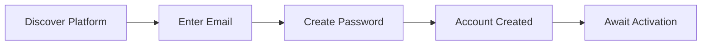

### Email Verification Trigger

WHEN a new account is created, THE system SHALL automatically send a verification email to the registered email address.

THE system SHALL include a verification link unique to that registration attempt.

THE system SHALL display a message instructing the user to check their email to complete activation.

### Account Activation Process

### Verification Link Processing

WHEN the user clicks the verification link in the email, THE system SHALL:
1. Validate the link authenticity
2. Activate the user account
3. Enable login capabilities for the user

IF the verification link has expired or is invalid, THE system SHALL display an error message and offer to resend a new verification email.

WHEN account activation completes successfully, THE system SHALL redirect the user to a welcome screen prompting profile setup.

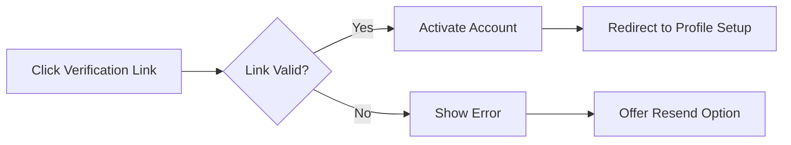

### Activation Security

IF an unverified user attempts to log in, THE system SHALL deny access and remind the user to verify their email address.

THE system SHALL allow the user to request a new verification email from the login screen.

### First-Time User Onboarding

### Welcome Experience

WHEN a newly activated user logs in for the first time, THE system SHALL present a welcome screen introducing the platform features.

THE system SHALL prompt the user to complete their profile with a display name and bio text.

WHEN the user completes the onboarding prompts, THE system SHALL save the profile information and direct the user to the main discussion board.

### Onboarding Guidance

THE system SHALL display guidance elements for first-time users, including:
1. How to browse sections
2. How to read articles
3. How to write comments
4. How to create articles

WHEN the user dismisses the onboarding guidance, THE system SHALL record completion and not display it again for that user.

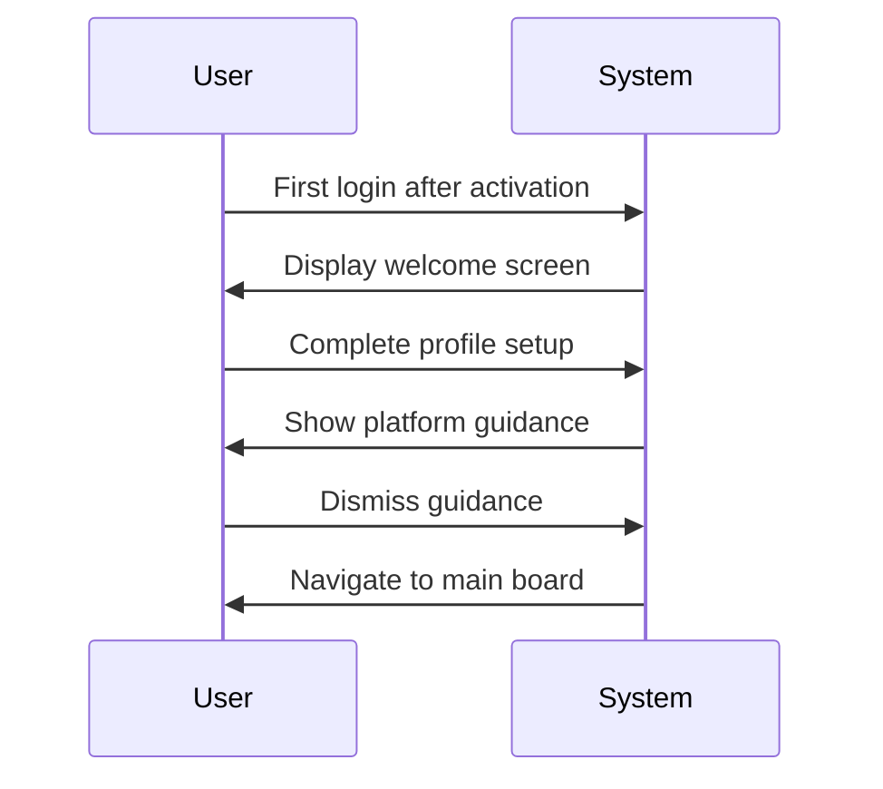

### Profile Setup Workflow

### Profile Configuration

WHEN a user accesses their profile settings for the first time, THE system SHALL display empty fields for display name and bio text.

WHEN the user enters a display name, THE system SHALL:
1. Accept the display name input
2. Associate the display name with the user account
3. Display the name alongside the user's contributions

WHEN the user enters bio text, THE system SHALL:
1. Accept the bio text input
2. Store the bio for public viewing
3. Display the bio on the user's profile page

### Profile Visibility

THE system SHALL make the user's display name and bio visible to all users who view the profile.

THE system SHALL allow the user to edit their display name and bio at any time.

WHEN the user saves profile changes, THE system SHALL immediately update the displayed information across all areas of the platform.

### Complete User Lifecycle

### Lifecycle Stages

THE system SHALL support the following user lifecycle stages:
1. Guest (unregistered visitor)
2. Pending (registered but unverified)
3. Active (verified member)
4. Banned (prohibited from logging in)
5. Deleted (account removed)

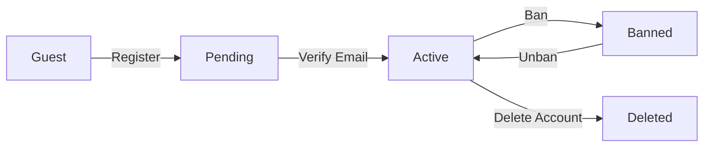

### State Transitions

WHEN a guest completes registration, THE system SHALL transition the user to the Pending state.

WHEN a pending user verifies their email, THE system SHALL transition the user to the Active state.

WHEN an active user's account is deleted, THE system SHALL transition the user to the Deleted state.

WHEN an administrator bans a user, THE system SHALL transition the user to the Banned state.

WHEN an administrator unbans a user, THE system SHALL transition the user back to the Active state.

### Account Deletion Cascade

### Deletion Request Handling

WHEN an active user requests account deletion, THE system SHALL display a confirmation prompt explaining:
1. All articles authored by the user will be permanently deleted
2. All comments written by the user will be permanently deleted
3. All profile information will be removed
4. The action is irreversible

WHEN the user confirms deletion, THE system SHALL:
1. Remove all articles authored by the user
2. Remove all comments written by the user
3. Delete the user account record
4. Permanently remove all profile information

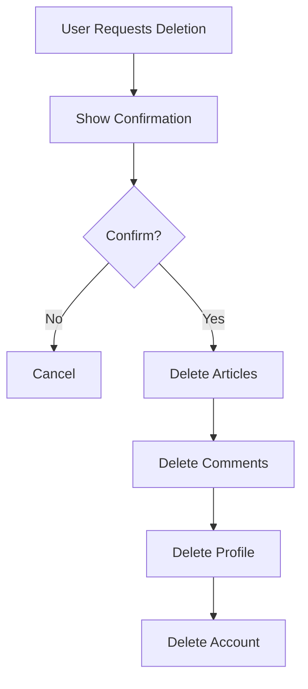

### Content Removal Guarantee

THE system SHALL ensure that after account deletion, no content remains associated with the deleted account.

THE system SHALL prevent recovery of any data from a deleted account.

THE system SHALL treat deleted accounts as non-existent for any subsequent login attempts.

### Ban Impact on Login

### Login Denial for Banned Users

WHEN a banned user attempts to log in, THE system SHALL:
1. Reject the login attempt
2. Display a message indicating the account has been banned
3. Prevent access to any authenticated features

THE system SHALL NOT display the ban reason to the banned user during login denial.

### Content Visibility After Ban

THE system SHALL preserve and display all articles written by a banned user.

THE system SHALL preserve and display all comments written by a banned user.

THE system SHALL show the banned user's display name on their existing content.

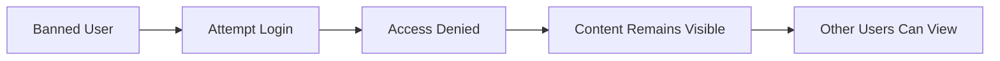

### Administrator Visibility

Administrators SHALL be able to view the ban reason associated with each banned user.

THE system SHALL store the ban reason at the time of banning.

### User Profile Viewing Experience

### Profile Access

WHEN a user views another user's profile, THE system SHALL display:
1. The user's display name
2. The user's bio text
3. A list of all articles authored by that user
4. A list of all comments written by that user

THE system SHALL allow any registered user to view any other user's profile.

THE system SHALL allow guests to view user profiles.

### Profile Navigation

WHEN a user clicks on an author's name from an article or comment, THE system SHALL navigate to that user's profile page.

WHEN viewing a user's profile, THE system SHALL provide links to each article in the article list.

WHEN viewing a user's profile, THE system SHALL provide links to each comment's original article context.

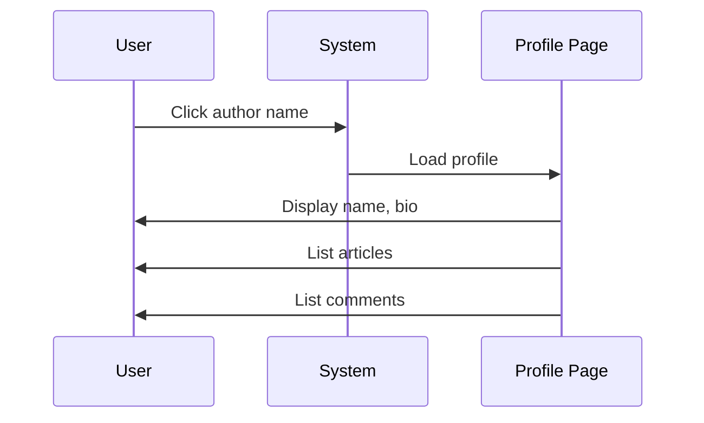

### User Contribution History Access

### Article History

WHEN viewing a user's profile, THE system SHALL display a paginated list of all articles the user has authored.

THE system SHALL show for each article in the list:
1. Article title
2. The section where the article was posted
3. The date the article was created

THE system SHALL sort the article list with the most recent articles first.

### Comment History

WHEN viewing a user's profile, THE system SHALL display a paginated list of all comments the user has written.

THE system SHALL show for each comment:
1. A preview of the comment content
2. The article the comment belongs to
3. The date the comment was created

WHEN a user clicks on a comment in the history, THE system SHALL navigate to the original article with the comment highlighted.

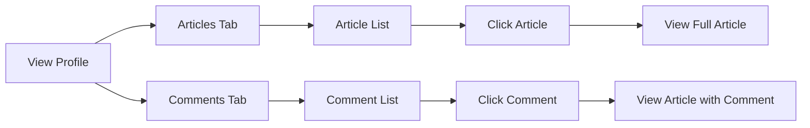

### History Persistence

THE system SHALL maintain the complete contribution history for active users.

THE system SHALL update contribution lists in real-time when new articles or comments are created.

### Account Management End-to-End

### Self-Service Account Operations

THE system SHALL provide a centralized account management interface where users can:
1. Change their password
2. Edit their profile information
3. Delete their account

WHEN a user accesses the account management interface, THE system SHALL display current profile information and available actions.

### Password Change Flow

WHEN a user requests a password change, THE system SHALL:
1. Require authentication of the current session
2. Prompt for the current password
3. Prompt for a new password
4. Require confirmation of the new password

IF the current password is incorrect, THE system SHALL reject the password change.

IF the new password does not meet security requirements, THE system SHALL reject the password change.

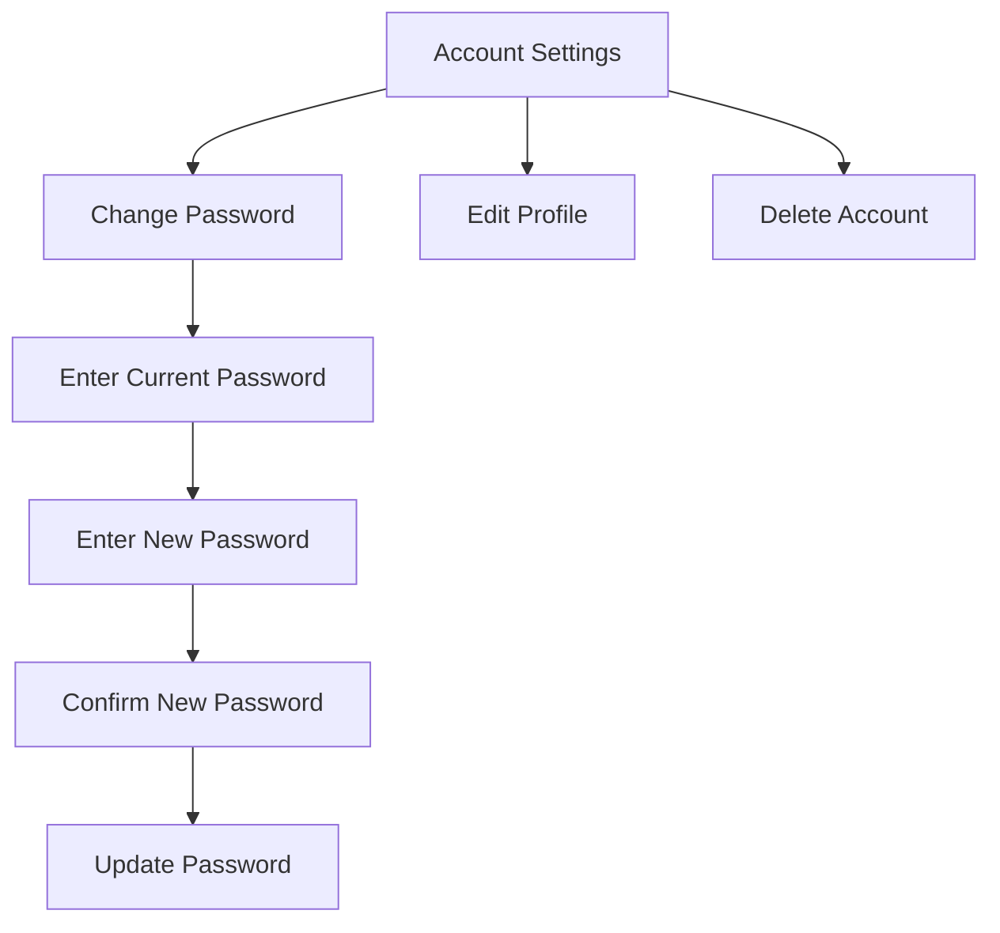

## Section User Scenarios

A user visits the discussion board homepage and sees a list of all available sections including Politics, Economy, and Current Affairs. Each section displays its name and description, helping the user understand what topics are discussed there. The user selects a section of interest and browses the paginated list of articles within that section. They can sort articles by newest or oldest to find relevant discussions. When an administrator creates a new section, regular users can immediately see and access it in the section list. Administrators manage sections by editing section names and descriptions to keep them relevant, and these changes are immediately reflected for all users browsing the platform. If an administrator deletes a section, users can no longer access that section, though the handling of articles within deleted sections follows platform policies. Users navigate between sections to explore different topics and find discussions matching their interests.

### Section Discovery on Homepage

### User Journey: Discovering Available Sections

WHEN a guest or member visits the discussion board homepage, THE system SHALL display a list of all available sections.

WHEN displaying the section list, THE system SHALL show each section's name and description.

THE system SHALL allow users to view section descriptions without requiring authentication.

WHEN a user views the section list, THE system SHALL display sections in a consistent order that allows users to easily discover topics of interest.

WHEN a new section is created by an administrator, THE system SHALL immediately make it visible to all users in the section list.

WHEN an administrator updates a section's name or description, THE system SHALL immediately reflect those changes for all users viewing the section list.

IF a section has been deleted by an administrator, THE system SHALL NOT display that section in the section list to any user.

### User Journey: Understanding Section Content

WHEN a user reads a section description, THE system SHALL provide sufficient information for the user to understand the topics discussed in that section.

WHEN a user compares multiple sections, THE system SHALL display each section's name and description side-by-side to facilitate informed selection.

IF a user cannot find a relevant topic, THE system SHALL allow them to browse other sections to find related discussions.

### Navigating Articles Within a Section

### User Journey: Entering a Section

WHEN a user selects a section from the section list, THE system SHALL display the paginated list of articles within that section.

WHEN displaying the article list, THE system SHALL show each article's title, author, tags, comment count, and time posted.

THE system SHALL NOT display the full article content in the section's article list.

### User Journey: Browsing Articles

WHEN a user views a section's article list, THE system SHALL provide pagination controls to navigate through multiple pages of articles.

WHEN a user requests a specific page of articles, THE system SHALL display the articles for that page.

WHEN a user sorts articles by newest first, THE system SHALL reorder the article list to show the most recently created articles at the top.

WHEN a user sorts articles by oldest first, THE system SHALL reorder the article list to show the earliest created articles at the top.

WHEN a user switches between sort orders, THE system SHALL maintain the current page position or reset to the first page as appropriate.

### User Journey: Discovering Article Previews

WHEN a user browses articles within a section, THE system SHALL display enough information in the article list for the user to decide whether to view the full article.

WHEN an article has tags, THE system SHALL display those tags in the article list within the section.

WHEN an article has comments, THE system SHALL display the comment count in the article list.

### Administrator Section Creation Visibility

### User Journey: Encountering New Sections

WHEN an administrator creates a new section, THE system SHALL make that section immediately visible to all users without requiring page refresh or system delay.

WHEN a user is browsing the section list, THE system SHALL ensure that newly created sections appear consistently for all users.

WHEN an administrator creates a section, THE system SHALL assign the specified name and description to the section for user discovery.

### User Journey: Seeing Section Updates

WHEN an administrator edits a section's name, THE system SHALL immediately update the display for all users viewing the section list.

WHEN an administrator edits a section's description, THE system SHALL immediately update the description for all users viewing that section.

IF a user is viewing a section when an administrator edits it, THE system SHALL reflect the updated name or description upon the next user interaction.

WHEN a user selects a section, THE system SHALL display the section's current name and description as defined by administrators.

### Cross-Section Exploration

### User Journey: Navigating Between Sections

WHEN a user finishes reviewing articles in one section, THE system SHALL allow the user to navigate to any other available section.

WHEN a user navigates between sections, THE system SHALL display the article list specific to each section.

THE system SHALL maintain separate article lists for each section, ensuring articles in one section do not appear in another section's list.

WHEN a user searches for articles, THE system SHALL allow filtering by section to narrow results to specific topic areas.

### User Journey: Finding Related Content

WHEN a user wants to explore different topics, THE system SHALL provide access to all available sections from any section's article list view.

WHEN a user navigates to a different section, THE system SHALL display that section's name and description before showing articles.

IF a user's interests span multiple topics, THE system SHALL enable exploration across all sections without restriction.

WHEN a user returns to a previously visited section, THE system SHALL display the section with its current articles and settings.

### Section Deletion Impact on Users

### User Journey: Losing Access to Deleted Sections

WHEN an administrator deletes a section, THE system SHALL remove that section from the section list for all users.

WHEN a user attempts to access a deleted section, THE system SHALL prevent access and inform the user that the section no longer exists.

IF a user had bookmarked or linked to an article in a deleted section, THE system SHALL handle the access attempt appropriately.

WHEN a section is deleted, THE system SHALL ensure users can no longer browse articles within that section.

### User Journey: Discovering Section Removal

WHEN a user returns to the discussion board after a section has been deleted, THE system SHALL display the updated section list without the deleted section.

THE system SHALL NOT display deleted sections to any user, regardless of previous interactions with those sections.

WHEN a section is deleted, THE system SHALL maintain the visibility of remaining sections in the section list.

## Article User Scenarios

A user creates a new article by first selecting a section where the article will be posted. They then enter a required title and content, add relevant tags to help others find the article, and attach any supporting files or images. After submitting, the article appears in the section's article list showing the title, author display name, tags, comment count, and posting time. Other users can view the full article page to read the complete content, see all attachments, and access any downloadable files or images. The article author can edit their article at any time to update the title, content, add or remove attachments, or modify tags. When a user searches for articles, they enter keywords matching titles or content and can filter results by specific tags to narrow down relevant discussions. Search results show paginated article previews that users can click to view full articles. If the author deletes their article, it is removed from all article lists and search results. Administrators can delete any article if it violates platform rules, removing it from public view. Users can click on tags to find other articles with similar topics across different sections.

### Article Creation Workflow

### End-to-End Article Creation Process

WHEN a member creates a new article, THE system SHALL guide them through a sequential workflow beginning with section selection and concluding with article publication.

WHEN a member initiates article creation, THE system SHALL display all available sections and require the member to select one section before proceeding.

WHEN a member submits a new article, THE system SHALL validate that:
1. A section has been selected
2. A title has been provided
3. Content has been provided

IF any required field is missing, THE system SHALL prevent publication and prompt the member to complete the missing information.

WHEN a member completes all required fields, THE system SHALL allow the member to optionally add tags and attach files or images before submitting.

WHEN the article is successfully submitted, THE system SHALL:
1. Create the article record
2. Associate all attachments
3. Store all tags
4. Make the article immediately visible in the section's article list
5. Display the full article to the member

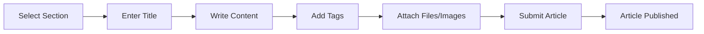

### Multi-Step Article Publishing

### Progressive Article Assembly

WHEN a member composes an article, THE system SHALL preserve partial work allowing the member to add, modify, or remove components in any order.

WHEN a member adds tags to an article, THE system SHALL accept free-text tag entries and allow multiple tags to be assigned before publication.

WHEN a member attaches files to an article, THE system SHALL allow multiple files to be uploaded and associated with the article.

WHEN a member attaches images to an article, THE system SHALL allow multiple images to be uploaded and associated with the article.

WHEN a member previews an article before submission, THE system SHALL display how the article will appear to other users including all attachments and tags.

IF a member attempts to submit an article missing required fields, THE system SHALL reject the submission and indicate which fields require completion.

### Publication Confirmation

WHEN an article is published, THE system SHALL:
1. Record the author's display name
2. Record the publication timestamp
3. Initialize the comment count to zero
4. Make the article searchable immediately

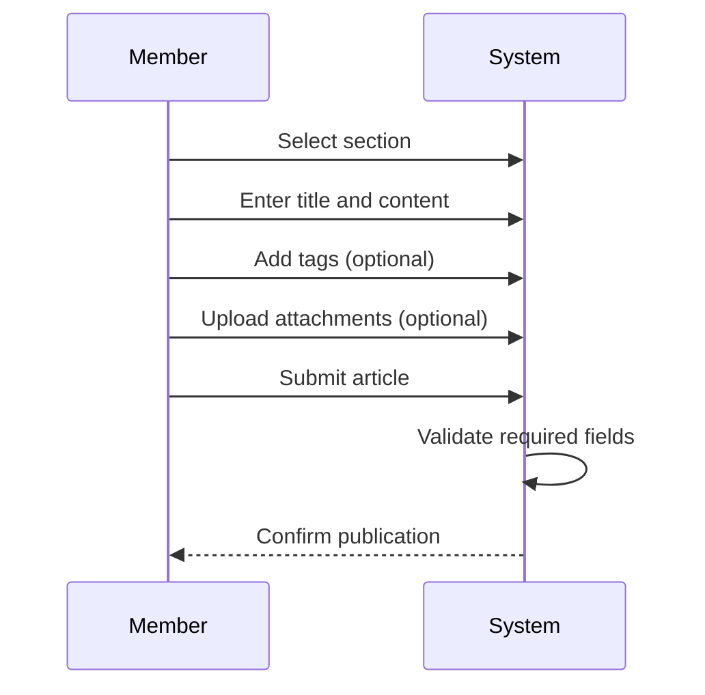

### Article Editing Lifecycle

### Author-Driven Article Updates

WHEN an article author views their own article, THE system SHALL provide an editing option that allows modification of the article's content and attributes.

WHEN an author edits their article, THE system SHALL allow modification of:
1. The title
2. The content
3. The tags
4. The attachments (files and images)

WHEN an author modifies the article title, THE system SHALL update the title displayed in article lists and search results.

WHEN an author adds new attachments, THE system SHALL append them to the existing attachments.

WHEN an author removes existing attachments, THE system SHALL delete them from the article and make them unavailable for download.

WHEN an author saves article edits, THE system SHALL:
1. Update all modified content
2. Maintain the original publication timestamp
3. Retain all existing comments
4. Reflect changes immediately in article lists and search results

### Edit Visibility

WHEN an article has been edited, THE system SHALL make updated content immediately visible to all users viewing the article.

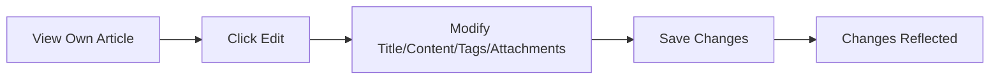

### Article Search and Discovery

### Keyword-Based Article Search

WHEN a user performs an article search, THE system SHALL allow entry of search keywords that match against article titles and article content.

WHEN the system processes a search query, THE system SHALL return matching articles from all sections.

WHEN search results are displayed, THE system SHALL present each matching article showing:
1. The article title
2. The author's display name
3. The article's tags
4. The comment count
5. The posting time

WHEN a user clicks on a search result, THE system SHALL navigate to the full article view.

### Search Result Pagination

WHEN search results exceed the page limit, THE system SHALL paginate results and provide navigation controls.

WHEN a user navigates between search result pages, THE system SHALL maintain the original search keywords and filters.

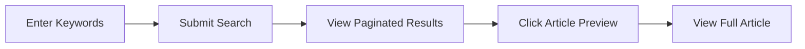

### Tag-Based Article Filtering

### Tag Navigation

WHEN a user views an article, THE system SHALL display all tags associated with that article.

WHEN a user clicks on a tag, THE system SHALL navigate to a filtered view showing all articles that share the same tag across all sections.

WHEN a user applies a tag filter to search results, THE system SHALL narrow results to only articles containing the selected tag.

### Combined Filtering

WHEN a user enters search keywords AND applies tag filters, THE system SHALL return only articles that match both the keywords AND the specified tags.

WHEN multiple tag filters are applied, THE system SHALL return articles that contain any of the selected tags.

WHEN tag filter results are displayed, THE system SHALL show articles from multiple sections if they share the same tag.

### Tag Results Display

WHEN tag-filtered results are displayed, THE system SHALL show each article with its section name, allowing users to understand the article's context.

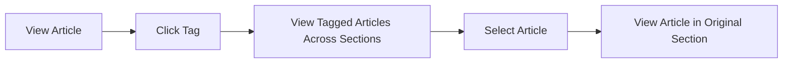

### Attachment Integration in Articles

### Attachment Upload During Creation

WHEN a member creates an article, THE system SHALL provide the capability to upload files and images during the article composition process.

WHEN multiple files and images are attached, THE system SHALL associate all attachments with the article before publication.

### Attachment Download Access

WHEN a user views an article with attachments, THE system SHALL display all attached files and images.

WHEN a user clicks on an attached file, THE system SHALL initiate a download of that file.

WHEN a user clicks on an attached image, THE system SHALL display the image or initiate a download.

### Attachment Management During Editing

WHEN an author edits an article, THE system SHALL allow adding new attachments without removing existing ones.

WHEN an author removes an attachment from an article, THE system SHALL delete the attachment and it SHALL no longer be downloadable.

WHEN an article is deleted, THE system SHALL remove all associated attachments from storage.

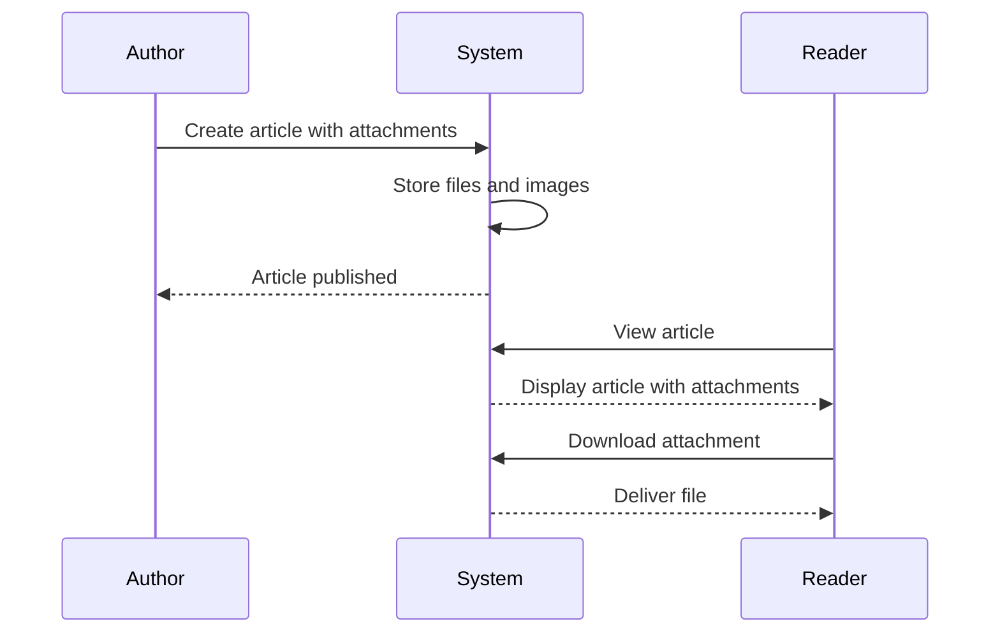

### Article Deletion Scenarios

### Author-Initiated Article Deletion

WHEN an article author deletes their own article, THE system SHALL:
1. Remove the article from the section's article list
2. Remove the article from search results
3. Remove the article from tag-filtered results
4. Delete all associated comments
5. Delete all associated attachments

WHEN an author deletes their article, THE system SHALL make the article immediately inaccessible to all users.

### Administrator Article Deletion

WHEN an administrator deletes any article, THE system SHALL perform the same removal operations as author-initiated deletion.

WHEN an administrator deletes an article, THE system SHALL NOT notify the original author.

### Deletion Impact

WHEN an article is deleted, THE system SHALL ensure that:
1. Links to the article no longer function
2. The article no longer appears in the author's profile article list
3. Comments from the article no longer appear in commenter's profiles

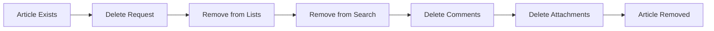

### Cross-Section Article Search

### Section-Independent Search

WHEN a user performs a keyword search, THE system SHALL search across all sections simultaneously without requiring section selection.

WHEN search results include articles from multiple sections, THE system SHALL display each article with an indication of its parent section.

### Section Context in Results

WHEN displaying cross-section search results, THE system SHALL show for each article:
1. The article title
2. The section name where the article resides
3. The author's display name
4. The article's tags
5. The comment count
6. The posting time

WHEN a user clicks on a cross-section search result, THE system SHALL navigate to the article within its original section context.

### Tag-Based Cross-Section Discovery

WHEN a user filters by tag, THE system SHALL return matching articles from all sections where articles have that tag.

WHEN viewing tag-filtered results, THE system SHALL group or identify articles by their parent section to maintain organizational context.

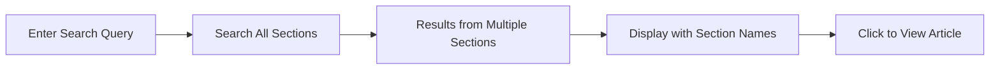

### Article Visibility in Lists

### Article List Display

WHEN a user views a section's article list, THE system SHALL display each article with:
1. The article title
2. The author's display name
3. All associated tags
4. The current comment count
5. The posting timestamp

WHEN an article list is displayed, THE system SHALL NOT show the full article content, only the title as a clickable preview.

### Article List Sorting

WHEN a user selects "Newest First" sorting, THE system SHALL display articles in descending order by creation timestamp.

WHEN a user selects "Oldest First" sorting, THE system SHALL display articles in ascending order by creation timestamp.

### Article List Pagination

WHEN the number of articles exceeds the page limit, THE system SHALL paginate the article list.

WHEN a user navigates between pages, THE system SHALL maintain the current sort order.

### Visibility of Article Attributes

WHEN an article has no comments, THE system SHALL display a comment count of zero.

WHEN an article has no tags, THE system SHALL display the article without any tag indicators.

WHEN an article has attachments, THE system SHALL NOT indicate attachments in the list view; attachments SHALL only be visible on the full article page.

```mermaid
flowchart LR
    A["Open Section"] --> B["View Paginated List"]
    B --> C["Sort by Newest/Oldest"]
    C --> D["Navigate Pages"]
    D --> E["Click Article Title"]
    E --> F["View Full Article"]
```

### Content Organization Flow

### Section-Based Organization

WHEN a user browses the discussion board, THE system SHALL organize articles into sections, with each article belonging to exactly one section.

WHEN a member creates an article, THE system SHALL require selection of a single section where the article will be posted.

### Tag-Based Topic Grouping

WHEN an author assigns tags to an article, THE system SHALL enable topic-based discovery across sections regardless of where articles are posted.

WHEN a user views articles by tag, THE system SHALL present articles from multiple sections that share the same tag, facilitating cross-topic discovery.

### Author Content Consolidation

WHEN a user views an author's profile, THE system SHALL display all articles written by that author regardless of which section each article belongs to.

WHEN a user views an author's profile, THE system SHALL display all comments written by that author on any article across all sections.

### Content Navigation Paths

WHEN a user browses content, THE system SHALL provide multiple navigation paths:
1. Section-based browsing for topic-focused reading
2. Tag-based filtering for cross-section topic discovery
3. Author profile viewing for user-specific content access
4. Keyword search for direct content lookup

```mermaid
flowchart LR
    A["Discussion Board"] --> B["Browse by Section"]
    A --> C["Browse by Tag"]
    A --> D["Search by Keyword"]
    A --> E["View Author Profile"]
    B --> F["Article List"]
    C --> F
    D --> F
    E --> F
    F --> G["Full Article"]
```

## Comment User Scenarios

A user reads an interesting article and wants to contribute to the discussion by writing a comment. They enter their comment text in the comment section and submit it. The comment appears at the bottom of the article's comment thread, sorted chronologically with oldest comments first. Other users viewing the article can see all comments including the new one, each showing the author's display name, comment content, and time posted. The comment author can edit their comment if they notice a mistake or want to clarify their point. If the user decides their comment is no longer relevant, they can delete it, which removes it from the discussion thread. Users can view another user's profile to see a list of all comments that user has written across different articles. When an article has many comments, users scroll through the thread to read the full discussion. Administrators can delete any comment that violates platform rules, removing it from the article's comment section. The comment count displayed in article lists updates whenever comments are added or removed.

### Comment Submission Flow

### Creating a Comment

WHEN a member views an article, THE system SHALL display a comment input area for writing new comments.

WHEN a member submits a comment, THE system SHALL require the comment content to be provided.

WHEN a member creates a comment on an article, THE system SHALL associate the comment with the article and the member as author.

WHEN a member successfully creates a comment, THE system SHALL store the comment content, author, article reference, and creation time.

WHEN a member successfully creates a comment, THE system SHALL display the new comment at the bottom of the article's comment thread.

IF the comment content is empty, THE system SHALL reject the comment submission.

IF the member is banned, THE system SHALL reject the comment submission.

IF the article does not exist, THE system SHALL reject the comment submission.

### Comment Data Captured

WHEN a comment is created, THE system SHALL record the author's display name, comment content, and time posted.

WHEN a comment is created, THE system SHALL NOT allow nested replies or comment threading.

### Discussion Thread Viewing

### Viewing Comments on an Article

WHEN a user views an article, THE system SHALL display all comments associated with that article.

WHEN a user views the comment thread, THE system SHALL sort comments by creation time in chronological order with oldest comments first.

WHEN a user views the comment thread, THE system SHALL display for each comment the author's display name, comment content, and time posted.

WHEN a user scrolls through a comment thread, THE system SHALL present comments in their entirety without truncation.

WHEN a user views comments on an article, THE system SHALL display comments in a single-level list without nested reply structures.

WHEN a guest views the comment thread, THE system SHALL display all comments but SHALL NOT display the comment input area.

### Comment Visibility

WHEN a user views an article with comments, THE system SHALL display the comment count in the article list.

WHEN a comment author's account is deleted, THE system SHALL remove the comment from the article thread.

WHEN a user is banned, THE system SHALL continue to display their existing comments in article threads.

### Comment Editing Workflow

### Editing Own Comments

WHEN a member views their own comment, THE system SHALL provide an edit option for that comment.

WHEN a member initiates comment editing, THE system SHALL display the current comment content in an editable form.

WHEN a member submits an edited comment, THE system SHALL update the comment content.

WHEN a member successfully edits a comment, THE system SHALL preserve the original author and creation time.

IF the edited comment content is empty, THE system SHALL reject the edit.

IF a member attempts to edit another user's comment, THE system SHALL reject the request.

IF a member attempts to edit a comment that has been deleted, THE system SHALL reject the edit.

IF a member is banned, THE system SHALL reject any edit attempts to their comments.

### Edit Permissions

WHEN an admin views any comment, THE system SHALL NOT provide an edit option unless the admin is the comment author.

THE system SHALL restrict comment editing to the comment author only.

### Comment Deletion Process

### Deleting Own Comments

WHEN a member views their own comment, THE system SHALL provide a delete option for that comment.

WHEN a member confirms comment deletion, THE system SHALL remove the comment from the article thread.

WHEN a member deletes their own comment, THE system SHALL decrement the article's comment count.

IF a member attempts to delete another user's comment, THE system SHALL reject the request.

IF a member attempts to delete a comment that no longer exists, THE system SHALL notify the user that the comment was already deleted.

IF a banned member attempts to delete their comments, THE system SHALL reject the deletion.

### Deletion Effects

WHEN a comment is deleted, THE system SHALL remove it from all views including the article thread and user profiles.

WHEN a comment is deleted, THE system SHALL NOT create a placeholder or tombstone message.

WHEN a user deletes their account, THE system SHALL delete all comments authored by that user.

### Comment History in Profiles

### Viewing Comment History

WHEN a user views another user's profile, THE system SHALL display a list of all comments written by that user.

WHEN a user views a profile's comment history, THE system SHALL display for each comment the article title, comment content, and time posted.

WHEN a user views a profile's comment history, THE system SHALL show comments across all articles the user has commented on.

WHEN a user views their own profile, THE system SHALL include links to edit or delete their comments directly from the profile view.

### Cross-Article Comment Activity

WHEN a user views a comment in another user's profile, THE system SHALL provide a link to the original article where the comment was posted.

WHEN a user has not written any comments, THE system SHALL display an empty comment history section in their profile.

WHEN a comment is deleted from an article, THE system SHALL remove it from the author's profile comment history.

### Comment Contribution Tracking

WHEN a user views another user's profile, THE system SHALL show the total count of comments written by that user.

WHEN a user's comment count is displayed, THE system SHALL reflect only currently existing comments.

WHEN a user's comment is deleted, THE system SHALL decrement the user's total comment count.

### Moderator Comment Removal

### Administrator Comment Deletion

WHEN an admin views any comment on the platform, THE system SHALL provide a delete option for that comment.

WHEN an admin deletes a comment, THE system SHALL remove the comment from the article thread regardless of author.

WHEN an admin deletes a comment, THE system SHALL decrement the article's comment count.

WHEN an admin deletes a comment, THE system SHALL remove the comment from the author's profile comment history.

IF an admin attempts to delete their own comment, THE system SHALL allow the deletion.

### Administrative Access

THE system SHALL allow admins to delete comments from any user including other administrators.

WHEN an admin deletes a comment for policy violations, THE system SHALL NOT automatically ban the comment author.

WHEN an admin deletes a comment, THE system SHALL record that the deletion was performed by an administrator.

### Banned User Comments

WHEN a user is banned, THE system SHALL preserve all existing comments authored by that user.

WHEN a banned user's comments are viewed, THE system SHALL display the comment content and author display name normally.

### Comment Count Synchronization

### Comment Count Updates

WHEN a new comment is created on an article, THE system SHALL increment the article's comment count.

WHEN a comment is deleted, THE system SHALL decrement the article's comment count.

WHEN an article is displayed in a list, THE system SHALL show the current comment count.

WHEN a user's account is deleted, THE system SHALL decrement the comment count for every article where that user had comments.

### Count Accuracy

WHEN a comment count is displayed, THE system SHALL reflect the exact number of existing comments on the article.

WHEN multiple comments are created or deleted simultaneously, THE system SHALL accurately update the comment count.

WHEN an admin bulk-deletes comments, THE system SHALL update the article comment count accordingly.

IF an error occurs during comment creation, THE system SHALL NOT increment the comment count.

IF an error occurs during comment deletion, THE system SHALL NOT decrement the comment count.

## Attachment User Scenarios

While creating an article, a user decides to attach supporting documents and images to provide context for their discussion. They select multiple files from their device, including both documents and images, which are uploaded and associated with the article. After publishing, other users viewing the article can see thumbnail previews of attached images and a list of downloadable files. Users click on attachments to download files or view full-size images. When the article author edits their article, they can add new attachments, remove existing ones, or replace files with updated versions. Each attachment displays its upload time, helping readers understand when supporting materials were added. If an article is deleted, all associated attachments are also removed and no longer accessible. Users downloading attachments can access the files directly from the article page without additional authentication steps. Multiple attachments on a single article allow authors to provide comprehensive supporting materials including images, spreadsheets, documents, and other file types. Attachment types are clearly indicated so users know whether they are opening an image or downloading a file.

### Reader Attachment Access Experience

### User Story
A reader views an article and wants to access the supporting materials—downloading documents and viewing images attached by the author.

### Attachment Visibility
WHEN a user views an article, THE system SHALL display all attached files and images in the article view.

WHEN a user views the article page, THE system SHALL show a clear separation between the article content and its attachments.

### Attachment Type Indication
WHEN attachments are displayed, THE system SHALL clearly indicate whether each attachment is an image or a file.

WHEN a file attachment is displayed, THE system SHALL show the file name and indicate it is downloadable.

WHEN an image attachment is displayed, THE system SHALL show a thumbnail preview to distinguish it from files.

### Download Access
WHEN a reader clicks on a file attachment, THE system SHALL download the file to the reader's device.

WHEN a reader clicks on an image thumbnail, THE system SHALL display the full-size image.

WHEN viewing a full-size image, THE system SHALL provide an option to download the image.

### No Additional Authentication
WHEN a logged-in user accesses attachments on an article, THE system SHALL allow download access without requiring additional authentication steps.

WHEN an attachment is clicked, THE system SHALL provide direct access to the file or image.

### Comprehensive Attachment List
WHEN multiple attachments are present, THE system SHALL display a complete list showing all attached materials.

WHEN attachments include both files and images, THE system SHALL organize them clearly so users can find the type they need.

## AdminRequest User Scenarios

A regular user who wants to help manage the platform decides to request administrator privileges. They submit an administrator request with a written explanation of why they would be a good administrator. The request enters a pending state and appears in a list that super administrators can review. Super administrators browse through pending requests and examine each requester's reason and account history before making a decision. When a super administrator approves a request, the user immediately gains regular administrator privileges and can access administrative functions. If the request is rejected, the user remains a regular user and can continue using the platform normally. A newly approved administrator can now create and manage sections, delete inappropriate articles and comments, and ban users who violate rules. Super administrators can promote trusted regular administrators to super administrator status when additional leadership is needed. Super administrators can also demote other super administrators to regular administrator status if needed, though they cannot demote themselves. The administrator request status is visible to the requesting user, showing whether it is pending, approved, or rejected. Users with rejected requests may submit new requests if they believe circumstances have changed.

### Administrator Privilege Request Flow

WHEN a member decides to request administrator privileges, THE system SHALL allow the member to submit an administrator request containing a written explanation.

WHEN a member submits an administrator request, THE system SHALL set the request status to pending.

WHEN a member has a pending administrator request, THE system SHALL prevent submission of additional requests until the existing request is resolved.

IF a member's previous administrator request was rejected, THE system SHALL allow the member to submit a new request.

WHEN a member submits a new request after rejection, THE system SHALL treat it as a fresh request independent of prior submissions.

WHEN a member's administrator request is approved, THE system SHALL immediately grant the member regular administrator privileges.

WHEN a member gains administrator privileges, THE system SHALL provide access to section management, content moderation, and user banning functions.

IF a member's administrator request is rejected, THE system SHALL retain the member's existing member privileges unchanged.

WHEN a member views their administrator request history, THE system SHALL display each request with its status: pending, approved, or rejected.

### Super Administrator Request Review Flow

WHEN a super administrator accesses the administrator request list, THE system SHALL display all requests with pending status.

WHEN a super administrator selects a pending request, THE system SHALL display the requester's display name, bio, and written reason.

WHEN a super administrator reviews a request, THE system SHALL allow the super administrator to approve or reject the request.

IF a super administrator approves a request, THE system SHALL change the requester's role from member to administrator.

IF a super administrator rejects a request, THE system SHALL update the request status to rejected without affecting the requester's member privileges.

WHEN a request is approved or rejected, THE system SHALL remove the request from the pending list.

WHEN a super administrator makes a decision on a request, THE system SHALL record which super administrator made the decision and when.

### Administrator Status Tracking Flow

WHEN a member views their profile, THE system SHALL display any administrator request they have submitted along with its current status.

WHEN a member has a pending request, THE system SHALL indicate that the request is awaiting review by super administrators.

WHEN a member's request is approved, THE system SHALL update the status to approved and reflect the member's new administrator role.

WHEN a member's request is rejected, THE system SHALL update the status to rejected while maintaining member role.

WHEN a banned user views their administrator request status, THE system SHALL display the status but prevent new request submissions.

WHEN a member who is already an administrator submits a new administrator request, THE system SHALL reject the request as unnecessary.

### New Administrator Capability Activation

WHEN a member's administrator request is approved, THE system SHALL enable section creation and editing capabilities immediately.

WHEN a member's administrator request is approved, THE system SHALL enable section deletion capabilities immediately.

WHEN a member's administrator request is approved, THE system SHALL enable article deletion capabilities for any article on the platform.

WHEN a member's administrator request is approved, THE system SHALL enable comment deletion capabilities for any comment on the platform.

WHEN a member's administrator request is approved, THE system SHALL enable user banning and unbanning capabilities.

WHEN a member's administrator request is approved, THE system SHALL enable access to the banned user list.

WHEN a newly appointed administrator performs administrative actions, THE system SHALL record the action with the administrator's identity and timestamp.

### Super Administrator Promotion Flow

WHEN a super administrator views the administrator list, THE system SHALL display all regular administrators with an option to promote them.

WHEN a super administrator promotes a regular administrator to super administrator, THE system SHALL immediately grant the promoted user all super administrator privileges.

WHEN a user is promoted to super administrator, THE system SHALL enable the ability to approve administrator requests.

WHEN a user is promoted to super administrator, THE system SHALL enable the ability to promote and demote other administrators.

WHEN a user is promoted to super administrator, THE system SHALL enable the ability to view and act on administrator requests.

IF a super administrator attempts to demote themselves, THE system SHALL reject the operation and prevent self-demotion.

### Administrator Demotion Flow

WHEN a super administrator views another super administrator's profile, THE system SHALL display an option to demote that administrator.

WHEN a super administrator demotes another super administrator, THE system SHALL change the demoted user's role from super administrator to regular administrator.

WHEN a super administrator is demoted to regular administrator, THE system SHALL retain all regular administrator capabilities while removing super administrator-specific capabilities.

WHEN a super administrator is demoted, THE system SHALL remove access to administrator request approval functions.

WHEN a super administrator is demoted, THE system SHALL remove access to administrator promotion and demotion functions.

WHEN a demoted administrator views their profile, THE system SHALL reflect their current regular administrator status.

### Repeated Request Submission Scenarios

WHEN a member submits an administrator request after a previous rejection, THE system SHALL accept the new request as a fresh submission.

WHEN a member submits a new request after rejection, THE system SHALL allow the member to provide an updated or different reason.

WHEN a member has multiple past rejected requests, THE system SHALL maintain a complete history of all requests and their outcomes.

WHEN a super administrator reviews a request from a member with previous rejections, THE system SHALL display the member's request history including past rejections.

IF a banned user attempts to submit an administrator request, THE system SHALL reject the request submission.

WHEN a member who is already an administrator attempts to submit an administrator request, THE system SHALL reject the request as the user already has administrator privileges.

# File Storage

File upload capabilities, media processing, and storage requirements.

## File Upload and Management

Define file upload capabilities, supported formats, processing requirements, and access control for stored files.

### File Upload Requirements

WHEN a user uploads a file attachment, THE system SHALL accept files of commonly used document formats.

WHEN a user uploads a file attachment, THE system SHALL validate that the file meets size constraints.

IF a file exceeds the maximum allowed size, THE system SHALL reject the upload.

IF a file type is not supported, THE system SHALL reject the upload.

WHEN a file upload is successful, THE system SHALL associate the file with the article being created or edited.

WHEN multiple files are uploaded for a single article, THE system SHALL attach each file to the same article.

THE system SHALL preserve the original filename for each uploaded file.

### Image Upload Requirements

WHEN a user uploads an image attachment, THE system SHALL accept common image formats.

WHEN a user uploads an image attachment, THE system SHALL validate that the image meets size constraints.

IF an image exceeds the maximum allowed size, THE system SHALL reject the upload.

IF an image format is not supported, THE system SHALL reject the upload.

THE system SHALL distinguish between file attachments and image attachments.

WHEN an image upload is successful, THE system SHALL associate the image with the article being created or edited.

WHEN multiple images are uploaded for a single article, THE system SHALL attach each image to the same article.

THE system SHALL preserve the original filename for each uploaded image.

### Attachment Storage

THE system SHALL store all attachments associated with an article for the duration of the article's existence.

WHEN an article is created, THE system SHALL persistently store all attached files and images.

WHEN an article is edited, THE system SHALL preserve existing attachments unless explicitly removed by the author.

WHEN an article is deleted, THE system SHALL remove all attachments associated with that article.

THE system SHALL maintain the association between each attachment and its parent article.

THE system SHALL store attachment metadata including upload timestamp and file type.

WHEN attachments are stored, THE system SHALL retain the original file content without modification.

### Attachment Access and Download

WHEN a user views an article, THE system SHALL display all attached files and images.

WHEN a user requests to download a file attachment, THE system SHALL provide the file for download.

WHEN a user requests to download an image attachment, THE system SHALL provide the image for download.

THE system SHALL allow any user with access to the article to download its attachments.

WHEN a user downloads an attachment, THE system SHALL serve the file with its original filename.

THE system SHALL track the attachment type (file or image) for proper handling during download.

### Attachment Management During Article Editing

WHEN an author edits their article, THE system SHALL display all existing attachments.

WHEN an author removes an attachment during editing, THE system SHALL delete that attachment from storage.

WHEN an author adds new attachments during editing, THE system SHALL append them to existing attachments.

WHEN an author replaces an attachment, THE system SHALL remove the old attachment and store the new one.

IF an article edit is cancelled, THE system SHALL preserve the original set of attachments without changes.

THE system SHALL allow the author to manage both file and image attachments during a single edit session.