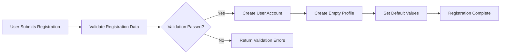
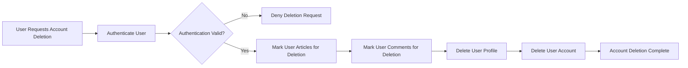
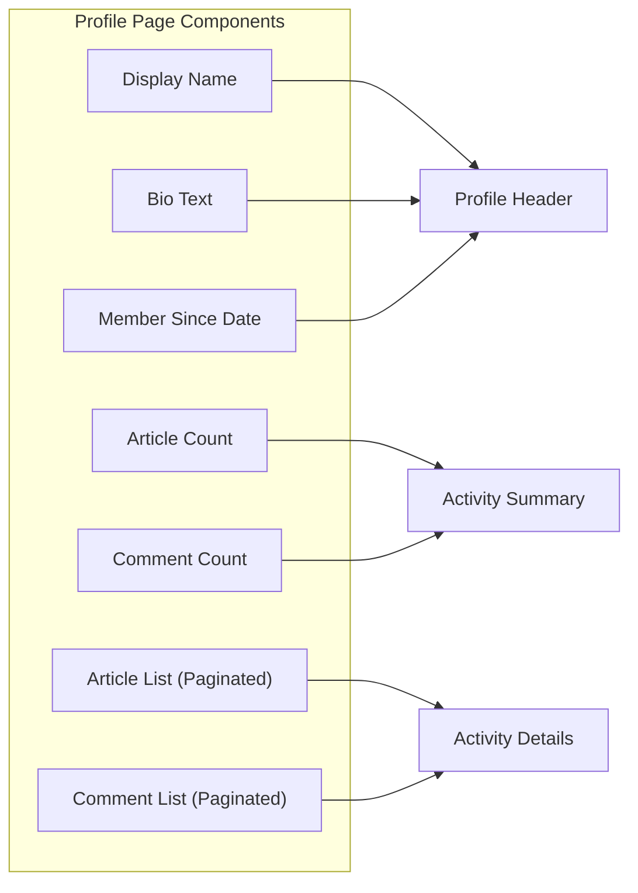
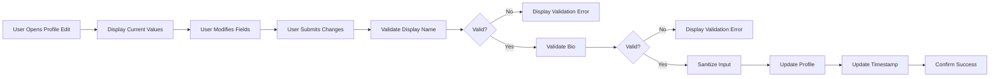
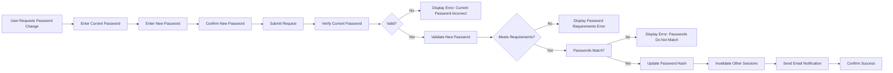

# User Profile System Requirements

## Overview

The User Profile System provides users with a personal identity on the discussion board platform. Each registered user has a profile that displays their display name, biography, and activity history including articles and comments they have authored. The profile system enables personalization while maintaining content attribution and platform transparency.

## Profile Data Structure

### Core Profile Fields

THE system SHALL maintain a user profile for every registered user account.

THE user profile SHALL contain the following fields:

| Field | Type | Required | Constraints | Description |
|-------|------|----------|-------------|-------------|
| Display Name | String | No | 1-50 characters, alphanumeric with spaces and basic punctuation | The name displayed to other users |
| Bio | Text | No | 0-500 characters | User-provided biography or description |
| User ID | UUID | Yes | Immutable, unique | Reference to the user account |
| Created At | Timestamp | Yes | Auto-generated, immutable | Profile creation timestamp |
| Updated At | Timestamp | Yes | Auto-updated | Last modification timestamp |

### Display Name Rules

WHEN a user does not provide a display name, THE system SHALL use a default identifier based on the user's email address or a system-generated name.

THE display name SHALL allow the following characters:
- Alphabetic characters (A-Z, a-z)
- Numeric characters (0-9)
- Spaces (single spaces between words, no leading/trailing spaces)
- Basic punctuation (hyphen, underscore, apostrophe)

THE display name SHALL NOT allow:
- Empty display name when explicitly set (must have at least 1 character)
- Display names exceeding 50 characters
- Display names consisting only of whitespace
- Display names containing special characters (emojis, symbols, HTML tags)

### Bio Rules

THE bio field SHALL be optional and allow empty values.

WHEN a user provides a bio, THE system SHALL limit the content to 500 characters maximum.

THE bio field SHALL preserve user formatting including:
- Line breaks (newlines)
- Basic text formatting
- URLs (displayed as plain text, not clickable)

THE bio field SHALL sanitize content to prevent:
- HTML/JavaScript injection
- Malicious scripts
- Excessive whitespace

## Profile Lifecycle

### Profile Creation

WHEN a new user completes registration, THE system SHALL automatically create an empty user profile associated with their account.

THE system SHALL initialize the profile with:
- Display Name: `null` (system will display default identifier)
- Bio: Empty string
- Created At: Current timestamp
- Updated At: Current timestamp

### Profile and Account Relationship

THE user profile SHALL have a one-to-one relationship with the user account.

WHEN a user account is created, THE system SHALL create exactly one profile record.

THE profile SHALL NOT exist independently from a user account.

### Profile Deletion

WHEN a user deletes their account, THE system SHALL delete the user profile along with all associated data.

THE profile deletion SHALL cascade delete:
- User's display name and bio
- Profile metadata (timestamps)
- References to the profile in articles and comments

## Profile Viewing

### Profile Access Rules

THE system SHALL allow all registered users to view any other user's profile.

THE system SHALL allow users to view their own profile.

WHEN a user views their own profile, THE system SHALL display an edit option not visible to other viewers.

### Profile Page Display

WHEN a user views a profile, THE system SHALL display the following information:

**Basic Information Section:**
- Display name (or default identifier if not set)
- Bio text (or "No bio provided" message if empty)
- Member since date (profile creation timestamp)

**Activity Summary Section:**
- Total number of articles written
- Total number of comments written

**Article List Section:**
- List of articles authored by the user
- Each article displays: title, section name, tags, comment count, creation date
- Articles sorted by newest first
- Pagination: 10 articles per page

**Comment List Section:**
- List of comments authored by the user
- Each comment displays: excerpt (first 100 characters), article title, creation date
- Comments sorted by newest first
- Pagination: 15 comments per page

### Article List on Profile

WHEN displaying articles on a user profile, THE system SHALL:

- Show articles in reverse chronological order (newest first)
- Display the article title as a clickable link to the full article
- Show the section name where the article was posted
- Display all tags associated with the article
- Show the comment count for each article
- Display the article creation timestamp in human-readable format (e.g., "February 19, 2026")
- Provide pagination with 10 articles per page
- Show total article count

THE article list SHALL NOT display:
- Full article content
- File attachments
- Image attachments

### Comment List on Profile

WHEN displaying comments on a user profile, THE system SHALL:

- Show comments in reverse chronological order (newest first)
- Display a truncated excerpt (first 100 characters) of the comment content
- Show the title of the article where the comment was posted (clickable link)
- Display the comment creation timestamp in human-readable format
- Provide pagination with 15 comments per page
- Show total comment count

WHEN a comment's associated article has been deleted, THE system SHALL display "[Deleted Article]" instead of the article title.

WHEN a comment exceeds 100 characters, THE system SHALL append "..." to indicate truncation.

### Profile Visibility for Banned Users

WHEN a user is banned, THE system SHALL:

- Continue displaying their profile to other users
- Show all their articles and comments on their profile
- Display a visual indicator that the user is banned (visible to administrators only)
- Maintain all historical activity data

## Profile Editing

### Editable Fields

THE system SHALL allow users to edit the following profile fields:
- Display name
- Bio text

THE system SHALL NOT allow users to edit:
- User ID
- Profile creation timestamp
- Account email (managed through account settings)

### Edit Permissions

THE system SHALL allow users to edit ONLY their own profile.

WHEN a user attempts to edit another user's profile, THE system SHALL deny access and display an appropriate error message.

### Profile Edit Process

WHEN a user updates their profile, THE system SHALL:

1. Validate the display name according to naming rules
2. Validate the bio text length and content
3. Sanitize all input to prevent injection attacks
4. Update the profile record
5. Update the "Updated At" timestamp
6. Confirm the changes to the user

### Validation Rules for Editing

WHEN a user submits profile changes, THE system SHALL validate:

**Display Name Validation:**
- Maximum 50 characters
- Minimum 1 character (if provided, cannot be empty string)
- Allowed characters only (alphanumeric, spaces, hyphens, underscores, apostrophes)
- No consecutive spaces
- No leading or trailing spaces
- Uniqueness is NOT required (multiple users can have the same display name)

**Bio Validation:**
- Maximum 500 characters
- No HTML tags allowed
- No JavaScript code allowed
- Multiple consecutive line breaks collapsed to maximum 2

### Profile Edit Error Handling

IF the display name validation fails, THE system SHALL display a specific error message indicating the validation rule violated.

IF the bio validation fails, THE system SHALL display a specific error message indicating the issue.

WHEN validation errors occur, THE system SHALL:
- Preserve the user's entered values
- Highlight the specific field with the error
- Provide a clear explanation of how to fix the error
- Allow the user to correct and resubmit

### Successful Profile Update

WHEN a profile update is successful, THE system SHALL:

- Save all changes immediately
- Update the "Updated At" timestamp
- Display a success confirmation to the user
- Show the updated profile information

## Account Management

### Password Change

THE system SHALL provide authenticated users the ability to change their password.

WHEN a user requests a password change, THE system SHALL:

1. Require the current password for verification
2. Require the new password
3. Require confirmation of the new password
4. Validate the new password meets security requirements
5. Update the password hash in the database
6. Invalidate all existing sessions except the current one
7. Notify the user via email that their password was changed

### Password Requirements

WHEN a user sets a new password, THE system SHALL require:

- Minimum 8 characters
- Maximum 128 characters
- At least one uppercase letter (A-Z)
- At least one lowercase letter (a-z)
- At least one numeric character (0-9)
- At least one special character (!@#$%^&*()_+-=[]{}|;:',.<>?)

THE system SHALL NOT allow:
- Passwords matching the user's email address
- Passwords matching the user's display name
- Passwords that are common or easily guessable (common password blacklist)
- Passwords containing only repetitive characters

### Account Deletion

THE system SHALL provide authenticated users the ability to permanently delete their account.

WHEN a user requests account deletion, THE system SHALL:

1. Require password confirmation for security
2. Display a clear warning about permanent data loss
3. Require explicit confirmation (e.g., typing "DELETE" or checking a confirmation box)
4. Delete all user data in a transactional manner
5. Immediately log the user out

```mermaid
graph LR
    A["User Requests Account Deletion"] --> B["Enter Password Confirmation"]
    B --> C["Verify Password"]
    C --> D{"Valid?"}
    D -->|"No"| E["Display Error: Incorrect Password"]
    D -->|"Yes"| F["Display Deletion Warning"]
    F --> G["Require Explicit Confirmation"]
    G --> H["User Confirms Deletion"]
    H --> I["Begin Transaction"]
    I --> J["Delete All User Articles"]
    J --> K["Delete All User Comments"]
    K --> L["Delete User Profile"]
    L --> M["Delete User Account"]
    M --> N["Commit Transaction"]
    N --> O["Log User Out"]
    O --> P["Show Final Goodbye Message"]
```

### Account Deletion Cascade Rules

WHEN a user account is deleted, THE system SHALL delete the following data:

| Data Type | Deletion Behavior | Notes |
|-----------|-------------------|-------|
| User Profile | Deleted immediately | Display name, bio, metadata |
| Articles | Deleted immediately | All articles authored by the user |
| Article Files/Images | Deleted immediately | All attachments from user's articles |
| Article Tags | Removed with article | Tags are article-dependent |
| Comments | Deleted immediately | All comments authored by the user |
| Admin Requests | Deleted immediately | Any pending or historical admin requests |
| Sessions | Deleted immediately | All active user sessions |

THE system SHALL NOT delete:
- References in other users' comments (the comment itself is deleted)
- System audit logs (anonymized reference may be retained)

### Account Deletion Irreversibility

THE system SHALL NOT provide any mechanism to recover a deleted account.

THE system SHALL NOT provide any mechanism to restore deleted articles or comments.

WHEN an account deletion is confirmed, THE system SHALL complete the deletion within 24 hours.

## Permission Matrix

### Profile Viewing Permissions

| Action | Profile Owner | Other Users | Administrator | Banned Users |
|--------|---------------|-------------|---------------|--------------|
| View own profile | ✅ | ✅ | ✅ | ❌ (cannot log in) |
| View others' profiles | ✅ | ✅ | ✅ | ❌ (cannot log in) |
| See edit button on own profile | ✅ | ❌ | ❌ | ❌ |
| See banned status indicator | ❌ | ❌ | ✅ | ❌ |

### Profile Editing Permissions

| Action | Profile Owner | Other Users | Administrator | Super Admin |
|--------|---------------|-------------|---------------|-------------|
| Edit own display name | ✅ | ❌ | ✅ | ✅ |
| Edit own bio | ✅ | ❌ | ✅ | ✅ |
| Edit others' display name | ❌ | ❌ | ❌ | ❌ |
| Edit others' bio | ❌ | ❌ | ❌ | ❌ |
| Delete own account | ✅ | ❌ | ✅ | ✅ |

### Account Management Permissions

| Action | Profile Owner | Administrator | Super Admin |
|--------|---------------|---------------|-------------|
| Change own password | ✅ | ✅ | ✅ |
| Delete own account | ✅ | ✅ | ✅ |
| Reset password via email | ✅ | ✅ | ✅ |
| Force password reset (admin action) | ❌ | ❌ | ✅ |

## Error Handling

### Profile View Errors

IF a user attempts to view a profile that does not exist, THE system SHALL display a "Profile not found" error page.

IF a user attempts to view a profile with an invalid user ID format, THE system SHALL display a "Invalid profile request" error.

### Profile Edit Errors

| Error Condition | Error Message | Recovery Action |
|----------------|---------------|----------------|
| Display name too long | "Display name must be 50 characters or less" | Shorten display name |
| Display name invalid characters | "Display name can only contain letters, numbers, spaces, hyphens, underscores, and apostrophes" | Remove invalid characters |
| Display name empty | "Display name cannot be empty" | Enter a valid name or leave unset |
| Bio too long | "Bio must be 500 characters or less" | Shorten bio text |
| Not authorized to edit | "You can only edit your own profile" | Navigate to own profile |

### Password Change Errors

| Error Condition | Error Message | Recovery Action |
|----------------|---------------|----------------|
| Current password incorrect | "Current password is incorrect" | Re-enter current password |
| New password too weak | "Password must be at least 8 characters with uppercase, lowercase, number, and special character" | Use stronger password |
| Passwords don't match | "New password and confirmation do not match" | Re-enter confirmation |
| Password same as current | "New password must be different from current password" | Choose different password |
| Password contains personal info | "Password cannot contain your email or display name" | Choose different password |

### Account Deletion Errors

| Error Condition | Error Message | Recovery Action |
|----------------|---------------|----------------|
| Password incorrect | "Password is incorrect" | Re-enter password |
| Confirmation not provided | "Please confirm by typing DELETE" | Type confirmation text |
| Account already deleted | "This account no longer exists" | N/A - redirect to homepage |

## Performance Requirements

### Profile Page Loading

WHEN a user views a profile page, THE system SHALL:

- Display basic profile information within 200 milliseconds
- Load the article list within 500 milliseconds
- Load the comment list within 500 milliseconds
- Support pagination without full page reload

### Profile Update Performance

WHEN a user updates their profile, THE system SHALL:

- Process the update within 300 milliseconds
- Display confirmation within 500 milliseconds total
- Not require page reload for simple edits

### Search Performance

WHEN a user searches for profiles, THE system SHALL return results within 2 seconds for queries against display names.

## Data Retention

THE system SHALL retain profile data as long as the user account exists.

WHEN a user account is deleted, THE system SHALL remove all profile data within 24 hours.

THE system SHALL NOT retain backup copies of deleted profile data for recovery purposes.

## Integration Points

### Profile and Article System

WHEN an article is displayed anywhere on the platform, THE system SHALL show the author's display name as a clickable link to their profile.

WHEN an article's author has been deleted, THE system SHALL display "[Deleted User]" as the author name and SHALL NOT link to any profile.

### Profile and Comment System

WHEN a comment is displayed, THE system SHALL show the author's display name as a clickable link to their profile.

WHEN a comment's author has been deleted, THE system SHALL display "[Deleted User]" as the author name.

### Profile and Authentication System

THE profile system SHALL integrate with the authentication system to:
- Create profiles automatically upon user registration
- Delete profiles automatically upon account deletion
- Validate user identity for profile editing operations
- Enforce ban status (banned users cannot edit profiles)

### Profile and Administration System

THE profile system SHALL provide administrators with:
- Ability to view any user's profile
- Ability to see ban status indicators on profiles
- Access to profile metadata (creation date, last update date)
- No ability to edit other users' profiles (profile editing remains user-only)