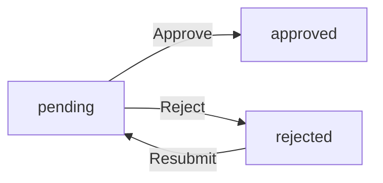
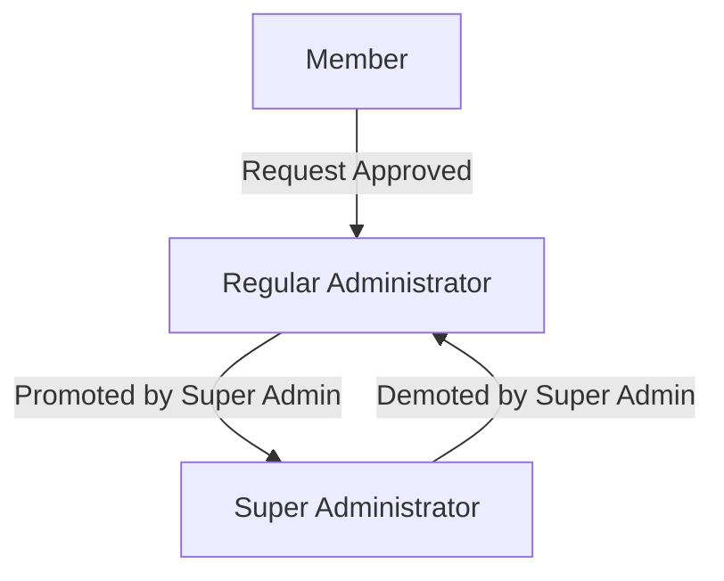

**discussionBoard — Data isolation, business rules, filtering/sorting/pagination, error catalog**

Data isolation, business rules, filtering/sorting/pagination, error catalog

# Data Isolation and Ownership

Data ownership rules and tenant/user-level isolation policies.

## Ownership and Isolation Rules

Define data ownership semantics and isolation boundaries for multi-user access.

### Data Ownership Model

THE system SHALL associate each article with exactly one user as its author.

THE system SHALL associate each comment with exactly one user as its author.

THE system SHALL associate each admin request with exactly one user as its requester.

THE system SHALL associate each article with exactly one section.

THE system SHALL associate each attachment with exactly one article.

THE system SHALL NOT allow ownership of articles, comments, or attachments to be transferred to another user.

WHEN a user creates an article, THE system SHALL record that user as the article's author.

WHEN a user creates a comment, THE system SHALL record that user as the comment's author.

WHEN a user submits an admin request, THE system SHALL record that user as the requestor.

### User Data Isolation

THE system SHALL restrict article editing to the article's author.

THE system SHALL restrict article deletion to the article's author.

THE system SHALL restrict comment editing to the comment's author.

THE system SHALL restrict comment deletion to the comment's author.

THE system SHALL restrict admin request submission to the requesting user's own account.

THE system SHALL restrict profile editing to the profile owner.

THE system SHALL restrict password changes to the account owner.

THE system SHALL restrict account deletion to the account owner.

IF a user attempts to edit an article they do not own, THE system SHALL reject the request.

IF a user attempts to delete a comment they do not own, THE system SHALL reject the request.

THE system SHALL NOT allow users to modify other users' profiles, articles, or comments.

### Cross-User Read Access

THE system SHALL allow all users to view all articles regardless of authorship.

THE system SHALL allow all users to view all comments regardless of authorship.

THE system SHALL allow all users to view other users' profiles.

THE system SHALL allow all users to download article attachments.

THE system SHALL allow all users to view all sections.

THE system SHALL allow guests (unauthenticated users) to view articles and comments.

THE system SHALL allow guests to view user profiles.

THE system SHALL NOT restrict read access to articles based on user identity.

WHILE a user is banned, THE system SHALL prevent that user from logging in and accessing the platform.

THE system SHALL continue to display banned users' articles and comments to other users.

### Administrative Override

THE system SHALL allow administrators to delete any article regardless of authorship.

THE system SHALL allow administrators to delete any comment regardless of authorship.

THE system SHALL allow administrators to ban any user.

THE system SHALL allow administrators to unban any user.

THE system SHALL allow super administrators to create, edit, and delete sections.

THE system SHALL allow super administrators to promote regular administrators to super administrator.

THE system SHALL allow super administrators to demote other super administrators to regular administrator.

THE system SHALL NOT allow a super administrator to demote themselves.

IF an administrator deletes content owned by another user, THE system SHALL record the deletion action.

Administrators SHALL retain all regular user capabilities including creating articles and comments.

Administrators SHALL be bound by the same content creation rules as regular users when writing their own articles and comments.

### Data Cascade Rules

WHEN a user deletes their account, THE system SHALL delete all articles owned by that user.

WHEN a user deletes their account, THE system SHALL delete all comments owned by that user.

WHEN a user deletes their account, THE system SHALL delete all admin requests submitted by that user.

WHEN a user deletes their account, THE system SHALL delete all attachments associated with their articles.

WHEN an article is deleted, THE system SHALL delete all comments on that article.

WHEN an article is deleted, THE system SHALL delete all attachments associated with that article.

WHEN a section is deleted, THE system SHALL delete all articles within that section.

WHEN a section is deleted, THE system SHALL delete all comments on articles within that section.

WHEN a section is deleted, THE system SHALL delete all attachments on articles within that section.

THE system SHALL NOT cascade delete user accounts when their articles are deleted by an administrator.

THE system SHALL preserve articles and comments of banned users (visibility remains unchanged).

# Domain Business Rules

Per-concept business rules, validation logic, and domain constraints.

## User Rules

Users register with an email address and password combination, where the email serves as the unique identifier for authentication. Each user maintains a profile containing a display name and optional bio text that can be edited at any time. Users can change their password through an authenticated process and may delete their account, which triggers removal of all associated articles and comments. A user may request administrator privileges by submitting a reason for the request. Administrators exist in two grades: regular administrators who can manage content and users, and super administrators who have additional capabilities including managing administrator roles. Banned users are prohibited from logging into the platform, though their existing content remains visible to other users. When a user is banned, a reason must be recorded for administrative reference. Users can view their own profile and the profiles of other users, including lists of articles and comments written by each user.

### User Authentication Identity

THE system SHALL use email address as the unique identifier for user authentication.

THE system SHALL associate each user account with exactly one email address.

WHEN a user attempts to register with an email that already exists in the system, THE system SHALL reject the registration.

THE system SHALL maintain the email address as immutable after account creation.

THE system SHALL use the email address to identify users during login authentication.

WHEN a user authenticates successfully, THE system SHALL establish the user's identity based on their registered email.

IF multiple users attempt to use the same email address, THE system SHALL ensure only one account is created per email.

### Password Change Capability

WHEN an authenticated user requests to change their password, THE system SHALL require the current password for verification.

THE system SHALL require a new password that meets security requirements (defined in User Validation Rules).

THE system SHALL require confirmation of the new password before applying the change.

IF the current password provided does not match the stored password, THE system SHALL reject the password change.

IF the new password confirmation does not match the new password, THE system SHALL reject the password change.

WHEN a password change is successful, THE system SHALL update the stored password for that user.

THE system SHALL allow users to change their password at any time while authenticated.

### Account Deletion Cascade

WHEN a user deletes their account, THE system SHALL remove the user's profile information.

WHEN a user deletes their account, THE system SHALL delete all articles authored by that user.

WHEN a user deletes their account, THE system SHALL delete all comments authored by that user.

THE system SHALL perform account deletion as an atomic operation where all associated data is removed together.

THE system SHALL NOT allow partial account deletion where some data remains.

WHEN account deletion completes, THE system SHALL remove all records linking the user to any content.

IF a deletion operation fails, THE system SHALL NOT leave the account in a partially deleted state.

### Display Name and Bio Management

THE system SHALL allow users to edit their display name at any time.

THE system SHALL allow users to edit their bio text at any time.

WHEN a user updates their display name, THE system SHALL apply the change immediately to their profile.

WHEN a user updates their bio, THE system SHALL apply the change immediately to their profile.

THE system SHALL allow display name and bio to be edited independently.

THE system SHALL allow display name and bio to be empty or cleared by the user.

Changes to display name or bio (validation constraints defined in User Validation Rules) SHALL be subject to validation.

### Administrator Request Process

WHEN a user submits a request to become an administrator, THE system SHALL record the request with pending status.

THE system SHALL require a reason text for every administrator request submission.

THE system SHALL maintain a list of pending administrator requests visible to super administrators.

WHEN a super administrator approves a request, THE system SHALL change the user's role to regular administrator.

WHEN a super administrator rejects a request, THE system SHALL update the request status to rejected.

THE system SHALL retain a record of approved and rejected requests for audit purposes.

THE system SHALL allow a user to submit only one pending administrator request at a time.

### Administrator Grade Hierarchy

THE system SHALL maintain two administrator grades: regular administrator and super administrator.

Regular administrators SHALL have all capabilities of regular users plus content and user management privileges.

Super administrators SHALL have all capabilities of regular administrators plus administrator management privileges.

THE system SHALL allow super administrators to promote regular administrators to super administrator status.

THE system SHALL allow super administrators to demote other super administrators to regular administrator status.

THE system SHALL NOT allow a super administrator to demote themselves.

THE system SHALL maintain the administrator grade for each user with administrator privileges.

### Banned User Login Restriction

WHEN a banned user attempts to log in, THE system SHALL reject the authentication attempt.

THE system SHALL prevent banned users from accessing any authenticated functionality.

THE system SHALL record a reason for each user ban.

Administrators SHALL be able to view the ban reason for each banned user.

WHEN an administrator bans a user, THE system SHALL require a reason to be recorded.

The ban reason SHALL be accessible only to administrators viewing the banned users list.

The ban status SHALL NOT remove or hide the user's existing articles and comments from other users' view.

### Profile Visibility Rules

THE system SHALL allow any user to view any other user's profile.

WHEN viewing a user profile, THE system SHALL display the user's display name and bio.

WHEN viewing a user profile, THE system SHALL display a list of all articles written by that user.

WHEN viewing a user profile, THE system SHALL display a list of all comments written by that user.

THE system SHALL allow users to view profiles of banned users.

THE system SHALL continue to display articles and comments from banned users when viewing their profiles.

THE system SHALL NOT indicate ban status to non-administrators when displaying user profiles.

## Section Rules

Sections serve as organizational containers for grouping related articles by topic, such as Politics, Economy, or Current Affairs. Section creation and management are restricted to administrator users only; regular users cannot create, modify, or delete sections. Each section must have a name and a description that explains its purpose to users. All users, including unauthenticated visitors, can view the list of available sections and browse articles within any section. Sections cannot be deleted if they contain articles, or deletion may cascade to remove associated articles depending on administrative choice. When a section is deleted, its articles may need to be reassigned or removed. The section structure provides the primary navigation hierarchy for the discussion board content.

### Section Creation Restriction

### Administrator-Only Creation

THE system SHALL restrict section creation to administrator users only.

IF a non-administrator user attempts to create a section, THE system SHALL reject the request.

WHEN an administrator creates a section, THE system SHALL:
1. Require a unique name
2. Require a description
3. Record the creation timestamp
4. Make the section immediately visible to all users

### Creation Authorization

THE system SHALL verify administrator privileges before allowing section creation.

WHILE a user lacks administrator privileges, THE system SHALL prevent any section creation operations.

WHEN a regular user or guest attempts to access section creation functionality, THE system SHALL deny access.

### Audit Trail for Section Creation

WHEN an administrator creates a section, THE system SHALL record:
1. The creating administrator's identity
2. The timestamp of creation
3. The initial section name and description

### Section Management Authority

### Administrator-Only Modification

THE system SHALL restrict section editing to administrator users only.

IF a non-administrator user attempts to edit a section, THE system SHALL reject the request.

WHEN an administrator edits a section, THE system SHALL:
1. Allow modification of the name
2. Allow modification of the description
3. Preserve all articles within the section
4. Record the modification timestamp

### Section Deletion Authority

THE system SHALL restrict section deletion to administrator users only.

IF a non-administrator user attempts to delete a section, THE system SHALL reject the request.

WHEN an administrator deletes a section, THE system SHALL enforce deletion constraints based on article containment.

### Management Scope

Administrators, including both regular administrators and super administrators, SHALL have equal authority to create, edit, and delete sections.

THE system SHALL NOT distinguish between administrator grades for section management operations.

### Section Visibility Rules

### Public Visibility

THE system SHALL make all sections visible to all users, including unauthenticated guests.

WHEN a guest views the discussion board, THE system SHALL display the list of available sections.

THE system SHALL NOT restrict section visibility based on user authentication status.

### Section List Access

WHEN any user requests the list of sections, THE system SHALL:
1. Return all existing sections
2. Include section names and descriptions
3. Not require authentication

### Section Content Access

WHEN any user browses articles within a section, THE system SHALL:
1. Allow access to the section's article list
2. Display section name and description
3. Permit navigation to individual articles within the section

THE system SHALL NOT impose visibility restrictions on section structure or metadata.

### Article Organization by Topic

### Section as Primary Organizational Unit

THE system SHALL organize articles exclusively by section.

WHEN a user creates an article, THE system SHALL:
1. Require selection of exactly one section
2. Associate the article with the selected section
3. Display the article within that section's content area

### Topic-Based Grouping

THE system SHALL use sections to group related articles by topic.

WHEN a user browses a section, THE system SHALL display only articles assigned to that section.

THE system SHALL NOT display unassigned articles.

### Section Assignment Constraint

Every article SHALL belong to exactly one section.

THE system SHALL NOT allow an article to exist without a section assignment.

THE system SHALL NOT allow an article to belong to multiple sections simultaneously.

### Topic Categories

Sections SHALL serve as topic categories such as Politics, Economy, and Current Affairs.

THE system SHALL allow administrators to define section topics through the section name and description.

### Section Deletion Constraints

### Articles-Contained Check

WHEN an administrator attempts to delete a section, THE system SHALL check whether the section contains articles.

IF a section contains one or more articles, THE system SHALL:
1. Prevent direct deletion
2. Require the administrator to specify handling for contained articles
3. Offer options for article reassignment or removal

### Empty Section Deletion

IF a section contains no articles, THE system SHALL allow immediate deletion without additional constraints.

### Deletion Options for Non-Empty Sections

WHEN an administrator deletes a section containing articles, THE system SHALL offer:
1. Option to reassign articles to a different section
2. Option to delete all contained articles

THE system SHALL NOT delete a section with articles until the administrator explicitly chooses a handling method.

### Cascade Deletion

IF an administrator chooses to delete all contained articles during section deletion, THE system SHALL:
1. Delete all articles within the section
2. Delete all comments on those articles
3. Delete all attachments associated with those articles
4. Then delete the section

THE system SHALL perform cascade deletion as a single atomic transaction.

### Content Reassignment Rules

### Article Reassignment Process

WHEN an administrator chooses to reassign articles during section deletion, THE system SHALL:
1. Require selection of a target section
2. Validate that the target section exists
3. Move all articles from the deleted section to the target section
4. Preserve all article metadata, comments, and attachments

### Reassignment Target Requirements

THE system SHALL only allow reassignment to an existing section.

IF the specified target section does not exist, THE system SHALL reject the reassignment.

THE system SHALL NOT allow reassignment to the section being deleted.

### Reassignment Preservation

WHEN articles are reassigned to a different section, THE system SHALL preserve:
1. Article titles and content
2. Author associations
3. Tags
4. Attachments
5. Comments
6. Creation timestamps

THE system SHALL update only the section association.

### Section Navigation Hierarchy

### Primary Navigation Structure

THE system SHALL provide sections as the primary navigation hierarchy for the discussion board.

WHEN a user accesses the discussion board, THE system SHALL:
1. Display the list of sections as the top-level navigation
2. Allow users to select a section to view its articles
3. Provide breadcrumb navigation showing the current section context

### Section Listing Order

WHEN displaying sections in navigation, THE system SHALL order sections by a configurable sequence or alphabetically.

### Section Browsing Path

THE system SHALL support the following navigation path:
1. User views list of all sections
2. User selects a section
3. System displays article list for the selected section
4. User selects an article
5. System displays the full article content

### Cross-Section Navigation

THE system SHALL allow users to navigate between sections without restrictions.

THE system SHALL NOT require users to return to the main section list to switch sections.

### Section Content Containment

### Section-Article Relationship

THE system SHALL establish a one-to-many relationship between sections and articles.

WHILE a section exists, THE system SHALL maintain references to all articles assigned to it.

### Containment Integrity

THE system SHALL ensure article containment integrity.

WHEN an article is viewed, THE system SHALL display the parent section information.

WHEN an article is created, THE system SHALL immediately associate it with its assigned section.

### Section Information Display

WHEN viewing an article, THE system SHALL display:
1. The section name the article belongs to
2. A link or navigation element to return to the section

### Content Statistics

WHEN displaying a section, THE system MAY show:
1. Total number of articles in the section
2. Number of comments across all articles in the section

THE system SHALL update these statistics in real-time as content changes.

### Topic Categorization Purpose

### Section as Topic Categories

THE system SHALL use sections to categorize discussion board content by topic.

THE system SHALL support topic categorization through:
1. Section names that identify the topic area
2. Section descriptions that explain the topic scope
3. Article assignment to relevant topic sections

### Topic Discovery

THE system SHALL enable users to discover content by topic.

WHEN a user browses a section, THE system SHALL present articles filtered to that topic category.

THE system SHALL NOT mix articles from different sections in a single view unless performing a search.

### Topic Scope Definition

Section descriptions SHALL define the scope and purpose of each topic category.

Administrators SHOULD create clear, non-overlapping topic categories to aid content organization.

### Topic-Based Article Creation

WHEN a user creates an article, THE system SHALL require the user to select the appropriate topic section.

THE system SHALL present the list of all available sections during article creation.

THE system SHALL NOT allow article creation without section assignment.

## Article Rules

Articles are user-created content items that must be associated with exactly one section chosen by the author. Every article requires a title and content text; both fields are mandatory for submission. Authors can attach multiple files and images to an article, providing supplementary materials for readers. Articles can have multiple tags added by the author, enabling categorization and search filtering by topic. Article authors can edit their own articles at any time, including modifying the title, content, attachments, and tags. Authors can delete their own articles, which removes the article and all associated comments. Administrators can delete any article regardless of authorship for moderation purposes. When an article is viewed, readers can see the full title, content, attachments, tags, author information, and posting timestamp. Article lists display summary information including title, author, tags, comment count, and time posted, without showing the full content.

### Article Section Assignment

### Section Association Rules

WHEN a user creates an article, THE system SHALL require selection of exactly one section for the article.

THE system SHALL associate each article with one and only one section.

WHEN an article is viewed, THE system SHALL display the section to which the article belongs.

WHEN a user browses articles, THE system SHALL allow filtering by section to view only articles within a specific section.

THE system SHALL prevent article creation without a valid section selection.

WHEN a section is deleted, THE system SHALL handle all articles within that section (refer to Section Rules for cascade behavior).

### Article Ownership Rules

### Ownership Definition

THE system SHALL record the author (User) for every article upon creation.

THE system SHALL maintain a permanent association between an article and its author for the lifetime of the article.

WHEN an article is displayed, THE system SHALL show the author's display name.

THE system SHALL prevent users from modifying the author of an article.

WHEN a user deletes their account, THE system SHALL delete all articles authored by that user.

### Ownership-Based Access

THE system SHALL grant editing rights only to the author of an article.

THE system SHALL grant deletion rights to the author of an article and to administrators.

THE system SHALL deny editing access to users who are not the article author and not an administrator.

THE system SHALL deny deletion access to users who are not the article author and not an administrator.

### Author Editing Rights

### Author Edit Authority

WHEN the author of an article requests to edit their article, THE system SHALL allow modification of the title.

WHEN the author of an article requests to edit their article, THE system SHALL allow modification of the content.

WHEN the author of an article requests to edit their article, THE system SHALL allow modification of attachments (files and images).

WHEN the author of an article requests to edit their article, THE system SHALL allow modification of tags.

THE system SHALL NOT allow the author to change the section of an article after creation.

THE system SHALL NOT allow the author to change the creation timestamp of an article.

WHEN an article edit is saved, THE system SHALL update the article while preserving the original author and creation timestamp.

### Author Deletion Rights

### Author Delete Authority

WHEN the author of an article requests to delete their article, THE system SHALL remove the article from the system.

WHEN an article is deleted by its author, THE system SHALL delete all comments associated with that article.

WHEN an article is deleted by its author, THE system SHALL delete all attachments associated with that article.

THE system SHALL NOT require administrator approval for an author to delete their own article.

THE system SHALL confirm the deletion request before permanently removing the article.

IF the author is banned, THE system SHALL still allow deletion of their existing articles (refer to Banning Rules for account access).

### Administrator Deletion Authority

### Administrator Delete Power

WHEN an administrator requests to delete any article, THE system SHALL remove the article regardless of authorship.

THE system SHALL allow administrators to delete articles authored by any user in the system.

WHEN an administrator deletes an article, THE system SHALL delete all comments associated with that article.

WHEN an administrator deletes an article, THE system SHALL delete all attachments associated with that article.

THE system SHALL record the deletion action for moderation purposes.

### Administrator vs Author Deletion

THE system SHALL apply the same deletion process whether an article is deleted by its author or by an administrator.

THE system SHALL NOT notify the article author when an administrator deletes their article (notification behavior defined separately).

### Article Summary Display

### List View Requirements

WHEN users view the list of articles, THE system SHALL display the title of each article.

WHEN users view the list of articles, THE system SHALL display the author's display name for each article.

WHEN users view the list of articles, THE system SHALL display all tags associated with each article.

WHEN users view the list of articles, THE system SHALL display the total number of comments on each article.

WHEN users view the list of articles, THE system SHALL display the time the article was posted.

THE system SHALL NOT display the full content of articles in the list view.

THE system SHALL present articles in a paginated format (refer to List Query Specifications for pagination rules).

### Sorting Options

WHEN users sort articles, THE system SHALL support sorting by newest first (descending creation timestamp).

WHEN users sort articles, THE system SHALL support sorting by oldest first (ascending creation timestamp).

### Full Content Display

### Article Detail View

WHEN users view a single article, THE system SHALL display the complete title of the article.

WHEN users view a single article, THE system SHALL display the full content text of the article.

WHEN users view a single article, THE system SHALL display the author's display name.

WHEN users view a single article, THE system SHALL display all attachments (files and images) associated with the article.

WHEN users view a single article, THE system SHALL display all tags associated with the article.

WHEN users view a single article, THE system SHALL display the time the article was posted.

### Attachment Access

WHEN users view an article with attachments, THE system SHALL provide download access to all attached files.

WHEN users view an article with attachments, THE system SHALL provide download access to all attached images.

THE system SHALL allow all users (including guests) to download attachments from articles.

### Tagging Business Rules

### Article Tagging

WHEN an author creates or edits an article, THE system SHALL allow the author to add multiple tags to the article.

THE system SHALL store tags as free text provided by the author.

THE system SHALL display all tags associated with an article in both list view and detail view.

WHEN users search articles, THE system SHALL allow filtering by one or more tags.

THE system SHALL preserve the original tag text as entered by the author (case-sensitive storage).

## Comment Rules

Comments allow users to engage in discussion on articles through written responses. Comments are single-level only, meaning users cannot reply to other comments or create nested discussion threads. Each comment must have content text and is associated with exactly one article and one author. Comments are displayed in chronological order with the oldest comments appearing first. Comment authors can edit their own comments to correct or update their responses. Authors can delete their own comments, removing them from the article discussion. Administrators have the authority to delete any comment for moderation purposes, regardless of who wrote it. Each comment displays the author's information, the comment content, and the time it was posted. Comments remain visible when a user is banned, preserving the continuity of discussions. When an article is deleted, all associated comments are removed along with it.

### Comment Structure

THE system SHALL support only single-level comments on articles.

THE system SHALL NOT allow nested replies to other comments.

THE system SHALL restrict all comments to direct replies on articles only.

IF a user attempts to reply to an existing comment, THE system SHALL reject the request.

THE system SHALL NOT provide any threading capability for comments.

THE system SHALL treat all comments as independent responses to articles with no parent-child relationship between comments.

### Comment Article Association

THE system SHALL associate every comment with exactly one article.

THE system SHALL require an article reference when creating a comment.

IF the referenced article does not exist, THE system SHALL reject the comment creation request.

WHEN a comment is created, THE system SHALL permanently link it to the specified article.

THE system SHALL NOT allow reassignment of a comment to a different article after creation.

### Comment Author Identification

THE system SHALL associate every comment with exactly one author.

THE system SHALL record the author identity when a comment is created.

THE system SHALL display the author's display name alongside each comment.

THE system SHALL NOT allow anonymous comments.

THE system SHALL NOT allow author reassignment after a comment is created.

### Comment Display Order

THE system SHALL display comments in chronological order.

THE system SHALL sort comments by their creation time from oldest to newest.

THE system SHALL NOT provide alternative sorting options for comments.

WHEN displaying comments on an article, THE system SHALL present the oldest comment first.

THE system SHALL maintain consistent chronological ordering across all article comment views.

### Comment Content Requirements

THE system SHALL require content text for every comment.

THE system SHALL reject comments with empty content.

THE system SHALL display the full content text of each comment.

THE system SHALL NOT truncate or summarize comment content in article comment views.

### Comment Timestamp Display

THE system SHALL record the creation time for every comment.

THE system SHALL display the time posted alongside each comment.

THE system SHALL preserve the original creation timestamp even after comment edits.

THE system SHALL NOT provide a separate edited timestamp indicator.

### Comment Editing Rights

THE system SHALL allow comment authors to edit their own comments.

THE system SHALL NOT allow users to edit comments authored by other users.

WHEN editing a comment, THE system SHALL allow modification of the content only.

THE system SHALL NOT allow changing the associated article or author during an edit.

IF a user attempts to edit another user's comment, THE system SHALL reject the request.

### Comment Deletion Rights

THE system SHALL allow comment authors to delete their own comments.

THE system SHALL NOT allow users to delete comments authored by other users.

WHEN a comment is deleted, THE system SHALL remove it from the article's comment list.

THE system SHALL NOT retain deleted comments in any recoverable form.

IF a user attempts to delete another user's comment, THE system SHALL reject the request.

### Administrator Comment Moderation

THE system SHALL allow administrators to delete any comment.

Administrators SHALL have the authority to remove comments for moderation purposes regardless of authorship.

THE system SHALL NOT restrict administrators from deleting comments authored by any user.

WHEN an administrator deletes a comment, THE system SHALL remove it completely from the article.

### Banned User Comment Retention

WHEN a user is banned, THE system SHALL preserve all existing comments authored by that user.

THE system SHALL continue to display comments from banned users on their associated articles.

THE system SHALL NOT remove or hide comments as a consequence of user banning.

THE system SHALL continue to show the banned user's display name on their existing comments.

### Article Deletion Cascade

WHEN an article is deleted, THE system SHALL delete all comments associated with that article.

THE system SHALL NOT retain orphaned comments when their parent article is removed.

THE system SHALL remove all comments as part of the article deletion transaction.

THE system SHALL NOT require individual comment deletion before article deletion.

## Attachment Rules

Attachments provide a way for article authors to include supplementary files and images with their content. Each attachment is classified as either a file or an image, with distinct handling for each type. Multiple attachments of both types can be added to a single article, allowing rich content presentation. Attachments are created at the time of article creation or when editing an existing article. Users can download any attachment from articles they can view, enabling access to supplementary materials. Attachments are associated with the article and are removed when the parent article is deleted. The attachment type determines how the content is displayed and processed by the system. Images may be displayed inline or as downloadable links, while files are typically provided as downloadable resources.

### Attachment Type Classification

### Type Classification Rules

THE system SHALL classify every attachment as either a file type or an image type.

WHEN a user uploads an attachment, THE system SHALL determine the attachment type based on the uploaded content's classification.

THE system SHALL distinguish between file attachments and image attachments for all attachment-related operations.

### Type-Specific Handling

WHEN an attachment is classified as an image type, THE system SHALL process it according to image-specific handling rules.

WHEN an attachment is classified as a file type, THE system SHALL process it according to file-specific handling rules.

THE system SHALL maintain the type classification of each attachment throughout its lifecycle.

THE system SHALL NOT allow an attachment to change its type after creation.

### Multiple Attachments per Article

### Multiple Attachment Support

THE system SHALL allow multiple attachments to be associated with a single article.

THE system SHALL allow both file attachments and image attachments to be added to the same article.

WHEN a user creates or edits an article, THE system SHALL support adding multiple attachments in a single operation.

### Attachment Collection Rules

THE system SHALL maintain the complete collection of all attachments associated with an article.

THE system SHALL preserve the relationship between each attachment and its parent article.

THE system SHALL treat each attachment as a distinct entity within the article's attachment collection.

### Attachment Lifecycle and Association

### Article Association

THE system SHALL associate every attachment with exactly one article.

THE system SHALL NOT allow attachments to exist without an associated article.

THE system SHALL NOT allow an attachment to be associated with multiple articles.

### Creation Timing

WHEN a user creates a new article, THE system SHALL allow attachments to be added during the creation process.

WHEN a user edits an existing article, THE system SHALL allow new attachments to be added to the article.

### Deletion Cascade Rules

WHEN an article is deleted, THE system SHALL remove all attachments associated with that article.

THE system SHALL NOT allow orphaned attachments to persist after their parent article is deleted.

THE system SHALL remove attachments automatically without requiring explicit user action for each attachment.

### Attachment Access and Visibility

### Download Access

WHEN a user can view an article, THE system SHALL allow that user to download all attachments associated with the article.

THE system SHALL grant download access to all attachments based on the parent article's visibility rules.

THE system SHALL NOT restrict attachment download based on attachment type.

### Visibility Rules

THE system SHALL apply the same visibility rules to attachments as are applied to their parent article.

IF a user cannot view an article, THE system SHALL NOT allow access to that article's attachments.

THE system SHALL enforce attachment visibility through the parent article's access controls.

### Supplementary Content Access

THE system SHALL provide supplementary content access through attachments.

THE system SHALL allow users to access any attachment associated with an article they can view.

THE system SHALL maintain consistent access control between article content and its supplementary attachments.

### Image Display and File Download

### Image Display Handling

WHEN an attachment is classified as an image type, THE system SHALL provide display capabilities appropriate for visual content.

THE system SHALL support image attachments being displayed inline with article content or as accessible downloadable links.

THE system SHALL process image attachments according to display-oriented handling rules.

### File Download Handling

WHEN an attachment is classified as a file type, THE system SHALL provide download capabilities for the attachment.

THE system SHALL support file attachments as downloadable resources.

THE system SHALL process file attachments according to download-oriented handling rules.

### Type-Based Processing

THE system SHALL route attachments to the appropriate handling mechanism based on their type classification.

WHEN a user requests access to an image attachment, THE system SHALL provide appropriate display or download options.

WHEN a user requests access to a file attachment, THE system SHALL provide download access to the content.

## AdminRequest Rules

Administrator requests allow regular users to apply for administrator privileges on the platform. Each request must include a reason text explaining why the user should be granted administrator status. Requests start in a pending status and remain there until reviewed by a super administrator. Super administrators can view all pending administrator requests and decide to approve or reject each one. An approved request changes the requesting user's role to regular administrator. A rejected request leaves the user as a regular user, and the user may submit a new request later. Super administrators can promote regular administrators to super administrator status when needed. Super administrators can demote other super administrators to regular administrator status, but cannot demote themselves. The administrator grade system ensures a clear hierarchy where super administrators have elevated capabilities for managing the platform and other administrators.

### AdminRequest Submission

### Request Creation

WHEN a member submits an administrator request, THE system SHALL create a new AdminRequest record associated with the requesting user.

WHEN an administrator request is created, THE system SHALL set the status to "pending".

WHEN an administrator request is created, THE system SHALL record the current timestamp as the creation time.

### Mandatory Reason Text

WHEN a member submits an administrator request, THE system SHALL require a reason text explaining why the user should be granted administrator status.

IF the reason text is not provided, THE system SHALL reject the request submission.

THE system SHALL store the reason text as part of the AdminRequest record.

### Request Status Lifecycle

### Status States

THE system SHALL support three request statuses: "pending", "approved", and "rejected".

WHEN an administrator request is first created, THE system SHALL assign it the "pending" status.

### Pending Status

WHILE an administrator request has the "pending" status, THE system SHALL await review by a super administrator.

WHILE an administrator request has the "pending" status, THE system SHALL allow the request to be approved or rejected by a super administrator.

### Approved Status

WHEN a super administrator approves a request, THE system SHALL change the status to "approved".

WHILE an administrator request has the "approved" status, THE system SHALL NOT allow further status changes.

### Rejected Status

WHEN a super administrator rejects a request, THE system SHALL change the status to "rejected".

WHILE an administrator request has the "rejected" status, THE system SHALL allow the user to submit a new administrator request.

### Status Transition Diagram

### Super Administrator Review

### Review Authority

THE system SHALL restrict administrator request review to super administrators only.

THE system SHALL NOT allow regular administrators to approve or reject administrator requests.

### Pending Request Visibility

WHEN a super administrator views administrator requests, THE system SHALL display all requests with "pending" status.

THE system SHALL display the requesting user's display name, the reason text, and the creation time for each pending request.

### Approval Action

WHEN a super administrator approves a pending request, THE system SHALL change the request status to "approved" and grant administrator privileges to the requesting user.

### Rejection Action

WHEN a super administrator rejects a pending request, THE system SHALL change the request status to "rejected" without changing the user's role.

WHEN rejecting a request, THE system SHALL allow the super administrator to optionally provide a rejection reason.

### Role Promotion to Administrator

### Privilege Granting

WHEN an administrator request is approved, THE system SHALL grant the requesting user regular administrator privileges.

THE system SHALL assign the "regular administrator" grade as the initial administrator grade for newly approved administrators.

### Immediate Effect

WHEN administrator privileges are granted, THE system SHALL apply the change immediately without requiring additional action from the user.

### Cumulative Privileges

WHEN a user becomes a regular administrator, THE system SHALL retain all existing member privileges.

THE regular administrator SHALL have the ability to write articles, write comments, and manage sections in addition to regular member capabilities.

### Administrator Grade Hierarchy

### Grade Definitions

THE system SHALL support two administrator grades: "regular administrator" and "super administrator".

### Regular Administrator

THE system SHALL allow regular administrators to manage sections, delete articles, delete comments, ban users, and unban users.

THE system SHALL NOT allow regular administrators to approve administrator requests, promote administrators, or demote super administrators.

### Super Administrator

THE system SHALL allow super administrators to perform all regular administrator functions.

THE system SHALL allow super administrators to approve or reject administrator requests.

THE system SHALL allow super administrators to promote regular administrators to super administrator grade.

THE system SHALL allow super administrators to demote other super administrators to regular administrator grade.

### Hierarchy Diagram

### Super Administrator Promotion

### Promotion Authority

THE system SHALL restrict promotion to super administrator grade to existing super administrators only.

THE system SHALL NOT allow regular administrators to promote other administrators.

### Promotion Process

WHEN a super administrator promotes a regular administrator, THE system SHALL change the administrator's grade from "regular administrator" to "super administrator".

WHEN a promotion occurs, THE system SHALL apply the new privileges immediately.

### Self-Promotion Restriction

THE system SHALL NOT allow a regular administrator to promote themselves to super administrator grade.

### Super Administrator Demotion

### Demotion Authority

THE system SHALL restrict demotion from super administrator grade to existing super administrators only.

THE system SHALL NOT allow regular administrators to demote any administrator.

### Demotion Process

WHEN a super administrator demotes another super administrator, THE system SHALL change the administrator's grade from "super administrator" to "regular administrator".

WHEN a demotion occurs, THE system SHALL immediately revoke super administrator privileges from the demoted user.

### Self-Demotion Restriction

IF a super administrator attempts to demote themselves, THE system SHALL reject the operation.

THE system SHALL preserve at least one super administrator account in the system at all times.

### Request Resubmission

### Resubmission Allowance

WHEN a user's administrator request has been rejected, THE system SHALL allow the user to submit a new administrator request.

### Multiple Requests

THE system SHALL NOT impose a limit on the number of times a user may submit administrator requests.

### Concurrent Request Prevention

WHEN a user submits a new administrator request, IF the user has an existing pending request, THE system SHALL reject the new submission.

THE system SHALL allow only one pending administrator request per user at any time.

### Previous Request Handling

WHEN a user resubmits after rejection, THE system SHALL create a new AdminRequest record with a new reason text.

THE system SHALL maintain the history of previous rejected requests for reference.

# Detailed Validation Rules

Detailed validation rules with boundary values and format requirements.

## User Validation Rules

Users must provide a valid email address during registration, and the email must be unique among all active accounts in the system. The email format must follow standard email address conventions to ensure deliverability of verification and notification messages. Passwords must meet security requirements that protect user accounts from unauthorized access. Users can change their password at any time, and the new password must also satisfy the same security requirements. Display names are shown publicly alongside articles and comments, so they must not contain inappropriate content. The bio text allows users to describe themselves but must remain within acceptable length limits to maintain profile readability. When a user deletes their account, the system validates that the request comes from the authenticated account owner. Email addresses and passwords are required fields that cannot be left empty during registration. Profile display names and bio text are optional but must be validated for content appropriateness if provided.

### Email Format and Uniqueness

### Email Address Format

WHEN a user submits an email address during registration or profile update, THE system SHALL validate that the email follows standard email address conventions.

IF the email address does not contain an @ symbol, THE system SHALL reject the request.

IF the email address does not contain a domain part after the @ symbol, THE system SHALL reject the request.

IF the email address contains invalid characters outside the allowed email character set, THE system SHALL reject the request.

### Email Uniqueness Requirement

WHEN a user attempts to register with an email address, THE system SHALL check that no other active account exists with the same email.

IF an active account already exists with the submitted email address, THE system SHALL reject the registration request.

THE system SHALL treat email addresses as case-insensitive for uniqueness verification purposes.

WHEN a banned user's email address is checked for uniqueness, THE system SHALL consider that email as already taken and unavailable for new registrations.

### Password Security Requirements

### Password Creation Requirements

WHEN a user creates or changes their password, THE system SHALL require a minimum password length.

IF the password is shorter than the minimum required length, THE system SHALL reject the request.

THE system SHALL require passwords to contain at least one uppercase letter.

IF the password contains no uppercase letters, THE system SHALL reject the request.

THE system SHALL require passwords to contain at least one lowercase letter.

IF the password contains no lowercase letters, THE system SHALL reject the request.

THE system SHALL require passwords to contain at least one numeric character.

IF the password contains no numeric characters, THE system SHALL reject the request.

THE system SHALL require passwords to contain at least one special character.

IF the password contains no special characters, THE system SHALL reject the request.

### Password Change Validation

WHEN a user requests a password change, THE system SHALL require the new password to satisfy all password security requirements.

THE system SHALL validate the new password independently from the current password.

IF the new password does not meet security requirements, THE system SHALL reject the password change request regardless of the current password validity.

### Display Name Validation

### Display Name Format

WHEN a user sets or updates their display name, THE system SHALL validate that the name does not exceed the maximum allowed length.

IF the display name exceeds the maximum length, THE system SHALL reject the request.

IF the display name consists only of whitespace characters, THE system SHALL reject the request.

THE system SHALL allow display names containing letters, numbers, spaces, and common punctuation characters.

### Content Appropriateness Rules

WHEN a user submits a display name, THE system SHALL check the name for inappropriate content.

IF the display name contains prohibited words or phrases, THE system SHALL reject the request.

IF the display name contains offensive language, THE system SHALL reject the request.

THE system SHALL apply the same content appropriateness rules to display names across all users regardless of account type.

### Bio Text Constraints

### Bio Text Length Limits

WHEN a user sets or updates their bio text, THE system SHALL validate that the bio does not exceed the maximum allowed length.

IF the bio text exceeds the maximum length, THE system SHALL reject the request.

THE system SHALL allow an empty bio text field.

THE system SHALL preserve whitespace formatting in bio text within length limits.

### Bio Content Validation

WHEN a user submits bio text, THE system SHALL check for inappropriate content.

IF the bio text contains prohibited content, THE system SHALL reject the request.

THE system SHALL apply content appropriateness rules consistently to all bio text submissions.

### Required and Optional Field Rules

### Registration Required Fields

WHEN a user submits a registration request, THE system SHALL require an email address field.

IF the email address field is missing or empty, THE system SHALL reject the registration request.

WHEN a user submits a registration request, THE system SHALL require a password field.

IF the password field is missing or empty, THE system SHALL reject the registration request.

### Profile Field Constraints

THE system SHALL NOT require a display name during registration.

THE system SHALL NOT require a bio during registration.

WHEN a display name is provided during registration or profile update, THE system SHALL validate it according to display name rules.

WHEN a bio is provided during registration or profile update, THE system SHALL validate it according to bio text rules.

THE system SHALL allow users to omit display name and bio fields entirely without causing a validation error.

### Account Deletion Validation

### Account Deletion Authorization

WHEN a user requests account deletion, THE system SHALL verify that the requesting user is the authenticated account owner.

IF the request does not come from the authenticated account owner, THE system SHALL reject the deletion request.

### Account Deletion Cascade

WHEN an account deletion is validated and processed, THE system SHALL delete all articles authored by the user.

WHEN an account deletion is validated and processed, THE system SHALL delete all comments authored by the user.

THE system SHALL NOT require users to manually delete their articles or comments before account deletion.

### Ban Status and Deletion

IF a banned user's account is deleted, THE system SHALL process the deletion the same as any other account deletion.

THE system SHALL maintain the cascade deletion rules regardless of the user's ban status at the time of deletion.

## Section Validation Rules

Sections require both a name and a description to be created successfully by administrators. The section name must be unique across all sections to prevent confusion when users browse or create articles. Section names should be concise yet descriptive enough for users to understand the topic area at a glance. The description provides additional context about what types of discussions belong in that section. When an administrator creates a new section, both the name and description fields are mandatory and cannot be empty. Section names must not duplicate existing section names to maintain clear categorization of articles. Administrators can edit section names and descriptions, and the same validation rules apply during modification. If a section is deleted, all articles within that section must be handled according to system policy. Section names should be long enough to be meaningful but short enough to display properly in navigation elements. The description can be longer than the name but should remain concise for readability.

### Section Name Validation

### Uniqueness Requirements

THE system SHALL ensure each section name is unique across all sections.

IF a section name matches an existing section name (case-insensitive), THEN THE system SHALL reject the request.

WHEN validating section name uniqueness, THE system SHALL perform case-insensitive comparison.

### Length Constraints

THE system SHALL require section names to be at least 1 character in length.

IF a section name exceeds 100 characters, THEN THE system SHALL reject the request.

### Format Requirements

IF a section name contains only whitespace characters, THEN THE system SHALL reject the request.

WHEN storing a section name, THE system SHALL trim leading and trailing whitespace.

THE system SHALL allow alphanumeric characters, spaces, hyphens, and underscores in section names.

### Section Description Validation

### Required Field

THE system SHALL require a section description to be provided during section creation.

IF a section description is missing or empty, THEN THE system SHALL reject the request.

### Length Constraints

THE system SHALL require section descriptions to be at least 1 character in length.

IF a section description exceeds 500 characters, THEN THE system SHALL reject the request.

### Format Requirements

IF a section description contains only whitespace characters, THEN THE system SHALL reject the request.

WHEN storing a section description, THE system SHALL trim leading and trailing whitespace.

### Mandatory Field Validation

### Creation Requirements

WHEN an administrator creates a section, THE system SHALL require both a name and a description.

IF either the name or description field is missing, THEN THE system SHALL reject the request.

IF either the name or description field is an empty string, THEN THE system SHALL reject the request.

### Edit Requirements

WHEN an administrator edits a section, THE system SHALL require both a name and a description to be provided.

IF the edited name or description is missing, THEN THE system SHALL reject the request.

IF the edited name or description is an empty string, THEN THE system SHALL reject the request.

### Error Response

WHEN mandatory field validation fails, THE system SHALL return an error message indicating which required field is missing.

### Duplicate Name Prevention

### Cross-Section Validation

WHEN creating a new section, THE system SHALL check all existing sections for name conflicts.

WHEN editing a section name, THE system SHALL check all other sections for name conflicts.

IF a section name duplicates another section's name, THEN THE system SHALL reject the request with an error indicating the name already exists.

### Case Handling

THE system SHALL treat section names as case-insensitive for uniqueness validation.

IF a new section name differs only in case from an existing section name, THEN THE system SHALL reject the request.

### Validation Timing

THE system SHALL perform uniqueness validation before saving any section name changes.

### Section Deletion Constraints

### Referential Integrity

WHEN an administrator attempts to delete a section, THE system SHALL check for existing articles within that section.

IF articles exist within the section, THEN THE system SHALL reject the deletion request.

THE system SHALL return an error message indicating the section cannot be deleted while articles exist.

### Empty Section Requirement

THE system SHALL only allow section deletion when the section contains no articles.

WHEN a section deletion is requested, THE system SHALL verify the article count for that section is zero.

### Section Edit Validation

### Modification Rules

WHEN an administrator edits a section, THE system SHALL apply the same validation rules as section creation.

THE system SHALL validate name uniqueness when the name is modified.

IF an edited name conflicts with another section's name, THEN THE system SHALL reject the request.

### Partial Updates

THE system SHALL require both name and description fields during edit operations.

IF only one field is provided during edit, THEN THE system SHALL reject the request.

### Concurrent Editing

WHEN multiple administrators attempt to edit the same section simultaneously, THE system SHALL process edits sequentially to prevent data conflicts.

## Article Validation Rules

Every article must have a title and content before it can be published in a section. The title is required and must clearly indicate the topic of discussion for the article. Article content is mandatory and must contain substantive text that contributes to the discussion. Users must select exactly one section when creating an article, and the section must exist in the system. Tags are free text entries that users can add to categorize their articles, and multiple tags can be attached to a single article. Tags should be relevant to the article content and help other users discover related discussions. When users edit their articles, the same validation rules apply to any modified title, content, or tags. The title length must be sufficient to convey meaning but not excessively long for display purposes. Article content should have a minimum length to ensure meaningful discussion contributions. Users cannot submit articles with empty titles or empty content fields. The section selection is mandatory and cannot be omitted during article creation or editing. Tags are optional but must meet content appropriateness standards if provided.

### Article Title Requirements

### Required Title

WHEN a user creates or edits an article, THE system SHALL require a title to be provided.

IF the title is omitted during article creation or editing, THE system SHALL reject the request.

### Title Length Constraints

WHEN a user provides an article title, THE system SHALL enforce a minimum length of 1 character.

WHEN a user provides an article title, THE system SHALL enforce a maximum length of 200 characters.

IF the title exceeds the maximum length, THE system SHALL reject the request.

IF the title consists only of whitespace characters, THE system SHALL reject the request.

### Title Content Validation

WHEN a user submits an article title, THE system SHALL preserve the title exactly as provided.

WHEN displaying an article title in any list or view, THE system SHALL show the full title without truncation.

### Article Content Requirements

### Required Content

WHEN a user creates or edits an article, THE system SHALL require content to be provided.

IF the content is omitted during article creation or editing, THE system SHALL reject the request.

### Minimum Content Length

WHEN a user provides article content, THE system SHALL enforce a minimum length of 20 characters.

IF the content is shorter than the minimum length, THE system SHALL reject the request.

IF the content consists only of whitespace characters, THE system SHALL reject the request.

### Content Validation

WHEN a user submits article content, THE system SHALL preserve the content exactly as provided.

WHEN displaying article content, THE system SHALL render the full content on the article detail page.

### Section Assignment Requirements

### Mandatory Section Selection

WHEN a user creates an article, THE system SHALL require exactly one section to be selected.

IF no section is selected during article creation, THE system SHALL reject the request.

IF multiple sections are provided, THE system SHALL reject the request.

### Section Existence Validation

WHEN a user selects a section for an article, THE system SHALL verify that the section exists in the system.

IF the selected section does not exist, THE system SHALL reject the request.

### Section Assignment Persistence

WHEN an article is created, THE system SHALL permanently associate the article with the selected section.

WHEN a user edits an article, THE system SHALL allow the section to be changed to a different valid section.

### Tag Validation Rules

### Multiple Tags Allowed

WHEN a user creates or edits an article, THE system SHALL allow zero or more tags to be attached.

WHEN a user provides multiple tags, THE system SHALL accept and store all provided tags.

### Tag Content Appropriateness

WHEN a user provides tags, THE system SHALL enforce that each tag contains only valid characters.

IF a tag contains prohibited content such as offensive language or special characters, THE system SHALL reject the request.

WHEN a user provides tags, THE system SHALL enforce a maximum length of 50 characters per tag.

IF any tag exceeds the maximum length, THE system SHALL reject the request.

### Tag Format Requirements

WHEN a user provides tags, THE system SHALL trim leading and trailing whitespace from each tag.

IF a tag consists only of whitespace characters, THE system SHALL ignore that tag.

WHEN duplicate tags are provided, THE system SHALL store only one instance of each unique tag.

### Article Edit Validation

### Edit Validation Consistency

WHEN a user edits an article, THE system SHALL apply the same validation rules as article creation for title, content, and section.

WHEN a user edits an article, THE system SHALL apply the same tag validation rules as article creation.

### Partial Edit Handling

WHEN a user edits an article, THE system SHALL allow modification of title, content, section, tags, and attachments independently.

WHEN a user modifies only some fields, THE system SHALL preserve unchanged fields without modification.

### Edit Authorization

WHEN a user attempts to edit an article, THE system SHALL verify that the user is the author of the article.

IF the user is not the author, THE system SHALL reject the edit request.

## Comment Validation Rules

Comments must contain content text and cannot be submitted with empty content. Each comment is associated with a specific article and must be created in response to that article. Comments are single-level only, meaning users cannot create nested replies to other comments. The comment content must meet a minimum length requirement to ensure meaningful contributions to the discussion. Users can edit their own comments, and the edited content must still satisfy the same validation rules. When a user deletes a comment, the system validates that the user is the author of that comment. Comment content should not exceed reasonable length limits to maintain readability within the article's comment section. Each comment records the time it was posted for proper chronological sorting. Comments are sorted by oldest first, so the creation timestamp is important for display ordering. Users cannot create comments without being authenticated and logged into the system. The comment content must adhere to content appropriateness standards for the discussion platform.

### Comment Content Validation

### Comment Content Requirements

WHEN a user creates a comment, THE system SHALL require non-empty content text.

IF the comment content is empty, THEN THE system SHALL reject the request.

IF the comment content contains only whitespace characters, THEN THE system SHALL reject the request.

THE system SHALL validate that comment content contains at least 10 characters of meaningful text.

IF the comment content is shorter than the minimum length, THEN THE system SHALL reject the request with a message indicating the minimum length requirement.

### Comment Length Limits

### Maximum Comment Length

THE system SHALL enforce a maximum comment content length of 10,000 characters.

IF the comment content exceeds the maximum length, THEN THE system SHALL reject the request.

WHEN a user edits a comment, THE system SHALL apply the same maximum length limit to the edited content.

THE system SHALL provide a clear error message specifying the maximum allowed length when a comment exceeds the limit.

### Authentication Requirement

### Authentication for Comments

THE system SHALL reject any comment creation request from unauthenticated users.

THE system SHALL reject any comment edit request from unauthenticated users.

THE system SHALL reject any comment deletion request from unauthenticated users.

WHEN an unauthenticated user attempts to perform any comment operation, THE system SHALL return an authentication required error.

### Article Association Validation

### Article Association

WHEN a user creates a comment, THE system SHALL require a valid article identifier.

IF the specified article does not exist, THEN THE system SHALL reject the comment creation.

IF the specified article has been deleted, THEN THE system SHALL reject the comment creation.

THE system SHALL associate each comment with exactly one article.

Comments cannot be created without specifying the target article.

### Single-Level Comment Validation

### Single-Level Comment Structure

THE system SHALL reject any attempt to create a nested reply to an existing comment.

Comments can only be created in response to articles, not in response to other comments.

IF a request includes a parent comment identifier, THEN THE system SHALL reject the request.

THE system SHALL enforce that all comments are direct children of articles with no nesting permitted.

### Comment Ownership Validation

### Ownership Validation for Edit

WHEN a user attempts to edit a comment, THE system SHALL verify the user is the author of that comment.

IF the user is not the author of the comment, THEN THE system SHALL reject the edit request.

THE system SHALL reject edit requests from any user who is not the comment author.

Administrators can delete comments but cannot edit comments owned by other users.

### Comment Deletion Validation

### Ownership Validation for Deletion

WHEN a user attempts to delete a comment, THE system SHALL verify the user is the author of that comment or has administrator privileges.

IF the user is neither the author nor an administrator, THEN THE system SHALL reject the deletion request.

THE system SHALL verify the comment exists before processing a deletion request.

IF the comment does not exist, THEN THE system SHALL reject the deletion request.

IF the comment has already been deleted, THEN THE system SHALL reject the deletion request.

### Timestamp Recording

### Comment Timestamp Validation

WHEN a comment is created, THE system SHALL record the creation timestamp.

WHEN a comment is edited, THE system SHALL preserve the original creation timestamp.

THE system SHALL not allow users to modify the creation timestamp.

THE system SHALL use the creation timestamp to determine comment display order (oldest first).

Timestamp values shall be immutable after creation.

### Comment Existence Validation

### Comment Existence Checks

IF a requested comment does not exist, THEN THE system SHALL reject any operation on that comment.

WHEN attempting to view, edit, or delete a comment, THE system SHALL first verify the comment exists.

IF a comment identifier is invalid, THEN THE system SHALL reject the request with an appropriate error message.

### Content Appropriateness Rules

### Content Standards for Comments

THE system SHALL not perform automated content moderation on comments.

Administrators may remove comments that violate platform content standards.

THE system SHALL allow users to submit comments containing standard text characters.

Comment content is stored and displayed as submitted by the author, subject to administrator review.

## Attachment Validation Rules

Attachments can be either files or images that users attach to their articles during creation or editing. Multiple files and images can be attached to a single article to support the discussion content. Each attachment has a type that distinguishes between file attachments and image attachments. Attachments must meet size limits to ensure reasonable upload and download performance for all users. The system records the creation time of each attachment for tracking and management purposes. File attachments must have valid file formats that are supported by the platform. Image attachments must be in recognized image formats that can be displayed in the article view. Users can download attached files and images when viewing an article, so attachments must remain accessible. Attachments are associated with specific articles and cannot exist independently without an article. When an article is deleted, all associated attachments should also be removed from the system. Users can modify attachments when editing their articles by adding or removing files and images. Attachment names should be preserved to maintain context for users downloading the files.

### Supported File Formats

WHEN a user uploads a file attachment, THE system SHALL accept only the following file formats: PDF, DOC, DOCX, XLS, XLSX, TXT, CSV.

IF a user attempts to upload a file with an unsupported format, THE system SHALL reject the upload and notify the user of the supported formats.

IF a user attempts to upload a file without a recognizable file extension, THE system SHALL reject the upload.

WHEN validating a file format, THE system SHALL check the file content signature in addition to the file extension.

IF the file content signature does not match the declared file extension, THE system SHALL reject the upload as a security precaution.

### Supported Image Formats

WHEN a user uploads an image attachment, THE system SHALL accept only the following image formats: JPEG, PNG, GIF, WEBP.

IF a user attempts to upload an image with an unsupported format, THE system SHALL reject the upload and notify the user of the supported image formats.

IF a user attempts to upload an image without a recognizable file extension, THE system SHALL reject the upload.

WHEN validating an image format, THE system SHALL verify the image content signature matches the declared format.

IF the image content signature does not match the declared format, THE system SHALL reject the upload.

### Attachment Size Limits

WHEN a user uploads a file attachment, THE system SHALL enforce a maximum file size of 20 megabytes per file.

IF a user attempts to upload a file exceeding 20 megabytes, THE system SHALL reject the upload and notify the user of the size limit.

WHEN a user uploads an image attachment, THE system SHALL enforce a maximum image size of 10 megabytes per image.

IF a user attempts to upload an image exceeding 10 megabytes, THE system SHALL reject the upload and notify the user of the size limit.

WHEN a user uploads attachments to an article, THE system SHALL enforce a total attachment size limit of 50 megabytes per article.

IF the combined size of all attachments would exceed 50 megabytes, THE system SHALL reject the upload and notify the user of the total size limit.

### Attachment Quantity Limits

WHEN a user uploads attachments to an article, THE system SHALL allow a maximum of 10 attachments per article.

IF a user attempts to upload more than 10 attachments to a single article, THE system SHALL reject the excess attachments.

WHEN counting attachments, THE system SHALL count both file attachments and image attachments together toward the limit.

IF an article already has 10 attachments, THE system SHALL reject any additional upload attempts and notify the user of the attachment limit.

### Attachment Upload Rules

WHEN a user uploads an attachment, THE system SHALL only accept uploads during article creation or article editing.

IF a user attempts to upload an attachment outside of article creation or editing, THE system SHALL reject the upload.

WHEN an attachment is uploaded, THE system SHALL record the creation timestamp for tracking and management purposes.

THE system SHALL preserve the original filename of each attachment for user reference.

IF a filename contains characters that could pose security risks, THE system SHALL sanitize the filename while preserving readability.

### Article Attachment Association

WHEN a user creates an article with attachments, THE system SHALL associate each attachment with the specific article.

THE system SHALL NOT allow attachments to exist independently without an associated article.

IF an upload attempt is made without a valid article association, THE system SHALL reject the attachment.

WHEN an article is deleted, THE system SHALL remove all associated attachments from the system.

WHEN an article is viewed, THE system SHALL display all associated attachments for download access.

### Attachment Modification Rules

WHEN a user edits their own article, THE system SHALL allow the user to add new attachments.

WHEN a user edits their own article, THE system SHALL allow the user to remove existing attachments.

IF a user removes an attachment during editing, THE system SHALL permanently delete the attachment from the system.

WHEN a user modifies attachments, THE system SHALL validate that the total number of attachments does not exceed the maximum limit.

WHEN a user modifies attachments, THE system SHALL validate that the total size does not exceed the size limit.

### Download Accessibility

WHEN any user views an article, THE system SHALL provide access to download all attachments associated with that article.

IF a user attempts to download an attachment from an article they cannot access, THE system SHALL deny the download.

WHEN a user downloads an attachment, THE system SHALL provide the file in its original format.

IF an attachment no longer exists in storage when a user attempts to download it, THE system SHALL display an error message indicating the file is unavailable.

### Invalid Attachment Handling

IF a user attempts to upload a file infected with malware or viruses, THE system SHALL reject the upload and notify the user of the security issue.

IF a user attempts to upload a corrupted file, THE system SHALL reject the upload and notify the user.

IF an attachment fails to upload due to a system error, THE system SHALL notify the user of the failure and allow them to retry.

WHEN an attachment upload fails, THE system SHALL NOT create a partial or incomplete attachment record.

## AdminRequest Validation Rules

Users who wish to become administrators must submit a request that includes a reason for their request. The reason field is required and must contain text explaining why the user should be granted administrator privileges. Admin requests cannot be submitted with an empty reason field to ensure meaningful evaluation by super administrators. Each request has a status that indicates whether it is pending, approved, or rejected. The initial status of a new request is always pending until a super administrator reviews it. The request creation time is recorded for tracking and for super administrators to review submission order. Super administrators can view pending requests and must approve or reject each one. When a request is approved, the user becomes a regular administrator with appropriate privileges. When a request is rejected, the user remains a regular user without administrator access. Users can only have one pending admin request at a time to prevent request spam. The reason text must meet minimum length requirements to provide sufficient context for evaluation. Approved and rejected requests are retained in the system for record-keeping purposes.

### Reason Field Requirements

WHEN a user submits an admin request, THE system SHALL require a reason field containing text explaining why the user should be granted administrator privileges.

IF the reason field is empty or contains only whitespace, THE system SHALL reject the request with a message indicating that a reason is required.

WHEN validating the reason text, THE system SHALL ensure the content meets minimum length requirements to provide sufficient context for evaluation.

THE system SHALL NOT accept admin requests with missing or empty reason fields.

THE system SHALL preserve the exact reason text as submitted by the user for super administrator review.

### Request Status Management

WHEN a new admin request is created, THE system SHALL set the initial status to pending.

THE system SHALL only allow the following status values for admin requests: pending, approved, and rejected.

WHEN a super administrator approves a pending request, THE system SHALL change the status from pending to approved.

WHEN a super administrator rejects a pending request, THE system SHALL change the status from pending to rejected.

THE system SHALL NOT allow status transitions from approved back to pending or rejected.

THE system SHALL NOT allow status transitions from rejected back to pending or approved.

IF a request status is already approved or rejected, THE system SHALL reject any further status modification attempts.

### Request Submission Rules

WHEN a user attempts to submit an admin request, THE system SHALL check whether the user has any existing pending request.

IF the user already has a pending admin request, THE system SHALL reject the new submission with a message indicating that only one pending request is allowed at a time.

WHEN an admin request is successfully created, THE system SHALL record the request creation timestamp.

THE system SHALL use the creation timestamp to establish the chronological order of pending requests for super administrator review.

WHEN a previously submitted request is approved or rejected, THE system SHALL allow the user to submit a new admin request.

### Request Review Process

THE system SHALL restrict the ability to approve or reject admin requests to super administrators only.

WHEN a super administrator views pending requests, THE system SHALL display requests in chronological order based on creation timestamp.

THE system SHALL require explicit approval or rejection action from a super administrator to change a request status from pending.

IF a user who is not a super administrator attempts to approve or reject an admin request, THE system SHALL reject the action.

WHEN a super administrator approves a request, THE system SHALL transition the request status to approved and the requesting user shall become a regular administrator.

### Request Record Retention

THE system SHALL retain all admin requests regardless of their status (pending, approved, or rejected) for record-keeping purposes.

WHEN a request is approved, THE system SHALL preserve the request record including the reason text, timestamp, and approving super administrator.

WHEN a request is rejected, THE system SHALL preserve the request record including the reason text, timestamp, and rejecting super administrator.

THE system SHALL NOT delete admin request records when users are deleted or accounts are modified.

THE system SHALL maintain a complete history of all admin requests submitted by each user for audit and administrative review purposes.

### Administrator Privilege Assignment

WHEN an admin request is approved, THE system SHALL assign the requesting user the role of regular administrator with appropriate privileges.

WHEN an admin request is rejected, THE system SHALL NOT modify the user's role and the user shall remain a regular user without administrator access.

THE system SHALL grant administrator privileges immediately upon request approval without requiring additional user action.

WHEN a user becomes an administrator through request approval, THE system SHALL record the transition and the responsible super administrator who approved the request.

# Filtering, Sorting, and Pagination

List query specifications for filtering, sorting, and pagination.

## List Query Specifications

Define filtering, sorting, and pagination rules for list operations.

### Article List Pagination

### Article List Pagination

WHEN a user views the list of articles within a section, THE system SHALL display articles across multiple pages.

WHEN displaying article lists, THE system SHALL provide pagination controls enabling navigation between pages.

THE system SHALL display a consistent number of articles per page for all section article lists.

WHEN a user navigates between pages, THE system SHALL maintain the current sorting and filtering criteria.

IF a section contains no articles, THE system SHALL display an empty list message.

WHEN the last page of articles is displayed, THE system SHALL not provide a "next page" navigation option.

WHEN the first page of articles is displayed, THE system SHALL not provide a "previous page" navigation option.

### Article List Sorting

### Article List Sorting

WHEN viewing articles within a section, THE system SHALL allow users to sort articles by creation time.

THE system SHALL provide two sorting options for article lists:
1. Newest first (descending by creation time)
2. Oldest first (ascending by creation time)

IF a user does not specify a sort order, THE system SHALL default to displaying articles newest first.

WHEN a user changes the sort order, THE system SHALL re-render the article list with the new ordering.

WHEN multiple articles have identical creation times, THE system SHALL order those articles by their unique identifier.

### Article Filtering by Tags

### Article Filtering by Tags

WHEN a user views articles in a section, THE system SHALL allow filtering by tags.

IF a user specifies one or more tags as filter criteria, THE system SHALL display only articles containing all specified tags.

WHEN displaying tag filters, THE system SHALL show only tags that are present on articles within the current section.

IF no articles match the specified tag filters, THE system SHALL display an empty result message.

WHEN tag filters are applied, THE system SHALL maintain the filter criteria during pagination and sorting operations.

IF a user clears all tag filters, THE system SHALL display all articles in the section without tag restrictions.

### Article Search Query

### Article Search Query

WHEN a user performs a search, THE system SHALL allow searching articles by title or content.

IF a user enters a search query, THE system SHALL return articles whose title or content contains the search terms.

WHEN displaying search results, THE system SHALL paginate the results.

WHEN a user applies tag filters to search results, THE system SHALL return only articles matching both the search query AND the specified tags.

IF the search query is empty or contains only whitespace, THE system SHALL not perform a search operation.

THE system SHALL perform case-insensitive matching for search queries.

WHEN search results are displayed, each result SHALL show the article title, author, tags, comment count, and time posted.

### Comment List Ordering

### Comment List Ordering

WHEN viewing comments on an article, THE system SHALL display comments in chronological order from oldest to newest.

THE system SHALL not provide alternative sorting options for comments.

WHEN multiple comments have identical posting times, THE system SHALL order those comments by their unique identifier.

IF an article has no comments, THE system SHALL display an empty comments message.

### User Profile List Pagination

### User Profile List Pagination

WHEN viewing a user's profile, THE system SHALL display paginated lists of the user's articles and comments.

THE system SHALL provide separate pagination for the user's articles list and the user's comments list.

WHEN paginating a user's article list, THE system SHALL display each article with its title, section, tags, comment count, and time posted.

WHEN paginating a user's comment list, THE system SHALL display each comment with its content excerpt, associated article title, and time posted.

IF a user has not written any articles, THE system SHALL display an empty articles list message on their profile.

IF a user has not written any comments, THE system SHALL display an empty comments list message on their profile.

WHEN navigating between pages of a user's articles or comments, THE system SHALL maintain the respective pagination state.

# Error Conditions

Business error scenarios and how the system should respond.

## Error Scenarios

Describe error conditions and expected system responses in natural language.

### Authentication Error Scenarios

### Login Failure

IF a user attempts to log in with an email that does not exist, THEN THE system SHALL reject the request with an authentication failure message.

IF a user attempts to log in with an incorrect password, THEN THE system SHALL reject the request with an authentication failure message.

### Banned User Access

IF a banned user attempts to log in, THEN THE system SHALL reject the request and display the ban reason recorded when the user was banned.

### Email Already Registered

IF a user attempts to sign up with an email address already registered in the system, THEN THE system SHALL reject the registration request.

### Password Change Failure

IF a user attempts to change their password and the current password provided is incorrect, THEN THE system SHALL reject the password change request.

### Authorization Error Scenarios

### Article Ownership Violation

IF a user attempts to edit an article they do not own, THEN THE system SHALL reject the request.

IF a user attempts to delete an article they do not own, THEN THE system SHALL reject the request.

### Comment Ownership Violation

IF a user attempts to edit a comment they did not author, THEN THE system SHALL reject the request.

IF a user attempts to delete a comment they did not author, THEN THE system SHALL reject the request.

### Section Management Restriction

IF a non-administrator user attempts to create a section, THEN THE system SHALL reject the request.

IF a non-administrator user attempts to edit a section, THEN THE system SHALL reject the request.

IF a non-administrator user attempts to delete a section, THEN THE system SHALL reject the request.

### Administrator Privilege Escalation

IF a regular administrator attempts to approve or reject an administrator request, THEN THE system SHALL reject the request.

IF a regular administrator attempts to promote another user to super administrator, THEN THE system SHALL reject the request.

IF a regular administrator attempts to demote a super administrator, THEN THE system SHALL reject the request.

IF a super administrator attempts to demote themselves, THEN THE system SHALL reject the request.

### User Ban Management

IF a non-administrator user attempts to ban another user, THEN THE system SHALL reject the request.

IF a non-administrator user attempts to unban a user, THEN THE system SHALL reject the request.

IF a non-administrator user attempts to view the list of banned users, THEN THE system SHALL reject the request.

### Resource Not Found Error Scenarios

### User Not Found

IF a user attempts to view a profile that does not exist, THEN THE system SHALL return a not found error.

### Section Not Found

IF a user attempts to browse articles in a section that does not exist, THEN THE system SHALL return a not found error.

IF a user attempts to create an article in a section that does not exist, THEN THE system SHALL reject the request.

### Article Not Found

IF a user attempts to view an article that does not exist, THEN THE system SHALL return a not found error.

IF a user attempts to edit an article that does not exist, THEN THE system SHALL return a not found error.

IF a user attempts to delete an article that does not exist, THEN THE system SHALL return a not found error.

IF a user attempts to create a comment on an article that does not exist, THEN THE system SHALL reject the request.

### Comment Not Found

IF a user attempts to edit a comment that does not exist, THEN THE system SHALL return a not found error.

IF a user attempts to delete a comment that does not exist, THEN THE system SHALL return a not found error.

### Admin Request Not Found

IF a super administrator attempts to approve an administrator request that does not exist, THEN THE system SHALL return a not found error.

IF a super administrator attempts to reject an administrator request that does not exist, THEN THE system SHALL return a not found error.

### Validation Error Scenarios

### Missing Required Fields

IF a user creates an article without a title, THEN THE system SHALL reject the request and require a title.

IF a user creates an article without content, THEN THE system SHALL reject the request and require content.

IF a user creates an article without selecting a section, THEN THE system SHALL reject the request and require section selection.

IF a user submits an administrator request without providing a reason, THEN THE system SHALL reject the request and require a reason.

IF a user creates a section without a name, THEN THE system SHALL reject the request.

IF a user creates a section without a description, THEN THE system SHALL reject the request.

### Empty Content

IF a user attempts to create a comment with empty content, THEN THE system SHALL reject the request.

IF a user attempts to edit a comment resulting in empty content, THEN THE system SHALL reject the request.

### Duplicate Resource

IF an administrator attempts to create a section with a name that already exists, THEN THE system SHALL reject the request.

IF a user who already has a pending administrator request submits another request, THEN THE system SHALL reject the request.

### Business Constraint Violation Scenarios

### Administrator Request Processing

IF a super administrator attempts to approve an administrator request that is not in pending status, THEN THE system SHALL reject the request.

IF a super administrator attempts to reject an administrator request that is not in pending status, THEN THE system SHALL reject the request.

### Self-Demotion Prevention

IF a super administrator attempts to demote themselves to regular administrator, THEN THE system SHALL reject the request.

### Search Parameter Errors

IF a user provides invalid pagination parameters (e.g., negative page number), THEN THE system SHALL return an empty result set or default to the first page.

IF a user provides invalid sorting criteria for article lists, THEN THE system SHALL default to sorting by newest first.

### File Attachment Failures

IF a user attempts to attach a file that exceeds the size limit, THEN THE system SHALL reject the file upload.

IF a user attempts to attach a file type that is not supported, THEN THE system SHALL reject the file upload.

IF a user attempts to attach a file that fails virus scanning, THEN THE system SHALL reject the file upload.

# File Validation Rules

Validation rules and policies for file uploads and storage.

## File Validation and Policies

Define file type restrictions, virus scanning requirements, content validation, and retention policies for uploaded files.

### File Validation Business Rules

WHEN a user uploads a file or image to an article, THE system SHALL validate the file before accepting it.

IF the file size exceeds the maximum allowed limit, THE system SHALL reject the upload.

IF the file type is not in the list of permitted file types, THE system SHALL reject the upload.

IF the file type is not in the list of permitted image types, THE system SHALL reject the upload.

THE system SHALL apply the same validation rules to all file uploads regardless of the uploading user's role.

WHEN validation fails, THE system SHALL provide a clear reason for rejection to the user.

WHEN a user uploads multiple files to a single article, THE system SHALL validate each file independently.

### Virus Scanning Requirements

WHEN a file or image is uploaded, THE system SHALL scan the file for malicious content before making it available.

IF a file is detected as containing malicious content, THE system SHALL reject the upload and prevent storage.

IF a file is detected as containing malicious content, THE system SHALL log the incident for administrator review.

WHEN virus scanning cannot be performed due to service unavailability, THE system SHALL reject the upload and request the user to retry.

THE system SHALL ensure no file is accessible to other users until virus scanning completes successfully.

Administrators SHALL be able to view logs of rejected malicious file uploads.

THE system SHALL NOT execute or render uploaded files during the scanning process.

### Content Type Restrictions

THE system SHALL maintain a list of permitted file content types for uploads.

THE system SHALL maintain a list of permitted image content types for uploads.

IF the actual content of a file does not match its declared file extension, THE system SHALL reject the upload.

THE system SHALL verify the content type by inspecting the file content, not just the file extension.

IF a user attempts to upload executable files, THE system SHALL reject the upload.

THE system SHALL allow common document types as permitted file uploads.

THE system SHALL allow common image formats as permitted image uploads.

WHEN content type validation fails, THE system SHALL inform the user of the allowed content types.

### File Retention Policies

WHEN an article is deleted, THE system SHALL remove all attachments associated with that article.

WHEN a user account is deleted, THE system SHALL remove all articles and their associated attachments.

WHEN a user account is deleted, THE system SHALL remove all comments and their associated attachments.

THE system SHALL retain files only as long as their associated article exists.

IF an upload is interrupted before completion, THE system SHALL not retain partial file data.

WHEN a file upload is rejected due to validation or virus scanning failure, THE system SHALL not retain the file.

THE system SHALL ensure orphaned files (files not associated with any article) are removed.

Administrators SHALL be able to view storage usage statistics for the platform.