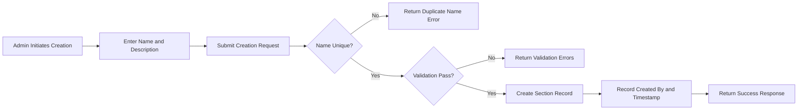
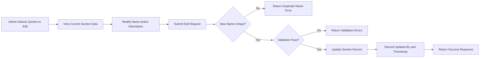
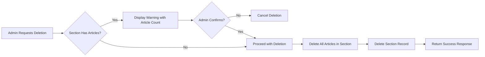
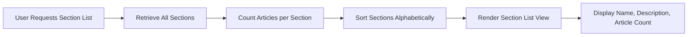
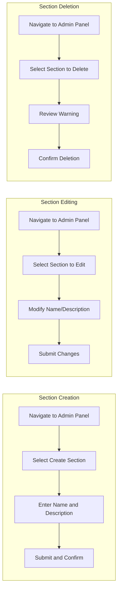
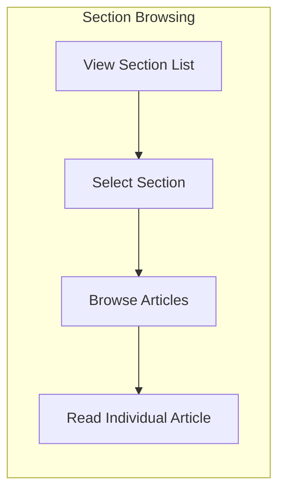

# Section Management Requirements

## 1. Executive Summary

Sections form the primary organizational structure of the discussion board, providing categorized spaces for economic and political discourse. They enable users to navigate content by topic and help maintain focused discussions within appropriate subject areas.

### Business Purpose

THE discussion board SHALL organize all articles within named sections to facilitate topic-based content discovery and maintain structured discourse.

Sections serve as the top-level categorization mechanism, grouping related articles together and enabling users to focus on specific topics of interest such as Politics, Economy, or Current Affairs.

## 2. Section Definition and Data Structure

### Core Section Attributes

Each section SHALL contain the following data:

| Attribute | Type | Required | Description |
|-----------|------|----------|-------------|
| Name | String | Yes | Display name of the section (e.g., "Politics", "Economy") |
| Description | String | Yes | Brief explanation of the section's topic and purpose |
| Created At | Timestamp | Yes | Date and time when the section was created |
| Created By | User ID | Yes | Administrator who created the section |
| Updated At | Timestamp | No | Date and time of last modification |
| Updated By | User ID | No | Administrator who last modified the section |

### Section Name Requirements

THE section name SHALL be unique across all sections in the system.

THE section name SHALL have a minimum length of 2 characters.

THE section name SHALL have a maximum length of 100 characters.

THE section name SHALL not contain only whitespace characters.

THE section name SHALL be trimmed of leading and trailing whitespace before storage.

### Section Description Requirements

THE section description SHALL have a minimum length of 10 characters.

THE section description SHALL have a maximum length of 500 characters.

THE section description SHALL not contain only whitespace characters.

THE section description SHALL be trimmed of leading and trailing whitespace before storage.

## 3. Section Creation (Administrator Only)

### Permission Requirements

WHEN a non-administrator user attempts to create a section, THE system SHALL deny the request and return an authorization error.

WHEN a user with administrator or super administrator permissions attempts to create a section, THE system SHALL allow the creation request.

### Creation Process Flow

### Creation Requirements

WHEN an administrator creates a new section, THE system SHALL validate that the section name is unique.

IF a section with the same name already exists, THEN THE system SHALL reject the creation and display an error message indicating the name conflict.

WHEN a section is successfully created, THE system SHALL record the creating administrator's user ID and the current timestamp.

WHEN a section is successfully created, THE system SHALL make the section immediately available for article association and user browsing.

### Input Validation

WHEN creating a section, THE system SHALL validate all required fields are present.

IF the section name is missing or empty, THEN THE system SHALL reject the creation with an appropriate error message.

IF the section description is missing or empty, THEN THE system SHALL reject the creation with an appropriate error message.

## 4. Section Editing (Administrator Only)

### Permission Requirements

WHEN a non-administrator user attempts to edit a section, THE system SHALL deny the request and return an authorization error.

WHEN a user with administrator or super administrator permissions attempts to edit a section, THE system SHALL allow the edit request.

### Editable Fields

Administrators SHALL be able to modify the following section attributes:
- Section name
- Section description

### Editing Process Flow

### Edit Requirements

WHEN an administrator modifies a section name, THE system SHALL validate that the new name is unique across all other sections.

IF the new name conflicts with an existing section, THEN THE system SHALL reject the modification and display an error message.

WHEN a section is successfully modified, THE system SHALL update the "Updated At" timestamp and "Updated By" administrator ID.

WHEN a section name is modified, THE system SHALL ensure all existing articles in that section remain associated with the section under its new name.

### Validation Rules

THE system SHALL apply the same validation rules for name and description during editing as during creation.

IF validation fails during editing, THEN THE system SHALL preserve the original section data unchanged.

## 5. Section Deletion (Administrator Only)

### Permission Requirements

WHEN a non-administrator user attempts to delete a section, THE system SHALL deny the request and return an authorization error.

WHEN a user with administrator or super administrator permissions attempts to delete a section, THE system SHALL allow the deletion request.

### Pre-Deletion Checks

WHEN an administrator requests to delete a section, THE system SHALL check if any articles exist within that section.

### Deletion with Articles

IF a section contains articles, THE system SHALL warn the administrator about the number of articles that will be affected.

WHEN an administrator confirms deletion of a section containing articles, THE system SHALL delete all articles within that section along with their associated comments, attachments, and images.

WHEN a section is deleted, THE system SHALL perform a cascade deletion of all related content including:
- All articles within the section
- All comments on those articles
- All file attachments associated with those articles
- All image attachments associated with those articles
- All tags associated with those articles

### Deletion Requirements

WHEN a section is successfully deleted, THE system SHALL remove it from the section list immediately.

AFTER a section is deleted, THE system SHALL ensure the section is no longer accessible to any user.

WHEN a deleted section's URL is accessed, THE system SHALL return a "section not found" response.

### Deletion Logging

WHEN a section is deleted, THE system SHALL maintain a record of the deletion including:
- The deleted section's name and description
- The number of articles that were deleted
- The administrator who performed the deletion
- The timestamp of deletion

## 6. Section Browsing (All Users)

### Section List Access

THE system SHALL allow all users, including non-authenticated users, to view the list of all sections.

WHEN a user requests to view the section list, THE system SHALL display all active sections in the system.

### Section List Display

THE section list SHALL display each section with:
- Section name
- Section description
- Number of articles in the section

### Section List Ordering

THE system SHALL display sections in alphabetical order by name.

WHEN displaying the section list, THE system SHALL ensure consistent ordering across all requests.

### Section List Performance

WHEN a user views the section list, THE system SHALL load and display all sections within 2 seconds.

### Section Detail View

WHEN a user clicks on a section, THE system SHALL navigate to the article list for that section.

The section detail view SHALL display:
- Section name as the page title
- Section description prominently
- List of articles within the section
- Option to create a new article (for authenticated users only)

### Empty Section Handling

IF a section contains no articles, THE system SHALL still display the section in the list with an article count of zero.

WHEN a user views an empty section, THE system SHALL display a message indicating "No articles have been posted in this section yet."

## 7. Article Association with Sections

### Article Creation Requirements

WHEN a user creates an article, THE system SHALL require the selection of exactly one section.

THE system SHALL not allow creation of articles without a section assignment.

WHEN displaying the article creation form, THE system SHALL present all available sections as selectable options.

### Section Selection Interface

WHEN a user creates an article, THE system SHALL display sections in a dropdown or selection list showing:
- Section name
- Brief indication of section topic

### Article Movement Between Sections

Administrators SHALL have the capability to move articles between sections.

WHEN an article is moved to a different section, THE system SHALL update the section association and record the modification timestamp.

## 8. Business Rules and Validation

### Unique Name Constraint

THE section name SHALL be unique across all sections in the system.

IF a duplicate name is submitted during creation or editing, THEN THE system SHALL reject the request with the error message: "A section with this name already exists."

### Name Validation Rules

| Validation Rule | Requirement |
|----------------|-------------|
| Minimum Length | 2 characters |
| Maximum Length | 100 characters |
| Allowed Characters | Letters, numbers, spaces, hyphens, underscores |
| Prohibited Characters | Special characters that could cause display issues |
| Whitespace Handling | Trim leading and trailing whitespace |

### Description Validation Rules

| Validation Rule | Requirement |
|----------------|-------------|
| Minimum Length | 10 characters |
| Maximum Length | 500 characters |
| Whitespace Handling | Trim leading and trailing whitespace |

### Concurrent Modification Handling

WHEN two administrators attempt to modify the same section simultaneously, THE system SHALL handle the conflict using a "last write wins" strategy with the most recent modification taking effect.

### Referential Integrity

WHEN displaying sections, THE system SHALL accurately reflect the current article count for each section.

WHEN an article is created or deleted, THE system SHALL update the article count for the affected section.

## 9. Error Scenarios

### Authorization Errors

IF a non-administrator user attempts to create, edit, or delete a section, THEN THE system SHALL return an error response with code AUTH_INSUFFICIENT_PERMISSIONS and message "Only administrators can manage sections."

### Validation Errors

IF section name validation fails, THEN THE system SHALL return an error response indicating which validation rule was violated.

IF section description validation fails, THEN THE system SHALL return an error response indicating which validation rule was violated.

### Not Found Errors

IF a user attempts to access a non-existent section, THEN THE system SHALL return a "Section not found" error.

IF an administrator attempts to edit or delete a non-existent section, THEN THE system SHALL return a "Section not found" error.

### System Errors

IF a database error occurs during section operations, THEN THE system SHALL return a generic error message and log the technical details for administrator review.

## 10. Section Management Workflow Summary

### Administrator Workflow

### User Workflow

## 11. Success Metrics

### Section Management Effectiveness

THE section system SHALL support the following operational metrics:

- Average number of sections: 5-20 active sections
- Article distribution: Balanced across sections without excessive concentration
- Section access time: Under 2 seconds for list retrieval
- Section detail load time: Under 1 second

### User Experience Metrics

WHEN users browse sections, THE system SHALL provide clear navigation and immediate feedback.

THE section organization SHALL enable users to find relevant content within 3 clicks from the home page.

## 12. Summary

Sections provide the foundational organizational structure for the discussion board. They enable:

1. **Topic Organization**: Clear categorization of political and economic discussions
2. **User Navigation**: Intuitive browsing by subject matter
3. **Content Management**: Structured article placement and discovery
4. **Administrative Control**: Centralized management of discussion categories

The section management system SHALL balance administrative flexibility with user accessibility, ensuring that sections can be easily managed while remaining always accessible to all users for browsing and content creation.