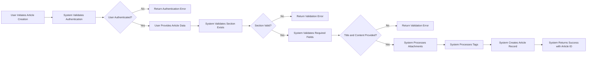
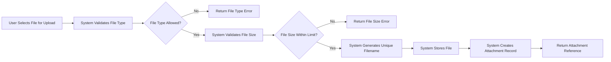
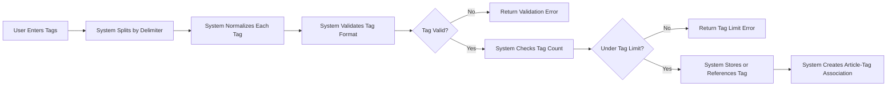
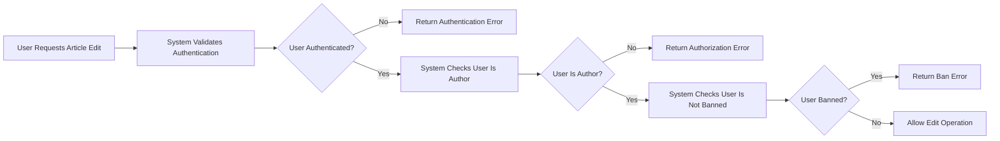
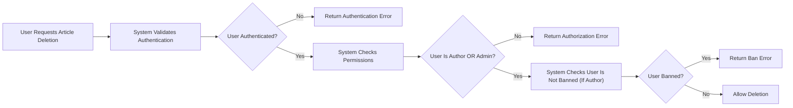

# Article Creation and Management Requirements

## 1. Overview

This document defines the complete business requirements for article creation, editing, and deletion functionality in the Economic/Political Discussion Board platform. Articles serve as the primary content units for user discussions, supporting rich text content, file and image attachments, and free-form tagging for organization and discovery.

### 1.1 Purpose

THE article system SHALL provide authenticated users with the capability to create, modify, and remove discussion content within designated sections of the platform.

### 1.2 Scope

This document covers:
- Article data structure and relationships
- Article creation workflow with validation
- File attachment upload and management
- Image attachment upload and management
- Tag creation, association, and normalization
- Article editing by authors
- Article deletion by authors and administrators
- Error handling and validation requirements

## 2. Article Data Model

### 2.1 Core Article Structure

Every article in the system SHALL contain the following core attributes:

| Attribute | Type | Required | Description |
|-----------|------|----------|-------------|
| Article ID | UUID | Yes | Unique identifier for the article |
| Title | String | Yes | The headline of the article, 3-200 characters |
| Content | Text | Yes | The main body of the article, 10-50,000 characters |
| Section | Reference | Yes | Reference to the section where the article is posted |
| Author | Reference | Yes | Reference to the user who created the article |
| Created At | Timestamp | Yes | Date and time when the article was created |
| Updated At | Timestamp | No | Date and time when the article was last modified |

### 2.2 Article Relationships

THE article data model SHALL maintain the following relationships:

- **Section Relationship**: Each article MUST belong to exactly one section. WHEN an article is created, THE system SHALL validate that the referenced section exists.
- **Author Relationship**: Each article MUST have exactly one author (user). WHEN an article is created, THE system SHALL automatically associate the authenticated user as the author.
- **Attachments Relationship**: An article MAY have zero or more file attachments. An article MAY have zero or more image attachments.
- **Tags Relationship**: An article MAY have zero or more tags associated with it.
- **Comments Relationship**: An article MAY have zero or more comments. WHEN an article is deleted, THE system SHALL cascade delete all associated comments.

### 2.3 Derived Attributes

THE system SHALL automatically maintain the following derived attributes:

| Attribute | Description | Update Trigger |
|-----------|-------------|----------------|
| Comment Count | Total number of comments on the article | Incremented when comment added, decremented when comment deleted |
| Attachment Count | Total number of file and image attachments | Updated when attachments added or removed |

## 3. Article Creation

### 3.1 Creation Authorization

WHEN a user attempts to create an article, THE system SHALL verify that the user is authenticated.

IF the user is not authenticated, THEN THE system SHALL deny the creation request and return an authentication error with code `AUTH_REQUIRED`.

WHERE a user is banned, THE system SHALL deny article creation regardless of authentication status.

### 3.2 Creation Process Flow



### 3.3 Required Field Validation

WHEN a user submits a new article, THE system SHALL validate the following required fields:

#### 3.3.1 Title Validation

THE title field SHALL be mandatory for all articles.

THE title SHALL have a minimum length of 3 characters.

THE title SHALL have a maximum length of 200 characters.

IF the title is missing or empty, THEN THE system SHALL return a validation error with code `ARTICLE_TITLE_REQUIRED`.

IF the title is below 3 characters, THEN THE system SHALL return a validation error with code `ARTICLE_TITLE_TOO_SHORT`.

IF the title exceeds 200 characters, THEN THE system SHALL return a validation error with code `ARTICLE_TITLE_TOO_LONG`.

#### 3.3.2 Content Validation

THE content field SHALL be mandatory for all articles.

THE content SHALL have a minimum length of 10 characters.

THE content SHALL have a maximum length of 50,000 characters.

IF the content is missing or empty, THEN THE system SHALL return a validation error with code `ARTICLE_CONTENT_REQUIRED`.

IF the content is below 10 characters, THEN THE system SHALL return a validation error with code `ARTICLE_CONTENT_TOO_SHORT`.

IF the content exceeds 50,000 characters, THEN THE system SHALL return a validation error with code `ARTICLE_CONTENT_TOO_LONG`.

#### 3.3.3 Section Validation

THE section field SHALL be mandatory for all articles.

THE system SHALL validate that the referenced section exists in the database.

IF the section is not specified, THEN THE system SHALL return a validation error with code `ARTICLE_SECTION_REQUIRED`.

IF the specified section does not exist, THEN THE system SHALL return a validation error with code `ARTICLE_SECTION_NOT_FOUND`.

### 3.4 Automatic Field Population

WHEN an article is successfully created, THE system SHALL automatically populate the following fields:

- **Author**: THE system SHALL set the author to the currently authenticated user.
- **Created At**: THE system SHALL set the creation timestamp to the current server time.
- **Updated At**: THE system SHALL initially set this to match the Created At timestamp.

### 3.5 Creation Response

WHEN an article is successfully created, THE system SHALL return:
- The unique article identifier
- The complete article data including all attached files, images, and tags
- HTTP status code 201 (Created)

## 4. File Attachments

### 4.1 File Attachment Overview

Users SHALL be able to attach files to their articles for sharing documents, data, or other relevant materials. Each article MAY have multiple file attachments.

### 4.2 File Upload Process



### 4.3 File Type Validation

WHEN a user uploads a file attachment, THE system SHALL validate the file type against an allowed list.

THE system SHALL support the following file types:

| Category | File Extensions | MIME Types |
|----------|-----------------|------------|
| Documents | .pdf, .doc, .docx, .txt, .rtf | application/pdf, application/msword, application/vnd.openxmlformats-officedocument.wordprocessingml.document, text/plain, application/rtf |
| Spreadsheets | .xls, .xlsx, .csv | application/vnd.ms-excel, application/vnd.openxmlformats-officedocument.spreadsheetml.sheet, text/csv |
| Presentations | .ppt, .pptx | application/vnd.ms-powerpoint, application/vnd.openxmlformats-officedocument.presentationml.presentation |
| Archives | .zip, .rar, .7z | application/zip, application/vnd.rar, application/x-7z-compressed |

IF a user attempts to upload a file type not in the allowed list, THEN THE system SHALL reject the upload and return an error with code `FILE_TYPE_NOT_ALLOWED`.

### 4.4 File Size Constraints

WHEN a user uploads a file attachment, THE system SHALL enforce the following size constraints:

- Maximum individual file size: 10 MB
- Maximum total attachment size per article: 50 MB
- Maximum number of file attachments per article: 10

IF a file exceeds the individual size limit, THEN THE system SHALL return an error with code `FILE_SIZE_EXCEEDED`.

IF the total attachment size would exceed the per-article limit, THEN THE system SHALL return an error with code `ARTICLE_ATTACHMENT_LIMIT_EXCEEDED`.

IF the number of file attachments would exceed 10, THEN THE system SHALL return an error with code `FILE_COUNT_EXCEEDED`.

### 4.5 File Storage

THE system SHALL store file attachments with the following characteristics:

- Each uploaded file SHALL be assigned a unique filename to prevent conflicts.
- THE system SHALL preserve the original filename for display purposes.
- THE system SHALL record the file size, MIME type, and upload timestamp.
- THE system SHALL associate each file with exactly one article.

### 4.6 File Download

WHEN a user requests to download an attached file, THE system SHALL:

1. Verify the file exists
2. Return the file with appropriate headers including original filename
3. IF the file does not exist, THEN THE system SHALL return an error with code `FILE_NOT_FOUND`

### 4.7 File Security

THE system SHALL scan uploaded files for malicious content.

THE system SHALL NOT execute uploaded files under any circumstances.

THE system SHALL serve file downloads with appropriate `Content-Disposition` headers to prevent inline execution.

## 5. Image Attachments

### 5.1 Image Attachment Overview

Users SHALL be able to attach images to their articles for visual content. Each article MAY have multiple image attachments.

### 5.2 Image Upload Process

THE image upload process SHALL follow the same validation flow as file attachments with image-specific validations.

### 5.3 Image Format Validation

WHEN a user uploads an image attachment, THE system SHALL validate the image format.

THE system SHALL support the following image formats:

| Format | File Extensions | MIME Types |
|--------|-----------------|------------|
| JPEG | .jpg, .jpeg | image/jpeg |
| PNG | .png | image/png |
| GIF | .gif | image/gif |
| WebP | .webp | image/webp |
| BMP | .bmp | image/bmp |

IF a user attempts to upload an image in an unsupported format, THEN THE system SHALL return an error with code `IMAGE_FORMAT_NOT_SUPPORTED`.

### 5.4 Image Size Constraints

WHEN a user uploads an image attachment, THE system SHALL enforce the following constraints:

- Maximum individual image size: 5 MB
- Maximum total image attachment size per article: 25 MB
- Maximum number of image attachments per article: 20
- Maximum image dimensions: 8000 x 8000 pixels

IF an image exceeds the individual size limit, THEN THE system SHALL return an error with code `IMAGE_SIZE_EXCEEDED`.

IF the total image size would exceed the per-article limit, THEN THE system SHALL return an error with code `ARTICLE_IMAGE_LIMIT_EXCEEDED`.

IF the number of image attachments would exceed 20, THEN THE system SHALL return an error with code `IMAGE_COUNT_EXCEEDED`.

IF an image exceeds the maximum dimensions, THEN THE system SHALL return an error with code `IMAGE_DIMENSIONS_EXCEEDED`.

### 5.5 Image Processing

THE system SHALL perform the following processing on uploaded images:

- THE system SHALL validate image integrity by attempting to parse the image.
- THE system SHALL NOT automatically resize or compress uploaded images.
- THE system SHALL store original images in their uploaded quality.
- IF an uploaded file claims to be an image but cannot be parsed as a valid image, THEN THE system SHALL return an error with code `INVALID_IMAGE_DATA`.

### 5.6 Image Display and Download

WHEN a user views an article with image attachments, THE system SHALL:

- Display images inline within the article content area
- Provide download links for each image
- WHEN a user clicks an image, THE system SHALL open the image in a full-size view.

## 6. Tag Management

### 6.1 Tag Overview

Tags SHALL provide a flexible, user-defined categorization system for articles. Tags enable users to organize content beyond the section-based structure and facilitate article discovery through filtering.

### 6.2 Tag Characteristics

Tags in the system SHALL have the following characteristics:

- Tags SHALL be free-form text strings entered by users.
- Tags SHALL be case-insensitive for comparison purposes (e.g., "Politics" and "politics" treated as the same tag).
- Tags SHALL have a minimum length of 1 character.
- Tags SHALL have a maximum length of 50 characters.
- Tags SHALL NOT contain special characters except hyphens and underscores.
- Each article MAY have zero or more tags.
- The system SHALL support multiple tags per article.
- Maximum number of tags per article: 15.

### 6.3 Tag Creation and Association



### 6.4 Tag Input Format

WHEN a user provides tags for an article, THE system SHALL accept the following input formats:

- Comma-separated values: "politics, economy, current-affairs"
- Array format: ["politics", "economy", "current-affairs"]

THE system SHALL automatically parse the input and extract individual tags.

### 6.5 Tag Validation Rules

WHEN a user submits tags for an article, THE system SHALL apply the following validation:

#### 6.5.1 Length Validation

IF a tag is empty, THEN THE system SHALL ignore it without returning an error.

IF a tag exceeds 50 characters, THEN THE system SHALL return a validation error with code `TAG_TOO_LONG`.

#### 6.5.2 Character Validation

Tags SHALL only contain alphanumeric characters, hyphens (-), and underscores (_).

Tags SHALL NOT contain spaces within the tag text.

IF a tag contains invalid characters, THEN THE system SHALL return a validation error with code `TAG_INVALID_CHARACTERS`.

#### 6.5.3 Count Validation

THE system SHALL limit articles to a maximum of 15 tags.

IF a user attempts to add more than 15 tags, THEN THE system SHALL return a validation error with code `TAG_LIMIT_EXCEEDED`.

### 6.6 Tag Normalization

THE system SHALL normalize tags before storage using the following rules:

- All tags SHALL be converted to lowercase for comparison and storage.
- Leading and trailing whitespace SHALL be trimmed.
- Duplicate tags SHALL be automatically removed (after normalization).

EXAMPLE: User input ["Politics", "politics", "POLITICS"] SHALL result in a single tag "politics".

### 6.7 Tag Autocomplete

WHEN a user begins typing a tag, THE system MAY suggest existing tags that match the partial input. This feature is optional and does not affect core functionality.

### 6.8 Tag Removal

WHEN a user edits an article, THE system SHALL allow:

- Removal of individual tags
- Replacement of all tags with a new set
- Complete removal of all tags

## 7. Article Editing

### 7.1 Edit Authorization

WHEN a user attempts to edit an article, THE system SHALL verify edit permissions:



THE system SHALL enforce the following authorization rules:

1. **Owner Edit Only**: Only the article's author SHALL have permission to edit the article.
2. **Banned User Restriction**: IF the user is banned, THE system SHALL deny edit access regardless of ownership.
3. **Administrator Exception**: Administrators SHALL NOT have permission to edit user articles. Only deletion rights are granted to administrators.

### 7.2 Editable Fields

WHEN a user edits an article, THE system SHALL allow modification of the following fields:

| Field | Editable | Notes |
|-------|----------|-------|
| Title | Yes | Subject to same validation as creation |
| Content | Yes | Subject to same validation as creation |
| Section | Yes | Article can be moved to a different section |
| File Attachments | Yes | Can add, remove, or replace attachments |
| Image Attachments | Yes | Can add, remove, or replace images |
| Tags | Yes | Can add, remove, or replace tags |
| Author | No | Cannot be changed after creation |
| Created At | No | Cannot be changed after creation |

### 7.3 Edit Process

WHEN a user submits article edits, THE system SHALL:

1. Validate all modified fields according to the same rules as article creation.
2. Apply partial updates - only submitted fields SHALL be updated; others remain unchanged.
3. Update the "Updated At" timestamp to the current server time.
4. Preserve all existing comments on the article.

### 7.4 Attachment Management During Edit

WHEN a user edits article attachments, THE system SHALL support:

- **Adding Attachments**: New files and images can be uploaded and added to existing attachments.
- **Removing Attachments**: Existing attachments can be removed by specifying their IDs.
- **Replacing Attachments**: Complete replacement by providing a new set of attachment references.

IF a user removes an attachment, THEN THE system SHALL delete the physical file from storage and remove the database record.

### 7.5 Edit Response

WHEN an article is successfully edited, THE system SHALL return:

- The complete updated article data
- HTTP status code 200 (OK)
- The updated "Updated At" timestamp

### 7.6 Edit History

THE system SHALL NOT maintain a history of article edits. Only the current version of each article SHALL be stored.

## 8. Article Deletion

### 8.1 Deletion Authorization

WHEN a user attempts to delete an article, THE system SHALL verify deletion permissions:



THE system SHALL enforce the following deletion authorization rules:

1. **Author Deletion**: The article's author SHALL have permission to delete their own articles.
2. **Administrator Deletion**: Administrators SHALL have permission to delete any article.
3. **Banned User Restriction**: IF a banned user attempts to delete their own articles, THE system SHALL deny the request.

### 8.2 Cascade Deletion Rules

WHEN an article is deleted, THE system SHALL automatically delete all related entities:

```mermaid
graph LR
    A["Article Deletion Initiated"] --> B["System Identifies All Comments"]
    B --> C["System Deletes All Comments"]
    C --> D["System Identifies All Attachments"]
    D --> E["System Deletes Attachment Files from Storage"]
    E --> F["System Deletes Attachment Records"]
    F --> G["System Identifies All Tag Associations"]
    G --> H["System Removes Tag Associations"]
    H --> I["System Deletes Article Record"]
    I --> J["Return Deletion Success"]
```



### 8.3 Cascade Deletion Details

WHEN an article is deleted, THE system SHALL perform the following cascade operations:

| Related Entity | Action | Notes |
|----------------|--------|-------|
| Comments | Delete All | All comments on the article are permanently deleted |
| File Attachments | Delete Files + Records | Physical files removed from storage, database records deleted |
| Image Attachments | Delete Files + Records | Physical images removed from storage, database records deleted |
| Tag Associations | Remove Associations | Links between article and tags are removed (tags themselves are preserved) |

### 8.4 Deletion Confirmation

THE system SHALL NOT require explicit confirmation before deletion. WHEN a deletion request is received, THE system SHALL proceed with deletion immediately.

### 8.5 Deletion Response

WHEN an article is successfully deleted, THE system SHALL return:

- HTTP status code 204 (No Content)
- Empty response body

### 8.6 Account Deletion Cascade

WHEN a user account is deleted, THE system SHALL cascade delete all articles owned by that user. Each article deletion SHALL follow the standard cascade deletion process defined in section 8.2.

## 9. Error Handling

### 9.1 Authentication Errors

| Error Code | HTTP Status | Scenario |
|------------|-------------|----------|
| AUTH_REQUIRED | 401 | User is not authenticated when attempting article operation |
| SESSION_EXPIRED | 401 | User session has expired |

### 9.2 Authorization Errors

| Error Code | HTTP Status | Scenario |
|------------|-------------|----------|
| NOT_ARTICLE_OWNER | 403 | User attempting to edit another user's article |
| USER_BANNED | 403 | Banned user attempting article operation |
| ADMIN_EDIT_FORBIDDEN | 403 | Administrator attempting to edit user article |

### 9.3 Validation Errors

| Error Code | HTTP Status | Scenario |
|------------|-------------|----------|
| ARTICLE_TITLE_REQUIRED | 400 | Title field is missing or empty |
| ARTICLE_TITLE_TOO_SHORT | 400 | Title is below 3 characters |
| ARTICLE_TITLE_TOO_LONG | 400 | Title exceeds 200 characters |
| ARTICLE_CONTENT_REQUIRED | 400 | Content field is missing or empty |
| ARTICLE_CONTENT_TOO_SHORT | 400 | Content is below 10 characters |
| ARTICLE_CONTENT_TOO_LONG | 400 | Content exceeds 50,000 characters |
| ARTICLE_SECTION_REQUIRED | 400 | Section field is missing |
| ARTICLE_SECTION_NOT_FOUND | 404 | Referenced section does not exist |

### 9.4 Attachment Errors

| Error Code | HTTP Status | Scenario |
|------------|-------------|----------|
| FILE_TYPE_NOT_ALLOWED | 400 | File extension/MIME type not in allowed list |
| FILE_SIZE_EXCEEDED | 400 | File exceeds 10 MB limit |
| FILE_COUNT_EXCEEDED | 400 | Number of file attachments exceeds 10 |
| ARTICLE_ATTACHMENT_LIMIT_EXCEEDED | 400 | Total attachments exceed 50 MB |
| FILE_NOT_FOUND | 404 | Requested attachment file does not exist |
| IMAGE_FORMAT_NOT_SUPPORTED | 400 | Image format not in supported list |
| IMAGE_SIZE_EXCEEDED | 400 | Image exceeds 5 MB limit |
| IMAGE_COUNT_EXCEEDED | 400 | Number of image attachments exceeds 20 |
| IMAGE_DIMENSIONS_EXCEEDED | 400 | Image dimensions exceed 8000 x 8000 pixels |
| ARTICLE_IMAGE_LIMIT_EXCEEDED | 400 | Total images exceed 25 MB |
| INVALID_IMAGE_DATA | 400 | Uploaded file is not a valid image |

### 9.5 Tag Errors

| Error Code | HTTP Status | Scenario |
|------------|-------------|----------|
| TAG_TOO_LONG | 400 | Tag exceeds 50 characters |
| TAG_INVALID_CHARACTERS | 400 | Tag contains invalid characters |
| TAG_LIMIT_EXCEEDED | 400 | Article exceeds 15 tag limit |

### 9.6 Resource Errors

| Error Code | HTTP Status | Scenario |
|------------|-------------|----------|
| ARTICLE_NOT_FOUND | 404 | Requested article does not exist |

### 9.7 Error Response Format

WHEN an error occurs, THE system SHALL return a JSON response with the following structure:

```json
{
  "error": {
    "code": "ERROR_CODE",
    "message": "Human-readable error message",
    "details": {}
  }
}
```

## 10. Performance Requirements

### 10.1 Article Creation Performance

WHEN a user creates an article without attachments, THE system SHALL complete the operation within 2 seconds.

WHEN a user creates an article with attachments, THE system SHALL complete the operation within 5 seconds for files up to the maximum size limit.

### 10.2 Article Retrieval Performance

WHEN a user requests a single article, THE system SHALL return the article data within 1 second.

WHEN a user requests an article with attachments, THE system SHALL provide attachment download links within the same response, with actual file downloads completing within 3 seconds per file.

### 10.3 Attachment Upload Performance

WHEN a user uploads a file attachment, THE system SHALL provide upload progress feedback for files larger than 1 MB.

### 10.4 Concurrent Operations

THE system SHALL support concurrent article creation by different users without degradation in performance.

THE system SHALL handle concurrent edits to different articles without conflicts.

THE system SHALL prevent concurrent edits to the same article using optimistic locking or equivalent mechanism.

## 11. Business Rules Summary

### 11.1 Article Creation Rules

1. Only authenticated users can create articles.
2. Title is mandatory and must be 3-200 characters.
3. Content is mandatory and must be 10-50,000 characters.
4. Section must be specified and must exist in the system.
5. Author is automatically set to the authenticated user.
6. Created timestamp is automatically set.

### 11.2 Attachment Rules

1. Files and images are separate attachment types with different limits.
2. Maximum 10 files per article, 10 MB each, 50 MB total.
3. Maximum 20 images per article, 5 MB each, 25 MB total.
4. Only specified file types and image formats are allowed.
5. Attachments are deleted when the article is deleted.

### 11.3 Tag Rules

1. Tags are case-insensitive and normalized to lowercase.
2. Maximum 15 tags per article.
3. Tags must be 1-50 characters, alphanumeric with hyphens and underscores only.
4. Duplicate tags are automatically removed.

### 11.4 Edit Rules

1. Only the article author can edit the article.
2. Administrators cannot edit articles (only delete).
3. Banned users cannot edit their articles.
4. Updated timestamp is automatically set on edit.

### 11.5 Deletion Rules

1. Article author can delete their own articles.
2. Administrators can delete any article.
3. All comments, attachments, and tag associations are cascade deleted.
4. Physical files are removed from storage on deletion.
5. Article deletion cascades from user account deletion.

## 12. Audit and Logging

### 12.1 Article Creation Logging

WHEN an article is created, THE system SHALL log the following information:

- Article ID
- Author ID
- Section ID
- Timestamp
- Client IP address (for security purposes)

### 12.2 Article Edit Logging

WHEN an article is edited, THE system SHALL log the following information:

- Article ID
- Editor ID
- Timestamp
- Fields modified

### 12.3 Article Deletion Logging

WHEN an article is deleted, THE system SHALL log the following information:

- Article ID
- Deleter ID
- Timestamp
- Reason (if deleted by administrator)

## 13. Related Documents

For additional context on article management, please refer to:

- **[User Actors and Authentication](./02-user-actors.md)**: Defines user roles and authentication requirements for article operations
- **[Section Management](./04-section-management.md)**: Describes how sections are created and managed, which articles reference
- **[Article Browsing and Search](./06-article-browsing.md)**: Covers how articles are displayed, searched, and filtered
- **[Comment System](./07-comment-system.md)**: Defines the comment system that attaches to articles
- **[Moderation System](./09-moderation-system.md)**: Describes administrator article deletion capabilities

---

> *Developer Note: This document defines business requirements for the article system. Technical implementation details including API design, database schema, and caching strategies are at the discretion of the development team.*