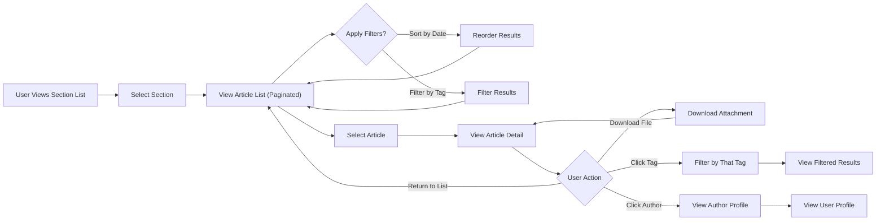
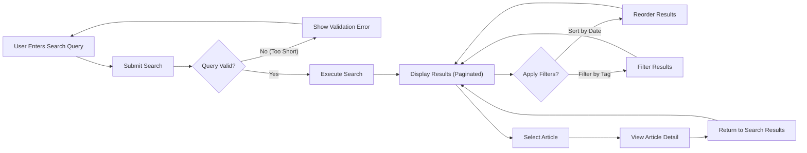

# Article Browsing and Search

## Overview

This document defines how users browse, view, and search for articles within the Economic/Political Discussion Board. The system provides comprehensive article discovery capabilities including section-based browsing, full-text search, and tag-based filtering.

## Article List Display

### Section Article List

WHEN a user navigates to a section, THE system SHALL display a paginated list of articles within that section.

THE article list SHALL display the following information for each article:

| Display Element | Description | Required |
|-----------------|-------------|----------|
| Title | The article title | Yes |
| Author | Display name of the article author | Yes |
| Tags | All tags attached to the article | Yes |
| Comment Count | Total number of comments on the article | Yes |
| Time Posted | Timestamp when the article was created | Yes |

THE article list SHALL NOT display the full article content, only the title and metadata.

### List Entry Behavior

WHEN a user clicks on an article title in the list, THE system SHALL navigate the user to the full article detail view.

THE article list entries SHALL be clickable in their entirety to provide easy access to article details.

### Empty State

WHEN a section contains no articles, THE system SHALL display an appropriate message indicating that no articles exist in that section.

### List Layout

THE article list SHALL present articles in a vertical list format with clear visual separation between entries.

Each article entry SHALL display:
- Title as the primary prominent element
- Author information below or beside the title
- Tags displayed in a compact, scannable format
- Comment count with clear labeling
- Time posted in a human-readable relative format (e.g., "2 hours ago") or absolute format based on recency

## Pagination

### Pagination Requirements

THE system SHALL paginate article lists to ensure optimal performance and user experience.

#### Default Page Size

THE system SHALL display a maximum of 20 articles per page by default.

#### Pagination Controls

THE system SHALL provide the following pagination controls:

| Control | Description |
|---------|-------------|
| Current Page Indicator | Shows the current page number |
| Total Pages | Shows the total number of pages available |
| Previous Button | Navigates to the previous page (disabled on first page) |
| Next Button | Navigates to the next page (disabled on last page) |
| Page Number Links | Direct access to specific page numbers |

#### Pagination Behavior

WHEN a user navigates to a specific page, THE system SHALL load and display only the articles for that page.

IF the requested page number exceeds the total number of pages, THEN THE system SHALL redirect the user to the last available page.

IF the requested page number is less than 1, THEN THE system SHALL redirect the user to the first page.

### Pagination State Preservation

WHEN a user navigates to an article detail and then returns to the list, THE system SHALL preserve the user's pagination position and sorting preferences.

## Sorting Options

### Available Sort Orders

THE system SHALL provide the following sorting options for article lists:

| Sort Option | Description | Default |
|-------------|-------------|---------|
| Newest First | Articles sorted by creation time, most recent first | Yes |
| Oldest First | Articles sorted by creation time, earliest first | No |

### Default Sorting

THE system SHALL sort articles by newest first by default.

### Sort Control Display

THE system SHALL display sorting options as clearly visible controls above the article list.

WHEN a user selects a different sorting option, THE system SHALL immediately reload the article list with the new sort order applied.

### Sort Persistence

THE system SHALL remember a user's sorting preference during their session.

WHEN a user navigates between sections, THE system SHALL maintain their selected sorting preference.

## Article Detail View

### Full Article Display

WHEN a user views a single article, THE system SHALL display the complete article with all associated information.

#### Required Display Elements

THE article detail view SHALL display the following information:

| Element | Description | Required |
|---------|-------------|----------|
| Title | The complete article title | Yes |
| Author | Display name of the article author | Yes |
| Content | The full article content text | Yes |
| Attachments | List of all attached files and images | Yes |
| Tags | All tags attached to the article | Yes |
| Time Posted | Timestamp when the article was created | Yes |

### Attachment Display

THE article detail view SHALL display attachments in a clearly identifiable section.

THE system SHALL differentiate between file attachments and image attachments in the display.

#### Image Attachments

WHEN an article has image attachments, THE system SHALL display thumbnail previews of the images.

WHEN a user clicks on an image thumbnail, THE system SHALL provide an option to view the full-size image or download it.

#### File Attachments

WHEN an article has file attachments, THE system SHALL display the file name and file type indicator.

THE system SHALL display a download button or link for each file attachment.

### Tag Display

THE system SHALL display all tags associated with the article.

WHEN a user clicks on a tag, THE system SHALL navigate to a search results page showing all articles with that tag.

### Author Information

THE system SHALL display the author's display name as a clickable element.

WHEN a user clicks on the author's display name, THE system SHALL navigate to that user's profile page.

### Article Actions

#### For Article Authors

WHEN the viewing user is the author of the article, THE system SHALL display edit and delete options.

THE edit option SHALL allow the author to modify the article title, content, attachments, and tags.

THE delete option SHALL allow the author to permanently remove the article.

#### For Administrators

WHERE the viewing user has administrator privileges, THE system SHALL display a delete option for moderation purposes.

### Article Not Found Handling

IF a user attempts to view an article that does not exist or has been deleted, THEN THE system SHALL display an appropriate error message and provide navigation options to return to the article list.

## File Download

### Download Capability

WHEN a user clicks on a file attachment or image in an article, THE system SHALL initiate the download process.

### Download Behavior

THE system SHALL download files using their original filenames.

THE system SHALL preserve the original file format and content during download.

### Image Preview vs Download

WHEN a user clicks on an image attachment, THE system SHALL provide options to:
- Preview the image in the browser
- Download the image file

### File Size Display

THE system SHALL display the file size for each attachment to help users understand download requirements.

### Download Error Handling

IF a file attachment fails to download, THEN THE system SHALL display an appropriate error message explaining the issue.

IF a file attachment no longer exists, THEN THE system SHALL display an error indicating the file is unavailable.

## Search Functionality

### Search Scope

THE system SHALL provide article search functionality that searches across:
- Article titles
- Article content

### Search Input

THE system SHALL provide a search input field accessible from the main interface.

THE search input field SHALL be prominently placed for easy access.

### Search Execution

WHEN a user submits a search query, THE system SHALL search all articles for matches in title or content.

THE search results SHALL be displayed in a paginated list format consistent with the article list display.

### Search Results Display

THE search results page SHALL display matching articles with the same information as the section article list:
- Title
- Author
- Tags
- Comment count
- Time posted

THE search results page SHALL indicate the search query that produced the results.

THE search results page SHALL display the total number of matching articles found.

### Empty Search Results

WHEN a search query produces no results, THE system SHALL display a message indicating no articles matched the search criteria.

THE system SHALL provide suggestions for refining the search query.

### Search Query Requirements

THE system SHALL accept search queries with a minimum of 2 characters.

IF a user submits a search query with fewer than 2 characters, THE system SHALL display a validation message requiring a longer query.

### Search Performance

THE system SHALL return search results within 2 seconds for typical queries.

WHEN a search takes longer than expected, THE system SHALL display a loading indicator.

### Search Results Sorting

THE search results SHALL be sortable using the same options as the article list:
- Newest first
- Oldest first

THE default sort for search results SHALL be newest first.

### Search and Section Context

THE search functionality SHALL search across all sections, not just the current section.

## Tag Filtering

### Tag Filter Capability

THE system SHALL allow users to filter articles by one or more tags.

### Tag Filter Access

THE system SHALL provide tag filtering options on:
- Article list pages (within sections)
- Search results pages

### Single Tag Filter

WHEN a user selects a single tag for filtering, THE system SHALL display only articles that have that tag attached.

### Multiple Tag Filter

WHEN a user selects multiple tags for filtering, THE system SHALL display articles that have ANY of the selected tags (OR logic).

### Tag Filter Display

THE system SHALL display the currently selected tag filters prominently above the article list.

THE system SHALL provide a clear option to remove individual tag filters or clear all filters.

### Tag Filter with Search

WHEN a user applies both a search query and tag filters, THE system SHALL display articles that match the search query AND have at least one of the selected tags.

### Available Tags Display

THE system SHALL display available tags for filtering based on:
- Popular tags across all articles
- Tags present in the current result set

### Tag Filter Persistence

WHEN a user applies a tag filter and navigates to an article detail, THE system SHALL preserve the filter when the user returns to the list.

## Browsing Flow Diagram

## Search Flow Diagram

## Combined Browsing and Search States

### User Navigation States

THE system SHALL maintain clear navigation context as users browse:

| Current State | Available Actions |
|---------------|-------------------|
| Section List | View sections, Search |
| Section Articles | Paginate, Sort, Filter by tag, View article, Search |
| Article Detail | Download files, Click tags, View author profile, Return to list |
| Search Results | Paginate, Sort, Filter by tag, View article, New search |

### Navigation Breadcrumbs

THE system SHALL provide breadcrumb navigation showing the user's current location:
- Section view: Home > Section Name
- Article view: Home > Section Name > Article Title
- Search results: Home > Search Results for "query"

## Error Handling

### Search Errors

IF the search service is unavailable, THEN THE system SHALL display an error message and suggest the user try again later.

### Article Load Errors

IF an article fails to load, THEN THE system SHALL display an error message with options to retry or return to the article list.

### Pagination Errors

IF a pagination request fails, THEN THE system SHALL display the last successfully loaded page with an error message.

### File Download Errors

IF a file download fails due to network issues, THEN THE system SHALL display an error message with a retry option.

IF a file download fails due to file unavailability, THEN THE system SHALL display an error indicating the file is no longer available.

## Permission Summary

### Article Browsing Permissions

| Action | Guest | Authenticated User | Administrator |
|--------|-------|-------------------|---------------|
| View article list | Yes | Yes | Yes |
| View article detail | Yes | Yes | Yes |
| Download attachments | Yes | Yes | Yes |
| Search articles | Yes | Yes | Yes |
| Filter by tags | Yes | Yes | Yes |
| Edit own articles | No | Yes | Yes |
| Delete own articles | No | Yes | Yes |
| Delete any article | No | No | Yes |

## Performance Requirements

### Page Load Times

THE article list page SHALL load within 2 seconds under normal conditions.

THE article detail page SHALL load within 2 seconds under normal conditions.

### Search Response Time

THE search function SHALL return results within 2 seconds for typical queries.

THE search function SHALL return results within 5 seconds for complex queries with multiple filters.

### File Download Performance

THE file download SHALL begin within 3 seconds of the user request.

Large file downloads SHALL display progress indication.

## Accessibility Considerations

THE article list and search interface SHALL be fully navigable via keyboard.

THE article list and search interface SHALL be compatible with screen readers.

THE system SHALL provide clear visual focus indicators for all interactive elements.

Color SHALL NOT be the only means of conveying information in the article browsing interface.