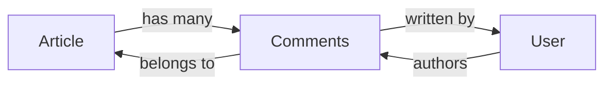
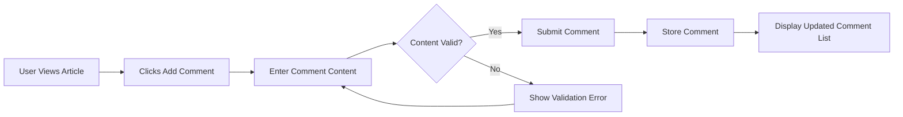
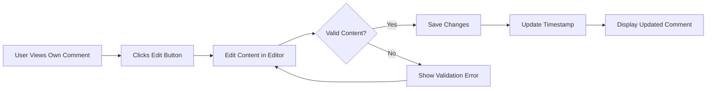
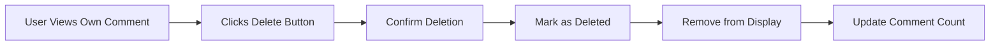
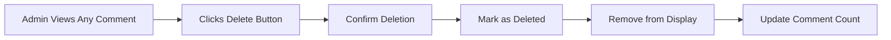

# Comment System Requirements

## Overview

The comment system enables users to engage in discussions on articles through single-level comments. This document defines all business requirements, user workflows, and system behaviors for the comment functionality.

### Purpose

THE comment system SHALL provide a mechanism for authenticated users to express opinions, ask questions, and engage in discussions on articles published within the discussion board.

### Scope

- Single-level comments attached to articles
- Comment creation, viewing, editing, and deletion by comment authors
- Comment deletion by administrators
- Chronological display of comments

### Key Design Decision

**Single-Level Comments Only**: THE system SHALL NOT support nested replies or threaded discussions. Each comment exists as a direct response to the article, promoting clarity and simplicity in discussion flow.

---

## Comment Data Model

### Core Attributes

THE comment data model SHALL include the following attributes:

| Attribute | Type | Required | Description |
|-----------|------|----------|-------------|
| Comment ID | Identifier | Yes | Unique identifier for the comment |
| Article Reference | Identifier | Yes | Reference to the parent article |
| Author Reference | Identifier | Yes | Reference to the user who wrote the comment |
| Content | Text | Yes | The comment body text |
| Created Timestamp | DateTime | Yes | Time when the comment was posted |
| Updated Timestamp | DateTime | Conditional | Time when the comment was last edited (null if never edited) |
| Deletion Status | Boolean | Yes | Flag indicating whether comment has been deleted |

### Data Relationships

### Content Constraints

THE comment content SHALL adhere to the following constraints:

- **Maximum Length**: THE comment content SHALL NOT exceed 10,000 characters
- **Minimum Length**: THE comment content SHALL contain at least 1 character of meaningful text
- **Whitespace Handling**: THE system SHALL trim leading and trailing whitespace from comment content before storage

### Attribute Behavior

WHEN a comment is created, THE system SHALL:
1. Generate a unique comment identifier
2. Record the current timestamp as the created timestamp
3. Set the updated timestamp to null
4. Set the deletion status to false

WHEN a comment is edited, THE system SHALL update the updated timestamp to reflect the modification time.

---

## Comment Creation

### User Workflow

### Prerequisites

WHEN a user attempts to create a comment, THE system SHALL verify:
1. The user is authenticated
2. The target article exists
3. The user is not banned

### Creation Process

WHEN an authenticated user submits a new comment on an article, THE system SHALL:
1. Validate the comment content meets all constraints
2. Create a new comment record linked to the article and user
3. Record the creation timestamp
4. Display the comment in the article's comment section immediately

### Authentication Requirement

THE comment system SHALL require user authentication for comment creation. WHEN an unauthenticated user attempts to create a comment, THE system SHALL deny the action and prompt the user to log in.

### Ban Status Check

WHEN a banned user attempts to create a comment, THE system SHALL deny the action with an appropriate error message indicating the account has been banned.

### Empty Content Handling

IF a user attempts to submit a comment with empty or whitespace-only content, THEN THE system SHALL reject the submission and display a validation error message.

### Character Limit Handling

IF a user attempts to submit a comment exceeding the maximum character limit, THEN THE system SHALL reject the submission and display an error message indicating the character limit.

---

## Comment Viewing

### Article Comment Section

WHEN a user views an article detail page, THE system SHALL display all non-deleted comments associated with that article.

### Comment Display Elements

THE system SHALL display the following information for each comment:

| Element | Description | Always Visible |
|---------|-------------|----------------|
| Author Display Name | The display name of the comment author | Yes |
| Comment Content | The text body of the comment | Yes |
| Created Timestamp | When the comment was posted | Yes |
| Edited Indicator | Visual indicator if comment was edited | Conditional |

### Author Information Display

THE system SHALL display the author's display name as a clickable element that links to the author's user profile page.

### Timestamp Display

THE system SHALL display comment timestamps in a human-readable format:
- For recent comments (within 24 hours): Relative time (e.g., "2 hours ago")
- For older comments: Absolute date and time (e.g., "February 19, 2026 at 3:30 PM")

### Edited Comment Indicator

WHEN a comment has been edited (updated timestamp is not null), THE system SHALL display an "edited" indicator near the timestamp.

### Comment Count Display

THE system SHALL display the total number of comments on the article list view. WHEN calculating the comment count, THE system SHALL only include non-deleted comments.

### Pagination for Comments

WHEN an article has more than 50 comments, THE system SHALL paginate the comment display with 20 comments per page. THE system SHALL provide navigation controls for users to browse through comment pages.

### Loading Comments

WHEN a user views an article with comments, THE system SHALL load and display comments within 2 seconds.

---

## Comment Sorting

### Default Sort Order

THE comment list SHALL be sorted by creation timestamp in ascending order (oldest first by default). This chronological ordering ensures discussions can be read naturally from beginning to end.

### Sort Behavior

THE system SHALL display comments in chronological order (oldest to newest) to maintain the natural flow of conversation.

### No User-Selectable Sorting

THE system SHALL NOT provide user-selectable sorting options for comments. THE fixed chronological order ensures consistent discussion flow.

### Rationale

**Why Oldest First?**
- Preserves natural conversation flow
- Enables users to read discussions from beginning to end
- Maintains context for later comments
- Simplifies the user experience

---

## Comment Editing

### Edit Authorization

THE system SHALL allow only the comment author to edit their own comments. WHEN a user who is not the comment author attempts to edit a comment, THE system SHALL deny access.

### Administrator Edit Restriction

Administrators SHALL NOT have the ability to edit user comments. Administrators can only delete comments that violate community guidelines.

### Edit Workflow

### Edit Process

WHEN a user edits their comment, THE system SHALL:
1. Validate the new content meets all constraints
2. Update the comment content
3. Update the updated timestamp to current time
4. Preserve the original created timestamp
5. Display the edited comment with an "edited" indicator

### Edit Time Limitation

THE system SHALL NOT impose any time limitation on comment editing. Users may edit their comments at any time after posting.

### Edit History

THE system SHALL NOT maintain a history of previous comment versions. Each edit overwrites the previous content.

### Empty Content Prevention

IF a user attempts to save an edited comment with empty or whitespace-only content, THEN THE system SHALL reject the edit and display a validation error.

### Deleted Comment Handling

THE system SHALL NOT allow editing of deleted comments. WHEN a user attempts to edit a deleted comment, THE system SHALL return an error indicating the comment no longer exists.

---

## Comment Deletion

### Deletion Authorization

THE comment deletion system SHALL support two types of authorized deletors:

| Deletor Type | Authorization Basis |
|--------------|---------------------|
| Comment Author | Owns the comment |
| Administrator | Moderation authority |

### Author Self-Deletion

WHEN a comment author deletes their own comment, THE system SHALL process the deletion immediately without requiring confirmation beyond a single user action.

### Administrator Deletion

Administrators SHALL have the authority to delete any comment on the platform regardless of authorship. This capability supports content moderation and enforcement of community guidelines.

### Deletion Workflow (Author)

### Deletion Workflow (Administrator)

### Soft Delete Implementation

WHEN a comment is deleted, THE system SHALL perform a soft delete by marking the comment as deleted rather than permanently removing it from the database. This approach:
- Preserves data integrity for audit purposes
- Enables potential content recovery if needed
- Maintains accurate activity records

### Display After Deletion

WHEN a comment is deleted, THE system SHALL:
1. Remove the comment from public display immediately
2. NOT display any "deleted" placeholder in the comment list
3. Update the article's comment count to reflect the deletion

### No Content Retention

THE system SHALL NOT display any portion of deleted comment content to any user, including administrators.

### Cascade Deletion (User Account)

WHEN a user deletes their account, THE system SHALL delete all comments authored by that user. This cascade deletion ensures no orphaned content remains.

### Article Deletion Impact

WHEN an article is deleted, THE system SHALL delete all comments associated with that article. This cascade deletion maintains data consistency.

---

## Business Rules

### Comment Ownership Rules

1. **Single Author**: Each comment SHALL have exactly one author
2. **Immutable Author**: THE comment author SHALL NOT be changeable after creation
3. **Permanent Article Link**: THE article to which a comment is attached SHALL NOT be changeable

### Content Validation Rules

| Rule | Constraint | Error Message |
|------|------------|---------------|
| Minimum Length | At least 1 non-whitespace character | "Comment cannot be empty" |
| Maximum Length | 10,000 characters | "Comment exceeds maximum length of 10,000 characters" |
| Required Authentication | User must be logged in | "Please log in to post a comment" |
| Ban Status | User must not be banned | "Your account has been banned" |

### Edit Restrictions

1. **Author Only**: Only the comment author may edit the comment
2. **Administrators Cannot Edit**: Administrators may only delete, not edit
3. **No Time Limit**: Comments may be edited at any time
4. **Single Version**: Only current version is stored

### Deletion Restrictions

1. **Author or Admin Only**: Only the comment author or an administrator may delete
2. **No Recovery Option**: Deleted comments cannot be recovered by users
3. **Immediate Effect**: Deletion takes effect immediately

---

## Error Scenarios

### Authentication Errors

WHEN an unauthenticated user attempts to create a comment, THE system SHALL:
- Deny the comment creation
- Display an error message: "Please log in to post a comment"
- Provide a link to the login page

### Authorization Errors

WHEN a user attempts to edit or delete another user's comment (without administrator privileges), THE system SHALL:
- Deny the action
- Display an error message: "You do not have permission to modify this comment"

### Validation Errors

IF a user submits a comment that fails validation, THEN THE system SHALL:
- Preserve the user's input in the comment field
- Display specific error messages for each validation failure
- Allow the user to correct and resubmit

### Article Not Found

WHEN a user attempts to comment on a deleted or non-existent article, THE system SHALL:
- Display an error message: "This article no longer exists"
- Redirect the user to the article list or section page

### Comment Not Found

WHEN a user attempts to edit or delete a comment that has been deleted, THE system SHALL:
- Display an error message: "This comment no longer exists"
- Refresh the comment list display

### Network Errors

WHEN a comment submission fails due to network connectivity, THE system SHALL:
- Preserve the user's comment content
- Display an error message: "Unable to submit comment. Please check your connection and try again."
- Provide a retry mechanism

---

## User Interface Behavior

### Comment Input Area

THE article detail page SHALL display a comment input area:
- Positioned below the article content
- Visible only to authenticated users
- Containing a text input field and submit button
- Expanding to accommodate longer comments

### Comment Display Layout

THE system SHALL display comments in a vertical list:
- Each comment clearly separated visually
- Author information prominent at the top of each comment
- Timestamp displayed in a subdued style
- Action buttons (Edit, Delete) visible only for authorized users

### Action Button Visibility

| User Status | Edit Button | Delete Button |
|-------------|-------------|---------------|
| Comment Author | Visible | Visible |
| Other Authenticated User | Hidden | Hidden |
| Administrator | Hidden | Visible (all comments) |
| Unauthenticated User | Hidden | Hidden |

### Real-Time Updates

WHEN a user posts, edits, or deletes a comment, THE system SHALL update the comment display immediately without requiring a page refresh.

---

## Performance Requirements

### Comment Load Time

WHEN a user views an article with comments, THE system SHALL load and display all visible comments within 2 seconds.

### Comment Submission Response

WHEN a user submits a comment, THE system SHALL process and display the comment within 1 second of submission.

### Large Comment Volume Handling

WHEN an article has more than 100 comments, THE system SHALL:
- Implement pagination (20 comments per page)
- Load only the first page initially
- Provide smooth navigation between pages

---

## Integration Points

### User Profile Integration

THE user profile page SHALL display a list of all comments written by the user. WHEN a user deletes a comment, THE system SHALL update the profile's comment list accordingly.

### Comment Count Synchronization

THE system SHALL maintain accurate comment counts across:
- Article list view (comment count per article)
- Article detail view (total comments displayed)
- User profile view (total comments by user)

### Notification Considerations

THE system SHALL NOT send notifications for new comments. Users discover new comments by visiting the article page.

---

## Summary

The comment system provides a straightforward, single-level discussion mechanism for articles. Key characteristics include:

- **Authentication Required**: Only logged-in users can comment
- **Single-Level Structure**: No nested replies for simplicity
- **Chronological Order**: Oldest first for natural conversation flow
- **Author Control**: Users can edit and delete their own comments
- **Moderation Support**: Administrators can delete any comment
- **Soft Delete**: Comments are marked deleted, not permanently removed
- **Cascade Deletion**: Account/article deletion removes associated comments

This design prioritizes simplicity, clarity, and ease of moderation while enabling meaningful discussions on published articles.

> *Developer Note: This document defines business requirements for the comment system. Technical implementation details including API design, database schema, and caching strategies are at the discretion of the development team.*