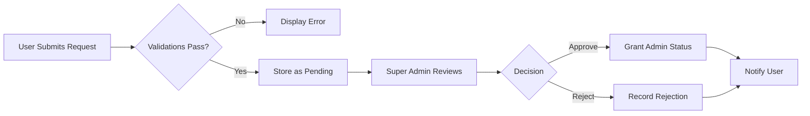
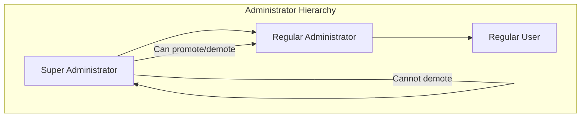
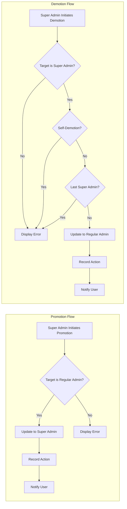

# Administrator System Requirements

## Executive Summary

The Discussion Board platform implements a hierarchical administrator system with two distinct permission levels: **Regular Administrator** and **Super Administrator**. This system enables platform governance through content moderation, user management, and structural organization while maintaining a clear chain of authority. Users transition to administrative roles through a formal request-and-approval process, ensuring accountability and community trust.

### Core Principles

- **Merit-based Access**: Administrative privileges are granted through an approval process, not automatically assigned
- **Hierarchical Authority**: Super administrators hold elevated privileges over regular administrators
- **Self-protection**: Built-in safeguards prevent administrators from abusing their own accounts
- **Transparent Process**: All admin requests are reviewed with recorded decisions

---

## Administrator Request Submission

### Overview

Any authenticated user may submit a request to become an administrator. This democratic approach allows dedicated community members to participate in platform governance while ensuring accountability through the review process.

### Request Process

#### Access Requirements

WHEN an authenticated user accesses the administrator request feature, THE system SHALL display the request submission interface.

#### Request Data Requirements

WHEN a user submits an administrator request, THE system SHALL capture the following information:

| Field | Type | Requirement | Description |
|-------|------|-------------|-------------|
| Reason | Text | Required, minimum 50 characters | User's explanation of why they should become an administrator |
| Submission Timestamp | DateTime | Auto-generated | When the request was submitted |
| Requester | User Reference | Auto-captured | The user submitting the request |
| Status | Enum | Auto-set to "pending" | Current state of the request |

#### Submission Validation

WHEN a user submits an administrator request, THE system SHALL perform the following validations:

1. THE system SHALL verify the user is authenticated
2. THE system SHALL verify the user is not already an administrator (regular or super)
3. THE system SHALL verify the user does not have a pending request
4. THE system SHALL verify the reason text meets minimum length requirement
5. THE system SHALL verify the user is not currently banned

#### Duplicate Request Prevention

IF a user with a pending administrator request attempts to submit another request, THEN THE system SHALL reject the submission and display an appropriate message indicating a pending request exists.

#### Already-Admin Prevention

IF a user who is already an administrator (regular or super) attempts to submit an administrator request, THEN THE system SHALL reject the submission and display an appropriate message.

#### Successful Submission

WHEN an administrator request is successfully submitted, THE system SHALL:

1. Store the request with "pending" status
2. Record the submission timestamp
3. Link the request to the submitting user
4. Display a confirmation message to the user

### Request Data Model

Each administrator request SHALL contain:

- **Request ID**: Unique identifier for the request
- **Requester**: Reference to the user who submitted the request
- **Reason**: Text explanation provided by the requester
- **Status**: Current state (pending, approved, rejected)
- **Submitted At**: Timestamp of submission
- **Reviewed By**: Reference to the super administrator who reviewed (null if pending)
- **Reviewed At**: Timestamp of review (null if pending)
- **Review Notes**: Optional notes from the reviewer (null if pending)

---

## Administrator Request Review

### Overview

Super administrators are responsible for reviewing and deciding on administrator requests. This process ensures that administrative privileges are granted through peer review rather than automatically.

### Access Control

#### Viewing Pending Requests

WHEN a super administrator accesses the administrator request management interface, THE system SHALL display a list of all pending administrator requests.

WHERE a user is a regular administrator, THE system SHALL NOT allow access to the request review interface.

#### Request List Display

THE system SHALL display the following information for each pending request:

- Requester's display name
- Requester's account creation date
- Requester's contribution statistics (article count, comment count)
- Reason text submitted by the requester
- Time elapsed since submission

### Review Actions

#### Approval Process

WHEN a super administrator approves an administrator request, THE system SHALL:

1. Update the request status to "approved"
2. Record the reviewer's identity
3. Record the approval timestamp
4. Store any review notes provided
5. Update the requester's account to grant regular administrator status
6. Send a notification to the requester informing them of approval

#### Rejection Process

WHEN a super administrator rejects an administrator request, THE system SHALL:

1. Update the request status to "rejected"
2. Record the reviewer's identity
3. Record the rejection timestamp
4. Store any review notes provided
5. Send a notification to the requester informing them of rejection

#### Review Notes

WHEN a super administrator provides review notes during approval or rejection, THE system SHALL store these notes with the request record for future reference.

### Post-Rejection Resubmission

WHEN a user whose previous administrator request was rejected submits a new request, THE system SHALL allow the submission and create a new request record.

THE system SHALL maintain a history of all previous requests for reference.

### Request Workflow Diagram

---

## Administrator Hierarchy

### Overview

The platform implements a two-tier administrator hierarchy with distinct permission levels. This structure enables distributed governance while maintaining clear authority boundaries.

### Role Definitions

#### Regular Administrator

A **Regular Administrator** is a user who has been granted moderation and management privileges through the request approval process. Regular administrators can:

- Perform all actions available to regular users
- Create, edit, and delete sections
- Delete any article
- Delete any comment
- Ban users
- Unban users
- View the list of banned users

Regular administrators **cannot**:

- Approve or reject administrator requests
- Promote or demote administrators
- Manage super administrator accounts

#### Super Administrator

A **Super Administrator** holds the highest level of platform authority. Super administrators possess all regular administrator capabilities plus:

- Approve or reject administrator requests
- Promote regular administrators to super administrator status
- Demote other super administrators to regular administrator status

Super administrators **cannot**:

- Demote themselves (self-protection mechanism)

### Hierarchy Visualization

### Permission Comparison

| Capability | Regular User | Regular Administrator | Super Administrator |
|------------|:------------:|:---------------------:|:-------------------:|
| Create articles | ✅ | ✅ | ✅ |
| Edit own articles | ✅ | ✅ | ✅ |
| Delete own articles | ✅ | ✅ | ✅ |
| Create comments | ✅ | ✅ | ✅ |
| Edit own comments | ✅ | ✅ | ✅ |
| Delete own comments | ✅ | ✅ | ✅ |
| Create sections | ❌ | ✅ | ✅ |
| Edit sections | ❌ | ✅ | ✅ |
| Delete sections | ❌ | ✅ | ✅ |
| Delete any article | ❌ | ✅ | ✅ |
| Delete any comment | ❌ | ✅ | ✅ |
| Ban users | ❌ | ✅ | ✅ |
| Unban users | ❌ | ✅ | ✅ |
| View banned users | ❌ | ✅ | ✅ |
| Review admin requests | ❌ | ❌ | ✅ |
| Promote administrators | ❌ | ❌ | ✅ |
| Demote administrators | ❌ | ❌ | ✅ |

---

## Promotion System

### Overview

Super administrators can elevate regular administrators to super administrator status. This promotion capability enables organic growth of the administrative team's leadership.

### Promotion Authority

WHERE a user is a super administrator, THE system SHALL allow that user to promote regular administrators to super administrator status.

WHERE a user is a regular administrator, THE system SHALL NOT allow that user to access the promotion feature.

### Promotion Process

#### Eligibility Verification

WHEN a super administrator initiates a promotion, THE system SHALL verify:

1. The target user is currently a regular administrator
2. The target user is not banned
3. The initiator is a super administrator

#### Promotion Execution

WHEN a super administrator promotes a regular administrator, THE system SHALL:

1. Update the target user's permission level to super administrator
2. Record the promotion action including:
   - Identity of the promoter
   - Identity of the promoted user
   - Timestamp of promotion
3. Notify the promoted user of their elevation

#### Invalid Promotion Prevention

IF a super administrator attempts to promote a user who is not a regular administrator, THEN THE system SHALL reject the action and display an appropriate error message.

### Initial Super Administrator

The platform SHALL have at least one initial super administrator provisioned during system setup to enable the promotion workflow.

---

## Demotion System

### Overview

Super administrators can downgrade other super administrators to regular administrator status. This demotion capability provides a check-and-balance mechanism within the administrative team.

### Self-Demotion Prevention

**Critical Business Rule**: A super administrator cannot demote themselves. This rule prevents accidental loss of administrative access and protects against potential abuse where a super administrator might demote themselves to avoid accountability.

WHEN a super administrator attempts to demote themselves, THE system SHALL reject the action and display an appropriate error message.

### Demotion Authority

WHERE a user is a super administrator, THE system SHALL allow that user to demote other super administrators to regular administrator status.

WHERE a user is a regular administrator, THE system SHALL NOT allow that user to access the demotion feature.

### Demotion Process

#### Eligibility Verification

WHEN a super administrator initiates a demotion, THE system SHALL verify:

1. The target user is currently a super administrator
2. The target user is not the same as the initiator (self-demotion check)
3. The initiator is a super administrator

#### Demotion Execution

WHEN a super administrator demotes another super administrator, THE system SHALL:

1. Update the target user's permission level to regular administrator
2. Record the demotion action including:
   - Identity of the demoter
   - Identity of the demoted user
   - Timestamp of demotion
3. Notify the demoted user of their status change

#### Invalid Demotion Prevention

IF a super administrator attempts to demote a user who is not a super administrator, THEN THE system SHALL reject the action and display an appropriate error message.

### Last Super Administrator Protection

WHEN a demotion would result in zero super administrators remaining, THE system SHALL reject the demotion and display an error message.

THE system SHALL always maintain at least one super administrator account.

### Promotion and Demotion Workflow

---

## Administrator Capabilities

### Overview

Administrators possess enhanced capabilities beyond those of regular users. These capabilities enable effective platform governance and content moderation.

### Section Management

#### Creating Sections

WHEN an administrator creates a new section, THE system SHALL:

1. Capture the section name and description
2. Validate that the name is unique
3. Validate that required fields are provided
4. Store the section with the creator's reference
5. Make the section immediately visible to all users

#### Editing Sections

WHEN an administrator edits an existing section, THE system SHALL:

1. Allow modification of name and description
2. Validate that any new name is unique
3. Preserve all existing articles within the section
4. Record the modification timestamp

#### Deleting Sections

WHEN an administrator deletes a section, THE system SHALL:

1. Prompt for confirmation
2. Upon confirmation, permanently remove the section
3. Handle articles within the deleted section according to business rules (delete or require reassignment)
4. Record the deletion action

### Content Moderation

#### Article Deletion

WHEN an administrator deletes any article, THE system SHALL:

1. Remove the article and all associated data (comments, attachments)
2. Record the deletion action including the administrator's identity
3. Preserve the deletion record for audit purposes

THE system SHALL NOT require the administrator to own the article being deleted.

#### Comment Deletion

WHEN an administrator deletes any comment, THE system SHALL:

1. Remove the comment
2. Record the deletion action including the administrator's identity
3. Preserve the deletion record for audit purposes

THE system SHALL NOT require the administrator to own the comment being deleted.

### User Management

#### Banning Users

WHEN an administrator bans a user, THE system SHALL:

1. Require a ban reason to be provided
2. Update the user's status to banned
3. Store the ban reason and timestamp
4. Store the identity of the administrator who performed the ban
5. Terminate any active sessions for the banned user
6. Prevent the banned user from logging in

THE system SHALL NOT remove or hide the banned user's existing content (articles and comments remain visible).

#### Unbanning Users

WHEN an administrator unbans a user, THE system SHALL:

1. Update the user's status to active
2. Record the unban action with timestamp
3. Store the identity of the administrator who performed the unban
4. Allow the user to log in again

#### Viewing Banned Users

WHEN an administrator accesses the banned users list, THE system SHALL display:

- User's display name
- Ban reason
- Ban date
- Identity of the administrator who performed the ban

### Administrative Actions Audit Trail

THE system SHALL maintain a record of all administrative actions including:

- Type of action performed
- Identity of the administrator who performed the action
- Timestamp of the action
- Target of the action (user, article, comment, or section affected)
- Any relevant notes or reasons

---

## Permission Matrix

### Complete Capability Matrix

The following matrix defines all capabilities for each user type:

| Action | Guest | User | Regular Admin | Super Admin |
|--------|:-----:|:----:|:-------------:|:-----------:|
| **Authentication** |
| Register account | ✅ | - | - | - |
| Login | - | ✅ | ✅ | ✅ |
| Logout | - | ✅ | ✅ | ✅ |
| Change password | - | ✅ | ✅ | ✅ |
| Delete own account | - | ✅ | ✅ | ✅ |
| **Profile** |
| View own profile | - | ✅ | ✅ | ✅ |
| Edit own profile | - | ✅ | ✅ | ✅ |
| View other profiles | ✅ | ✅ | ✅ | ✅ |
| **Sections** |
| Browse sections | ✅ | ✅ | ✅ | ✅ |
| View section articles | ✅ | ✅ | ✅ | ✅ |
| Create sections | ❌ | ❌ | ✅ | ✅ |
| Edit sections | ❌ | ❌ | ✅ | ✅ |
| Delete sections | ❌ | ❌ | ✅ | ✅ |
| **Articles** |
| View articles | ✅ | ✅ | ✅ | ✅ |
| Create articles | ❌ | ✅ | ✅ | ✅ |
| Edit own articles | - | ✅ | ✅ | ✅ |
| Delete own articles | - | ✅ | ✅ | ✅ |
| Delete any article | ❌ | ❌ | ✅ | ✅ |
| **Comments** |
| View comments | ✅ | ✅ | ✅ | ✅ |
| Create comments | ❌ | ✅ | ✅ | ✅ |
| Edit own comments | - | ✅ | ✅ | ✅ |
| Delete own comments | - | ✅ | ✅ | ✅ |
| Delete any comment | ❌ | ❌ | ✅ | ✅ |
| **Search** |
| Search articles | ✅ | ✅ | ✅ | ✅ |
| Filter by tags | ✅ | ✅ | ✅ | ✅ |
| **Administration** |
| Request admin status | - | ✅ | ❌ | ❌ |
| Review admin requests | ❌ | ❌ | ❌ | ✅ |
| Promote administrators | ❌ | ❌ | ❌ | ✅ |
| Demote administrators | ❌ | ❌ | ❌ | ✅ |
| Ban users | ❌ | ❌ | ✅ | ✅ |
| Unban users | ❌ | ❌ | ✅ | ✅ |
| View banned users | ❌ | ❌ | ✅ | ✅ |

---

## Business Rules

### Request Lifecycle Rules

1. **One Pending Request**: A user SHALL have at most one pending administrator request at any time
2. **No Self-Approval**: A super administrator cannot approve their own request (though they wouldn't have a request as they're already an admin)
3. **Resubmission After Rejection**: Users may submit new requests after rejection; there is no waiting period
4. **Request History**: All requests (pending, approved, rejected) SHALL be retained for audit purposes

### Hierarchy Rules

1. **Minimum Super Admins**: The system SHALL always maintain at least one super administrator
2. **No Self-Demotion**: A super administrator cannot demote themselves under any circumstances
3. **Cascade Protection**: Demotion of a super administrator SHALL NOT affect their existing content (articles, comments)
4. **Immediate Effect**: Permission changes SHALL take effect immediately upon execution

### Administrative Action Rules

1. **Reason Required**: All ban actions SHALL require a reason to be provided
2. **Audit Trail**: All administrative actions SHALL be logged with actor, timestamp, and target
3. **Content Preservation**: Banning a user SHALL NOT remove or hide their existing content
4. **Reversibility**: All administrative actions SHALL be reversible (unban, recreate sections)

---

## Error Handling

### Request Submission Errors

| Error Condition | User-Facing Message | Recovery Action |
|----------------|---------------------|-----------------|
| User already has pending request | "You already have a pending administrator request. Please wait for it to be reviewed." | Wait for review completion |
| User is already an administrator | "You are already an administrator." | N/A |
| User is banned | "Your account is currently banned and cannot submit administrator requests." | Contact support or wait for unban |
| Reason text too short | "Please provide a more detailed reason (minimum 50 characters)." | Expand reason text |
| Not authenticated | "Please log in to submit an administrator request." | Log in and retry |

### Promotion/Demotion Errors

| Error Condition | User-Facing Message | Recovery Action |
|----------------|---------------------|-----------------|
| Target is not a regular administrator | "The selected user is not a regular administrator." | Select a different user |
| Target is not a super administrator | "The selected user is not a super administrator." | Select a different user |
| Self-demotion attempt | "You cannot demote yourself." | N/A |
| Would result in zero super admins | "Cannot demote: at least one super administrator must remain." | Promote another user first |
| Insufficient permissions | "You do not have permission to perform this action." | Contact a super administrator |

### Content Moderation Errors

| Error Condition | User-Facing Message | Recovery Action |
|----------------|---------------------|-----------------|
| Article not found | "The requested article could not be found." | Refresh the page |
| Comment not found | "The requested comment could not be found." | Refresh the page |
| Section not found | "The requested section could not be found." | Navigate to sections list |
| Section name already exists | "A section with this name already exists." | Choose a different name |

### User Management Errors

| Error Condition | User-Facing Message | Recovery Action |
|----------------|---------------------|-----------------|
| User not found | "The requested user could not be found." | Verify user identifier |
| User is already banned | "This user is already banned." | N/A |
| User is not banned | "This user is not currently banned." | N/A |
| Ban reason missing | "A reason is required when banning a user." | Provide ban reason |
| Cannot ban yourself | "You cannot ban yourself." | N/A |

---

## Notification Requirements

### Administrator Request Notifications

WHEN an administrator request is approved or rejected, THE system SHALL send a notification to the requester containing:

- The decision (approved or rejected)
- Any review notes provided by the super administrator
- Timestamp of the decision
- Next steps (for approved: "You now have administrator privileges")

### Promotion/Demotion Notifications

WHEN a user is promoted to super administrator, THE system SHALL send a notification containing:

- Notification of elevation
- Identity of the promoter
- Timestamp of promotion

WHEN a user is demoted to regular administrator, THE system SHALL send a notification containing:

- Notification of status change
- Timestamp of demotion

### Ban/Unban Notifications

WHEN a user is banned, THE system SHALL send a notification to the banned user's email containing:

- Notification of ban
- Ban reason
- Timestamp of ban
- Contact information for appeals

WHEN a user is unbanned, THE system SHALL send a notification to the user's email containing:

- Notification of unban
- Timestamp of unban

---

## Security Considerations

### Session Management

WHEN a user is banned, THE system SHALL immediately terminate all active sessions for that user.

WHEN a user is promoted or demoted, THE system SHALL update the user's session token to reflect the new permission level.

### Audit Log Protection

Administrative action logs SHALL be immutable and cannot be modified or deleted by any user, including super administrators.

### Permission Verification

THE system SHALL verify permissions on every administrative action request, not rely on cached permission states.