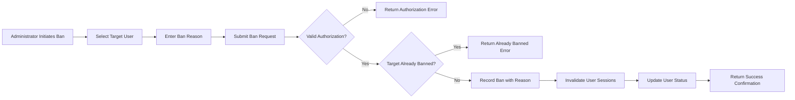
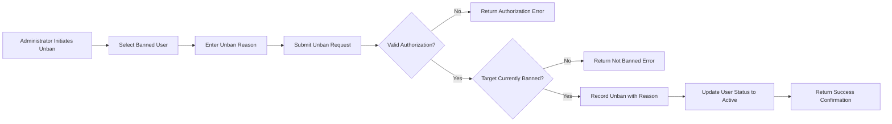
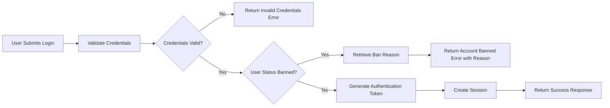
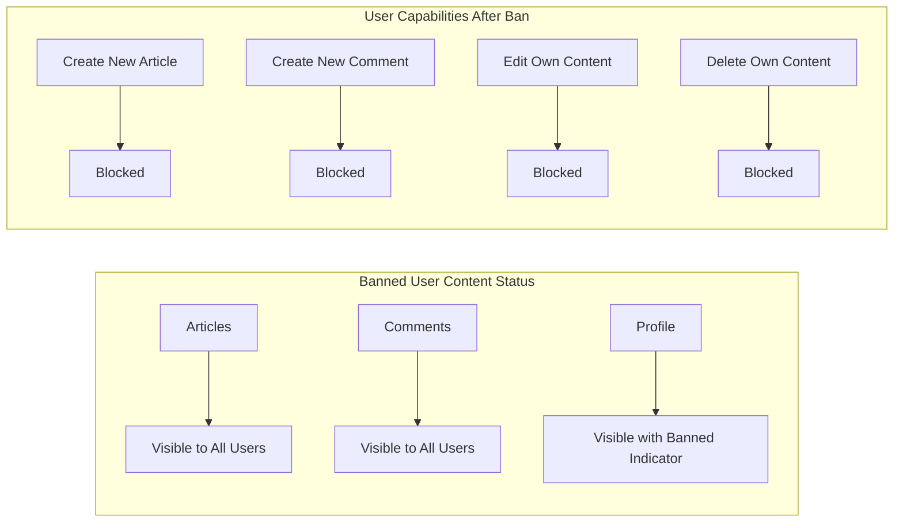

# User Banning System

## Overview

The banning system provides administrators with the ability to restrict platform access for users who violate community guidelines or terms of service. When a user is banned, they cannot log in to the platform, but their existing content (articles and comments) remains visible to other users. This approach preserves discussion continuity while removing problematic users from participation.

The system maintains comprehensive records of all ban actions, including reasons and administrative context, enabling transparent moderation practices and supporting potential appeals processes.

---

## Ban Process

### Authorization Requirements

Only users with administrator privileges can ban other users. The ban capability applies equally to regular administrators and super administrators.

| Actor | Can Ban | Cannot Ban |
|-------|---------|------------|
| Regular User | ❌ | All users |
| Administrator | ✅ | Regular users, other administrators |
| Super Administrator | ✅ | Regular users, administrators, other super administrators |

### Business Rules

**BR-BAN-001**: Administrators cannot ban themselves.

**BR-BAN-002**: Super administrators cannot ban themselves.

**BR-BAN-003**: WHEN an administrator attempts to ban a user with equal or higher permission level, THE system SHALL reject the action and return an authorization error.

**BR-BAN-004**: WHEN an administrator bans a user, THE system SHALL immediately invalidate all active sessions for the banned user.

### Ban Workflow

### Functional Requirements

**FR-BAN-001**: WHEN an administrator submits a ban request for a user, THE system SHALL verify that the administrator has sufficient permission to ban the target user.

**FR-BAN-002**: WHEN an administrator attempts to ban themselves, THE system SHALL reject the request and return error code `BAN_SELF_PROHIBITED`.

**FR-BAN-003**: WHEN an administrator attempts to ban a user with higher permission level, THE system SHALL reject the request and return error code `BAN_INSUFFICIENT_PERMISSION`.

**FR-BAN-004**: WHEN a ban request is validated successfully, THE system SHALL record the ban with the following information:
- Target user identifier
- Administrator who performed the ban
- Ban reason (text, required)
- Timestamp of ban action

**FR-BAN-005**: WHEN a user is successfully banned, THE system SHALL terminate all active sessions for that user immediately.

**FR-BAN-006**: WHEN a ban is recorded, THE system SHALL update the user's account status to `banned`.

**FR-BAN-007**: WHEN an administrator attempts to ban a user who is already banned, THE system SHALL return error code `USER_ALREADY_BANNED`.

---

## Ban Reason Recording

### Purpose

Ban reasons serve multiple purposes:
- Documentation for moderation transparency
- Reference for future administrative review
- Supporting information for potential user appeals
- Audit trail for compliance requirements

### Required Information

| Field | Type | Required | Constraints |
|-------|------|----------|-------------|
| Target User ID | UUID | Yes | Must reference existing user |
| Administrator ID | UUID | Yes | Must reference administrator performing ban |
| Ban Reason | Text | Yes | Minimum 10 characters, maximum 1,000 characters |
| Ban Timestamp | DateTime | Yes | Automatically recorded by system |

### Functional Requirements

**FR-REASON-001**: WHEN recording a ban, THE system SHALL require a ban reason text field with minimum 10 characters.

**FR-REASON-002**: WHEN a ban reason exceeds 1,000 characters, THE system SHALL truncate or reject the input with error code `BAN_REASON_TOO_LONG`.

**FR-REASON-003**: WHEN a ban reason is not provided or is empty, THE system SHALL reject the ban request with error code `BAN_REASON_REQUIRED`.

**FR-REASON-004**: THE system SHALL store ban reasons in plaintext format without markdown or HTML interpretation.

**FR-REASON-005**: WHEN storing a ban record, THE system SHALL link the record to both the banned user and the administrator who performed the ban.

### Data Retention

**FR-REASON-006**: THE system SHALL retain ban reason records indefinitely, even after a user is unbanned.

**FR-REASON-007**: WHEN a user account is deleted, THE system SHALL retain ban records with anonymized user references for audit purposes.

---

## Banned User List

### Access and Visibility

Only administrators (both regular and super administrators) can access the banned user list. Regular users cannot view this information.

### List Display Requirements

The banned user list provides administrators with a comprehensive view of all currently banned users, including relevant details for moderation management.

**FR-LIST-001**: WHEN an administrator requests the banned user list, THE system SHALL return all users with status `banned`.

**FR-LIST-002**: WHEN displaying the banned user list, THE system SHALL show the following information for each banned user:
- Display name
- Email address (for identification purposes)
- Ban reason
- Administrator who performed the ban
- Timestamp of ban action

**FR-LIST-003**: WHEN the banned user list exceeds 20 entries, THE system SHALL paginate results with 20 users per page.

**FR-LIST-004**: WHEN an administrator views the banned user list, THE system SHALL sort entries by ban timestamp in descending order (most recently banned first).

### Search and Filter

**FR-LIST-005**: WHEN an administrator searches the banned user list by email or display name, THE system SHALL filter results to matching entries.

**FR-LIST-006**: WHEN an administrator filters the banned user list by banning administrator, THE system SHALL show only users banned by that specific administrator.

### Permission Matrix

| Action | Regular User | Administrator | Super Administrator |
|--------|--------------|---------------|---------------------|
| View banned user list | ❌ | ✅ | ✅ |
| View ban reasons | ❌ | ✅ | ✅ |
| Search banned users | ❌ | ✅ | ✅ |
| Filter by administrator | ❌ | ✅ | ✅ |

---

## Unban Process

### Authorization Requirements

Unbanning follows the same permission hierarchy as banning.

| Actor | Can Unban | Cannot Unban |
|-------|-----------|--------------|
| Regular User | ❌ | All users |
| Administrator | ✅ | Users banned by self or lower-level admins |
| Super Administrator | ✅ | All banned users |

### Business Rules

**BR-UNBAN-001**: WHEN an administrator attempts to unban a user banned by a higher-level administrator, THE system SHALL reject the action.

**BR-UNBAN-002**: Super administrators can unban any user, including those banned by other super administrators.

### Unban Workflow

### Functional Requirements

**FR-UNBAN-001**: WHEN an administrator submits an unban request, THE system SHALL verify that the administrator has sufficient permission to unban the target user.

**FR-UNBAN-002**: WHEN an administrator attempts to unban a user who is not currently banned, THE system SHALL return error code `USER_NOT_BANNED`.

**FR-UNBAN-003**: WHEN an unban request is validated successfully, THE system SHALL require an unban reason text field with minimum 10 characters.

**FR-UNBAN-004**: WHEN a user is successfully unbanned, THE system SHALL update the user's account status to `active`.

**FR-UNBAN-005**: WHEN recording an unban, THE system SHALL store:
- Target user identifier
- Administrator who performed the unban
- Unban reason (text, required)
- Timestamp of unban action
- Reference to original ban record

**FR-UNBAN-006**: WHEN a user is unbanned, THE system SHALL retain the original ban record for audit purposes.

**FR-UNBAN-007**: WHEN an unbanned user attempts to log in, THE system SHALL process the authentication request normally.

### Re-banning Prevention Period

**FR-UNBAN-008**: THE system SHALL allow administrators to re-ban a previously unbanned user without restriction.

---

## Login Prevention

### Core Behavior

Banned users are completely restricted from accessing authenticated features of the platform. The login prevention mechanism operates at the authentication layer.

### Authentication Flow for Banned Users

### Functional Requirements

**FR-LOGIN-001**: WHEN a banned user attempts to log in with valid credentials, THE system SHALL reject the login attempt and return error code `ACCOUNT_BANNED`.

**FR-LOGIN-002**: WHEN rejecting a banned user's login attempt, THE system SHALL include the ban reason in the error response.

**FR-LOGIN-003**: WHEN rejecting a banned user's login attempt, THE system SHALL NOT include sensitive information such as administrator identity or timestamps in the error response visible to the banned user.

**FR-LOGIN-004**: WHEN a banned user's session exists at the time of banning, THE system SHALL invalidate the session within 5 seconds.

**FR-LOGIN-005**: WHEN a banned user attempts any authenticated API endpoint, THE system SHALL return error code `ACCOUNT_BANNED` with HTTP status 403 Forbidden.

### Session Management

**FR-LOGIN-006**: WHEN a user is banned while having active sessions, THE system SHALL add the user's ID to a session invalidation queue.

**FR-LOGIN-007**: THE system SHALL process the session invalidation queue within 5 seconds of ban execution.

**FR-LOGIN-008**: WHEN a banned user attempts to use an invalidated session token, THE system SHALL return error code `SESSION_INVALIDATED` with HTTP status 401 Unauthorized.

### Error Response Format

**FR-LOGIN-009**: WHEN returning an `ACCOUNT_BANNED` error to a banned user, THE system SHALL include:
- Error code: `ACCOUNT_BANNED`
- HTTP status: 403 Forbidden
- Message: "Your account has been banned"
- Ban reason: The reason text provided at time of ban

---

## Content Visibility

### Core Principle

Banning removes a user's ability to participate but does not remove their historical contributions. This approach maintains discussion integrity and context for other users.

### Article Visibility

**FR-CONTENT-001**: WHEN a user is banned, THE system SHALL retain all articles created by that user.

**FR-CONTENT-002**: WHEN displaying articles by a banned user, THE system SHALL show the articles normally with the author's display name.

**FR-CONTENT-003**: WHEN a banned user's articles are viewed, THE system SHALL indicate the author's banned status with a visual indicator (e.g., "[Banned]" suffix on display name or similar indicator).

**FR-CONTENT-004**: WHEN an administrator deletes a banned user's article through moderation, THE system SHALL follow standard article deletion procedures.

### Comment Visibility

**FR-CONTENT-005**: WHEN a user is banned, THE system SHALL retain all comments created by that user.

**FR-CONTENT-006**: WHEN displaying comments by a banned user, THE system SHALL show the comments normally within article discussions.

**FR-CONTENT-007**: WHEN displaying comments by a banned user, THE system SHALL indicate the author's banned status with a visual indicator.

### Profile Visibility

**FR-CONTENT-008**: WHEN a banned user's profile is viewed, THE system SHALL display the profile with a banned status indicator.

**FR-CONTENT-009**: WHEN viewing a banned user's profile, THE system SHALL display the user's articles and comments lists normally.

### Content Relationships

### Prohibited Actions for Banned Users

**FR-CONTENT-010**: WHEN a banned user attempts to create an article, THE system SHALL reject the request with error code `ACCOUNT_BANNED`.

**FR-CONTENT-011**: WHEN a banned user attempts to create a comment, THE system SHALL reject the request with error code `ACCOUNT_BANNED`.

**FR-CONTENT-012**: WHEN a banned user attempts to edit their own article, THE system SHALL reject the request with error code `ACCOUNT_BANNED`.

**FR-CONTENT-013**: WHEN a banned user attempts to edit their own comment, THE system SHALL reject the request with error code `ACCOUNT_BANNED`.

**FR-CONTENT-014**: WHEN a banned user attempts to delete their own article, THE system SHALL reject the request with error code `ACCOUNT_BANNED`.

**FR-CONTENT-015**: WHEN a banned user attempts to delete their own comment, THE system SHALL reject the request with error code `ACCOUNT_BANNED`.

**FR-CONTENT-016**: WHEN a banned user attempts to update their profile, THE system SHALL reject the request with error code `ACCOUNT_BANNED`.

---

## Ban History and Audit Trail

### Purpose

The system maintains comprehensive records of all ban and unban actions for administrative oversight, compliance, and appeal handling.

### Audit Record Structure

| Field | Type | Description |
|-------|------|-------------|
| Action Type | Enum | `BAN` or `UNBAN` |
| Target User ID | UUID | The user who was banned/unbanned |
| Administrator ID | UUID | The administrator who performed the action |
| Reason | Text | The reason provided for the action |
| Timestamp | DateTime | When the action occurred |
| Related Ban ID | UUID | For unban actions, reference to original ban |

### Functional Requirements

**FR-AUDIT-001**: THE system SHALL record all ban and unban actions in an immutable audit log.

**FR-AUDIT-002**: WHEN an administrator views a user's profile, THE system SHALL display ban/unban history to administrators.

**FR-AUDIT-003**: WHEN generating audit reports, THE system SHALL provide filtering by date range, administrator, and action type.

**FR-AUDIT-004**: THE system SHALL prevent modification or deletion of audit records.

**FR-AUDIT-005**: WHEN a user account is deleted, THE system SHALL retain audit records with anonymized user references.

---

## Error Codes Summary

| Error Code | HTTP Status | Description |
|------------|-------------|-------------|
| `BAN_SELF_PROHIBITED` | 400 | Administrator attempting to ban themselves |
| `BAN_INSUFFICIENT_PERMISSION` | 403 | Administrator lacks permission to ban target user |
| `USER_ALREADY_BANNED` | 400 | Target user is already banned |
| `BAN_REASON_REQUIRED` | 400 | Ban reason not provided |
| `BAN_REASON_TOO_LONG` | 400 | Ban reason exceeds 1,000 characters |
| `USER_NOT_BANNED` | 400 | Target user is not currently banned |
| `ACCOUNT_BANNED` | 403 | Account is banned, access denied |
| `SESSION_INVALIDATED` | 401 | Session terminated due to ban |

---

## Implementation Considerations

### Performance Requirements

**NFR-BAN-001**: WHEN an administrator bans a user, THE system SHALL complete the ban operation within 2 seconds.

**NFR-BAN-002**: WHEN a banned user attempts to log in, THE system SHALL return the appropriate error response within 1 second.

### Security Considerations

**NFR-BAN-003**: THE system SHALL prevent banned users from bypassing bans through:
- Creating new accounts with the same email
- Using existing session tokens
- API manipulation

**NFR-BAN-004**: WHEN a banned user attempts to register a new account with the banned email, THE system SHALL reject the registration with error code `EMAIL_BANNED`.

### Notification Requirements

**FR-NOTIFY-001**: WHEN a user is banned, THE system SHALL send an email notification to the banned user's registered email address containing:
- Notification that the account has been banned
- The ban reason
- Contact information for appeals (if applicable)

**FR-NOTIFY-002**: WHEN a user is unbanned, THE system SHALL send an email notification to the unbanned user's registered email address confirming the restoration of access.

---

## Summary

The banning system provides administrators with comprehensive moderation capabilities while maintaining platform integrity. Key characteristics include:

1. **Hierarchical Permissions**: Ban authority follows the administrative hierarchy
2. **Transparent Documentation**: All bans require reasons and are logged for audit
3. **Content Preservation**: Banned users' content remains visible for discussion continuity
4. **Immediate Effect**: Sessions are invalidated promptly upon banning
5. **Reversible Actions**: Unbanning is supported with full audit trail
6. **User Communication**: Banned users receive notification and can see their ban reason