# User Scenarios

This document outlines the primary user journeys and interaction flows for the Economic/Political Discussion Board platform. These scenarios describe how users interact with the system from their perspective, including success paths, error conditions, and expected behaviors.

## 1. New User Registration Journey

### 1.1 Overview

The new user registration journey describes the process from a visitor's first encounter with the platform to becoming an active, authenticated participant.

### 1.2 Registration Flow

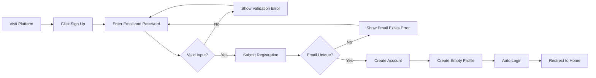

### 1.3 Detailed Registration Process

**Step 1: Access Registration Page**
- WHEN a visitor clicks the sign-up button, THE system SHALL display the registration form with email and password fields.
- THE registration form SHALL require email address and password input.

**Step 2: Input Validation**
- WHEN a user submits the registration form, THE system SHALL validate the email format.
- WHEN a user submits the registration form, THE system SHALL validate password strength.
- IF the email format is invalid, THEN THE system SHALL display "Invalid email format" error message.
- IF the password is weak, THEN THE system SHALL display password requirements.

**Step 3: Duplicate Check**
- WHEN the system receives valid registration data, THE system SHALL check if the email already exists.
- IF the email is already registered, THEN THE system SHALL display "Email already in use" error message.

**Step 4: Account Creation**
- WHEN the email is unique, THE system SHALL create a new user account.
- THE system SHALL securely hash and store the password.
- THE system SHALL assign default "member" permission level to the new account.
- THE system SHALL create an empty profile with null display name and bio.

**Step 5: Post-Registration**
- WHEN account creation succeeds, THE system SHALL automatically log the user in.
- THE system SHALL generate JWT access and refresh tokens.
- THE system SHALL redirect the user to the home page.

### 1.4 Registration Success Criteria

| Criteria | Expected Behavior |
|----------|-------------------|
| Account Created | User can log in with registered credentials |
| Profile Initialized | Empty profile exists with default values |
| Session Active | User is immediately logged in after registration |
| Permission Assigned | User has "member" level permissions |

---

## 2. Article Creation Journey

### 2.1 Overview

The article creation journey describes how authenticated users create, edit, and manage discussion content within sections.

### 2.2 Article Creation Flow

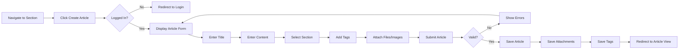

### 2.3 Detailed Article Creation Process

**Prerequisites**
- User must be authenticated with valid JWT token.
- User must not be banned.

**Step 1: Access Article Form**
- WHEN a user navigates to a section and clicks "Create Article", THE system SHALL display the article creation form.
- IF the user is not authenticated, THEN THE system SHALL redirect to the login page.

**Step 2: Article Information Input**
- THE article form SHALL include title field (required).
- THE article form SHALL include content field (required, text format).
- THE article form SHALL include section selector (required).
- THE article form SHALL include tag input (optional, multiple allowed).
- THE article form SHALL include file upload (optional, multiple allowed).
- THE article form SHALL include image upload (optional, multiple allowed).

**Step 3: Content Validation**
- WHEN a user submits an article, THE system SHALL validate that title is not empty.
- WHEN a user submits an article, THE system SHALL validate that content is not empty.
- WHEN a user submits an article, THE system SHALL validate that a section is selected.
- IF validation fails, THEN THE system SHALL display specific error messages for each failed field.

**Step 4: File and Image Processing**
- WHEN files are attached, THE system SHALL validate file types and sizes.
- WHEN images are attached, THE system SHALL validate image formats.
- THE system SHALL store attachments and link them to the article.
- IF a file upload fails, THEN THE system SHALL display an error and allow retry.

**Step 5: Tag Processing**
- WHEN tags are added, THE system SHALL parse and store each tag as free text.
- THE system SHALL allow multiple tags per article.
- THE system SHALL handle duplicate tags by storing only unique values.

**Step 6: Article Storage**
- WHEN all validations pass, THE system SHALL save the article with the following:
  - Title (required)
  - Content (required)
  - Section reference (required)
  - Author reference (current user)
  - Creation timestamp
  - Associated tags
  - Associated attachments

**Step 7: Post-Creation**
- WHEN article creation succeeds, THE system SHALL redirect to the article detail view.
- THE system SHALL display a success message.

### 2.4 Article Editing Flow

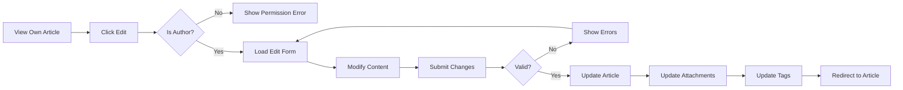

### 2.5 Article Editing Process

**Authorization Check**
- WHEN a user attempts to edit an article, THE system SHALL verify the user is the article author.
- IF the user is not the author, THEN THE system SHALL deny access with "You can only edit your own articles" message.

**Editable Content**
- THE system SHALL allow editing of title, content, tags, and attachments.
- THE section assignment SHALL remain editable.

**Update Process**
- WHEN changes are submitted, THE system SHALL validate all modified fields.
- THE system SHALL update the article with new values.
- THE system SHALL update the modification timestamp.
- WHEN attachments are modified, THE system SHALL handle additions and deletions appropriately.

### 2.6 Article Deletion Process

**Authorization Check**
- WHEN a user attempts to delete an article, THE system SHALL verify ownership.
- Administrators SHALL be able to delete any article regardless of ownership.

**Deletion Process**
- WHEN deletion is confirmed, THE system SHALL remove the article.
- THE system SHALL remove all associated comments.
- THE system SHALL remove all associated attachments.
- THE system SHALL remove all associated tags.
- WHEN deletion completes, THE system SHALL redirect to the section view.

---

## 3. Content Discovery Journey

### 3.1 Overview

The content discovery journey describes how users browse, search, and consume articles on the platform.

### 3.2 Section Browsing Flow

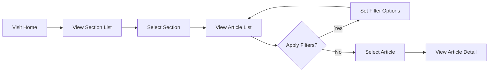

### 3.3 Section Navigation Process

**View All Sections**
- WHEN a user visits the home page, THE system SHALL display the list of all sections.
- THE section list SHALL display each section's name and description.
- THE section list SHALL be accessible to all users including non-authenticated visitors.

**Browse Section Articles**
- WHEN a user selects a section, THE system SHALL display articles within that section.
- THE article list SHALL be paginated with a default of 20 articles per page.
- THE article list SHALL display: title, author display name, tags, comment count, and time posted.
- THE article list SHALL NOT display full article content.

### 3.4 Article List Display

**Pagination Behavior**
- WHEN viewing an article list, THE system SHALL display pagination controls.
- THE system SHALL show current page number and total pages.
- WHEN a user clicks a page number, THE system SHALL load that page of results.
- THE system SHALL maintain sort order when changing pages.

**Sorting Options**
- THE system SHALL provide "Newest First" sort option.
- THE system SHALL provide "Oldest First" sort option.
- WHEN a user selects a sort option, THE system SHALL re-order the article list.
- THE system SHALL remember the selected sort order during the session.

**Article List Item Information**
- Each article in the list SHALL display:
  - Article title (clickable link to detail view)
  - Author display name
  - Tags associated with the article
  - Number of comments
  - Time elapsed since posting (e.g., "2 hours ago")

### 3.5 Search Flow

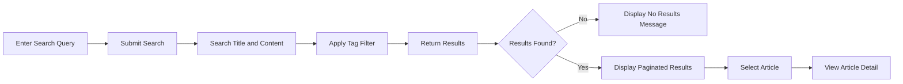

### 3.6 Search Process

**Search Execution**
- WHEN a user enters a search query, THE system SHALL search article titles and content.
- THE search SHALL be case-insensitive.
- THE system SHALL support partial word matching.

**Tag Filtering**
- WHEN a user specifies tag filters, THE system SHALL narrow results to articles with matching tags.
- THE system SHALL support multiple tag filters.
- THE system SHALL combine multiple tags with AND logic.

**Search Results**
- THE search results SHALL be paginated.
- IF no results match the query, THEN THE system SHALL display "No articles found" message.
- THE system SHALL display search results in the same format as section article lists.

### 3.7 Article Detail View

**Article Display**
- WHEN a user views an article, THE system SHALL display:
  - Article title
  - Author display name with link to profile
  - Full article content
  - All attached files (downloadable)
  - All attached images (viewable/downloadable)
  - All tags
  - Time posted
  - All comments (sorted oldest first)

**File Download**
- WHEN a user clicks on an attached file, THE system SHALL initiate file download.
- WHEN a user clicks on an attached image, THE system SHALL display the image with download option.

**Author Actions**
- IF the viewer is the article author, THE system SHALL display "Edit" and "Delete" buttons.
- IF the viewer is an administrator, THE system SHALL display "Delete" button.

---

## 4. Comment Interaction Journey

### 4.1 Overview

The comment interaction journey describes how users participate in article discussions through the single-level comment system.

### 4.2 Comment Flow

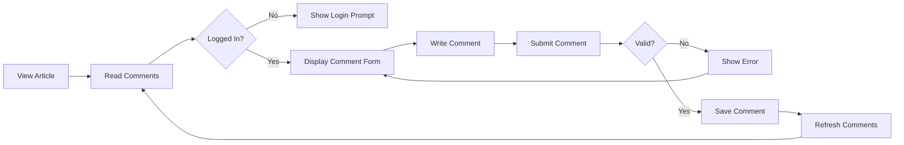

### 4.3 Comment Viewing Process

**Comment Display**
- WHEN a user views an article, THE system SHALL display all comments below the article content.
- THE comments SHALL be sorted by oldest first (chronological order).
- EACH comment SHALL display:
  - Author display name
  - Comment content
  - Time posted

**Comment Actions**
- IF the viewer is the comment author, THE system SHALL display "Edit" and "Delete" buttons.
- IF the viewer is an administrator, THE system SHALL display "Delete" button.

### 4.4 Comment Creation Process

**Authentication Required**
- WHEN a user attempts to comment, THE system SHALL check authentication status.
- IF the user is not authenticated, THEN THE system SHALL prompt login.

**Comment Input**
- THE comment form SHALL provide a text input area.
- THE system SHALL validate that the comment is not empty.
- IF the comment is empty, THEN THE system SHALL display "Comment cannot be empty" error.

**Comment Storage**
- WHEN a comment is submitted, THE system SHALL store:
  - Comment content
  - Author reference
  - Article reference
  - Creation timestamp

**Post-Comment**
- WHEN comment creation succeeds, THE system SHALL refresh the comment list.
- THE system SHALL display the new comment in the correct chronological position.

### 4.5 Comment Editing Process

**Authorization**
- WHEN a user attempts to edit a comment, THE system SHALL verify ownership.
- IF the user is not the comment author, THEN THE system SHALL deny access.

**Edit Process**
- THE system SHALL display the existing comment content in an editable form.
- WHEN changes are submitted, THE system SHALL update the comment content.
- THE system SHALL update the modification timestamp.

### 4.6 Comment Deletion Process

**Authorization**
- Users SHALL be able to delete their own comments.
- Administrators SHALL be able to delete any comment.

**Deletion Process**
- WHEN deletion is confirmed, THE system SHALL remove the comment.
- THE system SHALL refresh the comment list to reflect the deletion.

---

## 5. Profile Management Journey

### 5.1 Overview

The profile management journey describes how users manage their account information, view other profiles, and maintain their identity on the platform.

### 5.2 Profile View Flow

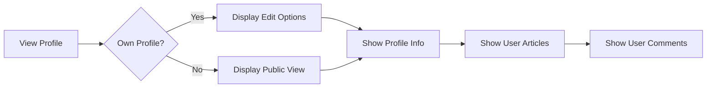

### 5.3 Profile Display Process

**Profile Information**
- WHEN viewing any profile, THE system SHALL display:
  - Display name (or "Anonymous" if not set)
  - Bio text (or empty if not set)

**Profile Content**
- WHEN viewing any profile, THE system SHALL display:
  - List of all articles written by the user
  - List of all comments written by the user

**Article List in Profile**
- THE profile article list SHALL display article titles with links.
- THE profile article list SHALL display the section each article belongs to.
- THE profile article list SHALL display the time each article was posted.

**Comment List in Profile**
- THE profile comment list SHALL display comment excerpts.
- THE profile comment list SHALL display links to the parent articles.
- THE profile comment list SHALL display the time each comment was posted.

### 5.4 Profile Editing Flow

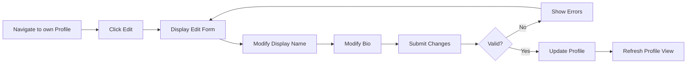

### 5.5 Profile Editing Process

**Editable Fields**
- THE system SHALL allow editing of display name.
- THE system SHALL allow editing of bio text.

**Validation**
- WHEN a display name is submitted, THE system SHALL validate maximum length.
- WHEN a bio is submitted, THE system SHALL validate maximum length.
- IF validation fails, THEN THE system SHALL display specific error messages.

**Update Process**
- WHEN changes are submitted, THE system SHALL update the profile.
- THE updated information SHALL immediately reflect in all displays of the user's identity.

### 5.6 Password Change Process

**Access Password Change**
- WHEN a user navigates to account settings, THE system SHALL display password change option.

**Password Change Process**
- THE system SHALL require current password for verification.
- THE system SHALL require new password input.
- THE system SHALL require new password confirmation.
- WHEN submitted, THE system SHALL verify the current password.
- IF the current password is incorrect, THEN THE system SHALL display "Incorrect password" error.
- WHEN verification succeeds, THE system SHALL update the password hash.
- THE system SHALL maintain the current session.

### 5.7 Account Deletion Flow

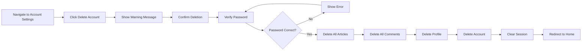

### 5.8 Account Deletion Process

**Confirmation Required**
- WHEN a user requests account deletion, THE system SHALL display a warning message.
- THE warning SHALL explain that all content will be permanently deleted.
- THE system SHALL require password confirmation.

**Cascade Deletion**
- WHEN deletion is confirmed, THE system SHALL delete all articles by the user.
- THE system SHALL delete all comments by the user.
- THE system SHALL delete the user's profile.
- THE system SHALL delete the user account.

**Post-Deletion**
- WHEN account deletion completes, THE system SHALL terminate the session.
- THE system SHALL redirect to the home page.
- THE deleted content SHALL not be recoverable.

---

## 6. Administrator User Scenarios

### 6.1 Overview

Administrator scenarios describe workflows specific to users with administrator or super administrator permissions.

### 6.2 Admin Request Journey

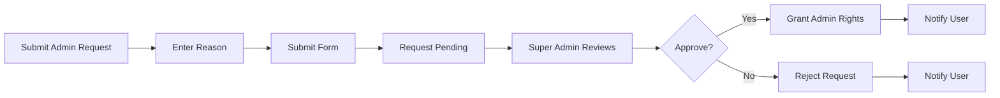

### 6.3 Admin Request Process

**Request Submission**
- WHEN a user wants to become an administrator, THE system SHALL provide an admin request form.
- THE form SHALL require a reason text field.
- WHEN submitted, THE system SHALL store the request as "pending" status.

**Request Review**
- WHEN a super administrator views the admin request list, THE system SHALL display all pending requests.
- THE system SHALL display the requester's information and submitted reason.
- WHEN a super administrator approves a request, THE system SHALL:
  - Update the user's permission level to "admin"
  - Change the request status to "approved"
  - Send a notification to the user
- WHEN a super administrator rejects a request, THE system SHALL:
  - Change the request status to "rejected"
  - Send a notification to the user with rejection reason
  - Keep the user's current permission level unchanged

### 6.4 Admin Hierarchy Management Flow

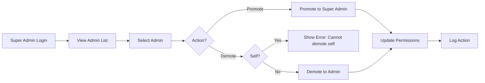

### 6.5 Admin Hierarchy Management Process

**Promotion Process**
- WHEN a super administrator promotes a regular administrator, THE system SHALL update the user's permission level to "super_admin".
- THE system SHALL log the promotion action with timestamp and actor.
- THE promoted user SHALL immediately gain all super administrator capabilities.

**Demotion Process**
- WHEN a super administrator attempts to demote themselves, THE system SHALL reject the action.
- THE system SHALL display "Cannot demote yourself" error message.
- WHEN a super administrator demotes another super administrator, THE system SHALL update the user's permission level to "admin".
- THE system SHALL log the demotion action with timestamp and actor.

### 6.6 Section Management Flow

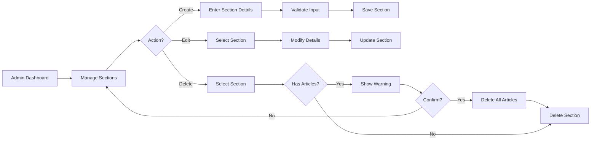

### 6.7 Section Management Process

**Section Creation**
- WHEN an administrator creates a new section, THE system SHALL require:
  - Section name (required)
  - Section description (required)
- THE system SHALL validate that the section name is unique.
- IF a section with the same name exists, THEN THE system SHALL display "Section name already exists" error.
- WHEN validation passes, THE system SHALL save the new section.

**Section Editing**
- WHEN an administrator edits a section, THE system SHALL allow modification of name and description.
- THE system SHALL validate the new name for uniqueness.
- WHEN changes are saved, THE system SHALL update the section immediately.

**Section Deletion**
- WHEN an administrator deletes a section with articles, THE system SHALL display a warning message.
- THE warning SHALL indicate the number of articles that will be deleted.
- WHEN deletion is confirmed, THE system SHALL:
  - Delete all articles in the section
  - Delete all comments on those articles
  - Delete all attachments associated with those articles
  - Remove the section from the database

### 6.8 Content Moderation Flow

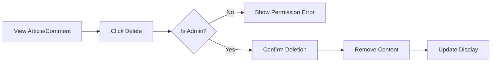

### 6.9 Content Moderation Process

**Article Moderation**
- WHEN an administrator deletes an article, THE system SHALL remove the article regardless of ownership.
- THE system SHALL cascade delete all associated comments and attachments.
- THE system SHALL log the moderation action.

**Comment Moderation**
- WHEN an administrator deletes a comment, THE system SHALL remove the comment regardless of ownership.
- THE system SHALL log the moderation action.

### 6.10 User Banning Flow

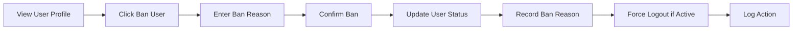

### 6.11 User Banning Process

**Ban Execution**
- WHEN an administrator bans a user, THE system SHALL require a ban reason.
- THE system SHALL update the user's status to "banned".
- THE system SHALL store the ban reason and timestamp.
- THE system SHALL store the administrator who performed the ban.
- IF the user has an active session, THE system SHALL terminate it immediately.

**Login Prevention**
- WHEN a banned user attempts to log in, THE system SHALL reject the login attempt.
- THE system SHALL display "Your account has been banned" message.
- THE system SHALL include the ban reason in the message.

**Content Visibility**
- THE system SHALL keep banned users' articles and comments visible.
- THE system SHALL display the author's last known display name.
- THE system SHALL not indicate that the user is banned on public content.

**Unban Process**
- WHEN an administrator views the banned users list, THE system SHALL display all banned users.
- THE system SHALL display the ban reason and date for each banned user.
- WHEN an administrator unbans a user, THE system SHALL:
  - Update the user's status to "active"
  - Clear the ban reason
  - Log the unban action with timestamp and administrator identity
  - Allow the user to log in again

---

## 7. Error Handling Scenarios

### 7.1 Authentication Errors

**Invalid Credentials**
- WHEN a user enters incorrect email or password, THE system SHALL display "Invalid email or password" error.
- THE system SHALL not reveal whether email or password was incorrect.
- THE system SHALL implement rate limiting after 5 failed attempts.

**Session Expired**
- WHEN a user's session expires, THE system SHALL redirect to login page.
- THE system SHALL display "Your session has expired. Please log in again." message.
- THE system SHALL preserve the intended destination URL for post-login redirect.

**Banned User Login Attempt**
- WHEN a banned user attempts to log in, THE system SHALL display "Your account has been banned. Reason: [ban reason]."
- THE system SHALL not create a session.

### 7.2 Authorization Errors

**Permission Denied**
- WHEN a user attempts an action without permission, THE system SHALL display "You do not have permission to perform this action" message.
- THE system SHALL redirect to the appropriate page based on context.
- WHEN a non-administrator attempts to access admin features, THE system SHALL return 403 Forbidden.

### 7.3 Validation Errors

**Form Validation**
- WHEN a required field is empty, THE system SHALL display "[Field name] is required" message.
- WHEN a field exceeds maximum length, THE system SHALL display "[Field name] must be [X] characters or less" message.
- WHEN an email format is invalid, THE system SHALL display "Please enter a valid email address" message.

**File Upload Errors**
- WHEN a file exceeds maximum size, THE system SHALL display "File size exceeds the maximum limit of [X]MB" message.
- WHEN a file type is not allowed, THE system SHALL display "File type not allowed. Allowed types: [list]" message.

### 7.4 Resource Not Found Errors

**Article Not Found**
- WHEN a user requests a non-existent article, THE system SHALL display "Article not found" message.
- THE system SHALL provide a link to return to the section list.

**Section Not Found**
- WHEN a user requests a non-existent section, THE system SHALL display "Section not found" message.
- THE system SHALL redirect to the home page.

**User Not Found**
- WHEN a user requests a non-existent profile, THE system SHALL display "User not found" message.

### 7.5 System Errors

**Server Error**
- WHEN an unexpected error occurs, THE system SHALL display "An unexpected error occurred. Please try again later." message.
- THE system SHALL log the error details for administrator review.
- THE system SHALL not expose internal error details to users.

**Network Error**
- WHEN a network request fails, THE system SHALL display "Unable to connect to the server. Please check your internet connection." message.
- THE system SHALL provide a retry button for idempotent operations.
